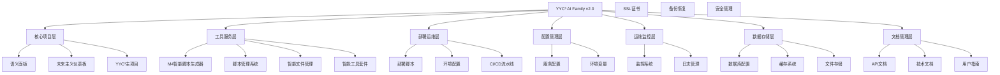
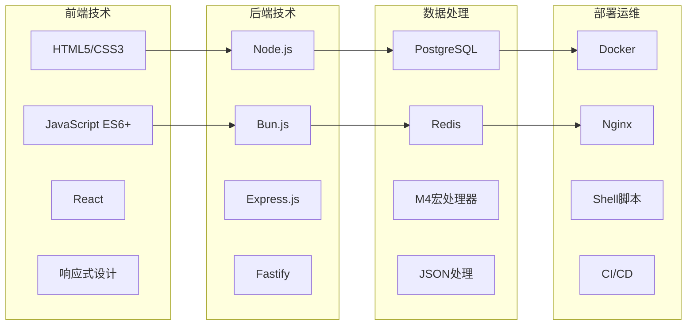
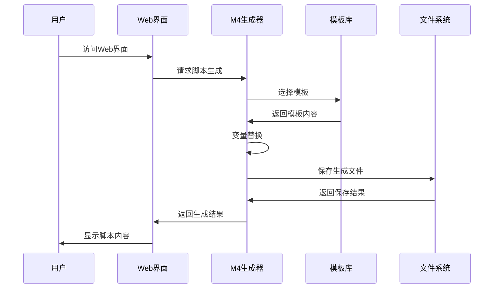
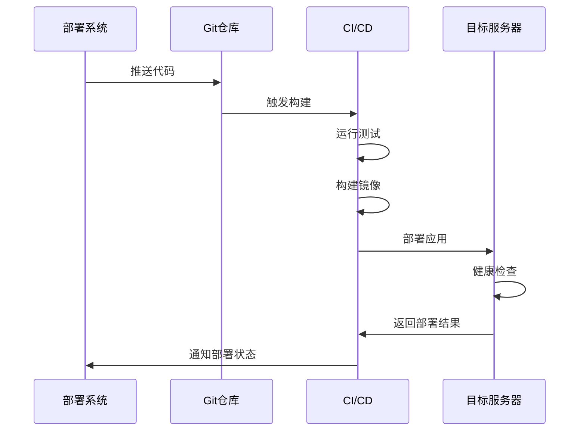

# YYC³ AI Family v2.0 - 系统架构文档

## 🎯 系统概述

YYC³ AI Family v2.0 是一个完整的智能化开发平台，集成了M4智能脚本生成、语义分析、部署运维等核心功能，采用标准化的目录结构和模块化架构设计。

## 🏗️ 系统架构

### 📊 核心架构图



### 🔧 技术栈架构



## 📁 目录架构详解

### 1. core-projects/ - 核心项目层

```
core-projects/
├── semantic-dashboard/          # 语义面板
│   ├── app.js                  # 主应用入口
│   ├── semantic-analyzer.js   # 语义分析器
│   ├── dashboard.html         # 仪表板界面
│   └── assets/                 # 静态资源
├── futuristic-dashboard/        # 未来主义仪表板
│   ├── index.html              # 主页面
│   ├── styles/                 # 样式文件
│   └── scripts/                # 脚本文件
└── yyc3-main/                  # YYC³主项目 (符号链接)
    └── yyc3-22/               # 实际项目位置
```

### 2. tools/ - 工具服务层

```
tools/
├── m4-generator/               # M4智能脚本生成器
│   ├── m4-generator-fixed.js  # 核心生成引擎
│   ├── m4-dashboard.html     # Web界面
│   ├── m4-styles.css         # 样式文件
│   └── templates/             # M4模板库
│       ├── web_deployment/
│       ├── api_service/
│       └── monitoring/
├── script-manager/            # 脚本管理系统
│   ├── deployment/            # 部署脚本
│   ├── monitoring/            # 监控脚本
│   ├── backup/                # 备份脚本
│   └── maintenance/           # 维护脚本
├── smart-script-generator/     # 智能脚本生成器
│   ├── SmartScriptGenerator.js
│   ├── AIIntegrationEngine.js
│   └── admin-integration/
└── file-manager/              # 智能文件管理系统
    ├── SmartFileManager.js
    ├── NASIntegration.js
    └── setup.js
```

### 3. deployment/ - 部署运维层

```
deployment/
├── environments/              # 环境配置
│   ├── production/           # 生产环境
│   ├── staging/              # 测试环境
│   └── development/          # 开发环境
├── infrastructure/            # 基础设施
│   ├── docker/              # Docker配置
│   ├── nginx/               # Nginx配置
│   └── frp/                 # FRP配置
├── scripts/                  # 部署脚本
│   ├── deploy-production.sh
│   ├── deploy-staging.sh
│   └── rollback.sh
└── ci-cd/                     # CI/CD配置
    ├── .github/workflows/
    └── gitlab-ci.yml
```

### 4. config/ - 配置管理层

```
config/
├── services/                 # 服务配置
│   ├── database/             # 数据库配置
│   ├── api/                  # API配置
│   └── monitoring/           # 监控配置
├── servers/                  # 服务器配置
│   ├── production/           # 生产服务器
│   └── development/          # 开发服务器
├── nginx/                    # Nginx配置
├── ssl/                      # SSL证书
└── environment/              # 环境变量
    ├── .env.production
    ├── .env.staging
    └── .env.development
```

### 5. operations/ - 运维监控层

```
operations/
├── monitoring/               # 监控脚本
│   ├── health-checks/
│   ├── performance/
│   └── alerts/
├── logs/                     # 日志管理
│   ├── application/
│   ├── access/
│   └── error/
├── backups/                  # 备份脚本
│   ├── database/
│   ├── files/
│   └── config/
└── security/                 # 安全配置
    ├── firewall/
    ├── ssl/
    └── access-control/
```

### 6. data/ - 数据存储层

```
data/
├── databases/               # 数据库配置
│   ├── postgresql/
│   ├── redis/
│   └── mongodb/
├── cache/                   # 缓存数据
│   ├── redis/
│   └── application/
├── storage/                 # 存储配置
│   ├── file-storage/
│   └── backup-storage/
└── temp/                    # 临时文件
    ├── uploads/
    └── processing/
```

### 7. archive/ - 项目存档层

```
archive/
├── old-projects/            # 历史项目
├── pending-files/          # 待处理文件
├── deprecated/             # 已弃用功能
└── tests/                  # 测试文件
```

### 8. docs/ - 文档管理层

```
docs/
├── api/                     # API文档
│   ├── openapi.yaml
│   ├── endpoints/
│   └── examples/
├── guides/                  # 指南文档
│   ├── deployment/
│   ├── development/
│   └── usage/
├── architecture/            # 架构文档
│   ├── system-design/
│   ├── data-flow/
│   └── security/
└── references/              # 参考资料
    ├── coding-standards/
    ├── best-practices/
    └── troubleshooting/
```

## 🔄 服务交互流程

### M4脚本生成流程



### 部署流程



## 🔒 安全架构

### 访问控制
- **身份验证**: 基于JWT的认证机制
- **权限管理**: RBAC角色权限控制
- **API安全**: 请求限流和防护
- **数据加密**: 敏感数据加密存储

### 网络安全
- **防火墙**: iptables规则配置
- **SSL/TLS**: HTTPS通信加密
- **VPN访问**: 安全远程访问
- **入侵检测**: 实时安全监控

## 📊 监控体系

### 应用监控
- **性能监控**: CPU、内存、磁盘使用率
- **业务监控**: API响应时间、错误率
- **用户行为**: 访问量、用户路径分析
- **实时告警**: 异常情况即时通知

### 日志管理
- **结构化日志**: JSON格式日志输出
- **日志聚合**: 集中化日志收集
- **日志分析**: 基于ELK的日志分析
- **日志归档**: 长期日志存储策略

## 🚀 部署架构

### 容器化部署
```yaml
version: '3.8'
services:
  yyc3-api:
    image: yyc3/api:latest
    ports:
      - "3000:3000"
    environment:
      - NODE_ENV=production
    volumes:
      - ./config:/app/config
      - ./logs:/app/logs

  yyc3-m4:
    image: yyc3/m4-generator:latest
    ports:
      - "9558:9558"
    volumes:
      - ./templates:/app/templates
      - ./generated:/app/generated

  yyc3-dashboard:
    image: yyc3/semantic-dashboard:latest
    ports:
      - "7777:7777"
    volumes:
      - ./data:/app/data
```

### 负载均衡
- **Nginx**: 反向代理和负载均衡
- **服务发现**: 基于Consul的服务发现
- **健康检查**: 自动故障转移
- **滚动更新**: 零停机部署

## 🔧 开发工作流

### 开发环境
1. **本地开发**: 基于Docker Compose
2. **热重载**: 代码变更自动重启
3. **调试支持**: 集成调试工具
4. **测试环境**: 自动化测试运行

### 代码管理
1. **分支策略**: Git Flow工作流
2. **代码审查**: Pull Request机制
3. **自动化测试**: CI/CD集成测试
4. **代码质量**: ESLint、Prettier检查

## 📈 性能优化

### 前端优化
- **代码分割**: 按需加载模块
- **资源压缩**: CSS/JS文件压缩
- **缓存策略**: 浏览器缓存优化
- **CDN加速**: 静态资源CDN分发

### 后端优化
- **数据库优化**: 索引和查询优化
- **缓存机制**: Redis缓存热点数据
- **连接池**: 数据库连接池管理
- **异步处理**: 非阻塞I/O操作

## 🎯 扩展性设计

### 水平扩展
- **无状态设计**: 服务无状态化
- **负载均衡**: 多实例负载分担
- **数据库分片**: 数据水平分割
- **消息队列**: 异步任务处理

### 垂直扩展
- **微服务拆分**: 功能模块独立
- **服务网格**: 服务间通信管理
- **容器化**: 轻量级部署
- **云原生**: 云平台集成

---

**文档版本**: v2.0.0
**最后更新**: 2025-12-08
**维护团队**: YYC³ AI Family Team

*言启象限，语枢智能 - YYC³ AI Family*