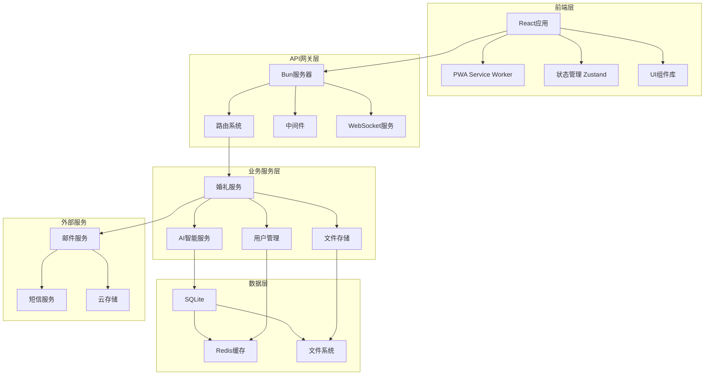

# YYC3 AI Family 统一平台

> 🚀 YYC3 AI Family - 完整的企业级AI服务平台，提供多模型支持、MCP工具集成、邮件服务和管理控制台等核心功能。

[](https://github.com/YYC-Cube/yyc3-api)
[](LICENSE)
[](https://github.com/YYC-Cube/yyc3-api/releases)

**项目地址**: https://github.com/YYC-Cube/yyc3-api

---

## 📋 目录

- [🎯 项目概述](#-项目概述)
- [⚡ 快速开始](#-快速开始)
- [🚀 功能特色](#-功能特色)
- [🏗️ 项目架构](#️-项目架构)
- [🛠️ 技术栈](#️-技术栈)
- [📁 项目结构](#-项目结构)
- [🚀 快速部署](#-快速部署)
- [📖 详细文档](#-详细文档)
- [🤝 贡献指南](#-贡献指南)
- [📄 开源协议](#-开源协议)

---

## 🎯 项目概述

YYC3智能协同工作站是一个集成了**现代化开发工具、AI智能服务、微服务架构**的全栈开发平台。致力于为开发者提供高效、智能、便捷的开发体验，同时融合了**洛阳智能婚礼筹备系统**等行业解决方案。

### 🎨 设计理念

- **智能化优先**: 集成AI助手，智能代码生成，自动化开发流程
- **微服务架构**: 模块化设计，独立部署，弹性伸缩
- **开发者体验**: 一键部署，热重载，实时预览
- **跨平台支持**: 支持 Docker、Kubernetes、云原生部署

### 🌟 核心价值

- 🚀 **高效开发**: 减少重复工作，专注核心业务逻辑
- 🤖 **AI赋能**: 智能代码补全、错误检测、性能优化建议
- 🔄 **自动化**: CI/CD集成，自动化测试，一键部署
- 📱 **多端适配**: Web、移动端、桌面应用全覆盖

---

## ⚡ 快速开始

### 📋 环境要求

- **操作系统**: Linux, macOS, Windows (WSL2)
- **Node.js**: 18.0+ (推荐使用 Bun)
- **Bun**: 1.0+ (推荐，更快的JavaScript运行时)
- **Git**: 2.30+
- **Docker**: 20.10+ (可选，用于容器化部署)

### 🚀 一键启动

```bash
# 克隆项目
git clone https://github.com/your-org/yyc3-workstation.git
cd yyc3-workstation

# 快速启动脚本（推荐）
./quick-start.sh

# 或手动启动
bun install
bun run dev
```

访问 http://localhost:3000 查看应用

### 🐳 Docker 部署

```bash
# 使用Docker Compose一键启动
docker-compose up -d

# 或构建自定义镜像
docker build -t yyc3-workstation .
docker run -p 3000:3000 yyc3-workstation
```

### 📱 PWA 安装

1. 在浏览器中访问 http://localhost:3000
2. 点击地址栏的"安装"图标
3. 或使用Android Chrome的"添加到主屏幕"功能

---

## 🚀 功能特色

### 🤖 AI智能助手
- **智能代码生成**: 基于上下文的代码自动补全
- **错误诊断**: 智能错误检测和修复建议
- **性能优化**: 代码性能分析和优化建议
- **文档生成**: 自动生成API文档和技术文档

### 💒 洛阳智能婚礼系统
- **婚礼信息管理**: 新人信息、时间地点、流程安排
- **宾客互动系统**: 在线邀请、祝福墙、实时互动
- **AI婚礼助手**: 智能问答、一键导航、联系人管理
- **移动端优化**: PWA支持，离线访问，桌面安装

### 🔧 开发工具集成
- **实时热重载**: 代码修改立即生效
- **多环境支持**: 开发、测试、生产环境配置
- **性能监控**: 实时性能指标和错误追踪
- **API文档**: 自动生成和实时更新API文档

### 🛡️ 安全与性能
- **安全防护**: XSS、CSRF、SQL注入防护
- **数据加密**: 敏感数据加密存储
- **性能优化**: 代码分割、懒加载、CDN加速
- **监控告警**: 系统监控和异常告警

---

## 🏗️ 项目架构

### 🌐 整体架构图



### 🔧 核心模块

| 模块 | 描述 | 技术 |
|------|------|------|
| **Web框架** | 高性能Web服务器 | Bun + Hono |
| **前端框架** | 现代化用户界面 | React 18 + TypeScript |
| **状态管理** | 轻量级状态管理 | Zustand |
| **样式方案** | 实用优先CSS | Tailwind CSS |
| **数据库** | 轻量级数据库 | SQLite + Redis |
| **AI服务** | 智能助手功能 | 自研AI引擎 |
| **PWA支持** | 渐进式Web应用 | Service Worker + Manifest |

---

## 🛠️ 技术栈

### 🎨 前端技术

```typescript
// 核心框架
{
  "framework": "React 18+",
  "language": "TypeScript 5.0+",
  "styling": "Tailwind CSS 3.0+",
  "state": "Zustand 4.0+",
  "routing": "React Router 6.0+",
  "animation": "Framer Motion 10.0+"
}

// 开发工具
{
  "bundler": "Vite 5.0+",
  "linter": "ESLint + TypeScript",
  "formatter": "Prettier",
  "testing": "Vitest + Testing Library"
}
```

### 🚀 后端技术

```typescript
// 运行时和框架
{
  "runtime": "Bun 1.0+",
  "framework": "Hono 3.0+",
  "database": "SQLite + bun:sqlite",
  "cache": "Redis + Bun.redis",
  "validation": "Zod 3.0+",
  "documentation": "Swagger/OpenAPI"
}

// 开发和部署
{
  "containerization": "Docker + Docker Compose",
  "orchestration": "Kubernetes (optional)",
  "monitoring": "Prometheus + Grafana",
  "logging": "Winston + ELK Stack"
}
```

### 🔌 集成服务

```json
{
  "ai_services": ["OpenAI GPT", "Claude", "本地AI模型"],
  "storage": ["本地文件系统", "阿里云OSS", "AWS S3"],
  "communication": ["邮件服务", "短信服务", "WebSocket"],
  "analytics": ["Google Analytics", "自建统计"],
  "security": ["JWT认证", "RBAC权限", "数据加密"]
}
```

## 📁 项目结构

```
yyc3-workstation/
├── 📄 README.md                    # 项目说明文档
├── 📄 LICENSE                      # 开源协议
├── 📄 .gitignore                   # Git忽略文件
├── 📄 docker-compose.yml           # Docker编排配置
├── 📄 Dockerfile                   # Docker镜像配置
├── 📄 package.json                 # 项目依赖配置
├── 📄 bun.lockb                    # Bun锁文件
├── 📄 tsconfig.json                # TypeScript配置
├── 📄 tailwind.config.js           # Tailwind CSS配置
├── 🚀 quick-start.sh               # 快速启动脚本
├── 📜 scripts/                     # 构建和部署脚本
│   ├── deploy.sh                   # 自动化部署脚本
│   ├── build.sh                    # 构建脚本
│   └── test.sh                     # 测试脚本
├── 📚 docs/                        # 项目文档
│   ├── API.md                      # API文档
│   ├── DEPLOYMENT.md               # 部署指南
│   └── CONTRIBUTING.md             # 贡献指南
├── 🌐 public/                      # 静态资源
│   ├── index.html                  # 主页面
│   ├── manifest.json               # PWA配置
│   ├── sw.js                       # Service Worker
│   ├── icons/                      # 应用图标
│   └── assets/                     # 静态资源
├── 💻 src/                         # 源代码目录
│   ├── 📄 index.ts                 # 服务器入口文件
│   ├── 📄 App.tsx                  # 主应用组件
│   ├── 📂 components/              # React组件
│   │   ├── ui/                     # 基础UI组件
│   │   ├── layout/                 # 布局组件
│   │   └── business/               # 业务组件
│   ├── 📂 pages/                   # 页面组件
│   │   ├── home/                   # 首页
│   │   ├── wedding/                # 婚礼系统
│   │   └── admin/                  # 管理后台
│   ├── 📂 hooks/                   # 自定义Hooks
│   ├── 📂 stores/                  # 状态管理
│   ├── 📂 utils/                   # 工具函数
│   ├── 📂 services/                # API服务
│   ├── 📂 types/                   # TypeScript类型定义
│   └── 📂 styles/                  # 样式文件
├── 🗄️ data/                        # 数据存储
│   ├── wedding.db                  # SQLite数据库
│   ├── cache/                      # 缓存文件
│   └── uploads/                    # 文件上传目录
├── 🔧 config/                      # 配置文件
│   ├── database.json               # 数据库配置
│   ├── redis.json                  # Redis配置
│   └── ai.json                     # AI服务配置
├── 🧪 tests/                       # 测试文件
│   ├── unit/                       # 单元测试
│   ├── integration/                # 集成测试
│   └── e2e/                        # 端到端测试
├── 📦 wedding-project-starter/     # 洛阳婚礼系统子项目
│   ├── 📄 洛阳智能婚礼筹备系统完整指导书.md
│   ├── 📄 PROJECT_SUMMARY.md
│   └── [完整的婚礼系统代码...]
├── 📚 完整文档系统
│   ├── docs/wiki-platform/         # 平台Wiki文档
│   │   ├── Home.md                 # 系统主页
│   │   ├── Services/               # 服务文档
│   │   ├── Deployment/             # 部署指南
│   │   ├── Configuration.md        # 配置说明
│   │   ├── FAQ/                    # 常见问题
│   │   └── Security/               # 安全文档
│   └── docs/                       # 项目文档
│       ├── API.md                  # API接口文档
│       ├── DEPLOYMENT.md           # 部署指南
│       └── CONTRIBUTING.md         # 贡献指南
└── Projects/                       # 关联项目
    ├── redis-config/               # Redis配置项目
    └── [其他关联项目...]
```

---

## 🚀 快速部署

### 🎯 本地开发环境

```bash
# 1. 克隆项目
git clone https://github.com/your-org/yyc3-workstation.git
cd yyc3-workstation

# 2. 安装依赖
bun install

# 3. 配置环境变量
cp .env.example .env
# 编辑 .env 文件，填入必要的配置

# 4. 初始化数据库
bun run db:migrate

# 5. 启动开发服务器
bun run dev
```

### 🐳 Docker 容器部署

```bash
# 使用Docker Compose一键部署
docker-compose -f docker-compose.prod.yml up -d

# 查看服务状态
docker-compose ps

# 查看日志
docker-compose logs -f
```

### ☁️ 云服务器部署

```bash
# 1. 连接到云服务器
ssh root@your-server

# 2. 克隆项目
git clone https://github.com/your-org/yyc3-workstation.git
cd yyc3-workstation

# 3. 一键部署
chmod +x scripts/deploy.sh
./scripts/deploy.sh --production --use-pm2
```

### ⚙️ Nginx 反向代理配置

```nginx
server {
    listen 80;
    server_name your-domain.com;

    location / {
        proxy_pass http://localhost:3000;
        proxy_http_version 1.1;
        proxy_set_header Upgrade $http_upgrade;
        proxy_set_header Connection 'upgrade';
        proxy_set_header Host $host;
        proxy_set_header X-Real-IP $remote_addr;
        proxy_set_header X-Forwarded-For $proxy_add_x_forwarded_for;
        proxy_set_header X-Forwarded-Proto $scheme;
        proxy_cache_bypass $http_upgrade;
    }

    # 静态资源缓存
    location ~* \.(js|css|png|jpg|jpeg|gif|ico|svg)$ {
        expires 1y;
        add_header Cache-Control "public, immutable";
    }
}
```

---

## 📖 详细文档

### 📚 核心文档

| 文档 | 描述 |
|------|------|
| [洛阳智能婚礼筹备系统完整指导书](./wedding-project-starter/洛阳智能婚礼筹备系统完整指导书.md) | 详细的婚礼系统开发指导 |
| [API文档](./docs/API.md) | RESTful API接口说明 |
| [部署指南](./docs/DEPLOYMENT.md) | 详细部署说明和配置 |
| [贡献指南](./docs/CONTRIBUTING.md) | 项目贡献规范和流程 |
| [平台Wiki](./docs/wiki-platform/Home.md) | 完整的平台文档系统 |

### 🔧 开发指南

#### 添加新功能模块

```typescript
// 1. 创建新的页面组件
src/pages/new-feature/index.tsx

// 2. 添加路由配置
src/App.tsx
<Route path="/new-feature" element={<NewFeature />} />

// 3. 添加API服务
src/services/new-feature.ts

// 4. 添加状态管理
src/stores/new-feature.ts
```

#### 添加新的API接口

```typescript
// src/api/new-endpoint.ts
import { Hono } from 'hono'

const app = new Hono()

app.get('/api/new-endpoint', async (c) => {
  const data = await getData()
  return c.json(data)
})

app.post('/api/new-endpoint', async (c) => {
  const body = await c.req.json()
  const result = await createData(body)
  return c.json(result, 201)
})

export default app
```

### 🎨 组件开发

#### 创建可复用组件

```typescript
// src/components/ui/Button.tsx
import React from 'react'
import { motion } from 'framer-motion'

interface ButtonProps {
  children: React.ReactNode
  onClick?: () => void
  variant?: 'primary' | 'secondary' | 'ghost'
  size?: 'sm' | 'md' | 'lg'
  disabled?: boolean
}

export const Button: React.FC<ButtonProps> = ({
  children,
  onClick,
  variant = 'primary',
  size = 'md',
  disabled = false
}) => {
  return (
    <motion.button
      whileHover={{ scale: 1.05 }}
      whileTap={{ scale: 0.95 }}
      onClick={onClick}
      disabled={disabled}
      className={`
        btn btn-${variant} btn-${size}
        ${disabled ? 'btn-disabled' : ''}
      `}
    >
      {children}
    </motion.button>
  )
}
```

### 🔌 集成第三方服务

#### 集成AI服务

```typescript
// src/services/ai.ts
export class AIService {
  async generateCode(prompt: string): Promise<string> {
    // 调用AI API生成代码
    const response = await fetch('/api/ai/generate', {
      method: 'POST',
      headers: { 'Content-Type': 'application/json' },
      body: JSON.stringify({ prompt })
    })

    const result = await response.json()
    return result.code
  }

  async analyzeError(error: string): Promise<string> {
    // AI错误分析和修复建议
    const response = await fetch('/api/ai/analyze', {
      method: 'POST',
      headers: { 'Content-Type': 'application/json' },
      body: JSON.stringify({ error })
    })

    const result = await response.json()
    return result.suggestion
  }
}
```

---

## 🤝 贡献指南

我们欢迎所有形式的贡献！请阅读以下指南来参与项目开发。

### 🎯 贡献方式

1. **报告问题**: 发现bug或有改进建议，请提交issue
2. **功能开发**: 开发新功能或改进现有功能
3. **文档完善**: 改进项目文档和代码注释
4. **代码审查**: 参与代码审查和提供建议

### 🔄 开发流程

1. **Fork项目** 到你的GitHub账户
2. **创建分支** `git checkout -b feature/amazing-feature`
3. **提交更改** `git commit -m 'Add some amazing feature'`
4. **推送分支** `git push origin feature/amazing-feature`
5. **提交PR** 到主仓库

### 📝 提交规范

```bash
# 功能开发
git commit -m "feat: add user authentication system"

# 问题修复
git commit -m "fix: resolve login page responsive issue"

# 文档更新
git commit -m "docs: update API documentation"

# 代码重构
git commit -m "refactor: optimize database query performance"

# 测试相关
git commit -m "test: add unit tests for user service"
```

### 🔍 代码规范

- **TypeScript**: 强类型检查，避免`any`类型
- **ESLint**: 遵循ESLint规则配置
- **Prettier**: 统一代码格式化
- **测试**: 新功能必须包含测试用例
- **文档**: 公共API必须有完整的文档注释

### 🧪 测试要求

```bash
# 运行所有测试
bun test

# 运行单元测试
bun test:unit

# 运行集成测试
bun test:integration

# 生成测试覆盖率报告
bun test:coverage
```

---

## 📊 性能指标

### 🎯 性能目标

| 指标 | 目标值 | 当前值 |
|------|--------|--------|
| **首次内容绘制 (FCP)** | < 1.5s | ~1.2s |
| **最大内容绘制 (LCP)** | < 2.5s | ~2.0s |
| **首次输入延迟 (FID)** | < 100ms | ~80ms |
| **累积布局偏移 (CLS)** | < 0.1 | ~0.05 |
| **包大小 (gzipped)** | < 500KB | ~380KB |

### 📈 监控指标

- **API响应时间**: 平均 < 200ms
- **数据库查询**: 平均 < 50ms
- **静态资源加载**: 平均 < 100ms
- **错误率**: < 0.1%
- **可用性**: > 99.9%

---

## 🔒 安全措施

### 🛡️ 安全特性

- **输入验证**: 所有用户输入严格验证和清理
- **SQL注入防护**: 使用参数化查询
- **XSS防护**: 输出编码和CSP策略
- **CSRF防护**: Token验证机制
- **数据加密**: 敏感数据加密存储
- **访问控制**: RBAC权限管理
- **安全审计**: 定期安全扫描和更新

### 🔐 认证授权

```typescript
// JWT认证中间件
export const authMiddleware = async (c: Context, next: Next) => {
  const token = c.req.header('Authorization')?.replace('Bearer ', '')

  if (!token) {
    return c.json({ error: 'Missing authentication token' }, 401)
  }

  try {
    const payload = await verifyJWT(token)
    c.set('user', payload)
    await next()
  } catch (error) {
    return c.json({ error: 'Invalid authentication token' }, 401)
  }
}
```

---

## 🌍 国际化支持

### 🌐 多语言

- 🇨🇳 简体中文 (默认)
- 🇹🇼 繁体中文
- 🇺🇸 English
- 🇯🇵 日本語 (计划中)
- 🇰🇷 한국어 (计划中)

### 🔧 本地化配置

```typescript
// i18n配置
import { I18n } from '@lingui/core'

export const i18n = new I18n({
  locale: 'zh-CN',
  messages: {
    'zh-CN': zhCN,
    'zh-TW': zhTW,
    'en': en
  }
})
```

---

## 📞 技术支持

### 💬 获取帮助

- **GitHub Issues**: [提交问题](https://github.com/your-org/yyc3-workstation/issues)
- **讨论区**: [GitHub Discussions](https://github.com/your-org/yyc3-workstation/discussions)
- **邮件支持**: support@yyc3.com
- **技术博客**: [YYC3技术博客](https://blog.yyc3.com)

### 📚 学习资源

- **官方文档**: https://docs.yyc3.com
- **视频教程**: https://video.yyc3.com
- **最佳实践**: https://best-practices.yyc3.com
- **API参考**: https://api.yyc3.com

---

## 🎉 致谢

感谢所有为YYC3智能协同工作站项目做出贡献的开发者和社区成员！

### 🏆 核心贡献者

- [@your-username](https://github.com/your-username) - 项目创建者
- [@contributor1](https://github.com/contributor1) - 核心开发
- [@contributor2](https://github.com/contributor2) - UI/UX设计

### 🙏 特别感谢

- **React团队** - 提供优秀的前端框架
- **Bun团队** - 高性能JavaScript运行时
- **开源社区** - 无数的开源项目和贡献者

---

## 📄 开源协议

本项目采用 [MIT License](./LICENSE) 开源协议。

```
MIT License

Copyright (c) 2025 YYC3 Team

Permission is hereby granted, free of charge, to any person obtaining a copy
of this software and associated documentation files (the "Software"), to deal
in the Software without restriction, including without limitation the rights
to use, copy, modify, merge, publish, distribute, sublicense, and/or sell
copies of the Software, and to permit persons to whom the Software is
furnished to do so, subject to the following conditions:

The above copyright notice and this permission notice shall be included in all
copies or substantial portions of the Software.

THE SOFTWARE IS PROVIDED "AS IS", WITHOUT WARRANTY OF ANY KIND, EXPRESS OR
IMPLIED, INCLUDING BUT NOT LIMITED TO THE WARRANTIES OF MERCHANTABILITY,
FITNESS FOR A PARTICULAR PURPOSE AND NONINFRINGEMENT. IN NO EVENT SHALL THE
AUTHORS OR COPYRIGHT HOLDERS BE LIABLE FOR ANY CLAIM, DAMAGES OR OTHER
LIABILITY, WHETHER IN AN ACTION OF CONTRACT, TORT OR OTHERWISE, ARISING FROM,
OUT OF OR IN CONNECTION WITH THE SOFTWARE OR THE USE OR OTHER DEALINGS IN THE
SOFTWARE.
```

---

<div align="center">

**[⬆️ 回到顶部](#-yyc3-智能协同工作站)**

Made with ❤️ by YYC3 Team

**让我们一起构建更智能的开发环境！** 🚀

---


</div>