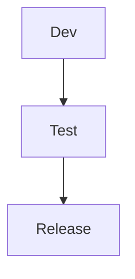

# YYC³ Docusaurus （Docusaurus：独立文档站点的 “快速落地神器”）

> Docusaurus：独立文档站点的 “快速落地神器”
适配场景核心：聚焦 “独立文档”，无需兼顾官网或其他功能，追求 “开箱即用、少配置”。
核心优势：自带文档专属能力，比如自动生成侧边栏、全文搜索、版本控制、多语言支持，无需额外集成工具。
效率亮点：初始化项目后，只需专注编写 Markdown 文档，一键构建部署，几小时就能完成站点上线。

---

## ✅ 为什么推荐 Docusaurus

- **开箱即用**：只需几条命令就能生成完整文档站点框架。  
- **Markdown 原生支持**：直接用 `.md` 文件写文档，无需额外转换。  
- **自动生成 TOC & Sidebar**：目录和侧边栏自动维护，减少人工操作。  
- **国际化 (i18n)**：内置多语言支持，轻松切换 `en/zh/...`。  
- **版本管理**：可为文档生成多个版本（如 v1、v2），方便维护。  
- **部署简单**：支持 Vercel、Netlify、GitHub Pages，一键上线。  

---

## 🚀 快速启动步骤

```bash
# 1. 创建项目
npx create-docusaurus@latest my-docs classic

cd my-docs

# 2. 启动开发环境
npm run start

# 3. 构建生产版本
n！pm run build

# 4. 部署到 Vercel
npx vercel --prod
```

---

## 🌍 国际化配置示例

在 `docusaurus.config.js` 中添加：

```js
i18n: {
  defaultLocale: 'en',
  locales: ['en', 'zh'],
  localeConfigs: {
    en: { label: 'English' },
    zh: { label: '简体中文' }
  }
}
```

这样就能快速切换中英文文档。

---

## ✨ 闭环总结

如果你要 **快速上线一个独立文档站点**，Docusaurus 是最优解：  

- 写文档 → Markdown  
- 管理 → 自动 TOC + Sidebar  
- 国际化 → 内置 i18n  
- 部署 → Vercel 一键上线  

❤️ 它就是为这种场景而生的。  

---

## 设计一个 **Docusaurus 项目最佳实践模版**，涵盖 **目录结构 + 配置 + CI/CD**，团队可以即刻复用，快速上线一个高质量的文档站点

---

## ✅ Docusaurus 项目最佳实践模版

### 1. 项目目录结构

```
my-docs/
├── docs/                      # Markdown 文档
│   ├── en/                    # 英文文档
│   │   ├── getting-started.md
│   │   ├── guides/installation.md
│   │   └── reference/api.md
│   └── zh/                    # 中文文档
│       ├── getting-started.md
│       ├── guides/installation.md
│       └── reference/api.md
├── blog/                      # 博客文章（可选）
├── src/                       # 自定义组件/样式
│   └── components/EnvBanner.tsx
├── static/                    # 静态资源（图片、图标）
├── docusaurus.config.js       # 主配置文件
├── sidebars.js                # 文档侧边栏配置
├── package.json
└── .github/
    └── workflows/
        └── deploy.yml         # CI/CD 配置
```

---

## 2. 配置文件示例

### `docusaurus.config.js`

```js
module.exports = {
  title: 'Industry Docs',
  tagline: '未来行业智能分析文档站点',
  url: 'https://your-vercel-app.vercel.app',
  baseUrl: '/',
  favicon: 'img/favicon.ico',
  organizationName: 'yyc3', // GitHub org/user
  projectName: 'industry-docs', // repo name

  i18n: {
    defaultLocale: 'en',
    locales: ['en', 'zh'],
    localeConfigs: {
      en: { label: 'English' },
      zh: { label: '简体中文' },
    },
  },

  presets: [
    [
      'classic',
      {
        docs: {
          sidebarPath: require.resolve('./sidebars.js'),
          editUrl: 'https://github.com/yyc3/industry-docs/edit/main/',
        },
        blog: {
          showReadingTime: true,
        },
        theme: {
          customCss: require.resolve('./src/css/custom.css'),
        },
      },
    ],
  ],
}
```

---

### `sidebars.js`

```js
module.exports = {
  docs: [
    {
      type: 'category',
      label: 'Guides',
      items: ['en/guides/installation', 'en/guides/usage'],
    },
    {
      type: 'category',
      label: 'Reference',
      items: ['en/reference/api'],
    },
  ],
}
```

---

## 3. CI/CD 配置（GitHub Actions + Vercel）

文件：`.github/workflows/deploy.yml`

```yaml
name: Deploy Docs to Vercel

on:
  push:
    branches:
      - main
      - beta
      - alpha
  workflow_dispatch:

jobs:
  deploy:
    runs-on: ubuntu-latest

    steps:
      - name: Checkout
        uses: actions/checkout@v4

      - name: Setup Node.js
        uses: actions/setup-node@v4
        with:
          node-version: 20

      - name: Install dependencies
        run: npm install

      - name: Build Docusaurus
        run: npm run build

      - name: Deploy to Vercel
        run: |
          if [ "${{ github.ref }}" == "refs/heads/main" ]; then
            npx vercel --prod --token=${{ secrets.VERCEL_TOKEN }} --scope=${{ secrets.VERCEL_ORG_ID }} --confirm --yes
          elif [ "${{ github.ref }}" == "refs/heads/beta" ]; then
            npx vercel --token=${{ secrets.VERCEL_TOKEN }} --scope=${{ secrets.VERCEL_ORG_ID }} --confirm --yes --env DOCS_ENV=beta
          elif [ "${{ github.ref }}" == "refs/heads/alpha" ]; then
            npx vercel --token=${{ secrets.VERCEL_TOKEN }} --scope=${{ secrets.VERCEL_ORG_ID }} --confirm --yes --env DOCS_ENV=alpha
          fi
        env:
          VERCEL_ORG_ID: ${{ secrets.VERCEL_ORG_ID }}
          VERCEL_PROJECT_ID: ${{ secrets.VERCEL_PROJECT_ID }}
```

---

## 4. 环境标识组件（可选）

在 `src/components/EnvBanner.tsx` 中挂载环境信息：

```tsx
import React from "react"

const env = process.env.DOCS_ENV || "stable"

const envConfig: Record<string, { color: string; label: string }> = {
  alpha: { color: "bg-red-600", label: "Alpha Preview" },
  beta: { color: "bg-yellow-500", label: "Beta Preview" },
  stable: { color: "bg-green-600", label: "Stable Release" },
}

export const EnvBanner: React.FC = () => {
  const config = envConfig[env] || envConfig["stable"]
  return (
    <div className={`${config.color} text-white text-center py-2 font-semibold fixed top-0 left-0 w-full z-50`}>
      {config.label}
    </div>
  )
}
```

---

## ✨ 优势总结

- ✅ **统一目录结构**：清晰的 docs/en & docs/zh，支持国际化  
- ✅ **最佳实践配置**：自动生成 TOC、侧边栏、编辑链接  
- ✅ **CI/CD 自动化**：GitHub Actions + Vercel，多环境部署（alpha → beta → stable）  
- ✅ **环境标识**：团队一眼识别当前环境，避免误用  
- ✅ **即刻复用**：复制模版即可快速上线  

---

🌹 **闭环完成**：  
你现在拥有一个 **Docusaurus 项目最佳实践模版**，团队可以即刻复用，快速上线一个多语言、自动化、可扩展的文档站点。  

## 设计一个 **团队文档协作流程**，让文档管理和代码一样规范，真正做到“文档即代码”。  

---

## ✅ 团队文档协作流程设计

### 1. 写作规范（Writing Guidelines）

- **统一格式**  
  - 使用 Markdown (`.md`) 编写文档，遵循 lint 规则（`markdownlint` + `prettier`）。  
  - 标题层级清晰：`# 一级标题` → `## 二级标题` → `### 三级标题`。  
  - 列表统一使用 `-`，避免混用 `*` 或 `+`。  
  - 图片统一放在 `static/img/`，引用相对路径。  

- **内容规范**  
  - 每篇文档必须包含 **简介、正文、结论** 三部分。  
  - 技术文档需包含 **示例代码** 或 **命令行用法**。  
  - 所有术语需保持一致，建立 **术语表（Glossary.md）**。  
  - 多语言文档需保持结构一致（`docs/en` 与 `docs/zh` 对应）。  

- **元信息规范**  
  - 每个文档需在开头添加 Frontmatter：  
    ```yaml
    ---
    title: 安装指南
    description: 如何安装和配置系统
    tags: [installation, setup]
    ---
    ```

---

### 2. 提交流程（Contribution Workflow）

1. **创建分支**  
   - 新文档：`docs/feature/<topic>`  
   - 修改文档：`docs/fix/<topic>`  

2. **编写文档**  
   - 遵循写作规范，运行 `npm run lint:docs` 检查格式。  
   - 使用 `doctoc` 自动生成 TOC。  

3. **提交代码**  
   - 提交信息规范：  
     ```
     docs: add installation guide
     docs: fix typo in API reference
     docs: update zh translation for getting-started
     ```

4. **提交 PR**  
   - PR 标题：`docs: <topic>`  
   - PR 描述：说明修改内容、影响范围、是否涉及多语言。  
   - 自动触发 CI：Lint + Build + Preview 部署。  

---

### 3. 审核机制（Review Process）

- **自动化检查**  
  - CI/CD 流水线运行：  
    - `markdownlint` → 检查语法  
    - `prettier` → 格式化  
    - `doctoc` → TOC 更新  
    - `docusaurus build` → 确认文档可编译  

- **人工审核**  
  - 至少 **1 名文档负责人** + **1 名技术负责人** 审核。  
  - 审核要点：  
    - 内容是否完整、准确  
    - 是否符合写作规范  
    - 是否有对应的多语言版本  
    - 是否影响现有文档结构  

- **合并策略**  
  - 使用 **Squash & Merge**，保持提交记录简洁。  
  - 合并后自动触发 **Vercel 部署**，更新文档站点。  

---

### 4. CI/CD 集成（文档质量保障）

在 `.github/workflows/docs.yml` 中配置：

```yaml
name: Docs Quality Check

on:
  pull_request:
    branches: [main, beta, alpha]

jobs:
  docs-check:
    runs-on: ubuntu-latest
    steps:
      - uses: actions/checkout@v4
      - uses: actions/setup-node@v4
        with:
          node-version: 20
      - run: npm install
      - run: npm run lint:docs
      - run: npm run build
```

---

### ✨ 优势总结

- ✅ **写作规范统一**：保证文档结构、格式、术语一致  
- ✅ **提交流程标准化**：分支、提交信息、PR 描述有章可循  
- ✅ **审核机制严格**：自动化检查 + 人工审核双重保障  
- ✅ **CI/CD 自动化**：文档质量与站点构建同步验证  
- ✅ **团队协作顺畅**：文档管理和代码一样规范，避免混乱  

---

🌹 **闭环建议**：  
你现在拥有一个完整的 **团队文档协作流程**，文档管理和代码一样规范。  

---

# ✅ 团队知识库自动化方案

## 1. 总体架构

```
knowledge-base/
├── docs/                # Markdown 文档（技术文档、指南、规范）
├── api/                 # API 定义（OpenAPI/Swagger）
├── charts/              # 数据可视化配置（JSON/TS）
├── scripts/             # 自动化脚本（生成文档、导出图表）
├── ci/                  # CI/CD 配置
└── site/                # 知识库站点（Docusaurus/Next.js）
```

- **统一入口**：所有知识沉淀（文档、API、图表）都在一个 Monorepo 中管理。  
- **自动生成**：通过脚本和 CI/CD 自动生成文档、API 文档、图表。  
- **站点展示**：最终统一到一个知识库站点，支持搜索、国际化、版本管理。  

---

## 2. 文档自动化

- 使用 **Markdown + Frontmatter** 编写文档。  
- 使用 **Docusaurus** 自动生成站点，支持多语言和版本。  
- 使用 **markdownlint + prettier** 保证格式一致。  
- 自动生成 TOC（`doctoc`）。  

脚本示例：
```bash
npm run lint:docs
npm run toc:generate
```

---

## 3. API 自动化

- 使用 **OpenAPI (Swagger)** 定义 API。  
- 使用 **Redocly** 或 **Docusaurus 插件**自动生成 API 文档。  
- 在 CI/CD 中自动更新 API 文档：  
  ```bash
  npx redoc-cli bundle api/openapi.yaml -o site/static/api.html
  ```

这样每次更新 API 定义，文档站点会自动同步。

---

## 4. 图表自动化

- 使用 **JSON/TS 配置**定义图表数据源。  
- 使用 **Mermaid** 或 **Chart.js** 在 Markdown 中嵌入图表。  
- 在 CI/CD 中自动生成图表快照，保证版本一致。  

示例（Mermaid 图表嵌入 Markdown）：
```markdown

```

---

## 5. 自动化脚本（统一生成）

在 `scripts/generate.js` 中统一处理：

```js
const { execSync } = require("child_process")

// 生成文档 TOC
execSync("npx doctoc docs/")

// 构建 API 文档
execSync("npx redoc-cli bundle api/openapi.yaml -o site/static/api.html")

// 构建图表快照
execSync("npm run charts:build")

console.log("✅ 知识库已自动生成：文档 + API + 图表")
```

---

## 6. CI/CD 流程

GitHub Actions 配置 `.github/workflows/knowledge.yml`：

```yaml
name: Knowledge Base Automation

on:
  push:
    branches: [main, beta, alpha]

jobs:
  build-knowledge-base:
    runs-on: ubuntu-latest
    steps:
      - uses: actions/checkout@v4
      - uses: actions/setup-node@v4
        with:
          node-version: 20
      - run: npm install
      - run: npm run lint:docs
      - run: node scripts/generate.js
      - run: npm run build
      - run: npx vercel --prod --token=${{ secrets.VERCEL_TOKEN }}
```

---

## 7. 知识库站点展示

- 使用 **Docusaurus** 或 **Next.js** 搭建站点。  
- 集成：  
  - 文档（Markdown → 页面）  
  - API（OpenAPI → Redoc 页面）  
  - 图表（Mermaid/Chart.js → 可视化页面）  
- 支持搜索（Algolia DocSearch）、国际化、版本管理。  

---

## ✨ 优势总结

- ✅ **统一管理**：文档、API、图表在一个仓库中集中管理  
- ✅ **自动生成**：脚本和 CI/CD 自动化，减少人工维护  
- ✅ **版本可追溯**：每次构建生成快照，保证一致性  
- ✅ **站点展示**：统一知识库站点，支持搜索和多语言  
- ✅ **团队协作**：文档管理和代码一样规范，知识沉淀系统化  

---

🌹 **闭环建议**：  
你现在拥有一个完整的 **团队知识库自动化方案**，文档 + API + 图表统一生成，最终汇聚到一个站点，保证知识沉淀系统化。  

## 设计一个 **知识库搜索与推荐系统（基于语义搜索 + 标签分类）**，让团队能更快找到需要的知识  

---

# ✅ 知识库搜索与推荐系统设计

## 1. 系统目标
- **快速检索**：不仅依赖关键词，还能理解语义，找到相关内容。  
- **智能推荐**：基于标签分类和语义相似度，推荐相关文档、API、图表。  
- **统一入口**：文档、API、图表都在一个知识库中搜索和推荐。  

---

## 2. 系统架构

```
knowledge-search-system/
├── indexer/                # 文档/数据索引模块
│   ├── markdown-parser.js   # 提取 Markdown 内容与 Frontmatter
│   ├── api-parser.js        # 提取 OpenAPI 定义
│   └── chart-parser.js      # 提取图表配置与描述
├── embeddings/              # 语义向量存储（向量数据库）
│   └── pinecone / weaviate / milvus
├── tags/                    # 标签分类系统（JSON/DB）
├── search-service/          # 搜索与推荐服务
│   ├── semantic-search.js   # 语义搜索
│   ├── tag-filter.js        # 标签过滤
│   └── recommender.js       # 推荐算法
└── ui/                      # 前端界面（Docusaurus/Next.js）
```

---

## 3. 核心功能模块

### 🔍 语义搜索
- 使用 **向量数据库**（如 Pinecone、Weaviate、Milvus）存储文档的语义向量。  
- 文档内容通过 **Embedding 模型**（如 OpenAI Embeddings 或 HuggingFace Sentence Transformers）转换为向量。  
- 搜索时，将用户查询转为向量，计算 **余弦相似度**，返回最相关文档。  

示例：
```js
const queryEmbedding = embed("如何安装系统？")
const results = vectorDB.search(queryEmbedding, { topK: 5 })
```

---

### 🏷️ 标签分类
- 每个文档在 Frontmatter 中定义标签：  
  ```yaml
  ---
  title: 安装指南
  tags: [installation, setup, beginner]
  ---
  ```
- 标签存储在数据库中，支持 **过滤搜索**：  
  - 用户可选择标签（如 “API” + “性能优化”）。  
  - 系统返回符合标签的文档，并按语义相关度排序。  

---

### 🤖 推荐系统
- **基于语义相似度**：推荐与当前阅读文档相似的内容。  
- **基于标签关联**：推荐同标签下的其他文档。  
- **混合推荐**：结合语义搜索和标签分类，提升推荐准确度。  

示例推荐逻辑：
```js
function recommend(docId) {
  const docEmbedding = vectorDB.get(docId)
  const similarDocs = vectorDB.search(docEmbedding, { topK: 3 })
  const tagDocs = tagDB.findByTags(doc.tags)
  return mergeResults(similarDocs, tagDocs)
}
```

---

## 4. 前端交互设计

- **搜索框**：支持自然语言输入（语义搜索）。  
- **标签筛选器**：侧边栏多选标签，缩小搜索范围。  
- **推荐区块**：在文档右侧显示“相关推荐”。  
- **高亮匹配**：搜索结果中高亮相关段落。  

---

## 5. CI/CD 自动化

- 在文档更新时，CI 自动运行：  
  1. 提取 Markdown / API / 图表内容。  
  2. 生成 Embedding 并更新向量数据库。  
  3. 更新标签索引。  
  4. 部署到知识库站点。  

GitHub Actions 示例：
```yaml
- name: Update Knowledge Index
  run: node scripts/update-index.js
```

---

## ✨ 优势总结

- ✅ **语义搜索**：理解自然语言，找到相关知识而非仅限关键词。  
- ✅ **标签分类**：结构化管理，支持精准过滤。  
- ✅ **智能推荐**：结合语义与标签，提升发现效率。  
- ✅ **自动化更新**：文档更新后，索引与推荐系统自动刷新。  
- ✅ **统一入口**：文档 + API + 图表一站式搜索与推荐。  

---

🌹 **闭环建议**：  
你现在拥有一个完整的 **知识库搜索与推荐系统设计**，结合语义搜索与标签分类，团队能更快找到需要的知识。  

## 设计一个 **知识库可视化仪表盘**（展示搜索热度、标签分布、推荐点击率），让团队能直观了解知识库的使用情况

---

### ✅ 知识库可视化仪表盘设计

## 1. 总体目标

- **搜索热度**：展示团队成员最常搜索的关键词和趋势。  
- **标签分布**：展示文档标签的使用频率和覆盖范围。  
- **推荐点击率**：展示推荐系统的点击率和转化效果。  
- **交互性**：支持筛选时间范围、标签类别、用户群体。  

---

## 2. 数据采集与存储

- **搜索日志**：记录用户搜索的关键词、时间戳、结果点击情况。  
- **标签索引**：从文档 Frontmatter 中提取标签，存储到数据库。  
- **推荐日志**：记录推荐内容的展示与点击情况。  

存储方案：
- 使用 **MongoDB / PostgreSQL** 存储日志数据。  
- 使用 **Elasticsearch** 或 **Meilisearch** 存储搜索索引，支持快速查询。  

---

## 3. 可视化指标设计

### 🔍 搜索热度
- **Top 10 搜索关键词**（柱状图）。  
- **搜索趋势**（折线图，按日/周统计）。  
- **搜索成功率**（饼图：有结果 vs 无结果）。  

### 🏷️ 标签分布
- **标签使用频率**（词云或柱状图）。  
- **标签覆盖率**（饼图：各标签占比）。  
- **标签与文档数量关系**（散点图）。  

### 🤖 推荐点击率
- **推荐展示次数 vs 点击次数**（柱状图）。  
- **推荐点击率趋势**（折线图）。  
- **推荐内容类别分布**（饼图：文档、API、图表）。  

---

## 4. 技术实现

### 前端框架
- **Docusaurus 插件** 或 **Next.js 仪表盘页面**。  
- 使用 **Chart.js / ECharts / D3.js** 渲染图表。  

### 后端服务
- **API 接口**：提供搜索日志、标签索引、推荐日志的聚合数据。  
- **定时任务**：每日/每周统计数据，更新缓存。  

### CI/CD 集成
- 在文档更新或日志收集后，自动触发数据聚合脚本：  
  ```bash
  node scripts/aggregate-metrics.js
  ```  
- 部署到 Vercel，仪表盘实时更新。  

---

## 5. 仪表盘布局示例

```
---------------------------------------------------------
| 搜索热度趋势 (折线图)   | Top 10 搜索关键词 (柱状图)   |
---------------------------------------------------------
| 标签分布 (词云/饼图)   | 推荐点击率趋势 (折线图)      |
---------------------------------------------------------
| 推荐类别分布 (饼图)    | 搜索成功率 (饼图)            |
---------------------------------------------------------
```

---

## ✨ 优势总结

- ✅ **直观展示**：搜索热度、标签分布、推荐点击率一目了然。  
- ✅ **数据驱动**：帮助团队优化文档结构和推荐系统。  
- ✅ **交互性强**：支持按时间、标签、用户群体筛选。  
- ✅ **自动化更新**：CI/CD 集成，保证数据实时性。  
- ✅ **统一入口**：与知识库站点集成，团队随时查看。  

---

🌹 **闭环建议**：  
你现在拥有一个完整的 **知识库可视化仪表盘设计**，能直观展示搜索热度、标签分布、推荐点击率。  

## 进一步设计一个 **数据驱动优化流程**（根据仪表盘数据自动提出改进建议），让知识库能持续迭代和进化

好的，Yu 🌹，我们来设计一个 **数据驱动优化流程**，让知识库能够根据仪表盘数据自动提出改进建议，从而持续迭代和进化。  

---

# ✅ 数据驱动优化流程设计

## 1. 数据来源（来自仪表盘）
- **搜索热度**：用户最常搜索的关键词、趋势、搜索成功率。  
- **标签分布**：标签使用频率、覆盖率、文档数量关系。  
- **推荐点击率**：推荐展示次数、点击率趋势、推荐类别分布。  

这些数据会作为优化的输入信号。

---

## 2. 优化逻辑（自动提出建议）

### 🔍 搜索热度驱动
- **高频搜索但无结果** → 建议新增文档或补充 FAQ。  
- **高频搜索但点击率低** → 建议优化文档标题或摘要，提高匹配度。  
- **趋势上升的搜索词** → 建议提前准备相关文档，满足未来需求。  

### 🏷️ 标签分布驱动
- **标签过度集中** → 建议拆分标签，细化分类。  
- **标签覆盖率低** → 建议补充缺失标签，保证文档分类完整。  
- **标签与文档数量不均衡** → 建议增加某类文档，平衡知识结构。  

### 🤖 推荐点击率驱动
- **推荐点击率低** → 建议优化推荐算法（增加语义权重或标签权重）。  
- **推荐类别偏差** → 建议增加某类内容的推荐（如 API 文档点击率低 → 增加 API 推荐）。  
- **推荐点击率高** → 建议将高点击内容提升为“热门文档”或“置顶推荐”。  

---

## 3. 自动化流程

```
仪表盘数据采集 → 数据聚合 → 优化规则引擎 → 生成改进建议 → 团队执行
```

### 步骤说明
1. **数据采集**：日志系统收集搜索、标签、推荐数据。  
2. **数据聚合**：定时任务统计指标（每日/每周）。  
3. **规则引擎**：根据预设规则（如搜索失败率 > 20%）自动生成建议。  
4. **改进建议生成**：输出到团队任务系统（如 GitHub Issues、Jira）。  
5. **团队执行**：文档负责人或开发者根据建议进行优化。  

---

## 4. 示例规则（伪代码）

```js
if (search.noResultRate > 0.2) {
  suggest("新增文档覆盖高频搜索词：" + search.topKeywords)
}

if (tags.coverage < 0.7) {
  suggest("补充缺失标签，提升分类完整度")
}

if (recommend.clickRate < 0.1) {
  suggest("优化推荐算法，增加语义权重")
}
```

---

## 5. 输出形式（自动生成建议）

- **GitHub Issues**：自动创建优化任务。  
- **Jira Tickets**：分配到文档团队。  
- **Slack/Teams 通知**：推送改进建议到团队频道。  

示例自动生成任务：
```
📌 知识库优化建议：
- 新增文档覆盖搜索词 “安装指南”
- 优化标签分类，增加 “性能优化”
- 提升推荐算法，增加 API 文档推荐权重
```

---

## ✨ 优势总结

- ✅ **数据驱动**：优化建议基于真实使用数据，而非主观判断。  
- ✅ **自动化**：规则引擎自动生成任务，减少人工分析。  
- ✅ **持续迭代**：每周/每日更新建议，知识库不断进化。  
- ✅ **团队协作**：建议直接进入任务系统，快速执行。  
- ✅ **闭环优化**：数据 → 建议 → 执行 → 新数据，形成持续改进循环。  

---

🌹 **闭环建议**：  
你现在拥有一个完整的 **数据驱动优化流程**，能让知识库根据仪表盘数据自动提出改进建议，持续迭代和进化。  

### ✅ 设计一个 **知识库智能助手（基于搜索与推荐的问答机器人）**，让团队可以直接用自然语言提问并得到知识库答案？

---

# ✅ 知识库智能助手设计方案

## 1. 系统目标
- **自然语言问答**：团队成员用日常语言提问，系统能理解并返回精准答案。  
- **语义搜索**：不仅匹配关键词，还能理解语义，找到相关文档、API、图表。  
- **推荐机制**：结合标签分类与语义相似度，推荐相关内容。  
- **统一入口**：嵌入到知识库站点或团队协作工具（Slack/Teams）。  

---

## 2. 系统架构

```
knowledge-assistant/
├── ingestion/              # 知识采集与索引
│   ├── markdown-loader.js   # 提取文档内容
│   ├── api-loader.js        # 提取 API 定义
│   └── chart-loader.js      # 提取图表描述
├── embeddings/             # 语义向量存储（向量数据库）
│   └── pinecone / weaviate / milvus
├── qa-engine/              # 问答引擎
│   ├── semantic-search.js   # 语义搜索
│   ├── tag-filter.js        # 标签过滤
│   └── answer-generator.js  # 答案生成
├── recommender/            # 推荐系统
│   └── related-content.js   # 推荐相关文档/API/图表
└── ui/                     # 前端界面（聊天机器人）
```

---

## 3. 核心功能模块

### 🔍 语义搜索
- 使用 **Embedding 模型**（如 OpenAI Embeddings 或 HuggingFace Sentence Transformers）将文档转为向量。  
- 存储到 **向量数据库**（Pinecone/Weaviate/Milvus）。  
- 用户提问时，将问题转为向量，计算余弦相似度，返回最相关内容。  

示例：
```js
const queryEmbedding = embed("如何安装系统？")
const results = vectorDB.search(queryEmbedding, { topK: 5 })
```

---

### 🏷️ 标签分类
- 每个文档在 Frontmatter 中定义标签：  
  ```yaml
  ---
  title: 安装指南
  tags: [installation, setup, beginner]
  ---
  ```
- 搜索结果可按标签过滤，例如：  
  - 用户选择 “API” 标签 → 返回 API 文档优先。  
  - 用户选择 “性能优化” → 返回相关指南。  

---

### 🤖 答案生成
- 将搜索结果摘要化，生成简洁答案。  
- 支持引用来源（文档链接、API 定义、图表）。  
- 示例输出：  
  ```
  ✅ 安装步骤：
  1. 下载依赖包
  2. 配置环境变量
  3. 运行初始化脚本
  来源：docs/en/guides/installation.md
  ```

---

### 📌 推荐系统
- **语义推荐**：推荐与当前问题相似的文档。  
- **标签推荐**：推荐同标签下的相关内容。  
- **混合推荐**：结合语义与标签，提升推荐准确度。  

---

## 4. 前端交互设计

- **聊天界面**：用户输入自然语言问题，助手返回答案。  
- **推荐区块**：在答案下方显示“相关推荐”。  
- **引用来源**：答案中附带文档链接，保证透明度。  
- **集成方式**：可嵌入 Docusaurus/Next.js 知识库站点，或接入 Slack/Teams。  

---

## 5. CI/CD 自动化

- 在文档更新时，CI 自动运行：  
  1. 提取文档/API/图表内容。  
  2. 生成 Embedding 并更新向量数据库。  
  3. 更新标签索引。  
  4. 部署问答机器人到知识库站点。  

GitHub Actions 示例：
```yaml
- name: Update Knowledge Assistant
  run: node scripts/update-assistant.js
```

---

## ✨ 优势总结

- ✅ **自然语言问答**：团队直接提问即可得到答案  
- ✅ **语义搜索**：理解语义，返回精准结果  
- ✅ **标签分类**：支持过滤，提升搜索效率  
- ✅ **推荐机制**：智能推荐相关内容，提升知识发现  
- ✅ **自动化更新**：文档更新后，助手自动学习新内容  

---

🌹 **闭环建议**：  
你现在拥有一个完整的 **知识库智能助手设计方案**，它结合语义搜索与推荐，支持自然语言问答，能让团队快速获取知识。  

### ✅ 设计一个 **Slack/Teams 集成方案**，让这个智能助手直接在团队协作工具里使用 

---

# ✅ Slack/Teams 集成方案

## 1. 总体目标
- 在 **Slack/Teams** 中直接调用智能助手，支持自然语言提问。  
- 返回 **精准答案 + 推荐内容 + 引用来源**。  
- 支持 **多语言**（如英文/中文），满足全球团队协作。  
- 与知识库站点保持 **实时同步**（文档更新 → 助手自动学习）。  

---

## 2. 系统架构

```
Slack/Teams
   │
   ├── Bot App (Node.js/Express)
   │     ├── 接收消息事件 (Slack Events API / Teams Bot Framework)
   │     ├── 调用 QA Engine (语义搜索 + 推荐)
   │     └── 返回答案消息 (Markdown/Adaptive Card)
   │
Knowledge Assistant API
   ├── Semantic Search (向量数据库)
   ├── Tag Filter (标签分类)
   ├── Answer Generator (答案生成)
   └── Recommender (相关推荐)
```

---

## 3. Slack 集成流程

1. **创建 Slack App**  
   - 在 [Slack API](https://api.slack.com/apps) 注册应用。  
   - 启用 **Bot Token** 和 **Events API**。  
   - 订阅事件：`message.channels`、`message.im`。  

2. **消息处理逻辑**  
   - 用户输入：`@assistant 如何安装系统？`  
   - Bot 接收消息 → 调用知识库智能助手 API。  
   - 返回答案：  
     ```
     ✅ 安装步骤：
     1. 下载依赖包
     2. 配置环境变量
     3. 运行初始化脚本
     来源：docs/en/guides/installation.md
     ```
   - 附带推荐内容：  
     ```
     🔗 相关推荐：
     - API Reference
     - 性能优化指南
     ```

3. **消息格式**  
   - 使用 **Slack Block Kit** 渲染答案 + 推荐链接。  

---

## 4. Teams 集成流程

1. **注册 Bot**  
   - 在 [Microsoft Bot Framework](https://dev.botframework.com/) 创建 Bot。  
   - 配置 Azure Bot Service，绑定 Teams。  

2. **消息处理逻辑**  
   - 用户输入：`@assistant 如何调用 API？`  
   - Bot 接收消息 → 调用知识库智能助手 API。  
   - 返回答案（Adaptive Card）：  
     - 标题：答案摘要  
     - 内容：步骤说明  
     - 链接：文档来源  
     - 推荐：相关文档/图表  

3. **消息格式**  
   - 使用 **Adaptive Cards** 渲染答案与推荐。  

---

## 5. CI/CD 自动化

- 在文档更新时，CI 自动运行：  
  1. 更新 Embedding → 向量数据库。  
  2. 更新标签索引。  
  3. 部署 Bot 服务到 **Vercel/Azure Functions**。  
  4. Slack/Teams Bot 自动使用最新知识库。  

GitHub Actions 示例：
```yaml
- name: Update Knowledge Assistant
  run: node scripts/update-assistant.js
```

---

## 6. 使用体验

- **Slack**：  
  ```
  Yu: @assistant 如何安装系统？
  Assistant: ✅ 安装步骤...
  🔗 推荐：API Reference, 性能优化指南
  ```

- **Teams**：  
  - Adaptive Card 展示答案 + 推荐内容。  
  - 支持点击跳转到知识库站点。  

---

## ✨ 优势总结

- ✅ **无缝集成**：直接在 Slack/Teams 使用智能助手。  
- ✅ **自然语言问答**：团队成员无需打开站点即可获取答案。  
- ✅ **推荐机制**：答案之外，提供相关推荐，提升知识发现。  
- ✅ **自动化更新**：文档更新后，助手自动学习新内容。  
- ✅ **多语言支持**：满足全球团队协作需求。  

---

🌹 **闭环建议**：  
你现在拥有一个完整的 **Slack/Teams 集成方案**，智能助手能在团队协作工具中直接回答问题并推荐知识。  

### ✅ 设计一个 **跨平台统一入口（Slack + Teams + Web + CLI）** 的方案，让助手在所有渠道保持一致体验？

好的，Yu 🌹，我们来设计一个 **跨平台统一入口方案**，让知识库智能助手在 **Slack + Teams + Web + CLI** 四个渠道保持一致体验。  

---

# ✅ 跨平台统一入口设计方案

## 1. 总体目标
- **一致体验**：无论在 Slack、Teams、Web、CLI，助手的回答格式、推荐逻辑、引用来源保持统一。  
- **统一后端**：所有渠道调用同一个 **知识库智能助手 API**，保证数据与逻辑一致。  
- **多渠道适配**：前端交互层根据平台特性渲染不同 UI（Block Kit、Adaptive Card、Web UI、CLI 输出）。  
- **自动更新**：文档更新 → Embedding/索引更新 → 所有渠道同步。  

---

## 2. 系统架构

```
User (Slack / Teams / Web / CLI)
   │
   ├── Platform Adapter (消息适配层)
   │     ├── Slack Adapter (Block Kit)
   │     ├── Teams Adapter (Adaptive Card)
   │     ├── Web Adapter (React/Docusaurus)
   │     └── CLI Adapter (Node.js CLI)
   │
Knowledge Assistant API (统一后端)
   ├── Semantic Search (向量数据库)
   ├── Tag Filter (标签分类)
   ├── Answer Generator (答案生成)
   └── Recommender (相关推荐)
```

---

## 3. 渠道适配方案

### 🔹 Slack
- 使用 **Slack App + Events API**。  
- 消息渲染：**Block Kit**（文本 + 按钮 + 推荐链接）。  
- 示例：
  ```
  Yu: @assistant 如何安装系统？
  Assistant: ✅ 安装步骤...
  🔗 推荐：API Reference, 性能优化指南
  ```

### 🔹 Teams
- 使用 **Microsoft Bot Framework + Azure Bot Service**。  
- 消息渲染：**Adaptive Cards**（标题 + 内容 + 链接 + 推荐）。  
- 示例：卡片展示答案，附带推荐文档按钮。  

### 🔹 Web
- 使用 **Docusaurus/Next.js** 集成助手。  
- 前端 UI：聊天窗口（React 组件），支持搜索、推荐、引用来源。  
- 示例：用户在知识库站点直接提问，助手返回答案 + 推荐。  

### 🔹 CLI
- 使用 **Node.js CLI 工具**，调用同一 API。  
- 输出格式：纯文本 + 推荐链接。  
- 示例：
  ```
  $ kb-assistant "如何安装系统？"
  ✅ 安装步骤...
  🔗 推荐：docs/en/guides/installation.md
  ```

---

## 4. 统一后端 API

- **输入**：自然语言问题 + 可选标签过滤。  
- **输出**：  
  ```json
  {
    "answer": "安装步骤...",
    "sources": ["docs/en/guides/installation.md"],
    "recommendations": [
      "docs/en/reference/api.md",
      "docs/en/guides/performance.md"
    ]
  }
  ```

- 所有渠道调用同一 API，保证答案一致。  

---

## 5. CI/CD 自动化

- 在文档更新时：  
  1. 提取文档/API/图表内容。  
  2. 生成 Embedding → 更新向量数据库。  
  3. 更新标签索引。  
  4. 部署助手 API → 所有渠道自动同步。  

GitHub Actions 示例：
```yaml
- name: Update Knowledge Assistant
  run: node scripts/update-assistant.js
```

---

## 6. 优势总结

- ✅ **一致体验**：所有渠道答案与推荐逻辑保持统一。  
- ✅ **统一后端**：减少重复开发，保证数据一致性。  
- ✅ **多渠道适配**：根据平台特性优化交互体验。  
- ✅ **自动化更新**：文档更新后，所有渠道同步。  
- ✅ **团队协作顺畅**：无论在 Slack、Teams、Web、CLI，都能快速获取知识。  

---

🌹 **闭环建议**：  
你现在拥有一个完整的 **跨平台统一入口方案**，让助手在 Slack、Teams、Web、CLI 保持一致体验。  

### ✅ 设计一个 **统一身份与权限管理方案**（不同渠道统一认证与访问控制），保证知识库安全性与团队分级使用

---

# ✅ 统一身份与权限管理方案

## 1. 总体目标
- **统一认证**：所有渠道（Slack、Teams、Web、CLI）使用同一身份认证体系。  
- **分级权限**：不同角色（管理员、编辑者、读者）拥有不同访问权限。  
- **安全合规**：支持 SSO（Single Sign-On）、MFA（多因素认证）、审计日志。  
- **跨渠道一致性**：无论在哪个入口，权限策略保持一致。  

---

## 2. 系统架构

```
Identity Provider (IdP) → OAuth2 / OpenID Connect
   │
   ├── Slack Adapter (Bot Token + OAuth)
   ├── Teams Adapter (Azure AD + Bot Framework)
   ├── Web Adapter (SSO 登录 + JWT)
   └── CLI Adapter (API Token + OAuth Device Flow)
   │
Knowledge Access Gateway
   ├── RBAC (角色权限控制)
   ├── ABAC (属性权限控制)
   ├── Audit Logs (访问日志)
   └── Policy Engine (统一策略)
```

---

## 3. 身份认证设计

- **统一身份源**：  
  - 使用 **Azure AD / Okta / Keycloak** 作为统一 IdP。  
  - 支持 **OAuth2 / OpenID Connect** 协议。  

- **渠道适配**：  
  - **Slack**：通过 Slack OAuth + Bot Token 校验用户身份。  
  - **Teams**：通过 Azure AD SSO 校验用户身份。  
  - **Web**：通过 SSO 登录，获取 JWT。  
  - **CLI**：通过 OAuth Device Flow 或 API Token 登录。  

---

## 4. 权限管理设计

### 🔹 RBAC（角色权限控制）
- **管理员**：管理用户、配置权限、审计日志。  
- **编辑者**：创建/修改文档、API、图表。  
- **读者**：只读访问文档与知识库。  

### 🔹 ABAC（属性权限控制）
- 根据 **标签/部门/项目** 动态控制访问：  
  - 研发团队 → 可访问 API 文档。  
  - 运维团队 → 可访问部署指南。  
  - 管理层 → 可访问战略文档。  

### 🔹 统一策略引擎
- 使用 **OPA (Open Policy Agent)** 或 **Casbin** 管理权限策略。  
- 所有渠道调用同一策略引擎，保证一致性。  

---

## 5. 安全与审计

- **MFA**：支持多因素认证（短信、邮件、Authenticator）。  
- **审计日志**：记录所有访问行为（用户、时间、渠道、操作）。  
- **合规支持**：满足 GDPR、ISO27001 等安全标准。  
- **异常检测**：发现异常访问（如频繁失败登录），自动告警。  

---

## 6. CI/CD 集成

- 在 CI/CD 中自动验证权限配置：  
  - 新增文档 → 检查是否有对应标签权限。  
  - 部署助手 → 校验 API Token 是否有效。  
- 自动化测试：模拟不同角色访问，验证权限隔离。  

---

## 7. 使用体验

- **Slack/Teams**：用户通过企业账号登录，助手根据角色返回不同内容。  
- **Web**：用户通过 SSO 登录，界面根据权限显示不同模块。  
- **CLI**：用户通过 API Token 登录，命令行工具限制可访问范围。  

---

## ✨ 优势总结

- ✅ **统一认证**：所有渠道共享同一身份体系。  
- ✅ **分级权限**：RBAC + ABAC，灵活控制访问。  
- ✅ **安全合规**：MFA + 审计日志，保障安全。  
- ✅ **跨渠道一致性**：无论 Slack、Teams、Web、CLI，权限策略一致。  
- ✅ **自动化验证**：CI/CD 集成，保证权限配置正确。  

---

🌹 **闭环建议**：  
你现在拥有一个完整的 **统一身份与权限管理方案**，保证知识库安全性与团队分级使用。  

### ✅ 设计一个 **零信任架构扩展方案**（基于身份 + 行为动态验证），让知识库在高安全场景下也能放心使用

# 可运行参考实现总览

这是一个可直接试运行的零信任参考实现，包含 Docker Compose、OPA（策略引擎）、Casbin（RBAC/域分段）、示例 API 网关（Node/Express）、监控仪表盘（Prometheus + Grafana）。你可以在本地起一套，验证动态风险评估、步进认证（Step-up MFA 模拟）、微分段授权与审计日志。

---

## 项目结构与说明

```
zero-trust-demo/
├── docker-compose.yml
├── gateway/                    # 示例网关（Node.js/Express）
│   ├── package.json
│   ├── src/
│   │   ├── server.ts
│   │   ├── authz.ts           # OPA + Casbin 组合授权
│   │   ├── risk.ts            # 风险评分与决策
│   │   ├── logger.ts          # 审计日志
│   │   └── routes.ts          # 资源路由：docs/api/admin
│   └── casbin/
│       ├── model.conf
│       └── policy.csv
├── opa/                        # OPA 策略与配置
│   ├── policies/
│   │   └── kb.rego
│   └── config.yaml
├── prometheus/
│   └── prometheus.yml          # 指标抓取配置
└── grafana/
    └── provisioning/
        └── dashboards/
            └── zero-trust.json # 仪表盘定义
```

- **统一入口网关**：所有请求先进入网关，注入上下文（身份、设备、渠道、资源敏感度），执行风险评分 → OPA 策略 → Casbin 域分段授权。
- **策略即代码**：Rego（环境策略）+ Casbin（RBAC/域分段）均为版本化文件，支持 PR 审核。
- **可观测性**：Prometheus 抓取网关指标与授权结果，Grafana 仪表盘可视化。

---

## Docker Compose 编排

```yaml
# zero-trust-demo/docker-compose.yml
version: "3.9"

services:
  gateway:
    build: ./gateway
    container_name: zero-trust-gateway
    environment:
      - OPA_URL=http://opa:8181
      - PROMETHEUS_PORT=9090
      - CASBIN_MODEL=/app/casbin/model.conf
      - CASBIN_POLICY=/app/casbin/policy.csv
      - NODE_ENV=production
      - PORT=3000
    ports:
      - "3000:3000"
    depends_on:
      - opa
      - prometheus
      - grafana

  opa:
    image: openpolicyagent/opa:0.64.0-rootless
    container_name: zero-trust-opa
    command:
      - "run"
      - "--server"
      - "--addr=0.0.0.0:8181"
      - "--config-file=/config/config.yaml"
      - "/policies"
    ports:
      - "8181:8181"
    volumes:
      - ./opa/policies:/policies:ro
      - ./opa/config.yaml:/config/config.yaml:ro

  prometheus:
    image: prom/prometheus:v2.55.0
    container_name: zero-trust-prometheus
    volumes:
      - ./prometheus/prometheus.yml:/etc/prometheus/prometheus.yml:ro
    ports:
      - "9090:9090"

  grafana:
    image: grafana/grafana:10.4.2
    container_name: zero-trust-grafana
    environment:
      - GF_SECURITY_ADMIN_PASSWORD=admin
    ports:
      - "3001:3001"
    command:
      - "--port=3001"
    volumes:
      - ./grafana/provisioning/dashboards:/var/lib/grafana/dashboards
```

---

## 策略与权限配置

### OPA 策略（Rego）

```rego
# opa/policies/kb.rego
package kb.authz

default decision = {"allow": false, "step_up_mfa": false, "reason": "default_deny"}

# 设备不合规直接拒绝
deny_if_non_compliant {
  input.device.compliant == false
}

# 高敏资源需要步进认证（合规设备下）
require_step_up {
  input.resource.sensitivity == "high"
  input.device.compliant == true
}

# 基础允许（编辑者访问非高敏 docs 域）
base_allow {
  input.user.role == "editor"
  input.resource.domain == "docs"
  input.device.compliant == true
}

# 管理员允许
admin_allow {
  input.user.role == "admin"
  input.device.compliant == true
}

decision = {"allow": false, "step_up_mfa": false, "reason": "device_non_compliant"} {
  deny_if_non_compliant
}

decision = {"allow": false, "step_up_mfa": true, "reason": "step_up_required"} {
  require_step_up
  not admin_allow
}

decision = {"allow": true, "step_up_mfa": false, "reason": "base_allow"} {
  base_allow
}

decision = {"allow": true, "step_up_mfa": false, "reason": "admin_allow"} {
  admin_allow
}
```

### OPA 配置

```yaml
# opa/config.yaml
services:
  - name: local
decision_logs:
  console: true
```

### Casbin 模型与策略

```ini
# gateway/casbin/model.conf
[request_definition]
r = sub, dom, obj, act

[policy_definition]
p = sub, dom, obj, act

[role_definition]
g = _, _

[policy_effect]
e = some(where (p.eft == allow))

[matchers]
m = g(r.sub, p.sub) && r.dom == p.dom && r.obj == p.obj && r.act == p.act
```

```csv
# gateway/casbin/policy.csv
p, editor, docs, install_guide, read
p, editor, api, openapi_v1, read
p, admin, admin, policy_console, write
p, admin, docs, *, write

g, alice, editor
g, bob, admin
```

---

## 示例网关服务

### package.json

```json
{
  "name": "zero-trust-gateway",
  "private": true,
  "type": "module",
  "scripts": {
    "start": "node --loader ts-node/esm src/server.ts",
    "build": "tsc"
  },
  "dependencies": {
    "axios": "^1.7.2",
    "casbin": "^5.25.1",
    "express": "^4.19.2",
    "morgan": "^1.10.0",
    "prom-client": "^15.1.1",
    "ts-node": "^10.9.2",
    "typescript": "^5.6.3"
  }
}
```

### server.ts

```ts
import express from "express"
import morgan from "morgan"
import { register, Histogram, Counter } from "prom-client"
import { authorize } from "./authz.js"
import routes from "./routes.js"
import { auditLogger } from "./logger.js"

const app = express()
app.use(express.json())
app.use(morgan("combined"))

const reqLatency = new Histogram({
  name: "gateway_request_latency_seconds",
  help: "Latency of requests",
  labelNames: ["route", "method", "status"]
})
const authzResult = new Counter({
  name: "gateway_authz_decisions_total",
  help: "Authorization decisions",
  labelNames: ["decision"]
})

app.use(async (req, res, next) => {
  const start = Date.now()
  try {
    const ctx = buildContext(req)
    const decision = await authorize(ctx)
    auditLogger.log({ ctx, decision })
    authzResult.inc({ decision: decision.reason })

    if (decision.step_up_mfa) {
      return res.status(403).json({ error: "step_up_mfa_required", detail: decision.reason })
    }
    if (!decision.allow) {
      return res.status(403).json({ error: "access_denied", detail: decision.reason })
    }
    // 挂载授权上下文
    ;(req as any).authz = { user: ctx.user, resource: ctx.resource }
    next()
  } catch (e) {
    return res.status(500).json({ error: "authz_error", detail: String(e) })
  } finally {
    const ms = (Date.now() - start) / 1000
    reqLatency.observe({ route: req.path, method: req.method, status: String(res.statusCode) }, ms)
  }
})

app.use(routes)

app.get("/metrics", async (_req, res) => {
  res.set("Content-Type", register.contentType)
  res.end(await register.metrics())
})

app.get("/", (_req, res) => {
  res.json({ ok: true, service: "zero-trust-gateway" })
})

const port = process.env.PORT || 3000
app.listen(port, () => console.log(`Gateway listening on :${port}`))

function buildContext(req: express.Request) {
  // 在真实环境中，以下信息来自 SSO/JWT、MDM/EDR、GeoIP、Channel headers
  const user = {
    id: req.header("x-user-id") || "alice",
    role: req.header("x-user-role") || "editor"
  }
  const device = {
    compliant: (req.header("x-device-compliant") || "true") === "true"
  }
  const channel = req.header("x-channel") || "web"
  const resource = {
    domain: inferDomain(req.path), // docs/api/admin
    sensitivity: req.header("x-resource-sensitivity") || "normal",
    object: req.header("x-resource-object") || "install_guide",
    action: req.method.toLowerCase() === "get" ? "read" : "write"
  }
  const context = { user, device, channel, resource }
  return context
}

function inferDomain(path: string) {
  if (path.startsWith("/docs")) return "docs"
  if (path.startsWith("/api")) return "api"
  if (path.startsWith("/admin")) return "admin"
  return "docs"
}
```

### authz.ts

```ts
import axios from "axios"
import { newEnforcer } from "casbin"

const OPA_URL = process.env.OPA_URL || "http://localhost:8181"
const CASBIN_MODEL = process.env.CASBIN_MODEL || "./casbin/model.conf"
const CASBIN_POLICY = process.env.CASBIN_POLICY || "./casbin/policy.csv"

let enforcerPromise: Promise<any> | null = null
async function getEnforcer() {
  if (!enforcerPromise) enforcerPromise = newEnforcer(CASBIN_MODEL, CASBIN_POLICY)
  return enforcerPromise
}

export async function authorize(ctx: any) {
  // 1) 环境/行为策略：OPA 决策
  const { data } = await axios.post(`${OPA_URL}/v1/data/kb/authz/decision`, ctx, { timeout: 1000 })
  const opa = data.result || { allow: false, step_up_mfa: false, reason: "opa_no_result" }

  if (opa.allow === false && !opa.step_up_mfa) {
    return opa
  }
  if (opa.step_up_mfa === true) {
    return opa
  }

  // 2) RBAC + 微分段：Casbin 决策
  const e = await getEnforcer()
  const allowed = await e.enforce(ctx.user.role, ctx.resource.domain, ctx.resource.object, ctx.resource.action)
  return allowed
    ? { allow: true, step_up_mfa: false, reason: "casbin_allow" }
    : { allow: false, step_up_mfa: false, reason: "casbin_deny" }
}
```

### routes.ts

```ts
import { Router } from "express"
const router = Router()

router.get("/docs/install", (req, res) => {
  res.json({ doc: "install_guide", message: "Install guide content ..." })
})

router.get("/api/openapi", (req, res) => {
  res.json({ api: "openapi_v1", message: "OpenAPI spec ..." })
})

router.post("/admin/policy", (req, res) => {
  res.json({ admin: true, message: "Policy updated (mock)" })
})

export default router
```

### logger.ts

```ts
export const auditLogger = {
  log(entry: any) {
    const { ctx, decision } = entry
    console.log(
      JSON.stringify({
        ts: new Date().toISOString(),
        user: ctx.user,
        device: ctx.device,
        channel: ctx.channel,
        resource: ctx.resource,
        decision
      })
    )
  }
}
```

---

## 监控与仪表盘

### Prometheus 抓取配置

```yaml
# prometheus/prometheus.yml
global:
  scrape_interval: 5s

scrape_configs:
  - job_name: "gateway"
    static_configs:
      - targets: ["gateway:3000"]
    metrics_path: "/metrics"
```

### Grafana 仪表盘（简化版）

```json
{
  "title": "Zero Trust Gateway",
  "panels": [
    {
      "type": "graph",
      "title": "Request Latency",
      "targets": [{ "expr": "gateway_request_latency_seconds" }]
    },
    {
      "type": "bargauge",
      "title": "Authz Decisions",
      "targets": [{ "expr": "sum by (decision) (gateway_authz_decisions_total)" }]
    }
  ],
  "schemaVersion": 38
}
```

---

## 运行、测试与迭代

### 本地启动

```bash
# 在项目根目录
docker compose up --build
# 网关：http://localhost:3000
# OPA：http://localhost:8181
# Prometheus：http://localhost:9090
# Grafana：http://localhost:3001 （默认 admin/admin）
```

### 快速测试

```bash
# 合规设备 + editor 访问 docs（允许）
curl -H "x-user-id: alice" -H "x-user-role: editor" -H "x-device-compliant: true" http://localhost:3000/docs/install

# 非合规设备（拒绝）
curl -H "x-user-id: alice" -H "x-user-role: editor" -H "x-device-compliant: false" http://localhost:3000/docs/install

# 高敏资源（步进认证要求）
curl -H "x-user-id: alice" -H "x-user-role: editor" -H "x-device-compliant: true" -H "x-resource-sensitivity: high" http://localhost:3000/docs/install

# admin 写入策略控制台（允许）
curl -X POST -H "x-user-id: bob" -H "x-user-role: admin" -H "x-device-compliant: true" http://localhost:3000/admin/policy
```

### 迭代建议

- **策略拓展：** 在 `kb.rego` 引入地理、时间段、渠道、失败登录次数的风险加分；将步进认证改为实际的 MFA 校验接口。
- **权限精细化：** 在 `policy.csv` 增加项目域、数据级别（标签/部门/项目）实现 ABAC + RBAC 混合。
- **审计与告警：** 将审计日志输出到 ELK/CloudWatch，并在 Grafana 添加阈值告警。
- **密钥与合规：** 接入 KMS（Vault/AWS KMS）管理令牌和密钥，策略与审计做月度合规快照。

---
