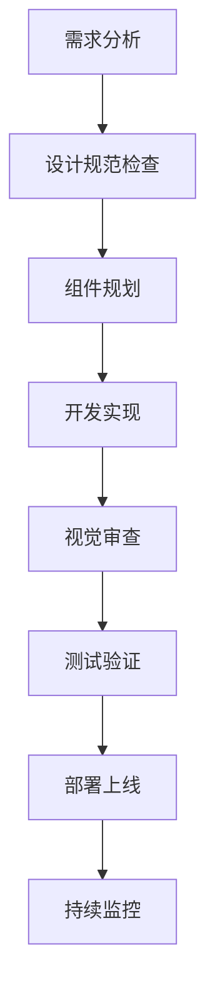

# 🚀 YYC³ UI风格一致性保障指南

## 📋 概述

本文档旨在为YYC³未来科技仪表盘项目提供全面的UI风格一致性保障方案，确保在模块功能实现及拓展过程中维持统一的视觉体验。

## 🎨 一、设计系统核心

### 1.1 现有设计令牌系统

您的项目已建立完善的设计令牌系统：

```css
/* 基础色彩令牌 */
--background: 0 0% 100%;
--foreground: 0 0% 3.9%;
--primary: 0 0% 9%;
--secondary: 0 0% 96.1%;

/* 组件色彩 */
--card: 0 0% 100%;
--card-foreground: 0 0% 3.9%;
--border: 0 0% 89.8%;
--input: 0 0% 89.8%;
```

### 1.2 色彩系统使用规范

#### 🔵 主要色彩搭配
- **主色调**: 深蓝色系 (#0F172A, #1E293B)
- **强调色**: 科技蓝 (#3B82F6, #06B6D4)
- **成功色**: 绿色系 (#10B981, #059669)
- **警告色**: 橙色系 (#F59E0B, #D97706)
- **错误色**: 红色系 (#EF4444, #DC2626)

#### 🌙 深色模式适配
```css
/* 深色模式下的科技感配色 */
.dark {
  --background: 0 0% 3.9%;
  --card: 0 0% 3.9%;
  --primary: 0 0% 98%;
  --muted: 0 0% 14.9%;
}
```

## 🧩 二、组件开发标准

### 2.1 组件结构规范

#### 标准组件模板
```tsx
/**
 * @description 未来科技风格的组件
 * @author YYC
 * @created 2024-10-15
 */
import { motion } from "framer-motion"
import { Card } from "@/components/ui/card"
import { cn } from "@/lib/utils"

interface FutureComponentProps {
  title: string
  children: React.ReactNode
  className?: string
  delay?: number
}

export const FutureComponent: React.FC<FutureComponentProps> = ({
  title,
  children,
  className = "",
  delay = 0
}) => {
  return (
    <motion.div
      initial={{ opacity: 0, y: 20 }}
      animate={{ opacity: 1, y: 0 }}
      transition={{ duration: 0.6, delay }}
      className={cn(
        "bg-slate-900/50 border-slate-700/50 backdrop-blur-sm",
        "rounded-lg border shadow-lg",
        className
      )}
    >
      {/* 组件内容 */}
    </motion.div>
  )
}
```

### 2.2 通用组件扩展规范

#### 按钮组件扩展
```tsx
// components/ui/button-futuristic.tsx
import { Button } from "@/components/ui/button"
import { motion } from "framer-motion"
import { cn } from "@/lib/utils"

interface FuturisticButtonProps extends ButtonProps {
  variant?: "default" | "neon" | "glow" | "outline"
  intensity?: "low" | "medium" | "high"
}

export const FuturisticButton: React.FC<FuturisticButtonProps> = ({
  variant = "default",
  intensity = "medium",
  className,
  children,
  ...props
}) => {
  const variantStyles = {
    neon: {
      low: "bg-blue-500/20 border-blue-500/50 text-blue-400",
      medium: "bg-blue-500/30 border-blue-500/70 text-blue-300",
      high: "bg-blue-500/40 border-blue-500 text-blue-200"
    },
    glow: {
      low: "bg-purple-500/20 border-purple-500/50 shadow-purple-500/20",
      medium: "bg-purple-500/30 border-purple-500/70 shadow-purple-500/30",
      high: "bg-purple-500/40 border-purple-500 shadow-purple-500/40"
    }
  }

  return (
    <motion.div
      whileHover={{ scale: 1.05 }}
      whileTap={{ scale: 0.95 }}
    >
      <Button
        className={cn(
          "transition-all duration-300",
          variant !== "default" && variantStyles[variant][intensity],
          className
        )}
        {...props}
      >
        {children}
      </Button>
    </motion.div>
  )
}
```

### 2.3 动画系统规范

#### 基础动画库
```typescript
// lib/animations-system.ts
export const animations = {
  // 入场动画
  enter: {
    initial: { opacity: 0, y: 30 },
    animate: { 
      opacity: 1, 
      y: 0,
      transition: { duration: 0.6, ease: "easeOut" }
    }
  },
  
  // 悬停效果
  hover: {
    scale: 1.02,
    y: -2,
    transition: { duration: 0.2 }
  },
  
  // 科技感光效
  glow: {
    boxShadow: "0 0 20px rgba(59, 130, 246, 0.5)"
  },
  
  // 页面切换
  pageTransition: {
    initial: { opacity: 0, x: 20 },
    animate: { 
      opacity: 1, 
      x: 0,
      transition: { duration: 0.4, ease: "easeInOut" }
    },
    exit: { 
      opacity: 0, 
      x: -20,
      transition: { duration: 0.3 }
    }
  }
}
```

## 🎭 三、视觉风格指南

### 3.1 字体系统

```css
/* 全局字体配置 */
:root {
  --font-sans: var(--font-geist-sans);
  --font-mono: var(--font-geist-mono);
}

/* 字体层级 */
.text-display { 
  font-size: 2.5rem; 
  font-weight: 700; 
  line-height: 1.2;
}
.text-headline { 
  font-size: 1.875rem; 
  font-weight: 600; 
  line-height: 1.3;
}
.text-title { 
  font-size: 1.5rem; 
  font-weight: 600; 
  line-height: 1.4;
}
.text-body { 
  font-size: 1rem; 
  font-weight: 400; 
  line-height: 1.5;
}
.text-caption { 
  font-size: 0.875rem; 
  font-weight: 400; 
  line-height: 1.4;
}
```

### 3.2 间距系统

```css
/* 基于8px网格的间距系统 */
.spacing-xs { padding: 0.5rem; }    /* 8px */
.spacing-sm { padding: 1rem; }      /* 16px */
.spacing-md { padding: 1.5rem; }    /* 24px */
.spacing-lg { padding: 2rem; }      /* 32px */
.spacing-xl { padding: 3rem; }      /* 48px */
.spacing-2xl { padding: 4rem; }     /* 64px */
```

### 3.3 边框和圆角

```css
/* 科技感边框效果 */
.border-futuristic {
  border: 1px solid rgba(59, 130, 246, 0.3);
  border-radius: 0.5rem;
  backdrop-filter: blur(8px);
}

.border-glow {
  border: 1px solid rgba(59, 130, 246, 0.5);
  box-shadow: 
    0 0 10px rgba(59, 130, 246, 0.2),
    inset 0 0 10px rgba(59, 130, 246, 0.1);
}
```

## 🔧 四、开发流程规范

### 4.1 新组件开发检查清单

#### ✅ 功能实现前
- [ ] 确认设计需求符合现有设计系统
- [ ] 检查是否存在可复用的现有组件
- [ ] 定义组件的TypeScript接口
- [ ] 规划组件的动画效果

#### ✅ 开发过程中
- [ ] 使用设计令牌系统中的颜色
- [ ] 遵循8px网格间距系统
- [ ] 实现响应式设计（移动端优先）
- [ ] 添加适当的动画效果
- [ ] 确保深色模式兼容性

#### ✅ 开发完成后
- [ ] 代码审查（风格一致性）
- [ ] 视觉对比检查
- [ ] 响应式测试
- [ ] 无障碍性测试
- [ ] 性能优化检查

### 4.2 样式管理最佳实践

#### CSS-in-JS vs Tailwind CSS
```tsx
// ✅ 推荐：使用Tailwind CSS类
<div className="bg-slate-900/50 border border-slate-700/50 backdrop-blur-sm">

// ✅ 推荐：创建可复用的组件样式
<div className={cn(
  "bg-card text-card-foreground rounded-lg border",
  "transition-all duration-300 hover:shadow-lg",
  className
)>

// ❌ 避免：内联样式
<div style={{ backgroundColor: '#1e293b' }}>

// ❌ 避免：复杂的CSS类组合
<div className="bg-slate-900 border-slate-700 rounded-lg shadow-lg hover:shadow-xl transition-all duration-300">
```

### 4.3 组件库扩展策略

#### 创建项目特定组件
```typescript
// components/yyc3/ 目录结构
components/
├── ui/                    # 基础shadcn/ui组件
├── animated/              # 动画增强组件
│   ├── animated-card.tsx
│   ├── animated-button.tsx
│   └── animated-modal.tsx
├── futuristic/            # 科技风格组件
│   ├── hologram-card.tsx
│   ├── neon-border.tsx
│   └── matrix-background.tsx
└── layout/                # 布局组件
    ├── futuristic-sidebar.tsx
    └── glassmorphism-panel.tsx
```

## 🛠️ 五、工具和验证

### 5.1 开发工具配置

#### ESLint规则扩展
```json
// .eslintrc.js
{
  "rules": {
    // 强制使用设计令牌
    "prefer-const": "error",
    "no-magic-numbers": ["error", { "ignore": [0, 1, 2, 4, 8, 16, 24, 32, 48, 64] }],
    
    // Tailwind CSS优化
    "tailwindcss/no-custom-classname": "error",
    "tailwindcss/enforces-negative-arbitrary-values": "error"
  }
}
```

#### Prettier格式化配置
```json
// .prettierrc
{
  "printWidth": 80,
  "tabWidth": 2,
  "useTabs": false,
  "semi": true,
  "singleQuote": false,
  "quoteProps": "as-needed",
  "trailingComma": "es5",
  "bracketSpacing": true,
  "bracketSameLine": false,
  "arrowParens": "avoid"
}
```

### 5.2 视觉回归测试

#### 组件截图测试
```typescript
// tests/visual/button.test.tsx
import { test, expect } from '@playwright/test'

test.describe('Button Visual Tests', () => {
  test('futuristic button variants', async ({ page }) => {
    await page.goto('/test-components')
    
    // 测试不同变体的视觉效果
    const variants = ['default', 'neon', 'glow', 'outline']
    
    for (const variant of variants) {
      const element = page.locator(`[data-variant="${variant}"]`)
      await expect(element).toHaveScreenshot(`button-${variant}.png`)
    }
  })
})
```

### 5.3 自动化样式检查

#### Stylelint配置
```json
// .stylelintrc.json
{
  "extends": ["stylelint-config-standard"],
  "rules": {
    "color-hex-length": "long",
    "color-named": "never",
    "selector-no-qualifying-type": true,
    "selector-combinator-space-after": "always",
    "selector-attribute-quotes": "always",
    "declaration-block-trailing-semicolon": "always"
  }
}
```

## 📱 六、响应式设计规范

### 6.1 断点系统

```css
/* 响应式断点 */
.container {
  width: 100%;
  padding: 0 1rem;
}

@media (min-width: 640px) { /* sm */ }
@media (min-width: 768px) { /* md */ }
@media (min-width: 1024px) { /* lg */ }
@media (min-width: 1280px) { /* xl */ }
@media (min-width: 1536px) { /* 2xl */ }
```

### 6.2 移动端优先策略

```tsx
// 组件响应式示例
const ResponsiveCard: React.FC = () => {
  return (
    <div className="
      w-full p-4                    /* 移动端 */
      sm:p-6                        /* 小屏幕 */
      md:p-8 md:w-2/3               /* 中等屏幕 */
      lg:p-10 lg:w-1/2              /* 大屏幕 */
      xl:p-12 xl:w-1/3              /* 超大屏幕 */
    ">
      {/* 内容 */}
    </div>
  )
}
```

## 🎯 七、性能优化

### 7.1 样式优化

```typescript
// 使用CSS变量减少重复
const useThemeColors = () => {
  const styles = {
    background: 'hsl(var(--background))',
    foreground: 'hsl(var(--foreground))',
    primary: 'hsl(var(--primary))',
    // ... 其他颜色
  }
  
  return styles
}
```

### 7.2 动画性能

```typescript
// 硬件加速动画
const optimizeAnimations = {
  useTransform: true,
  useSpring: true,
  layout: false,
  isStatic: false,
  forceReduceMotion: "respect-preference"
}
```

## 📊 八、监控和质量保证

### 8.1 风格一致性检查

```bash
#!/bin/bash
# scripts/style-check.sh
set -euo pipefail

echo "🔍 检查UI风格一致性..."

# 检查未使用的设计令牌
npx tailwindcss-analyze

# 验证组件结构
npm run test:visual

# 检查TypeScript类型
npm run type-check

# 验证无障碍性
npm run a11y-check

echo "✅ 风格检查完成"
```

### 8.2 性能监控

```typescript
// lib/performance.ts
export const measureStylePerformance = () => {
  if (typeof window !== 'undefined') {
    // 监控样式计算时间
    performance.mark('style-start')
    // 执行样式相关操作
    performance.mark('style-end')
    performance.measure('style-calculation', 'style-start', 'style-end')
  }
}
```

## 🚀 九、最佳实践总结

### 9.1 核心原则

1. **一致性优先**: 所有UI元素必须遵循统一的设计规范
2. **可复用性**: 优先复用现有组件，避免重复造轮子
3. **响应式设计**: 确保在所有设备上的良好体验
4. **性能优化**: 合理使用动画和样式，避免性能问题
5. **可维护性**: 清晰的代码结构和注释

### 9.2 开发流程



### 9.3 团队协作

- **代码审查**: 每次合并前必须进行UI风格审查
- **设计系统更新**: 及时同步设计令牌变更
- **组件文档**: 维护完整的组件使用文档
- **培训计划**: 定期组织设计系统培训

## 📝 十、附录

### 10.1 常用代码片段

#### 科技感卡片
```tsx
<motion.div
  className="bg-slate-900/50 border border-slate-700/50 backdrop-blur-sm rounded-lg p-6"
  whileHover={{ y: -4, boxShadow: "0 20px 25px -5px rgba(0, 0, 0, 0.1)" }}
>
  {/* 卡片内容 */}
</motion.div>
```

#### 发光按钮
```tsx
<motion.button
  className="bg-blue-600/20 border border-blue-500/50 text-blue-400 px-6 py-3 rounded-lg"
  whileHover={{ 
    boxShadow: "0 0 20px rgba(59, 130, 246, 0.5)" 
  }}
  whileTap={{ scale: 0.95 }}
>
  发光按钮
</motion.button>
```

### 10.2 色彩参考

```css
/* 科技蓝色系 */
--tech-blue: 59, 130, 246;      /* #3B82F6 */
--tech-blue-dark: 37, 99, 235;   /* #2563EB */
--tech-blue-light: 96, 165, 250; /* #60A5FA */

/* 未来绿色系 */
--futuristic-green: 16, 185, 129; /* #10B981 */
--neon-green: 34, 197, 94;        /* #22C55E */

/* 警告橙色系 */
--warning-orange: 245, 158, 11;   /* #F59E0B */
--error-red: 239, 68, 68;         /* #EF4444 */
```

---

**💡 保持设计系统的一致性是确保用户体验的关键。通过遵循这些规范，您的团队将能够构建出既美观又一致的未来科技风格仪表盘。**

*最后更新: 2024-10-15 | 版本: v1.0.0*