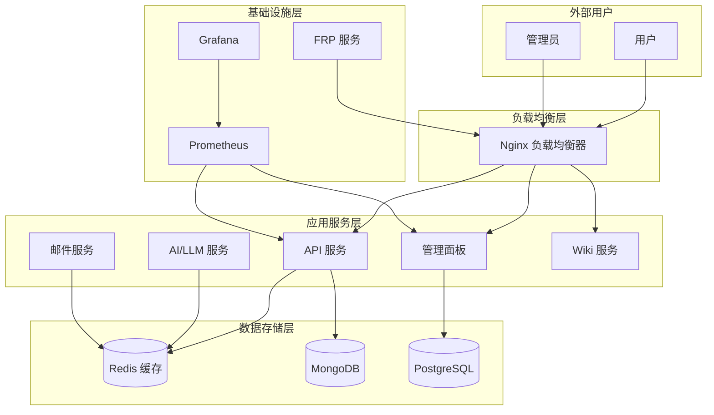

# 系统架构文档

## 架构概述

0379.email 采用微服务架构，基于 Docker 容器化部署，支持多服务器环境。

## 系统架构图

## 服务详细说明

### API 服务 (端口 3000)

**职责**：

- RESTful API 网关
- 用户认证和授权
- 请求路由和转发
- API 文档生成

**技术栈**：

- Node.js + Express.js
- JWT 认证
- Swagger/OpenAPI 文档

### 管理面板 (端口 3001)

**职责**：

- 系统管理界面
- 用户管理
- 服务监控
- 配置管理

**技术栈**：

- React.js + TypeScript
- Ant Design UI
- 状态管理：Redux Toolkit

### AI/LLM 服务 (端口 3002)

**职责**：

- 大语言模型集成
- 智能内容生成
- 自然语言处理
- AI 对话接口

**技术栈**：

- Python + FastAPI
- OpenAI API 集成
- 模型缓存和优化

### 邮件服务 (端口 3003)

**职责**：

- 邮件发送和接收
- 邮件模板管理
- 邮件队列处理
- 邮件统计分析

**技术栈**：

- Node.js + Nodemailer
- SMTP 集成
- 队列系统：Bull Queue

### Wiki 服务 (端口 3004)

**职责**：

- 知识管理系统
- 文档编辑和版本控制
- 全文搜索
- 协作编辑

**技术栈**：

- Node.js + Express.js
- Markdown 渲染
- 搜索引擎：Elasticsearch

## 数据存储架构

### Redis (端口 6379)

**用途**：

- 会话存储
- 缓存数据
- 消息队列
- 实时数据

**配置**：

- 内存优化
- 持久化配置
- 集群支持

### MongoDB (端口 27017)

**用途**：

- 文档存储
- 日志数据
- 非结构化数据

**配置**：

- 副本集
- 索引优化
- 分片支持

### PostgreSQL (端口 5432)

**用途**：

- 关系型数据
- 事务处理
- 用户数据

**配置**：

- 主从复制
- 连接池
- 性能调优

## 网络架构

### 内部网络

- **应用网络**：容器间通信
- **数据库网络**：数据存储访问
- **监控网络**：监控数据传输

### 外部访问

- **HTTPS**：443 端口，加密通信
- **HTTP**：80 端口，重定向到 HTTPS
- **SSH**：22 端口，管理访问

## 安全架构

### 认证授权

- JWT 令牌认证
- 基于角色的访问控制 (RBAC)
- API 密钥管理
- OAuth 2.0 集成

### 数据安全

- 传输层加密 (TLS 1.3)
- 数据库加密
- 敏感数据脱敏
- 密钥轮换机制

### 网络安全

- 防火墙规则
- DDoS 防护
- 入侵检测
- 安全监控

## 部署架构

### 开发环境

- 单机部署
- 热重载支持
- 调试工具集成
- 测试数据

### 生产环境

- 多服务器部署
- 负载均衡
- 高可用配置
- 自动扩缩容

### 服务器角色

- **yyc3-22**：开发服务器
- **yyc3-121**：生产服务器
- **yyc3-45**：NAS 存储服务器

## 监控架构

### 指标收集

- **Prometheus**：指标收集和存储
- **Grafana**：可视化面板
- **AlertManager**：告警管理

### 日志管理

- **ELK Stack**：日志收集和分析
- **Filebeat**：日志收集
- **Kibana**：日志可视化

### 健康检查

- 服务可用性监控
- 性能指标监控
- 资源使用监控
- 错误率监控

## 备份策略

### 数据备份

- **数据库备份**：每日全量备份 + 实时增量
- **文件备份**：定期备份重要文件
- **配置备份**：版本控制管理

### 灾难恢复

- **RTO**：恢复时间目标 < 4 小时
- **RPO**：恢复点目标 < 1 小时
- **多地域备份**：异地容灾

## 性能优化

### 应用层优化

- 缓存策略
- 数据库连接池
- 异步处理
- 代码优化

### 基础设施优化

- 负载均衡
- CDN 加速
- 数据库优化
- 网络优化

---

*文档版本：v1.0.0*
*最后更新：2024-11-10*
