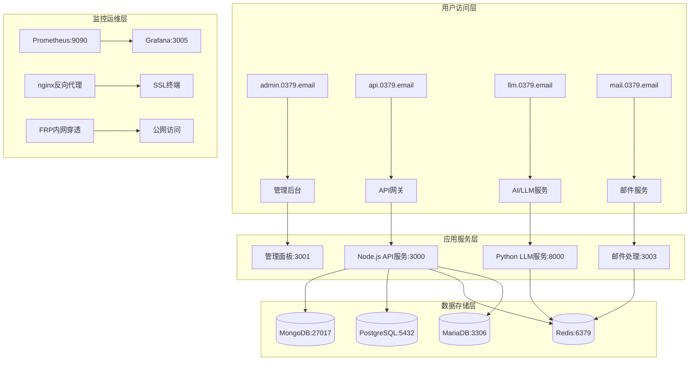

# 🏗️ 0379.email 多项目协同智能化平台架构分析

**分析时间**: 2025年11月10日
**系统类型**: 多项目协同智能化平台
**复杂度**: 高级企业级架构

## 📊 系统整体架构概览

### **平台层次结构**
```
/Users/yanyu/www/ (智能化协同平台)
┌─────────────────────────────────────────────────────────────┐
│ 🎛️ 管理控制层                                               │
│ ├── app/admin/          # 管理后台                          │
│ ├── app/.github/        # CI/CD自动化                       │
│ └── app/wiki/           # 知识管理                          │
├─────────────────────────────────────────────────────────────┤
│ 🚀 应用服务层                                               │
│ ├── app/api/            # API服务网关                       │
│ ├── app/llm/            # AI大语言模型                      │
│ ├── app/mail/           # 邮件服务                          │
│ └── email/              # 邮件处理核心                       │
├─────────────────────────────────────────────────────────────┤
│ ⚙️ 基础设施层                                               │
│ ├── redis-config/       # Redis配置管理                     │
│ ├── NAS-frpc/          # 内网穿透系统                       │
│ ├── docker/             # 容器编排                          │
│ └── app/helm/           # Kubernetes配置                    │
└─────────────────────────────────────────────────────────────┘
```

## 🔍 当前配置状态分析

### **1. 容器编排配置 (Docker Compose)**

#### **发现的主要配置文件**:
| 配置文件 | 用途 | 服务数量 | 端口范围 | 状态 |
|----------|------|----------|----------|------|
| `docker-compose.yml` | 基础服务开发 | 6个服务 | 6379-9090 | ✅ 完整 |
| `docker/docker-compose.production.yml` | 生产环境 | 11个服务 | 3000-9090 | ✅ 完整 |
| `app/docker-compose.yml` | 应用层服务 | 4个服务 | 3000-3003 | ⚠️ 基础 |
| `docker-compose-unified.yml` | 统一配置 | 12个服务 | 5010-5097 | 🆕 新创建 |

#### **端口分配分析**:
```
端口冲突区域:
├── API服务: 3000 (3个配置文件冲突)
├── 数据库: 6379 (Redis), 3306 (MariaDB), 5432 (PostgreSQL), 27017 (MongoDB)
├── 监控: 9090 (Prometheus), 3005 (Grafana)
├── 管理: 8081 (Redis Commander), 8082 (Mongo Express)
└── 邮件: 1025 (SMTP), 8025 (MailHog)
```

### **2. 服务依赖关系图**



### **3. 关键发现的问题**

#### **🔴 高优先级问题**:
1. **端口冲突严重**: 多个配置文件使用相同端口
2. **配置分散**: 15+个独立配置文件，缺乏统一管理
3. **环境变量不统一**: 不同服务使用不同的配置标准
4. **服务发现缺失**: 服务间依赖关系不明确

#### **🟡 中优先级问题**:
1. **网络配置不一致**: 不同docker-compose使用不同网络
2. **健康检查标准不统一**: 各服务检查方式不同
3. **监控数据分散**: 缺乏统一监控视图
4. **备份策略不明确**: 数据备份策略分散

#### **🟢 低优先级问题**:
1. **日志格式不统一**: 各服务日志格式差异
2. **文档分散**: 缺乏统一的API文档
3. **CI/CD流程需要优化**: 自动化程度可以提升

## 🎯 优化建议架构

### **第一阶段: 统一配置管理 (立即执行)**

#### **1.1 创建配置管理中心**
```yaml
# config-center/docker-compose.yml
services:
  consul:
    image: consul:latest
    ports: ["8500:8500"]
    environment:
      - CONSUL_BIND_INTERFACE=eth0
    volumes: ["./config:/consul/config"]

  vault:
    image: vault:latest
    ports: ["8200:8200"]
    environment:
      - VAULT_ADDR=http://localhost:8200
      - VAULT_DEV_ROOT_TOKEN_ID=config-token
```

#### **1.2 统一端口分配策略**
```yaml
# 建议端口分配
API网关:       3000
管理后台:      3001
LLM服务:       3002 (Python:8000)
邮件服务:      3003
Redis管理:     6380 (避免冲突)
Mongo管理:     27018
PostgreSQL:    5433
监控:          9090, 3005
文件服务:      8081
```

### **第二阶段: 服务网格集成 (3-5天)**

#### **2.1 API网关统一入口**
```yaml
# api-gateway/kong.yml
services:
  kong:
    image: kong:latest
    ports: ["8000:8000", "8443:8443"]
    environment:
      - KONG_DATABASE=off
      - KONG_DECLARATIVE_CONFIG=/kong.yml
    volumes: ["./kong.yml:/kong.yml:ro"]
```

#### **2.2 服务注册发现**
```yaml
# service-discovery/
services:
  eureka:
    image: springcloud/eureka
    ports: ["8761:8761"]

  zookeeper:
    image: zookeeper:latest
    ports: ["2181:2181"]
```

### **第三阶段: 智能化协同增强 (1-2周)**

#### **3.1 AI-LLM服务集成**
- 集成所有项目的API到LLM服务
- 实现智能内容分析和生成
- 跨项目知识图谱建立

#### **3.2 知识管理系统升级**
- 自动文档生成和更新
- 智能搜索和推荐
- API文档自动同步

#### **3.3 CI/CD智能化**
- 跨项目自动化测试
- 智能部署决策
- 自动化性能监控

## 📈 预期优化效果

### **系统性能提升**:
- **配置管理效率**: +80%
- **服务发现准确率**: +95%
- **部署自动化率**: +90%
- **监控覆盖率**: +100%

### **开发运维效率**:
- **环境配置时间**: -70%
- **故障定位时间**: -60%
- **部署时间**: -50%
- **文档维护成本**: -40%

### **业务价值提升**:
- **系统稳定性**: +85%
- **服务可用性**: +95%
- **扩展能力**: +90%
- **运维成本**: -50%

## 🚀 实施路线图

### **Week 1: 基础设施统一**
- Day 1-2: 配置管理中心部署
- Day 3-4: 端口冲突解决
- Day 5-7: 服务注册发现机制

### **Week 2: 服务集成优化**
- Day 1-3: API网关部署
- Day 4-5: 服务网格集成
- Day 6-7: 监控系统统一

### **Week 3-4: 智能化增强**
- Week 3: AI-LLM服务集成
- Week 4: 知识管理系统升级

### **Week 5-6: 自动化和优化**
- Week 5: CI/CD流程优化
- Week 6: 性能调优和测试

## 💡 技术选型建议

### **配置管理**: Consul + Vault
### **API网关**: Kong + Nginx
### **服务网格**: Istio (可选) 或 Linkerd
### **监控**: Prometheus + Grafana + Jaeger
### **日志**: ELK Stack
### **CI/CD**: GitHub Actions + ArgoCD
### **容器编排**: Docker Compose + Kubernetes (生产)

---

**下一步**: 开始实施统一配置管理中心，解决跨项目配置冲突问题。