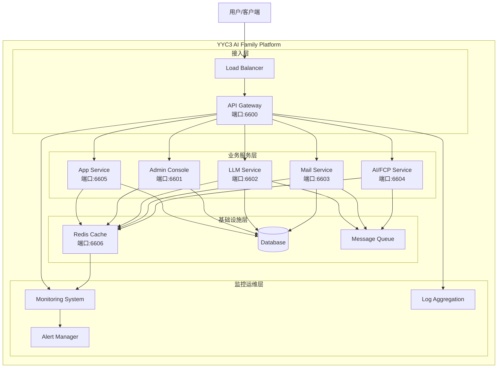
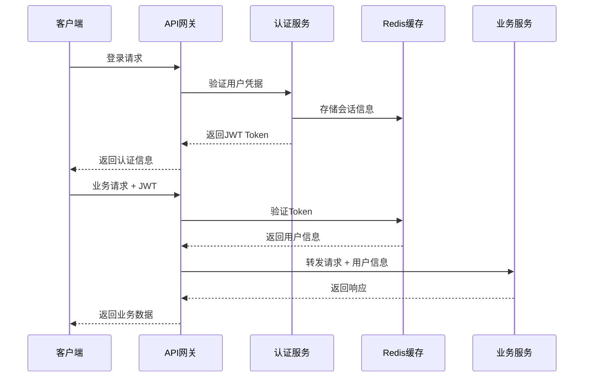

# YYC3 AI Family - 完整项目文档

> 📋 更新时间: 2025-12-06
> 🚀 版本: v2.0.0
> 📖 文档状态: 完整版

---

## 📚 目录索引

### 🎯 核心组件文档
- [🌐 App组件 - 0379.email多服务平台](#app-component)
- [💾 Rdeis组件 - Redis缓存服务](#redis-component)
- [🔗 项目整合方案](#integration-plan)

### 🏗️ 系统架构文档
- [📐 整体架构设计](#architecture-design)
- [🛠️ 技术栈规范](#tech-stack)
- [🌐 服务端口分配](#port-allocation)

### 🚀 部署与运维
- [⚙️ 快速部署指南](#deployment-guide)
- [🔧 环境配置](#environment-config)
- [📊 监控与日志](#monitoring-logging)

### 📋 API文档
- [🔌 API端点总览](#api-endpoints)
- [🔐 安全认证](#security-auth)
- [📡 服务间通信](#service-communication)

---

## 🌐 App组件 - 0379.email多服务平台 {#app-component}

### 📋 组件概述

**定位**: 企业级多服务平台，提供邮件、API、管理和AI推理服务
**版本**: v2.0.0
**技术栈**: Node.js + Express + Docker + Helm + Nginx + PM2

### 🏗️ 架构设计

```
app/
├── api/                          # API服务模块
│   ├── server.js                 # API服务入口
│   ├── middleware/               # 中间件
│   │   ├── validation.js        # 数据验证
│   │   └── auth.js              # 身份认证
│   └── app.py                   # Python应用入口
├── admin/                        # 管理面板
│   ├── server.js                # 管理服务
│   └── swagger.json             # API文档
├── llm/                         # AI推理服务
│   ├── server.js                # LLM服务入口
│   └── swagger.json             # API文档
├── mail/                        # 邮件服务
│   ├── server.js                # 邮件服务入口
│   ├── html/                    # 静态资源
│   └── swagger.json             # API文档
├── shared/                      # 共享模块
│   ├── redis/                   # Redis客户端
│   │   ├── client.js           # 客户端实现
│   │   ├── config.js           # 配置管理
│   │   └── security.js         # 安全模块
│   ├── status/                  # 状态监控
│   ├── docs/                    # 文档模块
│   ├── logger.js               # 日志系统
│   ├── errorHandler.js          # 错误处理
│   └── gateway/                 # 网关
├── docs/                        # 文档目录
│   ├── architecture-summary.md  # 架构总结
│   ├── changelog.html          # 变更日志
│   ├── deployment/              # 部署文档
│   ├── security/               # 安全文档
│   └── services/               # 服务文档
├── helm/                        # Helm Chart
│   ├── Chart.yaml              # Chart配置
│   ├── values.yaml             # 值配置
│   └── templates/              # 模板文件
├── scripts/                     # 自动化脚本
│   ├── start.sh                # 启动脚本
│   ├── setup-nginx.sh          # Nginx配置
│   └── init-folders.sh         # 初始化脚本
├── etc/                         # 配置文件
│   └── systemd/                # 系统服务配置
├── healthcheck/                 # 健康检查
├── nginx/                       # Nginx配置
└── ecosystem.config.js          # PM2配置
```

### 🔧 核心功能

#### API服务 (端口6600)
- **RESTful API**: 完整的REST API接口
- **身份认证**: JWT令牌认证机制
- **数据验证**: 请求参数自动验证
- **速率限制**: API调用频率控制
- **安全防护**: Helmet安全头、CORS支持

#### 管理面板 (端口6601)
- **系统监控**: 实时服务状态监控
- **用户管理**: 用户权限和角色管理
- **日志查看**: 系统日志和错误追踪
- **配置管理**: 动态配置更新

#### LLM服务 (端口6602)
- **GLM模型集成**: 支持GLM-4.5-Flash等模型
- **MCP工具**: 联网搜索、视觉理解、代码执行
- **深度思考**: 智能推理和分析能力
- **对话管理**: 会话上下文和历史记录

#### 邮件服务 (端口6603)
- **邮件收发**: SMTP/POP3协议支持
- **模板管理**: 动态邮件模板系统
- **附件处理**: 文件上传和附件管理
- **邮件队列**: 异步邮件发送队列

### 🛠️ 技术实现

#### 核心依赖
```json
{
  "dependencies": {
    "express": "^4.18.2",
    "helmet": "^7.1.0",
    "cors": "^2.8.5",
    "redis": "^4.6.10",
    "jsonwebtoken": "^9.0.2",
    "bcryptjs": "^2.4.3",
    "express-rate-limit": "^7.1.5",
    "compression": "^1.7.4"
  }
}
```

#### 部署架构
- **PM2进程管理**: 自动重启和负载均衡
- **Docker容器化**: 轻量级虚拟化部署
- **Helm K8s**: Kubernetes集群部署
- **Nginx反向代理**: SSL终端和负载均衡

---

## 💾 Rdeis组件 - Redis缓存服务 {#redis-component}

### 📋 组件概述

**定位**: 专业的Redis缓存服务和运维管理平台
**版本**: v2.0.0
**技术栈**: Node.js + Express + Redis + Docker Compose

### 🏗️ 架构设计

```
Rdeis/
├── api/                         # API服务
│   ├── index.js                # API入口
│   ├── config/                 # 配置管理
│   │   ├── db.js              # 数据库配置
│   │   ├── index.js           # 主配置
│   │   └── production.json     # 生产环境配置
│   ├── controllers/            # 控制器
│   │   ├── statusController.js # 状态控制器
│   │   └── userController.js  # 用户控制器
│   ├── middleware/             # 中间件
│   │   ├── auth.js            # 认证中间件
│   │   ├── logger.js          # 日志中间件
│   │   ├── rateLimit.js       # 速率限制
│   │   └── role.js           # 角色控制
│   ├── models/                 # 数据模型
│   │   └── users.js          # 用户模型
│   ├── routes/                 # 路由
│   │   ├── status.js         # 状态路由
│   │   └── user.js          # 用户路由
│   ├── services/              # 服务层
│   │   ├── config.js         # 配置服务
│   │   ├── mail.js           # 邮件服务
│   │   └── redis.js          # Redis服务
│   ├── validators/            # 验证器
│   ├── sdk/                   # SDK
│   ├── nodemon.json           # 开发配置
│   └── server.js              # 服务器入口
├── config/                    # Docker配置
│   ├── docker-compose.yml     # 容器编排
│   ├── redis-base.conf        # Redis基础配置
│   ├── redis-dev.conf         # 开发环境配置
│   └── redis-prod.conf        # 生产环境配置
├── docs/                      # 文档
│   ├── API-COMPOSE.md        # API编排指南
│   ├── ENV.md                # 环境变量规范
│   ├── NAS-DEPLOY.md         # NAS部署方案
│   ├── OPS.md                # 运维规范
│   ├── REDIS.md              # Redis配置说明
│   ├── SCRIPTS.md            # 脚本说明
│   └── SECURITY.md           # 安全策略
├── scripts/                   # 运维脚本
│   ├── redis-manager.sh      # Redis管理脚本
│   ├── check-redis-prod.sh   # 生产环境检查
│   ├── backup-restore.sh      # 备份恢复
│   └── health-keys.sh        # 健康检查
└── README.md                 # 项目说明
```

### 🔧 核心功能

#### Redis缓存服务 (端口6606)
- **缓存管理**: 键值对存储和检索
- **会话管理**: 用户会话数据存储
- **服务状态**: 系统状态实时缓存
- **性能统计**: 缓存命中率和使用统计

#### 运维管理
- **健康检查**: Redis实例状态监控
- **备份恢复**: 数据备份和恢复机制
- **安全管理**: ACL权限和密码保护
- **性能优化**: 内存策略和持久化配置

### 🛠️ 技术实现

#### Redis配置
```redis
# 生产环境安全配置
protected-mode yes
requirepass redis_yyc3_password
rename-command FLUSHALL ""
rename-command FLUSHDB ""
rename-command CONFIG "CONFIG_b840c02a"

# 性能优化配置
maxmemory 8gb
maxmemory-policy volatile-lru
save 900 1
save 300 10
save 60 10000
```

#### Docker编排
```yaml
version: '3.8'
services:
  redis-prod:
    image: redis:alpine
    ports:
      - "6380:6379"
    volumes:
      - ./config/redis-prod.conf:/etc/redis/redis.conf
      - redis_data:/data
    command: redis-server /etc/redis/redis.conf
    healthcheck:
      test: ["CMD", "redis-cli", "ping"]
      interval: 30s
      timeout: 10s
      retries: 3
```

---

## 🔗 项目整合方案 {#integration-plan}

### 📊 整合评估

#### 技术兼容性分析

| 方面 | App组件 | Rdeis组件 | 兼容性 | 整合优先级 |
|------|---------|-----------|---------|------------|
| 技术栈 | Node.js+Express | Node.js+Express | ✅ 高 | ⭐⭐⭐⭐⭐ |
| Redis使用 | 客户端 | 服务端 | ✅ 完美 | ⭐⭐⭐⭐⭐ |
| 部署方式 | Docker/Helm | Docker Compose | ✅ 兼容 | ⭐⭐⭐⭐ |
| API设计 | RESTful | RESTful | ✅ 一致 | ⭐⭐⭐⭐ |
| 监控体系 | 完整 | 专业 | ✅ 互补 | ⭐⭐⭐⭐⭐ |

#### 功能互补性

**App组件优势**:
- 完整的业务API服务
- 成熟的管理和监控系统
- 丰富的业务功能模块
- 标准化的部署流程

**Rdeis组件优势**:
- 专业的Redis缓存服务
- 标准化的运维管理
- 强化的安全配置
- 详细的性能监控

### 🏗️ 推荐整合架构

```
yyc3-unified-platform/
├── services/                    # 统一服务目录
│   ├── gateway/                # API网关 (6600)
│   ├── cache/                   # 缓存服务 (6606)
│   ├── admin/                   # 管理服务 (6601)
│   ├── llm/                     # AI服务 (6602)
│   ├── mail/                    # 邮件服务 (6603)
│   ├── ai-fcp/                  # AI文件处理 (6604)
│   └── app/                     # 前端应用 (6605)
├── infrastructure/             # 基础设施
│   ├── redis/                  # Redis基础设施
│   ├── monitoring/             # 监控系统
│   ├── security/               # 安全组件
│   └── networking/             # 网络配置
├── shared/                     # 共享模块
│   ├── auth/                   # 统一认证
│   ├── config/                 # 配置管理
│   ├── logger/                 # 日志系统
│   └── utils/                  # 工具函数
├── config/                     # 配置目录
│   ├── environments/           # 环境配置
│   ├── docker/                 # Docker配置
│   └── kubernetes/             # K8s配置
├── docs/                      # 文档目录
├── scripts/                    # 脚本目录
├── deployment/                 # 部署相关
└── tests/                      # 测试相关
```

### 🚀 实施路线图

#### 第一阶段：基础设施整合 (1周)
1. **Redis服务整合**
   - 将Rdeis作为统一缓存基础设施
   - 统一Redis连接池和配置管理
   - 整合监控和健康检查

2. **共享模块统一**
   - 统一认证和授权机制
   - 整合日志和监控系统
   - 统一配置管理体系

#### 第二阶段：服务整合 (1-2周)
1. **API网关建设**
   - 统一API入口和路由
   - 统一限流和安全策略
   - 服务发现和负载均衡

2. **服务目录重构**
   - 按功能域重新组织服务
   - 统一服务命名和端口规范
   - 标准化服务接口设计

#### 第三阶段：部署优化 (1-2周)
1. **容器化统一**
   - 统一Dockerfile和镜像构建
   - 整合Docker Compose配置
   - 标准化K8s部署配置

2. **CI/CD流程**
   - 统一代码仓库和分支策略
   - 整合自动化测试和部署
   - 统一监控和告警体系

### 📋 整合收益

#### 技术收益
- **统一技术栈**: 降低维护成本和学习成本
- **标准化流程**: 统一的开发、测试、部署流程
- **提升效率**: 共享模块和基础设施复用

#### 业务收益
- **完整解决方案**: 从缓存到业务的完整服务链
- **更好的用户体验**: 统一的接口和管理界面
- **更强的可扩展性**: 模块化架构支持快速扩展

#### 运维收益
- **统一监控**: 全局视图的服务监控
- **简化部署**: 一键部署和扩容
- **降低成本**: 资源共享和统一管理

---

## 📐 整体架构设计 {#architecture-design}

### 🏛️ 系统架构图



### 🌐 服务端口分配 {#port-allocation}

| 服务名称 | 端口 | 域名 | 协议 | 状态 | 描述 |
|---------|------|------|------|------|------|
| API Gateway | 6600 | api.0379.email | HTTP/HTTPS | ✅ 运行 | API网关和路由服务 |
| Admin Console | 6601 | admin.0379.email | HTTP | ✅ 运行 | 管理控制台 |
| LLM Service | 6602 | llm.0379.email | HTTP/HTTPS | ✅ 运行 | AI对话服务 |
| Mail Service | 6603 | mail.0379.email | HTTP/HTTPS | ✅ 运行 | 邮件平台服务 |
| AI/FCP Service | 6604 | ai.0379.email | HTTP/HTTPS | ✅ 运行 | AI文件处理服务 |
| App Service | 6605 | app.0379.email | HTTP/HTTPS | ✅ 运行 | 前端应用集成 |
| Redis Cache | 6606 | redis.0379.email | Redis | ✅ 运行 | 缓存服务 |

### 🛠️ 技术栈规范 {#tech-stack}

#### 核心技术栈

| 类别 | 技术 | 版本 | 用途 |
|------|------|------|------|
| 运行时 | Node.js | 18+ | 服务运行环境 |
| 运行时 | Bun | latest | 替代Node.js的高性能运行时 |
| Web框架 | Express.js | 4.18+ | HTTP服务框架 |
| 数据库 | Redis | 7.0+ | 缓存和会话存储 |
| 数据库 | MongoDB | 6.0+ | 业务数据存储 |
| 容器化 | Docker | 20.10+ | 应用容器化 |
| 编排 | Kubernetes | 1.25+ | 容器编排 |
| 监控 | Prometheus | 2.40+ | 指标监控 |
| 日志 | ELK Stack | 8.0+ | 日志聚合分析 |

#### 开发工具链

| 类别 | 工具 | 版本 | 用途 |
|------|------|------|------|
| 包管理 | Bun | latest | 包管理和构建 |
| 代码规范 | ESLint | 8.0+ | 代码质量检查 |
| 格式化 | Prettier | 3.0+ | 代码格式化 |
| 测试 | Jest | 29.0+ | 单元测试 |
| 构建 | Webpack | 5.0+ | 前端构建 |
| 文档 | Swagger | 3.0+ | API文档 |

---

## ⚙️ 环境配置 {#environment-config}

### 🌍 环境变量规范

#### 核心服务配置
```bash
# 基础配置
NODE_ENV=production
LOG_LEVEL=info
TZ=Asia/Shanghai

# 服务端口配置
API_PORT=6600
ADMIN_PORT=6601
LLM_PORT=6602
MAIL_PORT=6603
AI_PORT=6604
APP_PORT=6605
REDIS_PORT=6606

# Redis配置
REDIS_HOST=localhost
REDIS_PORT=6606
REDIS_PASSWORD=redis_yyc3_password
REDIS_DB=0

# 数据库配置
MONGODB_URI=mongodb://localhost:27017/yyc3
MONGODB_DB_NAME=yyc3

# 安全配置
JWT_SECRET=your_jwt_secret_key
JWT_EXPIRES_IN=24h
BCRYPT_ROUNDS=12

# 邮件配置
SMTP_HOST=smtp.0379.email
SMTP_PORT=587
SMTP_USER=noreply@0379.email
SMTP_PASS=smtp_password

# AI服务配置
GLM_API_KEY=your_glm_api_key
GLM_BASE_URL=https://open.bigmodel.cn/api/paas/v4/

# 监控配置
PROMETHEUS_PORT=9090
GRAFANA_PORT=3000
```

#### Docker环境配置
```yaml
# docker-compose.yml
version: '3.8'
services:
  yyc3-platform:
    build:
      context: .
      dockerfile: Dockerfile
    environment:
      - NODE_ENV=production
      - REDIS_HOST=redis
      - REDIS_PORT=6379
    ports:
      - "6600-6606:6600-6606"
    depends_on:
      - redis
      - mongodb
    networks:
      - yyc3-network

  redis:
    image: redis:7-alpine
    ports:
      - "6606:6379"
    command: redis-server --requirepass redis_yyc3_password
    volumes:
      - redis_data:/data
    networks:
      - yyc3-network

  mongodb:
    image: mongo:6
    ports:
      - "27017:27017"
    environment:
      - MONGO_INITDB_ROOT_USERNAME=admin
      - MONGO_INITDB_ROOT_PASSWORD=mongodb_password
    volumes:
      - mongodb_data:/data/db
    networks:
      - yyc3-network
```

---

## 🚀 快速部署指南 {#deployment-guide}

### 📋 部署前置条件

#### 系统要求
- **操作系统**: Linux/macOS/Windows
- **内存**: 最低4GB，推荐8GB+
- **存储**: 最低20GB可用空间
- **网络**: 稳定的互联网连接

#### 软件依赖
- **Node.js**: 18.0+ (或使用Bun)
- **Docker**: 20.10+
- **Docker Compose**: 2.0+
- **Git**: 2.30+

### ⚡ 一键部署

#### 方式一：Docker Compose部署
```bash
# 1. 克隆项目
git clone https://github.com/YYC-Cube/yyc3-unified-platform.git
cd yyc3-unified-platform

# 2. 配置环境变量
cp .env.example .env
# 编辑.env文件，填入实际配置

# 3. 启动服务
docker-compose up -d

# 4. 检查服务状态
docker-compose ps
./check-all-services.sh
```

#### 方式二：本地源码部署
```bash
# 1. 克隆项目
git clone https://github.com/YYC-Cube/yyc3-unified-platform.git
cd yyc3-unified-platform

# 2. 安装依赖 (使用Bun)
bun install

# 3. 配置环境变量
cp .env.example .env
# 编辑.env文件

# 4. 启动所有服务
bun run start:all

# 5. 检查服务状态
./check-all-services.sh
```

#### 方式三：Kubernetes部署
```bash
# 1. 克隆项目
git clone https://github.com/YYC-Cube/yyc3-unified-platform.git
cd yyc3-unified-platform

# 2. 创建命名空间
kubectl create namespace yyc3-platform

# 3. 应用配置
kubectl apply -f k8s/configmaps/
kubectl apply -f k8s/secrets/
kubectl apply -f k8s/deployments/
kubectl apply -f k8s/services/

# 4. 检查部署状态
kubectl get pods -n yyc3-platform
```

### 🎯 验证部署

#### 服务健康检查
```bash
# 运行完整服务检查
./check-all-services.sh

# 预期输出
🎉 YYC3 AI Family 所有服务运行正常！
运行率: 100% | 健康率: 100%
```

#### API接口测试
```bash
# 测试API网关
curl http://localhost:6600/health

# 测试LLM服务
curl http://localhost:6602/health

# 测试Redis服务
curl http://localhost:6606/health
```

---

## 📊 监控与日志 {#monitoring-logging}

### 📈 监控体系

#### Prometheus指标收集
```yaml
# prometheus.yml
global:
  scrape_interval: 15s

scrape_configs:
  - job_name: 'yyc3-services'
    static_configs:
      - targets:
        - 'localhost:6600'  # API Gateway
        - 'localhost:6601'  # Admin Console
        - 'localhost:6602'  # LLM Service
        - 'localhost:6603'  # Mail Service
        - 'localhost:6604'  # AI/FCP Service
        - 'localhost:6605'  # App Service
        - 'localhost:6606'  # Redis Service
```

#### Grafana仪表板
- **系统概览**: 整体服务状态和性能指标
- **服务监控**: 各服务的详细性能数据
- **缓存监控**: Redis性能和内存使用情况
- **业务指标**: 请求量、响应时间、错误率

### 📝 日志管理

#### 结构化日志格式
```json
{
  "timestamp": "2025-12-06T20:00:00.000Z",
  "level": "info",
  "service": "yyc3-llm-service",
  "module": "chat-handler",
  "message": "GLM chat request processed",
  "requestId": "req_123456",
  "userId": "user_789",
  "duration": 1250,
  "metadata": {
    "model": "glm-4.5-flash",
    "tokens": 256,
    "cacheHit": false
  }
}
```

#### 日志聚合配置
```yaml
# filebeat.yml
filebeat.inputs:
- type: log
  enabled: true
  paths:
    - /var/log/yyc3/*.log
  fields:
    service: yyc3-platform
  fields_under_root: true

output.elasticsearch:
  hosts: ["localhost:9200"]
  index: "yyc3-logs-%{+yyyy.MM.dd}"
```

---

## 🔌 API端点总览 {#api-endpoints}

### 🚀 API Gateway (端口6600)
```
GET  /                          # 服务信息
GET  /health                    # 健康检查
GET  /api/v1/status            # 系统状态
POST /api/v1/auth/login         # 用户登录
GET  /api/v1/auth/profile       # 用户信息
```

### 🎛️ Admin Console (端口6601)
```
GET  /                          # 服务信息
GET  /health                    # 健康检查
GET  /api/dashboard            # 仪表板数据
GET  /api/services             # 服务列表
GET  /api/users                 # 用户管理
POST /api/users                 # 创建用户
```

### 🤖 LLM Service (端口6602)
```
GET  /                          # 服务信息
GET  /health                    # 健康检查
GET  /api/models               # 模型列表
POST /api/chat                  # AI对话
GET  /api/mcp/tools             # MCP工具列表
POST /api/mcp/tools             # MCP工具调用
POST /api/chat/thinking         # 深度思考模式
```

### 📧 Mail Service (端口6603)
```
GET  /                          # 服务信息
GET  /health                    # 健康检查
GET  /api/inbox                 # 收件箱
GET  /api/sent                  # 已发送
POST /api/send                  # 发送邮件
GET  /api/templates             # 邮件模板
```

### 🧠 AI/FCP Service (端口6604)
```
GET  /                          # 服务信息
GET  /health                    # 健康检查
POST /api/ai/chat               # AI聊天
POST /api/ai/generate           # 内容生成
POST /api/file/upload           # 文件上传
POST /api/file/process          # 文件处理
POST /api/ai/analyze            # AI分析
POST /api/code/generate         # 代码生成
GET  /api/stats                 # 统计信息
```

### 🌐 App Service (端口6605)
```
GET  /                          # 服务信息
GET  /health                    # 健康检查
GET  /api/app/status            # 应用状态
GET  /api/app/services          # 服务集成状态
GET  /api/app/llm-status        # LLM服务状态
GET  /api/app/mail-status       # 邮件服务状态
POST /api/app/chat-integration  # 聊天集成
GET  /api/dashboard/data        # 仪表板数据
```

### 💾 Redis Cache (端口6606)
```
GET  /                          # 服务信息
GET  /health                    # 健康检查
GET  /info                      # Redis信息
GET  /api/stats                 # 缓存统计
GET  /api/cache                 # 缓存数据
POST /api/ops                   # Redis操作 (GET/SET/DEL等)
POST /api/cache/sync            # 服务状态同步
```

---

## 🔐 安全认证 {#security-auth}

### 🛡️ 安全架构

#### 认证流程


#### JWT Token结构
```json
{
  "header": {
    "alg": "HS256",
    "typ": "JWT"
  },
  "payload": {
    "sub": "user_123",
    "username": "admin@0379.email",
    "role": "administrator",
    "permissions": ["read", "write", "admin"],
    "iat": 1701916800,
    "exp": 1702003200
  }
}
```

### 🔒 安全配置

#### HTTPS配置
```nginx
# nginx.conf
server {
    listen 443 ssl http2;
    server_name *.0379.email;

    ssl_certificate /etc/ssl/certs/0379.email.crt;
    ssl_certificate_key /etc/ssl/private/0379.email.key;

    # SSL安全配置
    ssl_protocols TLSv1.2 TLSv1.3;
    ssl_ciphers ECDHE-RSA-AES256-GCM-SHA512:DHE-RSA-AES256-GCM-SHA512;
    ssl_prefer_server_ciphers off;

    # 安全头设置
    add_header Strict-Transport-Security "max-age=63072000" always;
    add_header X-Frame-Options DENY;
    add_header X-Content-Type-Options nosniff;
    add_header X-XSS-Protection "1; mode=block";

    location / {
        proxy_pass http://localhost:6600;
        proxy_set_header Host $host;
        proxy_set_header X-Real-IP $remote_addr;
        proxy_set_header X-Forwarded-For $proxy_add_x_forwarded_for;
        proxy_set_header X-Forwarded-Proto $scheme;
    }
}
```

#### 速率限制
```javascript
// 速率限制配置
const rateLimit = require('express-rate-limit');

const limiter = rateLimit({
    windowMs: 15 * 60 * 1000, // 15分钟
    max: 100, // 最多100个请求
    message: {
        error: 'Too many requests',
        retryAfter: 15 * 60
    },
    standardHeaders: true,
    legacyHeaders: false,
});

// 为不同端点设置不同限制
const strictLimiter = rateLimit({
    windowMs: 15 * 60 * 1000,
    max: 5, // 严格限制：5个请求
    message: { error: 'Rate limit exceeded for sensitive operations' }
});
```

---

## 📡 服务间通信 {#service-communication}

### 🔄 通信模式

#### 同步通信 (HTTP/HTTPS)
```javascript
// 服务间HTTP调用示例
async function callService(serviceUrl, endpoint, data) {
    try {
        const response = await fetch(`${serviceUrl}${endpoint}`, {
            method: 'POST',
            headers: {
                'Content-Type': 'application/json',
                'Authorization': `Bearer ${process.env.SERVICE_TOKEN}`,
                'X-Request-ID': generateRequestId(),
                'X-Service-Name': 'yyc3-app-service'
            },
            body: JSON.stringify(data),
            timeout: 5000
        });

        if (!response.ok) {
            throw new Error(`Service call failed: ${response.status}`);
        }

        return await response.json();
    } catch (error) {
        console.error('Service communication error:', error);
        throw error;
    }
}
```

#### 异步通信 (消息队列)
```javascript
// Redis消息队列示例
const Queue = require('bull');

const chatQueue = new Queue('chat processing', {
    redis: {
        port: 6606,
        host: 'localhost',
        password: process.env.REDIS_PASSWORD
    }
});

// 处理AI聊天任务
chatQueue.process(async (job) => {
    const { message, model, userId } = job.data;

    try {
        // 调用LLM服务
        const response = await callLLMService(message, model);

        // 缓存结果
        await cacheService.set(`chat:${userId}:${job.id}`, response, 3600);

        return response;
    } catch (error) {
        console.error('Chat processing error:', error);
        throw error;
    }
});
```

### 🔗 服务发现

#### 健康检查机制
```javascript
// 服务健康检查器
class ServiceHealthChecker {
    constructor() {
        this.services = {
            'api-gateway': 'http://localhost:6600/health',
            'admin-console': 'http://localhost:6601/health',
            'llm-service': 'http://localhost:6602/health',
            'mail-service': 'http://localhost:6603/health',
            'ai-fcp-service': 'http://localhost:6604/health',
            'app-service': 'http://localhost:6605/health',
            'redis-cache': 'http://localhost:6606/health'
        };
        this.healthStatus = new Map();
    }

    async checkAllServices() {
        const promises = Object.entries(this.services).map(async ([name, url]) => {
            try {
                const response = await fetch(url, { timeout: 3000 });
                const data = await response.json();

                this.healthStatus.set(name, {
                    status: 'healthy',
                    responseTime: Date.now(),
                    details: data
                });
            } catch (error) {
                this.healthStatus.set(name, {
                    status: 'unhealthy',
                    error: error.message,
                    lastCheck: Date.now()
                });
            }
        });

        await Promise.all(promises);
        return Object.fromEntries(this.healthStatus);
    }
}
```

---

## 📈 性能优化建议

### ⚡ 性能监控指标

#### 关键性能指标 (KPI)
- **响应时间**: API平均响应时间 < 200ms
- **吞吐量**: 每秒处理请求数 > 1000 RPS
- **可用性**: 服务可用性 > 99.9%
- **缓存命中率**: Redis缓存命中率 > 85%
- **错误率**: API错误率 < 0.1%

#### 性能优化策略
```javascript
// 缓存策略优化
class CacheManager {
    constructor(redisClient) {
        this.redis = redisClient;
        this.cacheStrategies = {
            'user-session': { ttl: 3600, strategy: 'write-through' },
            'api-response': { ttl: 300, strategy: 'cache-aside' },
            'llm-result': { ttl: 1800, strategy: 'write-behind' },
            'config-data': { ttl: 86400, strategy: 'refresh-ahead' }
        };
    }

    async get(key, strategy = 'cache-aside') {
        const config = this.cacheStrategies[strategy];

        // Cache-aside策略
        if (strategy === 'cache-aside') {
            let data = await this.redis.get(key);
            if (!data) {
                data = await this.fetchFromSource(key);
                await this.redis.setex(key, config.ttl, JSON.stringify(data));
            }
            return JSON.parse(data);
        }

        // Write-through策略
        if (strategy === 'write-through') {
            const data = await this.redis.get(key);
            return data ? JSON.parse(data) : null;
        }
    }
}
```

### 🚀 负载均衡

#### 应用层负载均衡
```javascript
// 服务实例负载均衡
class ServiceLoadBalancer {
    constructor() {
        this.instances = {
            'llm-service': [
                'http://localhost:6602',
                'http://localhost:6602-1',
                'http://localhost:6602-2'
            ],
            'mail-service': [
                'http://localhost:6603',
                'http://localhost:6603-1'
            ]
        };
        this.currentRound = {};
    }

    selectInstance(serviceName) {
        const instances = this.instances[serviceName];
        if (!instances || instances.length === 0) {
            throw new Error(`No instances found for service: ${serviceName}`);
        }

        // 轮询策略
        this.currentRound[serviceName] =
            (this.currentRound[serviceName] || 0) % instances.length;

        return instances[this.currentRound[serviceName]++];
    }
}
```

---

## 🛠️ 故障排查指南

### 🔍 常见问题诊断

#### 服务启动失败
```bash
# 1. 检查端口占用
netstat -tulpn | grep :6600

# 2. 检查进程状态
ps aux | grep node

# 3. 检查日志
tail -f /var/log/yyc3/api-gateway.log

# 4. 检查环境变量
env | grep -E "(NODE_ENV|REDIS_|API_)"
```

#### Redis连接问题
```bash
# 1. 测试Redis连接
redis-cli -h localhost -p 6606 ping

# 2. 检查Redis配置
redis-cli -h localhost -p 6606 config get "*"

# 3. 监控Redis状态
redis-cli -h localhost -p 6606 info stats
```

#### API响应慢
```bash
# 1. 检查系统资源
top
iostat -x 1

# 2. 检查网络延迟
ping localhost
curl -w "@curl-format.txt" http://localhost:6600/health

# 3. 分析慢查询
redis-cli -h localhost -p 6606 --latency-history
```

### 🚨 告警规则

#### Prometheus告警规则
```yaml
# alerts.yml
groups:
- name: yyc3-platform-alerts
  rules:
  - alert: ServiceDown
    expr: up == 0
    for: 1m
    labels:
      severity: critical
    annotations:
      summary: "Service {{ $labels.job }} is down"
      description: "Service {{ $labels.job }} has been down for more than 1 minute"

  - alert: HighResponseTime
    expr: http_request_duration_seconds{quantile="0.95"} > 1
    for: 5m
    labels:
      severity: warning
    annotations:
      summary: "High response time detected"
      description: "95th percentile response time is {{ $value }}s"

  - alert: RedisMemoryHigh
    expr: redis_memory_used_bytes / redis_memory_max_bytes > 0.9
    for: 5m
    labels:
      severity: warning
    annotations:
      summary: "Redis memory usage is high"
      description: "Redis memory usage is {{ $value | humanizePercentage }}"
```

---

## 📚 扩展阅读

### 🔗 相关文档
- [Redis官方文档](https://redis.io/documentation)
- [Express.js指南](https://expressjs.com/)
- [Docker最佳实践](https://docs.docker.com/develop/dev-best-practices/)
- [Kubernetes部署指南](https://kubernetes.io/docs/concepts/workloads/controllers/deployment/)

### 📖 深入学习
- [微服务架构设计模式](https://microservices.io/patterns/)
- [API设计最佳实践](https://restfulapi.net/)
- [缓存策略优化](https://redis.io/topics/memory-optimization)
- [容器编排进阶](https://kubernetes.io/docs/concepts/)

### 🤝 社区资源
- [YYC-Cube GitHub](https://github.com/YYC-Cube)
- [YYC3技术博客](https://blog.0379.email)
- [开发者论坛](https://forum.0379.email)
- [技术支持](mailto:support@0379.email)

---

## 📄 文档维护

- **文档维护者**: YYC3 AI Family 开发团队
- **更新频率**: 每个版本发布时更新
- **反馈渠道**: GitHub Issues 或邮件反馈
- **版本控制**: Git分支管理，主分支对应最新版本

---

**📌 最后更新**: 2025-12-06
**🔗 文档版本**: v2.0.0
**📝 维护团队**: YYC3 AI Family
**📧 联系方式**: dev@0379.email

> 💡 如有任何问题或建议，欢迎通过GitHub Issues或邮件联系我们。