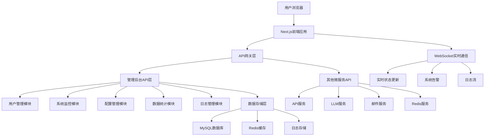
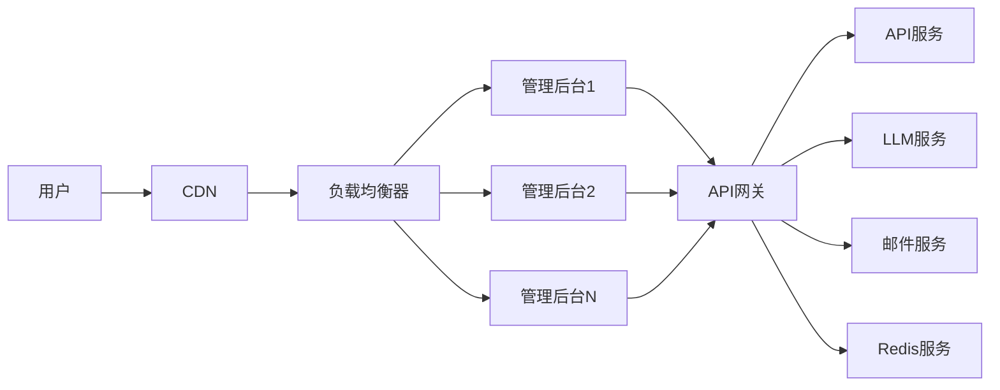

# YYC3 管理后台开发规划路线图

> 📋 **文档版本**: v1.0.0 | **创建时间**: 2025-12-08 | **维护团队**: YYC3 AI Family

## 📖 项目概述

YYC3管理后台是YYC3 AI Family平台的核心管理控制台，提供统一的服务监控、用户管理、系统配置和数据可视化能力，是整个平台的管理和运维中心。

### 基本信息

- **服务名称**: YYC3 Admin Console
- **技术栈**: React 18+ | Next.js 14+ | TypeScript | Ant Design | Redux Toolkit | WebSocket
- **服务端口**: 6601 (生产) / 3001 (开发)
- **主要功能**: 服务监控、用户管理、系统配置、数据可视化、日志管理

## 🎯 开发目标与愿景

### 核心目标
1. **统一管理界面**: 为YYC3平台提供统一的管理控制台
2. **服务监控**: 实时监控所有微服务的运行状态和性能指标
3. **用户管理**: 提供完整的用户生命周期管理功能
4. **系统配置**: 集中管理平台配置和环境变量
5. **数据可视化**: 提供丰富的图表和报表功能

### 技术愿景
- 构建现代化的企业级管理后台
- 实现响应式设计和移动端适配
- 提供可扩展的插件化架构
- 支持实时数据更新和告警

## 🏗️ 技术架构规划

### 架构层次



### 核心模块设计

#### 1. 用户管理器 (UserManager)
```typescript
interface UserManager {
  // 用户CRUD操作
  create(userData: CreateUserDto): Promise<User>;
  update(id: string, data: UpdateUserDto): Promise<User>;
  delete(id: string): Promise<void>;
  findById(id: string): Promise<User>;
  findList(query: UserListQuery): Promise<PaginatedUsers>;

  // 角色权限管理
  assignRole(userId: string, roleIds: string[]): Promise<void>;
  revokeRole(userId: string, roleIds: string[]): Promise<void>;
  getUserRoles(userId: string): Promise<Role[]>;
  getUserPermissions(userId: string): Promise<Permission[]>;

  // 认证授权
  authenticate(credentials: LoginCredentials): Promise<AuthResult>;
  refreshToken(refreshToken: string): Promise<TokenPair>;
  logout(userId: string, sessionId: string): Promise<void>;
}
```

#### 2. 服务监控器 (ServiceMonitor)
```typescript
interface ServiceMonitor {
  // 服务状态监控
  getServiceStatus(serviceName: string): Promise<ServiceStatus>;
  getAllServicesStatus(): Promise<ServiceStatus[]>;
  getServiceMetrics(serviceName: string): Promise<ServiceMetrics>;

  // 性能指标收集
  getSystemMetrics(timeRange: TimeRange): Promise<SystemMetrics>;
  getServicePerformance(serviceName: string): Promise<PerformanceData>;
  getDatabaseMetrics(): Promise<DatabaseMetrics>;

  // 告警管理
  createAlert(alert: CreateAlertDto): Promise<Alert>;
  getActiveAlerts(): Promise<Alert[]>;
  acknowledgeAlert(alertId: string): Promise<void>;
  resolveAlert(alertId: string, resolution: string): Promise<void>;

  // 健康检查
  performHealthCheck(serviceName: string): Promise<HealthCheckResult>;
  scheduleHealthChecks(services: string[]): Promise<void>;
}
```

#### 3. 配置管理器 (ConfigManager)
```typescript
interface ConfigManager {
  // 配置CRUD操作
  getConfig(namespace: string, key: string): Promise<ConfigValue>;
  setConfig(namespace: string, key: string, value: any): Promise<void>;
  deleteConfig(namespace: string, key: string): Promise<void>;
  getConfigs(namespace: string): Promise<ConfigMap>;

  // 环境变量管理
  getEnvironmentVariables(): Promise<EnvVar[]>;
  updateEnvironmentVariable(key: string, value: string): Promise<void>;
  exportEnvironmentVariables(): Promise<string>;
  importEnvironmentVariables(data: string): Promise<void>;

  // 配置版本控制
  createConfigSnapshot(description: string): Promise<ConfigSnapshot>;
  restoreConfigSnapshot(snapshotId: string): Promise<void>;
  getConfigHistory(namespace: string, key: string): Promise<ConfigHistory[]>;
}
```

#### 4. 数据可视化器 (DataVisualizer)
```typescript
interface DataVisualizer {
  // 图表数据
  getChartData(chartId: string, params: ChartParams): Promise<ChartData>;
  createChart(chart: CreateChartDto): Promise<Chart>;
  updateChart(chartId: string, data: UpdateChartDto): Promise<Chart>;
  deleteChart(chartId: string): Promise<void>;

  // 报表生成
  generateReport(reportType: string, params: ReportParams): Promise<Report>;
  scheduleReport(schedule: ScheduleReportDto): Promise<void>;
  exportReport(reportId: string, format: ExportFormat): Promise<Buffer>;

  // 仪表盘管理
  createDashboard(dashboard: CreateDashboardDto): Promise<Dashboard>;
  updateDashboard(dashboardId: string, data: UpdateDashboardDto): Promise<Dashboard>;
  getDashboard(dashboardId: string): Promise<Dashboard>;
  listDashboards(): Promise<Dashboard[]>;
}
```

## 📅 开发阶段规划

### 第一阶段：基础架构建设 (2周)

#### Week 1: 项目初始化和基础框架
**目标**: 完成项目初始化和基础UI框架搭建

**任务清单**:
- [ ] **项目初始化**
  - [x] Next.js 14+ 项目创建
  - [ ] TypeScript 配置和严格模式
  - [ ] ESLint + Prettier 代码规范配置
  - [ ] Git hooks 配置 (husky, lint-staged)

- [ ] **UI框架集成**
  - [ ] Ant Design 5.x 主题配置
  - [ ] 响应式布局和断点设计
  - [ ] 组件库封装和标准化
  - [ ] 图标库集成和自定义图标

- [ ] **基础架构**
  - [ ] Redux Toolkit 状态管理配置
  - [ ] React Router 6 路由配置
  - [ ] Axios HTTP客户端封装
  - [ ] 基础中间件和拦截器配置

- [ ] **开发工具**
  - [ ] 热更新和开发环境配置
  - [ ] 路径别名和模块解析
  - [ ] 代码分割和懒加载配置
  - [ ] 开发者工具集成

**交付物**:
- 可运行的Next.js管理后台项目
- 完整的开发环境配置
- 基础UI组件库和设计系统
- 项目脚手架和开发工具链

#### Week 2: 认证系统和基础布局
**目标**: 实现用户认证系统和基础页面布局

**任务清单**:
- [ ] **认证系统**
  - [ ] 登录/注册页面开发
  - [ ] JWT令牌管理和自动刷新
  - [ ] 路由守卫和权限控制
  - [ ] 用户状态管理和持久化

- [ ] **布局系统**
  - [ ] 响应式侧边栏导航
  - [ ] 顶部导航栏和用户菜单
  - [ ] 面包屑导航和页面标题
  - [ ] 主题切换和个性化设置

- [ ] **权限系统**
  - [ ] 角色权限管理模块
  - [ ] 动态菜单渲染
  - [ ] 按钮级权限控制
  - [ ] 页面访问权限验证

- [ ] **错误处理**
  - [ ] 全局错误边界
  - [ ] 网络请求错误处理
  - [ ] 用户友好的错误提示
  - [ ] 错误日志收集和上报

**交付物**:
- 完整的用户认证系统
- 响应式管理后台布局
- 基于角色的权限控制系统
- 错误处理和用户反馈机制

### 第二阶段：核心功能开发 (3周)

#### Week 3: 用户管理系统
**目标**: 实现完整的用户生命周期管理功能

**任务清单**:
- [ ] **用户列表和管理**
  - [ ] 用户列表页面和数据表格
  - [ ] 高级搜索和筛选功能
  - [ ] 批量操作和批量导入导出
  - [ ] 用户状态管理和操作记录

- [ ] **用户详情和编辑**
  - [ ] 用户详情页面和表单
  - [ ] 头像上传和裁剪功能
  - [ ] 个人信息编辑和验证
  - [ ] 密码修改和安全设置

- [ ] **角色权限管理**
  - [ ] 角色列表和CRUD操作
  - [ ] 权限树和权限分配
  - [ ] 角色继承和权限复制
  - [ ] 权限验证和显示逻辑

- [ ] **操作日志**
  - [ ] 用户操作记录和查询
  - [ ] 操作历史和审计日志
  - [ ] 敏感操作二次确认
  - [ ] 日志导出和归档

**交付物**:
- 完整的用户管理系统
- 基于角色的权限控制
- 操作审计和日志记录
- 批量操作和数据导入导出功能

#### Week 4: 服务监控系统
**目标**: 实现微服务监控和性能指标展示

**任务清单**:
- [ ] **服务状态监控**
  - [ ] 服务状态仪表盘
  - [ ] 实时服务状态更新
  - [ ] 服务依赖关系图
  - [ ] 服务健康检查面板

- [ ] **性能指标展示**
  - [ ] 系统资源使用率图表
  - [ ] API响应时间统计
  - [ ] 错误率和成功率监控
  - [ ] 并发用户数和请求量

- [ ] **告警系统**
  - [ ] 告警规则配置界面
  - [ ] 实时告警通知展示
  - [ ] 告警历史和处理记录
  - [ ] 告警级别和分类管理

- [ ] **实时数据更新**
  - [ ] WebSocket连接管理
  - [ ] 实时数据推送和更新
  - [ ] 断线重连和状态同步
  - [ ] 数据缓存和优化

**交付物**:
- 服务监控仪表盘
- 实时性能指标展示
- 告警管理系统
- WebSocket实时数据更新

#### Week 5: 配置管理和数据可视化
**目标**: 实现系统配置管理和数据可视化功能

**任务清单**:
- [ ] **配置管理界面**
  - [ ] 配置项分类和树形结构
  - [ ] 配置项编辑和验证
  - [ ] 环境变量管理
  - [ ] 配置版本控制和回滚

- [ ] **数据图表组件**
  - [ ] 基础图表组件封装
  - [ ] 图表主题和样式定制
  - [ ] 交互式图表和钻取
  - [ ] 图表数据导出功能

- [ ] **仪表盘系统**
  - [ ] 可拖拽的仪表盘布局
  - [ ] 自定义仪表盘创建
  - [ ] 图表组件和配置
  - [ ] 仪表盘模板和分享

- [ ] **报表功能**
  - [ ] 报表生成器界面
  - [ ] 定时报表任务配置
  - [ ] 报表模板管理
  - [ ] 报表导出和分发

**交付物**:
- 系统配置管理界面
- 丰富的数据可视化组件
- 可定制的仪表盘系统
- 报表生成和管理功能

### 第三阶段：高级功能和优化 (2周)

#### Week 6: 日志管理和系统工具
**目标**: 实现日志管理和系统运维工具

**任务清单**:
- [ ] **日志管理系统**
  - [ ] 日志列表和高级搜索
  - [ ] 日志详情和上下文查看
  - [ ] 日志级别和过滤功能
  - [ ] 日志导出和分析工具

- [ ] **系统工具集**
  - [ ] 数据库管理工具
  - [ ] Redis缓存管理工具
  - [ ] 文件管理器
  - [ ] API调试工具

- [ ] **性能优化**
  - [ ] 前端资源优化和压缩
  - [ ] 代码分割和懒加载
  - [ ] 图片优化和CDN集成
  - [ ] 缓存策略和性能监控

- [ ] **移动端适配**
  - [ ] 响应式设计优化
  - [ ] 触摸交互和手势支持
  - [ ] 移动端专用组件
  - [ ] PWA支持和离线功能

**交付物**:
- 完整的日志管理系统
- 系统运维工具集
- 性能优化方案
- 移动端适配和PWA支持

#### Week 7: 测试和部署准备
**目标**: 完成测试和生产环境部署准备

**任务清单**:
- [ ] **测试体系**
  - [ ] 单元测试覆盖
  - [ ] 组件测试和集成测试
  - [ ] E2E测试用例
  - [ ] 视觉回归测试

- [ ] **部署配置**
  - [ ] Docker镜像构建和优化
  - [ ] Nginx配置和静态资源服务
  - [ ] 环境变量和多环境配置
  - [ ] CI/CD流水线配置

- [ ] **文档完善**
  - [ ] 用户使用手册
  - [ ] 开发者文档
  - [ ] 部署和运维文档
  - [ ] API接口文档

- [ ] **安全和合规**
  - [ ] 安全漏洞扫描和修复
  - [ ] 依赖包安全更新
  - [ ] 数据保护和隐私合规
  - [ ] 安全审计和渗透测试

**交付物**:
- 完整的测试覆盖
- 生产部署配置
- 项目文档体系
- 安全合规检查

## 🔧 技术实现细节

### 核心技术栈

#### 前端框架
```json
{
  "next": "^14.0.0",
  "react": "^18.2.0",
  "react-dom": "^18.2.0",
  "typescript": "^5.0.0",
  "@types/react": "^18.2.0",
  "@types/react-dom": "^18.2.0"
}
```

#### UI组件库
```json
{
  "antd": "^5.12.0",
  "@ant-design/icons": "^5.2.0",
  "@ant-design/colors": "^7.0.0",
  "@ant-design/pro-components": "^2.6.0",
  "styled-components": "^6.1.0"
}
```

#### 状态管理和数据
```json
{
  "@reduxjs/toolkit": "^1.9.7",
  "react-redux": "^8.1.3",
  "redux-persist": "^6.0.0",
  "axios": "^1.6.0",
  "@tanstack/react-query": "^5.8.0"
}
```

#### 图表和可视化
```json
{
  "echarts": "^5.4.0",
  "echarts-for-react": "^3.0.0",
  "@ant-design/plots": "^2.0.0",
  "d3": "^7.8.0",
  "@types/d3": "^7.4.0"
}
```

### 关键配置

#### Next.js 配置 (next.config.js)
```javascript
const path = require('path');

/** @type {import('next').NextConfig} */
const nextConfig = {
  reactStrictMode: true,
  swcMinify: true,
  experimental: {
    appDir: true,
    serverComponentsExternalPackages: ['antd'],
  },
  webpack: (config, { buildId, dev, isServer, defaultLoaders, webpack }) => {
    config.resolve.alias = {
      ...config.resolve.alias,
      '@': path.resolve(__dirname, 'src'),
      '@components': path.resolve(__dirname, 'src/components'),
      '@pages': path.resolve(__dirname, 'src/pages'),
      '@utils': path.resolve(__dirname, 'src/utils'),
      '@hooks': path.resolve(__dirname, 'src/hooks'),
      '@store': path.resolve(__dirname, 'src/store'),
      '@services': path.resolve(__dirname, 'src/services'),
    };
    return config;
  },
  async rewrites() {
    return [
      {
        source: '/api/:path*',
        destination: process.env.API_BASE_URL + '/api/:path*',
      },
    ];
  },
  env: {
    CUSTOM_KEY: process.env.CUSTOM_KEY,
  },
  sassOptions: {
    includePaths: [path.join(__dirname, 'src/styles')],
  },
};

module.exports = nextConfig;
```

#### Ant Design 主题配置
```typescript
// src/theme/index.ts
import { theme } from 'antd';
import type { ThemeConfig } from 'antd';

const darkTheme: ThemeConfig = {
  algorithm: theme.darkAlgorithm,
  token: {
    colorPrimary: '#1890ff',
    colorBgBase: '#141414',
    colorBgContainer: '#1f1f1f',
    colorBgLayout: '#000000',
    borderRadius: 6,
    wireframe: false,
  },
  components: {
    Layout: {
      siderBg: '#001529',
      triggerBg: '#002140',
    },
    Menu: {
      darkItemBg: '#001529',
      darkSubMenuItemBg: '#000c17',
      darkItemSelectedBg: '#1890ff',
    },
  },
};

const lightTheme: ThemeConfig = {
  algorithm: theme.defaultAlgorithm,
  token: {
    colorPrimary: '#1890ff',
    borderRadius: 6,
    wireframe: false,
  },
};

export { darkTheme, lightTheme };
```

#### Redux Store 配置
```typescript
// src/store/index.ts
import { configureStore } from '@reduxjs/toolkit';
import { persistStore, persistReducer } from 'redux-persist';
import storage from 'redux-persist/lib/storage';
import { combineReducers } from '@reduxjs/toolkit';

import authSlice from './slices/authSlice';
import userSlice from './slices/userSlice';
import serviceSlice from './slices/serviceSlice';
import configSlice from './slices/configSlice';

const persistConfig = {
  key: 'root',
  storage,
  whitelist: ['auth', 'theme', 'settings'],
};

const rootReducer = combineReducers({
  auth: authSlice,
  user: userSlice,
  service: serviceSlice,
  config: configSlice,
});

const persistedReducer = persistReducer(persistConfig, rootReducer);

export const store = configureStore({
  reducer: persistedReducer,
  middleware: (getDefaultMiddleware) =>
    getDefaultMiddleware({
      serializableCheck: {
        ignoredActions: ['persist/PERSIST', 'persist/REHYDRATE'],
      },
    }),
  devTools: process.env.NODE_ENV !== 'production',
});

export const persistor = persistStore(store);

export type RootState = ReturnType<typeof store.getState>;
export type AppDispatch = typeof store.dispatch;
```

#### API 服务封装
```typescript
// src/services/api.ts
import axios, { AxiosInstance, AxiosRequestConfig, AxiosResponse } from 'axios';
import { message } from 'antd';
import { store } from '@/store';
import { logout } from '@/store/slices/authSlice';

class ApiService {
  private instance: AxiosInstance;

  constructor() {
    this.instance = axios.create({
      baseURL: process.env.NEXT_PUBLIC_API_BASE_URL,
      timeout: 30000,
      headers: {
        'Content-Type': 'application/json',
      },
    });

    this.setupInterceptors();
  }

  private setupInterceptors() {
    // 请求拦截器
    this.instance.interceptors.request.use(
      (config) => {
        const token = store.getState().auth.token;
        if (token) {
          config.headers.Authorization = `Bearer ${token}`;
        }
        return config;
      },
      (error) => {
        return Promise.reject(error);
      }
    );

    // 响应拦截器
    this.instance.interceptors.response.use(
      (response: AxiosResponse) => {
        return response.data;
      },
      (error) => {
        if (error.response?.status === 401) {
          store.dispatch(logout());
          window.location.href = '/login';
        } else if (error.response?.status >= 500) {
          message.error('服务器错误，请稍后重试');
        } else if (error.message === 'Network Error') {
          message.error('网络连接失败，请检查网络');
        }
        return Promise.reject(error);
      }
    );
  }

  public get<T = any>(url: string, config?: AxiosRequestConfig): Promise<T> {
    return this.instance.get(url, config);
  }

  public post<T = any>(url: string, data?: any, config?: AxiosRequestConfig): Promise<T> {
    return this.instance.post(url, data, config);
  }

  public put<T = any>(url: string, data?: any, config?: AxiosRequestConfig): Promise<T> {
    return this.instance.put(url, data, config);
  }

  public delete<T = any>(url: string, config?: AxiosRequestConfig): Promise<T> {
    return this.instance.delete(url, config);
  }

  public upload<T = any>(url: string, file: File, config?: AxiosRequestConfig): Promise<T> {
    const formData = new FormData();
    formData.append('file', file);
    return this.instance.post(url, formData, {
      ...config,
      headers: {
        'Content-Type': 'multipart/form-data',
        ...config?.headers,
      },
    });
  }
}

export const apiService = new ApiService();
```

## 📊 性能指标和目标

### 性能目标

| 指标 | 目标值 | 说明 |
|------|--------|------|
| 首屏加载时间 | < 2秒 | 用户首次访问到页面可交互 |
| 路由切换时间 | < 500ms | 页面间导航响应时间 |
| 列表渲染时间 | < 1秒 | 大数据表格渲染时间 |
| 可用性 | 99.9% | 服务可用性 |
| 错误率 | < 0.1% | 前端错误率 |

### 资源要求

#### 最小配置
- CPU: 2核
- 内存: 4GB
- 存储: 20GB
- 网络: 100Mbps

#### 推荐配置
- CPU: 4核
- 内存: 8GB
- 存储: 50GB
- 网络: 1Gbps

### 扩展性设计
- 组件化架构：支持按需加载和代码分割
- 插件系统：支持功能模块的动态加载
- 主题系统：支持多主题和自定义样式
- 国际化：支持多语言和本地化

## 🔒 安全和合规

### 安全措施
1. **认证安全**: JWT令牌、自动刷新、会话管理
2. **权限控制**: 基于角色的访问控制(RBAC)
3. **数据安全**: 敏感数据加密、传输安全
4. **前端安全**: XSS防护、CSRF防护、内容安全策略

### 合规要求
1. **数据保护**: 遵循GDPR、CCPA
2. **隐私保护**: 用户数据隔离和匿名化
3. **审计要求**: 完整的操作记录和审计日志
4. **可访问性**: 遵循WCAG 2.1 AA标准

## 🚀 部署和运维

### 部署架构



### 监控指标
- **前端指标**: 页面加载时间、用户行为、错误率
- **用户体验**: 核心网页指标(CWV)、用户满意度
- **业务指标**: 功能使用率、用户活跃度
- **系统指标**: 资源使用率、响应时间

### 运维流程
1. **自动化部署**: CI/CD流水线自动部署
2. **版本管理**: 蓝绿部署和灰度发布
3. **监控告警**: 实时监控和智能告警
4. **故障处理**: 快速定位和故障恢复

## 📈 未来发展规划

### 短期目标 (3-6个月)
- 完成核心管理功能开发
- 实现基础的监控和告警
- 建立完整的用户体系
- 优化用户体验和性能

### 中期目标 (6-12个月)
- 扩展插件系统和第三方集成
- 实现高级数据分析和AI辅助
- 建立移动端管理应用
- 支持多租户和SaaS模式

### 长期目标 (1-2年)
- 构建低代码开发平台
- 实现智能化运维和自动扩容
- 建立开发者生态和市场
- 支持云原生和边缘计算

## 📞 团队协作

### 开发团队
- **前端开发**: React/Next.js专家
- **UI/UX设计**: 用户体验设计专家
- **后端开发**: API开发专家
- **DevOps**: 前端部署和运维专家

### 协作流程
1. **需求分析**: 产品需求评审和设计讨论
2. **UI设计**: 界面设计和交互原型
3. **开发实现**: 敏捷开发和代码评审
4. **测试验证**: 功能测试和用户体验测试
5. **部署上线**: 自动化部署和监控

## 📋 风险评估

### 技术风险
- **性能瓶颈**: 大数据量渲染和实时更新
- **浏览器兼容性**: 不同浏览器的兼容性问题
- **安全漏洞**: 前端安全漏洞和数据泄露

### 业务风险
- **用户体验**: 复杂操作和学习成本
- **功能范围**: 需求变更和功能蔓延
- **维护成本**: 技术债务和代码质量

### 缓解措施
- 性能监控和优化
- 渐进式增强和优雅降级
- 安全审计和代码审查
- 用户体验测试和持续改进

---

<div align="center">

**[⬆️ 回到顶部](#yyc3-管理后台开发规划路线图)**

Made with ❤️ by YYC3 AI Family Team

**言启象限，语枢智能** 🎛️

</div>