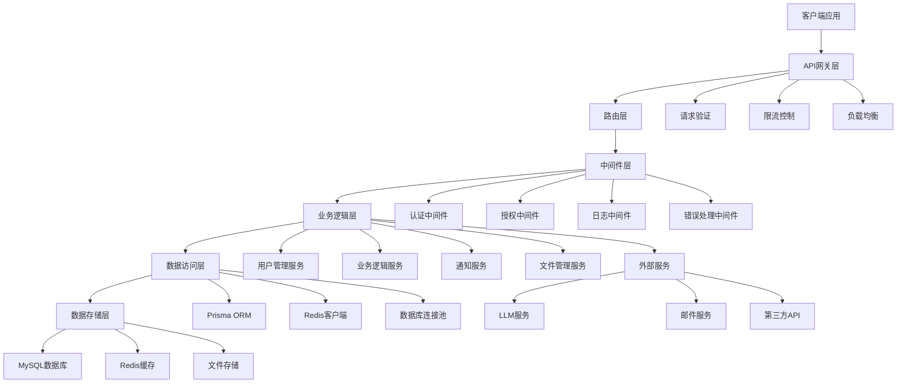
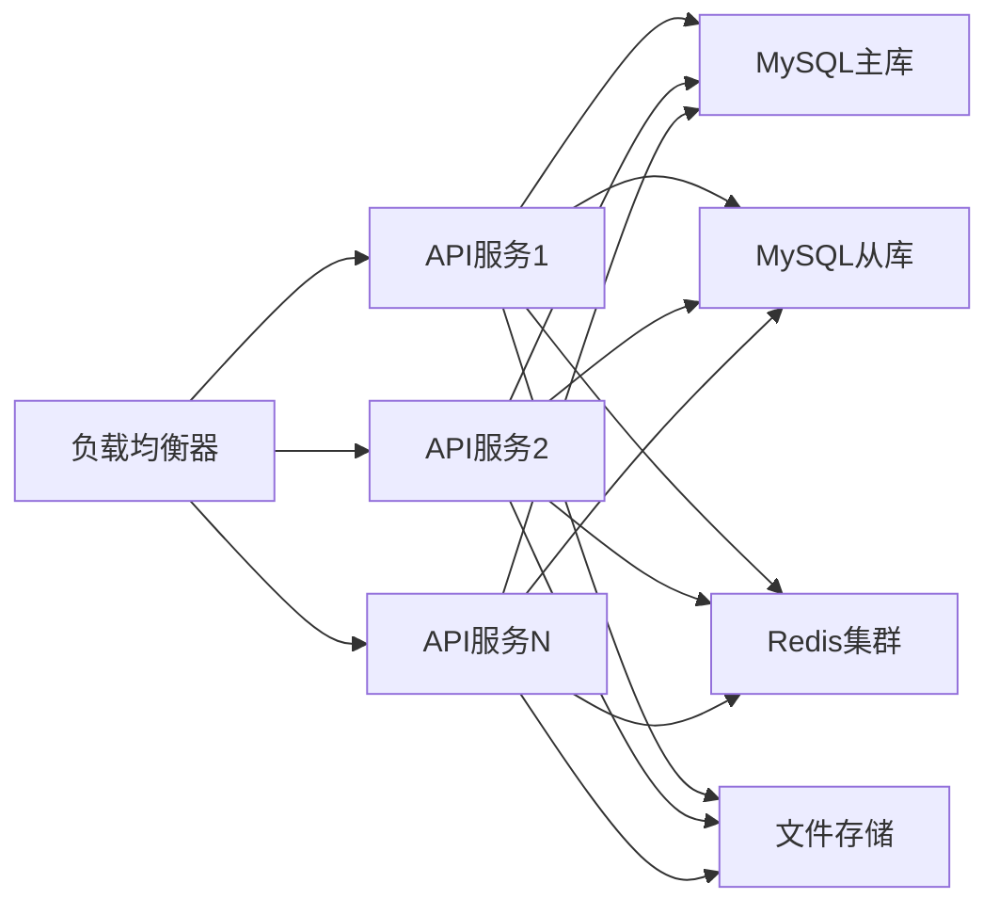

# YYC3 API服务开发规划路线图

> 📋 **文档版本**: v1.0.0 | **创建时间**: 2025-12-08 | **维护团队**: YYC3 AI Family

## 📖 项目概述

YYC3 API服务是YYC3 AI Family平台的核心API网关和业务服务层，提供统一的API接口、用户管理、数据持久化和业务逻辑处理能力，是整个平台的数据和业务中心。

### 基本信息

- **服务名称**: YYC3 API Service
- **技术栈**: Node.js 18+ | Express.js | TypeScript | MySQL | Redis | JWT | Prisma ORM
- **服务端口**: 6600 (生产) / 3000 (开发)
- **主要功能**: 用户认证、数据管理、业务逻辑、API网关、数据持久化

## 🎯 开发目标与愿景

### 核心目标

1. **统一API网关**: 为YYC3平台提供统一的API接口和路由管理
2. **用户认证授权**: 提供完整的用户认证、授权和会话管理
3. **数据持久化**: 提供可靠的数据存储和检索服务
4. **业务逻辑中心**: 实现核心业务逻辑和数据处理
5. **服务编排**: 协调各微服务间的通信和数据流转

### 技术愿景

- 构建高性能、可扩展的API服务架构
- 实现微服务间的统一协调和管理
- 提供企业级的数据安全和隐私保护
- 支持API版本管理和向后兼容性

## 🏗️ 技术架构规划

### 架构层次



### 核心模块设计

#### 1. 用户管理器 (UserManager)

```typescript
interface UserManager {
  // 用户基础操作
  create(userData: CreateUserDto): Promise<User>;
  findById(id: string): Promise<User | null>;
  findByEmail(email: string): Promise<User | null>;
  update(id: string, data: UpdateUserDto): Promise<User>;
  delete(id: string): Promise<void>;

  // 认证相关
  authenticate(email: string, password: string): Promise<AuthResult>;
  generateTokens(user: User): Promise<TokenPair>;
  refreshToken(refreshToken: string): Promise<TokenPair>;
  revokeToken(userId: string): Promise<void>;

  // 角色权限
  assignRole(userId: string, roleId: string): Promise<void>;
  removeRole(userId: string, roleId: string): Promise<void>;
  getUserRoles(userId: string): Promise<Role[]>;
  getUserPermissions(userId: string): Promise<Permission[]>;

  // 用户状态
  activateUser(userId: string): Promise<void>;
  deactivateUser(userId: string): Promise<void>;
  lockUser(userId: string, reason: string): Promise<void>;
  unlockUser(userId: string): Promise<void>;
}
```

#### 2. 业务逻辑管理器 (BusinessLogicManager)

```typescript
interface BusinessLogicManager {
  // 核心业务流程
  processUserRegistration(userData: CreateUserDto): Promise<RegistrationResult>;
  processUserLogin(credentials: LoginCredentials): Promise<LoginResult>;
  processUserPasswordReset(email: string): Promise<PasswordResetResult>;
  processUserProfileUpdate(userId: string, data: UpdateProfileDto): Promise<User>;

  // 数据处理
  validateBusinessData(data: any, rules: ValidationRules): Promise<ValidationResult>;
  transformData(input: any, rules: TransformRules): Promise<any>;
  aggregateData(query: AggregateQuery): Promise<AggregatedData>;

  // 工作流管理
  createWorkflow(workflow: CreateWorkflowDto): Promise<Workflow>;
  executeWorkflow(workflowId: string, context: WorkflowContext): Promise<WorkflowResult>;
  getWorkflowStatus(workflowId: string): Promise<WorkflowStatus>;

  // 事件处理
  publishEvent(event: DomainEvent): Promise<void>;
  subscribeToEvent(eventType: string, handler: EventHandler): Promise<void>;
  processEvent(event: DomainEvent): Promise<void>;
}
```

#### 3. API网关管理器 (APIGatewayManager)

```typescript
interface APIGatewayManager {
  // 路由管理
  registerRoute(route: RouteConfig): Promise<void>;
  updateRoute(routeId: string, config: Partial<RouteConfig>): Promise<void>;
  deleteRoute(routeId: string): Promise<void>;
  getRoutes(): Promise<RouteConfig[]>;

  // 限流控制
  setRateLimit(config: RateLimitConfig): Promise<void>;
  checkRateLimit(clientId: string): Promise<RateLimitResult>;
  updateRateLimit(clientId: string, limit: number): Promise<void>;

  // 服务发现
  registerService(service: ServiceRegistration): Promise<void>;
  discoverService(serviceName: string): Promise<ServiceInstance[]>;
  healthCheck(serviceName: string): Promise<HealthStatus>;

  // 代理转发
  forwardRequest(request: ProxyRequest): Promise<ProxyResponse>;
  loadBalance(serviceName: string, instances: ServiceInstance[]): Promise<ServiceInstance>;
}
```

#### 4. 数据访问管理器 (DataAccessManager)

```typescript
interface DataAccessManager {
  // 数据库操作
  create<T>(model: string, data: CreateData<T>): Promise<T>;
  findById<T>(model: string, id: string): Promise<T | null>;
  findMany<T>(model: string, query: FindQuery): Promise<T[]>;
  update<T>(model: string, id: string, data: UpdateData<T>): Promise<T>;
  delete<T>(model: string, id: string): Promise<void>;

  // 查询构建
  buildQuery(filters: Filter[], sort?: Sort[], pagination?: Pagination): QueryBuilder;
  executeQuery<T>(query: QueryBuilder): Promise<QueryResult<T>>;

  // 事务管理
  beginTransaction(): Promise<Transaction>;
  commitTransaction(transaction: Transaction): Promise<void>;
  rollbackTransaction(transaction: Transaction): Promise<void>;

  // 缓存管理
  cacheGet<T>(key: string): Promise<T | null>;
  cacheSet(key: string, value: any, ttl?: number): Promise<void>;
  cacheDelete(key: string): Promise<void>;
  cacheClear(pattern?: string): Promise<void>;
}
```

## 📅 开发阶段规划

### 第一阶段：基础架构建设 (2周)

#### Week 1: 项目初始化和基础框架

**目标**: 完成项目初始化和基础API框架搭建

**任务清单**:

- [ ] **项目初始化**
  - [x] Node.js 18+ 环境配置
  - [ ] TypeScript 项目配置和严格模式
  - [ ] Express.js 应用初始化
  - [ ] ESLint + Prettier 代码规范配置

- [ ] **数据库配置**
  - [ ] MySQL 数据库连接配置
  - [ ] Prisma ORM 初始化和配置
  - [ ] 数据库模型设计和迁移
  - [ ] Redis 连接配置和基础操作

- [ ] **基础中间件**
  - [ ] CORS 跨域处理中间件
  - [ ] 请求日志和错误处理中间件
  - [ ] 请求体解析和验证中间件
  - [ ] 安全头部和压缩中间件

- [ ] **开发工具**
  - [ ] 热重载和开发环境配置
  - [ ] API 文档自动生成 (Swagger)
  - [ ] 环境变量管理
  - [ ] Git hooks 和代码质量检查

**交付物**:

- 可运行的Node.js/TypeScript API服务
- 完整的数据库配置和模型
- 基础中间件和错误处理
- 开发环境和工具链

#### Week 2: 用户认证和基础API

**目标**: 实现用户认证系统和基础API接口

**任务清单**:

- [ ] **用户认证系统**
  - [ ] JWT 令牌生成和验证
  - [ ] 密码加密和验证 (bcrypt)
  - [ ] 用户注册和登录接口
  - [ ] 令牌刷新和撤销机制

- [ ] **权限系统**
  - [ ] 基于角色的访问控制 (RBAC)
  - [ ] 权限中间件和装饰器
  - [ ] 资源权限验证
  - [ ] 动态权限检查

- [ ] **用户管理API**
  - [ ] 用户 CRUD 操作接口
  - [ ] 用户查询和搜索接口
  - [ ] 用户状态管理接口
  - [ ] 批量操作接口

- [ ] **API 文档和测试**
  - [ ] Swagger API 文档生成
  - [ ] 接口参数验证和响应标准化
  - [ ] 基础的单元测试
  - [ ] API 接口集成测试

**交付物**:

- 完整的用户认证系统
- 基于角色的权限控制
- 用户管理 REST API
- API 文档和测试覆盖

### 第二阶段：核心功能开发 (3周)

#### Week 3: 业务逻辑和数据管理

**目标**: 实现核心业务逻辑和数据管理功能

**任务清单**:

- [ ] **业务逻辑服务**
  - [ ] 用户注册业务流程
  - [ ] 密码重置和找回流程
  - [ ] 用户资料更新流程
  - [ ] 账户状态变更流程

- [ ] **数据验证和处理**
  - [ ] 输入数据验证器
  - [ ] 数据转换和清洗
  - [ ] 业务规则验证
  - [ ] 数据完整性检查

- [ ] **文件管理系统**
  - [ ] 文件上传和存储接口
  - [ ] 文件类型验证和安全检查
  - [ ] 文件访问权限控制
  - [ ] 文件元数据管理

- [ ] **通知服务**
  - [ ] 邮件通知接口
  - [ ] 短信通知接口
  - [ ] 系统通知接口
  - [ ] 通知模板管理

**交付物**:

- 核心业务逻辑服务
- 数据验证和处理系统
- 文件管理 API
- 通知服务接口

#### Week 4: API网关和服务集成

**目标**: 实现API网关功能和外部服务集成

**任务清单**:

- [ ] **API网关功能**
  - [ ] 请求路由和转发
  - [ ] 限流和熔断机制
  - [ ] 负载均衡和服务发现
  - [ ] API 版本管理

- [ ] **外部服务集成**
  - [ ] LLM 服务客户端和接口适配
  - [ ] 邮件服务客户端和接口适配
  - [ ] 第三方 API 集成和配置管理
  - [ ] 服务调用重试和错误处理

- [ ] **数据同步和缓存**
  - [ ] Redis 缓存策略实现
  - [ ] 数据同步机制
  - [ ] 缓存失效和更新策略
  - [ ] 分布式缓存管理

- [ ] **监控和日志**
  - [ ] API 调用监控和统计
  - [ ] 性能指标收集
  - [ ] 结构化日志记录
  - [ ] 异常追踪和报警

**交付物**:

- API网关核心功能
- 外部服务集成模块
- 缓存和数据同步系统
- 监控和日志系统

#### Week 5: 高级功能和性能优化

**目标**: 实现高级功能和性能优化

**任务清单**:

- [ ] **高级查询功能**
  - [ ] 复杂查询构建器
  - [ ] 数据聚合和统计
  - [ ] 全文搜索集成
  - [ ] 数据导出功能

- [ ] **批量处理**
  - [ ] 批量数据导入导出
  - [ ] 异步任务处理
  - [ ] 队列管理和监控
  - [ ] 任务调度和重试

- [ ] **数据安全和隐私**
  - [ ] 数据加密和脱敏
  - [ ] 敏感信息保护
  - [ ] 数据访问审计
  - [ ] GDPR 合规支持

- [ ] **性能优化**
  - [ ] 数据库查询优化
  - [ ] 连接池管理
  - [ ] 响应缓存策略
  - [ ] 并发控制和限流

**交付物**:

- 高级查询和数据处理功能
- 批量处理和任务队列系统
- 数据安全和隐私保护
- 性能优化方案

### 第三阶段：企业级功能和部署 (2周)

#### Week 6: 企业级功能和扩展

**目标**: 实现企业级功能和系统扩展能力

**任务清单**:

- [ ] **多租户支持**
  - [ ] 租户隔离和数据分离
  - [ ] 租户配置管理
  - [ ] 资源配额和计费
  - [ ] 租户级别的权限控制

- [ ] **API版本管理**
  - [ ] 版本控制和兼容性
  - [ ] API 变更管理
  - [ ] 客户端SDK生成
  - [ ] 废弃API处理

- [ ] **Webhook和事件系统**
  - [ ] Webhook 配置和管理
  - [ ] 事件发布和订阅
  - [ ] 事件回放和重试
  - [ ] 第三方集成支持

- [ ] **国际化支持**
  - [ ] 多语言数据模型
  - [ ] 本地化接口支持
  - [ ] 时区和日期处理
  - [ ] 货币和数字格式化

**交付物**:

- 多租户支持系统
- API版本管理功能
- Webhook和事件系统
- 国际化支持

#### Week 7: 测试、部署和文档

**目标**: 完成测试、部署配置和文档完善

**任务清单**:

- [ ] **全面测试覆盖**
  - [ ] 单元测试和集成测试
  - [ ] API 端到端测试
  - [ ] 性能和负载测试
  - [ ] 安全漏洞测试

- [ ] **部署配置**
  - [ ] Docker 镜像构建和优化
  - [ ] Kubernetes 部署配置
  - [ ] 环境变量和配置管理
  - [ ] CI/CD 流水线配置

- [ ] **监控和运维**
  - [ ] 健康检查和监控端点
  - [ ] 日志聚合和分析
  - [ ] 指标收集和告警
  - [ ] 故障诊断和恢复

- [ ] **文档和培训**
  - [ ] API 文档完善
  - [ ] 开发者指南
  - [ ] 部署和运维文档
  - [ ] 故障排查手册

**交付物**:

- 完整的测试覆盖
- 生产部署配置
- 监控和运维系统
- 完整的项目文档

## 🔧 技术实现细节

### 核心技术栈

#### 后端框架

```json
{
  "express": "^4.18.2",
  "@types/express": "^4.17.21",
  "typescript": "^5.0.0",
  "ts-node": "^10.9.0",
  "nodemon": "^3.0.0"
}
```

#### 数据库和ORM

```json
{
  "@prisma/client": "^5.6.0",
  "prisma": "^5.6.0",
  "mysql2": "^3.6.5",
  "redis": "^4.6.10",
  "ioredis": "^5.3.2"
}
```

#### 认证和安全

```json
{
  "jsonwebtoken": "^9.0.2",
  "bcryptjs": "^2.4.3",
  "helmet": "^7.1.0",
  "cors": "^2.8.5",
  "express-rate-limit": "^7.1.5"
}
```

#### 验证和处理

```json
{
  "joi": "^17.11.0",
  "multer": "^1.4.5",
  "sharp": "^0.32.6",
  "csv-parser": "^3.0.0",
  "xlsx": "^0.18.5"
}
```

### 关键配置

#### Prisma Schema 配置

```prisma
// prisma/schema.prisma
generator client {
  provider = "prisma-client-js"
  output   = "./src/generated/client"
}

datasource db {
  provider = "mysql"
  url      = env("DATABASE_URL")
}

model User {
  id          String    @id @default(cuid())
  email       String    @unique
  username    String?   @unique
  password    String
  firstName   String?
  lastName    String?
  avatar      String?
  phone       String?
  status      UserStatus @default(ACTIVE)
  roles       UserRole[]
  sessions    Session[]
  createdAt   DateTime  @default(now())
  updatedAt   DateTime  @updatedAt
  lastLoginAt DateTime?

  @@map("users")
}

model Role {
  id          String    @id @default(cuid())
  name        String    @unique
  description String?
  permissions Permission[]
  users       UserRole[]
  createdAt   DateTime  @default(now())
  updatedAt   DateTime  @updatedAt

  @@map("roles")
}

model Permission {
  id          String    @id @default(cuid())
  name        String    @unique
  description String?
  resource    String
  action      String
  roles       Role[]    @relation("RolePermissions")
  createdAt   DateTime  @default(now())
  updatedAt   DateTime  @updatedAt

  @@map("permissions")
}

enum UserStatus {
  ACTIVE
  INACTIVE
  SUSPENDED
  PENDING
}
```

#### Express 应用配置

```typescript
// src/app.ts
import express from 'express';
import cors from 'cors';
import helmet from 'helmet';
import compression from 'compression';
import morgan from 'morgan';
import rateLimit from 'express-rate-limit';

import { errorHandler } from './middleware/errorHandler';
import { requestLogger } from './middleware/requestLogger';
import { authMiddleware } from './middleware/auth';
import { routes } from './routes';

const app = express();

// 安全中间件
app.use(helmet());
app.use(cors({
  origin: process.env.CORS_ORIGIN?.split(',') || ['http://localhost:3000'],
  credentials: true,
}));

// 压缩和日志
app.use(compression());
app.use(morgan('combined'));

// 限流
const limiter = rateLimit({
  windowMs: 15 * 60 * 1000, // 15 minutes
  max: 100, // limit each IP to 100 requests per windowMs
  message: '请求过于频繁，请稍后再试',
});
app.use(limiter);

// 解析中间件
app.use(express.json({ limit: '10mb' }));
app.use(express.urlencoded({ extended: true, limit: '10mb' }));

// 自定义中间件
app.use(requestLogger);

// 路由
app.use('/api/v1', authMiddleware, routes);

// 健康检查
app.get('/health', (req, res) => {
  res.json({
    status: 'ok',
    service: 'yyc3-api-service',
    timestamp: new Date().toISOString(),
  });
});

// 错误处理
app.use(errorHandler);

export default app;
```

#### 数据库连接配置

```typescript
// src/database/connection.ts
import { PrismaClient } from '@prisma/client';
import Redis from 'ioredis';

export class DatabaseConnection {
  private static prisma: PrismaClient;
  private static redis: Redis;

  static getPrisma(): PrismaClient {
    if (!this.prisma) {
      this.prisma = new PrismaClient({
        datasources: {
          db: {
            url: process.env.DATABASE_URL,
          },
        },
        log: process.env.NODE_ENV === 'development' ? ['query', 'info', 'warn', 'error'] : ['error'],
      });
    }
    return this.prisma;
  }

  static getRedis(): Redis {
    if (!this.redis) {
      this.redis = new Redis({
        host: process.env.REDIS_HOST || 'localhost',
        port: parseInt(process.env.REDIS_PORT || '6379'),
        password: process.env.REDIS_PASSWORD,
        db: parseInt(process.env.REDIS_DB || '0'),
        retryDelayOnFailover: 100,
        maxRetriesPerRequest: 3,
      });
    }
    return this.redis;
  }

  static async disconnect(): Promise<void> {
    if (this.prisma) {
      await this.prisma.$disconnect();
    }
    if (this.redis) {
      await this.redis.disconnect();
    }
  }
}
```

#### 认证中间件

```typescript
// src/middleware/auth.ts
import { Request, Response, NextFunction } from 'express';
import jwt from 'jsonwebtoken';
import { DatabaseConnection } from '../database/connection';

export interface AuthenticatedRequest extends Request {
  user?: {
    id: string;
    email: string;
    roles: string[];
    permissions: string[];
  };
}

export const authMiddleware = async (
  req: AuthenticatedRequest,
  res: Response,
  next: NextFunction
): Promise<void> => {
  try {
    const token = req.headers.authorization?.replace('Bearer ', '');

    if (!token) {
      res.status(401).json({ error: '未提供认证令牌' });
      return;
    }

    const decoded = jwt.verify(token, process.env.JWT_SECRET!) as any;

    const prisma = DatabaseConnection.getPrisma();
    const user = await prisma.user.findUnique({
      where: { id: decoded.userId },
      include: {
        roles: {
          include: {
            role: {
              include: {
                permissions: true,
              },
            },
          },
        },
      },
    });

    if (!user || user.status !== 'ACTIVE') {
      res.status(401).json({ error: '无效的认证令牌' });
      return;
    }

    req.user = {
      id: user.id,
      email: user.email,
      roles: user.roles.map(r => r.role.name),
      permissions: user.roles.flatMap(r =>
        r.role.permissions.map(p => `${p.resource}:${p.action}`)
      ),
    };

    next();
  } catch (error) {
    res.status(401).json({ error: '认证失败' });
  }
};
```

## 📊 性能指标和目标

### 性能目标

| 指标 | 目标值 | 说明 |
|------|--------|------|
| API响应时间 | < 200ms | 95%的请求响应时间 |
| 吞吐量 | 1000 RPS | 每秒请求数 |
| 可用性 | 99.9% | 服务可用性 |
| 错误率 | < 0.1% | API错误率 |
| 并发连接 | 10,000 | 同时处理连接数 |

### 资源要求

#### 最小配置

- CPU: 2核
- 内存: 4GB
- 存储: 50GB
- 网络: 100Mbps

#### 推荐配置

- CPU: 4核
- 内存: 8GB
- 存储: 100GB
- 网络: 1Gbps

### 扩展性设计

- 水平扩展：支持多实例部署
- 数据库扩展：读写分离和分片
- 缓存扩展：Redis集群支持
- 负载均衡：API网关负载均衡

## 🔒 安全和合规

### 安全措施

1. **API安全**: JWT认证、HTTPS强制、API限流
2. **数据安全**: 敏感数据加密、SQL注入防护
3. **访问控制**: RBAC权限模型、IP白名单
4. **监控审计**: 操作日志、安全事件监控

### 合规要求

1. **数据保护**: 遵循GDPR、CCPA
2. **隐私保护**: 数据脱敏和匿名化
3. **审计要求**: 完整的操作审计日志
4. **安全标准**: OWASP安全标准

## 🚀 部署和运维

### 部署架构



### 监控指标

- **系统指标**: CPU、内存、磁盘、网络使用率
- **应用指标**: 请求量、响应时间、错误率、并发数
- **业务指标**: 用户活跃度、功能使用率、API调用量
- **数据库指标**: 连接数、查询性能、锁等待时间

### 运维流程

1. **自动化部署**: CI/CD流水线自动部署
2. **健康检查**: 服务健康状态监控
3. **故障恢复**: 自动故障检测和恢复
4. **性能优化**: 定期性能分析和调优

## 📈 未来发展规划

### 短期目标 (3-6个月)

- 完成核心API功能开发
- 实现基础的监控和运维
- 建立完整的测试覆盖
- 优化API性能和稳定性

### 中期目标 (6-12个月)

- 支持GraphQL和WebSocket
- 实现API市场和开发者生态
- 建立完整的DevOps体系
- 支持多云部署和灾备

### 长期目标 (1-2年)

- 构建API治理和管理平台
- 实现智能化运维和自动扩容
- 建立API标准化和最佳实践
- 支持边缘计算和Serverless

## 📞 团队协作

### 开发团队

- **后端开发**: Node.js/Express.js专家
- **数据库工程师**: MySQL/Redis专家
- **API架构师**: 微服务和API设计专家
- **DevOps工程师**: 部署和运维专家

### 协作流程

1. **需求分析**: API需求评审和设计
2. **技术设计**: 架构设计和技术选型
3. **开发实现**: 敏捷开发和代码评审
4. **测试验证**: API测试和集成测试
5. **部署上线**: CI/CD部署和监控

## 📋 风险评估

### 技术风险

- **性能瓶颈**: 高并发下的性能问题
- **数据一致性**: 分布式环境下的数据一致性
- **安全漏洞**: API安全漏洞和数据泄露

### 业务风险

- **API变更**: 版本兼容性和向后兼容性
- **依赖风险**: 第三方服务依赖风险
- **扩展性**: 业务增长带来的扩展挑战

### 缓解措施

- 性能监控和自动扩容
- 数据一致性机制和事务管理
- 安全审计和渗透测试
- API版本管理和向后兼容

---

<div align="center">

**[⬆️ 回到顶部](#yyc3-api服务开发规划路线图)**

Made with ❤️ by YYC3 AI Family Team

**言启象限，语枢智能** 🔌

</div>
