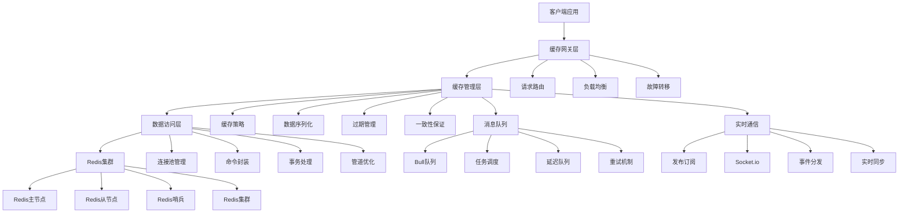
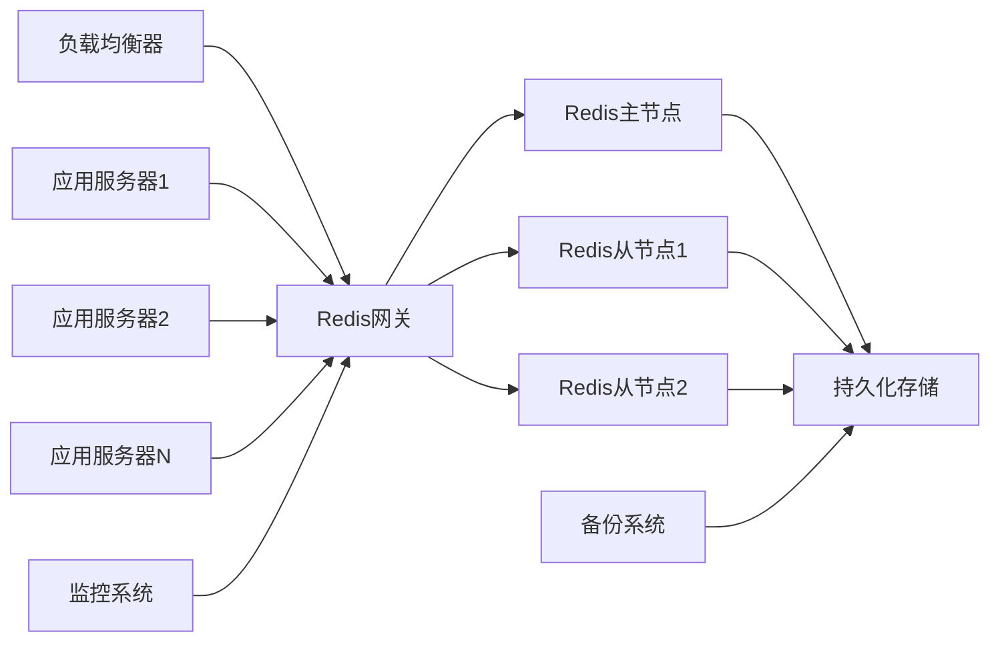

# YYC3 Redis缓存服务开发规划路线图

> 📋 **文档版本**: v1.0.0 | **创建时间**: 2025-12-08 | **维护团队**: YYC3 AI Family

## 📖 项目概述

YYC3 Redis缓存服务是YYC3 AI Family平台的核心数据缓存和会话管理服务，提供高性能的数据缓存、分布式锁、消息队列和实时数据同步能力，是整个平台的高性能数据层。

### 基本信息

- **服务名称**: YYC3 Redis Cache Service
- **技术栈**: Redis 7+ | Node.js | Express.js | TypeScript | Bull Queue | Socket.io
- **服务端口**: 6606 (生产) / 3004 (开发)
- **主要功能**: 数据缓存、会话管理、消息队列、分布式锁、实时同步

## 🎯 开发目标与愿景

### 核心目标

1. **统一缓存服务**: 为YYC3平台提供统一的缓存数据管理
2. **高性能访问**: 提供毫秒级的数据读写性能
3. **分布式支持**: 支持Redis集群和分布式锁
4. **消息队列**: 提供可靠的消息队列和任务调度
5. **实时数据**: 支持实时数据同步和发布订阅

### 技术愿景

- 构建企业级的高性能缓存服务
- 实现智能缓存策略和数据一致性
- 提供可扩展的消息队列系统
- 支持多级缓存和缓存预热

## 🏗️ 技术架构规划

### 架构层次



### 核心模块设计

#### 1. 缓存管理器 (CacheManager)

```typescript
interface CacheManager {
  // 基础缓存操作
  get<T>(key: string): Promise<T | null>;
  set<T>(key: string, value: T, ttl?: number): Promise<void>;
  del(key: string): Promise<void>;
  exists(key: string): Promise<boolean>;
  expire(key: string, ttl: number): Promise<boolean>;

  // 批量操作
  mget<T>(keys: string[]): Promise<(T | null)[]>;
  mset<T>(entries: Array<{key: string, value: T, ttl?: number}>): Promise<void>;
  mdel(keys: string[]): Promise<number>;

  // 缓存策略
  getWithFallback<T>(key: string, fallback: () => Promise<T>, ttl?: number): Promise<T>;
  setWithCondition<T>(key: string, value: T, condition: CacheCondition): Promise<boolean>;

  // 缓存预热
  warmup(pattern: string, loader: CacheLoader): Promise<void>;
  invalidate(pattern: string): Promise<number>;

  // 缓存统计
  getStats(): Promise<CacheStats>;
  hitRate(): Promise<number>;
  memoryUsage(): Promise<number>;
}
```

#### 2. 会话管理器 (SessionManager)

```typescript
interface SessionManager {
  // 会话操作
  createSession(sessionData: CreateSessionDto): Promise<Session>;
  getSession(sessionId: string): Promise<Session | null>;
  updateSession(sessionId: string, data: Partial<Session>): Promise<Session>;
  destroySession(sessionId: string): Promise<void>;

  // 会话验证
  validateSession(sessionId: string): Promise<boolean>;
  refreshSession(sessionId: string, ttl?: number): Promise<void>;

  // 用户会话
  getUserSessions(userId: string): Promise<Session[]>;
  destroyUserSessions(userId: string): Promise<number>;

  // 会话统计
  getActiveSessions(): Promise<number>;
  getSessionStats(): Promise<SessionStats>;

  // 会话清理
  cleanupExpiredSessions(): Promise<number>;
  cleanupIdleSessions(maxIdleTime: number): Promise<number>;
}
```

#### 3. 消息队列管理器 (QueueManager)

```typescript
interface QueueManager {
  // 队列操作
  createQueue(name: string, config: QueueConfig): Promise<Queue>;
  getQueue(name: string): Promise<Queue | null>;
  deleteQueue(name: string): Promise<void>;
  listQueues(): Promise<string[]>;

  // 任务操作
  addJob(queueName: string, jobData: JobData, options?: JobOptions): Promise<Job>;
  getJob(jobId: string): Promise<Job | null>;
  removeJob(jobId: string): Promise<boolean>;
  retryJob(jobId: string): Promise<Job>;

  // 队列管理
  pauseQueue(queueName: string): Promise<void>;
  resumeQueue(queueName: string): Promise<void>;
  cleanQueue(queueName: string, options: CleanOptions): Promise<number>;

  // 延迟队列
  scheduleJob(queueName: string, jobData: JobData, delay: number): Promise<Job>;
  scheduleRecurringJob(name: string, cronExpression: string, jobData: JobData): Promise<void>;

  // 队列监控
  getQueueStats(queueName: string): Promise<QueueStats>;
  getWaitingJobs(queueName: string, count?: number): Promise<Job[]>;
  getActiveJobs(queueName: string): Promise<Job[]>;
  getFailedJobs(queueName: string): Promise<Job[]>;
}
```

#### 4. 分布式锁管理器 (LockManager)

```typescript
interface LockManager {
  // 锁操作
  acquireLock(resource: string, ttl: number): Promise<string | null>;
  releaseLock(resource: string, lockId: string): Promise<boolean>;
  renewLock(resource: string, lockId: string, ttl: number): Promise<boolean>;

  // 锁检查
  isLocked(resource: string): Promise<boolean>;
  getLockInfo(resource: string): Promise<LockInfo | null>;

  // 分布式信号量
  acquireSemaphore(semaphore: string, permits: number, ttl: number): Promise<string | null>;
  releaseSemaphore(semaphore: string, lockId: string, permits: number): Promise<boolean>;

  // 分布式计数器
  incrementCounter(key: string, delta?: number): Promise<number>;
  decrementCounter(key: string, delta?: number): Promise<number>;
  getCounter(key: string): Promise<number>;

  // 分布式集合
  addSetMember(setKey: string, member: string): Promise<boolean>;
  removeSetMember(setKey: string, member: string): Promise<boolean>;
  getSetMembers(setKey: string): Promise<string[]>;
  isSetMember(setKey: string, member: string): Promise<boolean>;
}
```

#### 5. 实时通信管理器 (RealtimeManager)

```typescript
interface RealtimeManager {
  // 发布订阅
  publish(channel: string, message: any): Promise<number>;
  subscribe(channel: string, callback: MessageCallback): Promise<void>;
  unsubscribe(channel: string): Promise<void>;

  // 频道管理
  getChannels(): Promise<string[]>;
  getChannelSubscribers(channel: string): Promise<number>;

  // 消息缓存
  cacheMessage(channel: string, message: any, size?: number): Promise<void>;
  getCachedMessages(channel: string, count?: number): Promise<any[]>;

  // 实时同步
  syncData(pattern: string, callback: SyncCallback): Promise<void>;
  broadcast(event: string, data: any): Promise<void>;

  // Socket.io集成
  addSocketEvent(event: string, handler: SocketHandler): void;
  removeSocketEvent(event: string): void;
  broadcastToRoom(room: string, event: string, data: any): void;
}
```

## 📅 开发阶段规划

### 第一阶段：基础架构建设 (2周)

#### Week 1: Redis环境搭建和基础服务

**目标**: 完成Redis环境搭建和基础缓存服务

**任务清单**:

- [ ] **Redis环境配置**
  - [x] Redis 7+ 服务器安装和配置
  - [ ] Redis集群配置和哨兵模式
  - [ ] 内存配置和持久化设置
  - [ ] 安全配置和网络访问控制

- [ ] **基础服务框架**
  - [ ] Node.js/Express.js 项目初始化
  - [ ] TypeScript 配置和类型定义
  - [ ] Redis连接池和客户端配置
  - [ ] 基础API路由和中间件

- [ ] **核心缓存功能**
  - [ ] 基础缓存CRUD操作接口
  - [ ] 序列化和反序列化处理
  - [ ] TTL过期时间管理
  - [ ] 缓存键命名规范和验证

- [ ] **监控和日志**
  - [ ] Redis性能监控接口
  - [ ] 内存使用情况监控
  - [ ] 缓存命中率统计
  - [ ] 操作日志记录和查询

**交付物**:

- 完整的Redis集群环境
- 基础缓存服务和API接口
- 监控和统计系统
- 运维工具和脚本

#### Week 2: 高级缓存功能和性能优化

**目标**: 实现高级缓存功能和性能优化

**任务清单**:

- [ ] **高级缓存策略**
  - [ ] LRU/LFU缓存淘汰策略
  - [ ] 缓存预热和懒加载
  - [ ] 缓存穿透和雪崩防护
  - [ ] 缓存击穿和热点数据保护

- [ ] **批量操作优化**
  - [ ] 批量读写接口实现
  - [ ] 管道(pipeline)操作优化
  - [ ] 事务(multi/exec)支持
  - [ ] Lua脚本执行接口

- [ ] **分布式缓存**
  - [ ] 一致性哈希算法实现
  - [ ] 数据分片和负载均衡
  - [ ] 跨节点数据同步
  - [ ] 节点故障转移机制

- [ ] **性能优化**
  - [ ] 连接池优化配置
  - [ ] 内存使用优化
  - [ ] 网络传输优化
  - [ ] 压缩算法集成

**交付物**:

- 高级缓存策略系统
- 批量操作优化方案
- 分布式缓存架构
- 性能优化工具

### 第二阶段：会话管理和消息队列 (3周)

#### Week 3: 会话管理系统

**目标**: 实现完整的会话管理功能

**任务清单**:

- [ ] **会话存储和管理**
  - [ ] 用户会话CRUD接口
  - [ ] 会话数据结构设计
  - [ ] 会话ID生成和验证
  - [ ] 会话过期和清理机制

- [ ] **会话安全和验证**
  - [ ] 会话劫持防护
  - [ ] 跨站请求伪造(CSRF)防护
  - [ ] 会话数据加密存储
  - [ ] 并发会话限制

- [ ] **会话统计和监控**
  - [ ] 活跃会话统计
  - [ ] 会话生命周期追踪
  - [ ] 用户行为分析
  - [ ] 异常会话检测

- [ ] **多端会话支持**
  - [ ] 设备指纹识别
  - [ ] 跨设备会话同步
  - [ ] 设备管理接口
  - [ ] 设备信任机制

**交付物**:

- 完整的会话管理系统
- 会话安全防护机制
- 会话统计和监控
- 多端会话支持

#### Week 4: 消息队列系统

**目标**: 实现可靠的消息队列系统

**任务清单**:

- [ ] **队列基础功能**
  - [ ] Bull队列集成和配置
  - [ ] 任务创建和调度接口
  - [ ] 队列状态管理
  - [ ] 任务优先级和延迟

- [ ] **任务处理和重试**
  - [ ] 任务处理器注册
  - [ ] 失败重试机制
  - [ ] 死信队列处理
  - [ ] 任务依赖关系

- [ ] **分布式队列**
  - [ ] 多节点队列协调
  - [ ] 任务分片和并行处理
  - [ ] 负载均衡和故障转移
  - [ ] 队列数据一致性

- [ ] **调度和定时任务**
  - [ ] Cron表达式解析
  - [ ] 定时任务调度器
  - [ ] 周期性任务管理
  - [ ] 任务执行历史

**交付物**:

- 完整的消息队列系统
- 任务处理和重试机制
- 分布式队列支持
- 定时任务调度器

#### Week 5: 分布式锁和实时通信

**目标**: 实现分布式锁和实时通信功能

**任务清单**:

- [ ] **分布式锁实现**
  - [ ] Redis分布式锁算法
  - [ ] 锁获取和释放接口
  - [ ] 锁续期和超时处理
  - [ ] 锁竞争和等待队列

- [ ] **分布式同步原语**
  - [ ] 分布式信号量实现
  - [ ] 分布式计数器
  - [ ] 分布式集合操作
  - [ ] 原子性操作保证

- [ ] **发布订阅系统**
  - [ ] Redis Pub/Sub集成
  - [ ] 消息路由和过滤
  - [ ] 持久化订阅
  - [ ] 消息可靠投递

- [ ] **实时通信接口**
  - [ ] Socket.io服务器集成
  - [ ] WebSocket连接管理
  - [ ] 实时事件广播
  - [ ] 房间和命名空间管理

**交付物**:

- 分布式锁系统
- 分布式同步原语
- 发布订阅系统
- 实时通信接口

### 第三阶段：企业级功能和优化 (2周)

#### Week 6: 数据管理和备份恢复

**目标**: 实现数据管理和备份恢复功能

**任务清单**:

- [ ] **数据持久化**
  - [ ] RDB快照配置和调度
  - [ ] AOF日志配置和压缩
  - [ ] 混合持久化策略
  - [ ] 数据一致性验证

- [ ] **备份和恢复**
  - [ ] 自动备份脚本和调度
  - [ ] 增量备份和全量备份
  - [ ] 数据恢复工具和流程
  - [ ] 备份数据加密和压缩

- [ ] **数据迁移和同步**
  - [ ] 数据迁移工具开发
  - [ ] 跨集群数据同步
  - [ ] 数据格式转换
  - [ ] 增量同步机制

- [ ] **数据安全和合规**
  - [ ] 数据加密存储
  - [ ] 敏感数据脱敏
  - [ ] 访问日志和审计
  - [ ] 数据保留策略

**交付物**:

- 数据持久化系统
- 备份恢复工具
- 数据迁移系统
- 安全合规机制

#### Week 7: 监控告警和运维工具

**目标**: 完善监控告警和运维工具

**任务清单**:

- [ ] **监控指标体系**
  - [ ] 性能指标采集
  - [ ] 业务指标统计
  - [ ] 自定义指标上报
  - [ ] 指标聚合和计算

- [ ] **告警系统**
  - [ ] 告警规则配置
  - [ ] 多渠道告警通知
  - [ ] 告警升级和抑制
  - [ ] 告警历史和分析

- [ ] **运维工具集**
  - [ ] 命令行工具CLI
  - [ ] Web管理界面
  - [ ] 数据分析工具
  - [ ] 故障诊断工具

- [ ] **自动化运维**
  - [ ] 自动扩缩容机制
  - [ ] 故障自动恢复
  - [ ] 性能自动调优
  - [ ] 运维剧本和流程

**交付物**:

- 监控告警系统
- 运维工具集
- 自动化运维
- 管理界面

## 🔧 技术实现细节

### 核心技术栈

#### 后端框架

```json
{
  "express": "^4.18.2",
  "typescript": "^5.0.0",
  "@types/express": "^4.17.21",
  "ts-node": "^10.9.0",
  "nodemon": "^3.0.0"
}
```

#### Redis客户端

```json
{
  "redis": "^4.6.10",
  "ioredis": "^5.3.2",
  "@types/ioredis": "^5.0.0",
  "redis-clustr": "^1.0.2"
}
```

#### 消息队列

```json
{
  "bull": "^4.11.4",
  "@types/bull": "^4.10.0",
  "bull-board": "^2.1.3",
  "bullmq": "^4.12.0"
}
```

#### 实时通信

```json
{
  "socket.io": "^4.7.2",
  "@types/socket.io": "^3.0.2",
  "redis-adapter": "^8.2.1",
  "socket.io-redis-adapter": "^8.2.1"
}
```

### 关键配置

#### Redis集群配置

```typescript
// src/config/redis.ts
import { Cluster, Redis } from 'ioredis';

export interface RedisConfig {
  host: string;
  port: number;
  password?: string;
  db?: number;
  maxRetriesPerRequest?: number;
  retryDelayOnFailover?: number;
  enableReadyCheck?: boolean;
  maxRetriesPerRequest?: number;
  lazyConnect?: boolean;
}

export const redisConfig: RedisConfig[] = [
  {
    host: process.env.REDIS_HOST_1 || 'localhost',
    port: parseInt(process.env.REDIS_PORT_1 || '7000'),
    password: process.env.REDIS_PASSWORD,
  },
  {
    host: process.env.REDIS_HOST_2 || 'localhost',
    port: parseInt(process.env.REDIS_PORT_2 || '7001'),
    password: process.env.REDIS_PASSWORD,
  },
  {
    host: process.env.REDIS_HOST_3 || 'localhost',
    port: parseInt(process.env.REDIS_PORT_3 || '7002'),
    password: process.env.REDIS_PASSWORD,
  },
];

export const redisOptions = {
  redisOptions: {
    password: process.env.REDIS_PASSWORD,
  },
  maxRetriesPerRequest: 3,
  retryDelayOnFailover: 100,
  enableReadyCheck: true,
  maxRetriesPerRequest: 3,
  lazyConnect: true,
};

export class RedisManager {
  private static cluster: Cluster;
  private static standalone: Redis;

  static getCluster(): Cluster {
    if (!this.cluster) {
      this.cluster = new Cluster(redisConfig, redisOptions);
    }
    return this.cluster;
  }

  static getStandalone(): Redis {
    if (!this.standalone) {
      this.standalone = new Redis({
        host: process.env.REDIS_HOST || 'localhost',
        port: parseInt(process.env.REDIS_PORT || '6379'),
        password: process.env.REDIS_PASSWORD,
        db: parseInt(process.env.REDIS_DB || '0'),
        maxRetriesPerRequest: 3,
        retryDelayOnFailover: 100,
      });
    }
    return this.standalone;
  }

  static async disconnect(): Promise<void> {
    if (this.cluster) {
      await this.cluster.disconnect();
    }
    if (this.standalone) {
      await this.standalone.disconnect();
    }
  }
}
```

#### 缓存管理器实现

```typescript
// src/services/CacheManager.ts
import { RedisManager } from '../config/redis';
import { CacheStats, CacheCondition, CacheLoader } from '../types/cache';

export class CacheManager {
  private redis = RedisManager.getCluster();

  async get<T>(key: string): Promise<T | null> {
    try {
      const value = await this.redis.get(key);
      return value ? JSON.parse(value) : null;
    } catch (error) {
      console.error('Cache get error:', error);
      return null;
    }
  }

  async set<T>(key: string, value: T, ttl?: number): Promise<void> {
    try {
      const serialized = JSON.stringify(value);
      if (ttl) {
        await this.redis.setex(key, ttl, serialized);
      } else {
        await this.redis.set(key, serialized);
      }
    } catch (error) {
      console.error('Cache set error:', error);
      throw error;
    }
  }

  async del(key: string): Promise<void> {
    try {
      await this.redis.del(key);
    } catch (error) {
      console.error('Cache delete error:', error);
      throw error;
    }
  }

  async exists(key: string): Promise<boolean> {
    try {
      const result = await this.redis.exists(key);
      return result === 1;
    } catch (error) {
      console.error('Cache exists error:', error);
      return false;
    }
  }

  async mget<T>(keys: string[]): Promise<(T | null)[]> {
    try {
      const values = await this.redis.mget(...keys);
      return values.map(value => value ? JSON.parse(value) : null);
    } catch (error) {
      console.error('Cache mget error:', error);
      return new Array(keys.length).fill(null);
    }
  }

  async mset<T>(entries: Array<{key: string, value: T, ttl?: number}>): Promise<void> {
    try {
      const pipeline = this.redis.pipeline();
      entries.forEach(entry => {
        const serialized = JSON.stringify(entry.value);
        if (entry.ttl) {
          pipeline.setex(entry.key, entry.ttl, serialized);
        } else {
          pipeline.set(entry.key, serialized);
        }
      });
      await pipeline.exec();
    } catch (error) {
      console.error('Cache mset error:', error);
      throw error;
    }
  }

  async getWithFallback<T>(
    key: string,
    fallback: () => Promise<T>,
    ttl: number = 3600
  ): Promise<T> {
    const cached = await this.get<T>(key);
    if (cached !== null) {
      return cached;
    }

    const value = await fallback();
    await this.set(key, value, ttl);
    return value;
  }

  async setWithCondition<T>(
    key: string,
    value: T,
    condition: CacheCondition
  ): Promise<boolean> {
    try {
      const script = `
        local key = KEYS[1]
        local value = ARGV[1]
        local condition = ARGV[2]
        local currentValue = redis.call('GET', key)

        if condition == 'NX' and currentValue == nil then
          redis.call('SET', key, value)
          return 1
        elseif condition == 'XX' and currentValue ~= nil then
          redis.call('SET', key, value)
          return 1
        else
          return 0
        end
      `;

      const result = await this.redis.eval(
        script,
        1,
        key,
        JSON.stringify(value),
        condition
      );

      return result === 1;
    } catch (error) {
      console.error('Cache set with condition error:', error);
      return false;
    }
  }

  async getStats(): Promise<CacheStats> {
    try {
      const info = await this.redis.info('memory');
      const keyCount = await this.redis.dbsize();
      const commands = await this.redis.info('stats');

      return {
        totalKeys: keyCount,
        memoryUsage: this.parseMemoryInfo(info),
        totalCommands: this.parseCommandInfo(commands),
        hitRate: await this.calculateHitRate(),
      };
    } catch (error) {
      console.error('Cache stats error:', error);
      throw error;
    }
  }

  async warmup(pattern: string, loader: CacheLoader): Promise<void> {
    try {
      const keys = await this.redis.keys(pattern);
      const pipeline = this.redis.pipeline();

      for (const key of keys) {
        const data = await loader(key);
        if (data) {
          pipeline.set(key, JSON.stringify(data));
        }
      }

      await pipeline.exec();
    } catch (error) {
      console.error('Cache warmup error:', error);
      throw error;
    }
  }

  async invalidate(pattern: string): Promise<number> {
    try {
      const keys = await this.redis.keys(pattern);
      if (keys.length === 0) return 0;

      return await this.redis.del(...keys);
    } catch (error) {
      console.error('Cache invalidate error:', error);
      return 0;
    }
  }

  private parseMemoryInfo(info: string): string {
    const lines = info.split('\r\n');
    const usedMemory = lines.find(line => line.startsWith('used_memory:'));
    return usedMemory ? usedMemory.split(':')[1] : '0';
  }

  private parseCommandInfo(info: string): string {
    const lines = info.split('\r\n');
    const totalCommands = lines.find(line => line.startsWith('total_commands_processed:'));
    return totalCommands ? totalCommands.split(':')[1] : '0';
  }

  private async calculateHitRate(): Promise<number> {
    try {
      const stats = await this.redis.info('stats');
      const lines = stats.split('\r\n');
      const hits = lines.find(line => line.startsWith('keyspace_hits:'));
      const misses = lines.find(line => line.startsWith('keyspace_misses:'));

      const hitCount = hits ? parseInt(hits.split(':')[1]) : 0;
      const missCount = misses ? parseInt(misses.split(':')[1]) : 0;
      const total = hitCount + missCount;

      return total > 0 ? hitCount / total : 0;
    } catch (error) {
      return 0;
    }
  }
}
```

## 📊 性能指标和目标

### 性能目标

| 指标 | 目标值 | 说明 |
|------|--------|------|
| 缓存响应时间 | < 1ms | 内存操作响应时间 |
| 吞吐量 | 100,000 ops/s | 每秒操作数 |
| 命中率 | > 95% | 缓存命中率 |
| 可用性 | 99.99% | 服务可用性 |
| 内存利用率 | < 80% | 内存使用率 |

### 资源要求

#### 最小配置

- CPU: 1核
- 内存: 2GB
- 存储: 10GB
- 网络: 100Mbps

#### 推荐配置

- CPU: 2核
- 内存: 4GB
- 存储: 50GB SSD
- 网络: 1Gbps

### 扩展性设计

- 水平扩展：Redis集群模式
- 垂直扩展：增加内存和CPU
- 读写分离：主从复制
- 分片策略：一致性哈希

## 🔒 安全和合规

### 安全措施

1. **访问控制**: 密码认证、IP白名单、ACL权限
2. **数据加密**: TLS传输加密、敏感数据存储加密
3. **网络安全**: 防火墙配置、VPN访问
4. **审计日志**: 操作日志记录和分析

### 合规要求

1. **数据保护**: 遵循GDPR、CCPA
2. **隐私保护**: 敏感数据脱敏和匿名化
3. **审计要求**: 完整的操作审计记录
4. **备份要求**: 数据备份和恢复策略

## 🚀 部署和运维

### 部署架构



### 监控指标

- **系统指标**: CPU、内存、磁盘、网络使用率
- **Redis指标**: 命令执行率、内存使用、键空间统计
- **业务指标**: 缓存命中率、队列长度、会话数量
- **集群指标**: 节点状态、同步延迟、故障转移

### 运维流程

1. **部署管理**: 自动化部署和配置管理
2. **监控告警**: 实时监控和智能告警
3. **故障处理**: 快速故障定位和恢复
4. **性能优化**: 定期性能分析和调优

## 📈 未来发展规划

### 短期目标 (3-6个月)

- 完成核心缓存功能开发
- 实现基础的监控和运维
- 建立完整的测试覆盖
- 优化缓存性能和稳定性

### 中期目标 (6-12个月)

- 支持多级缓存架构
- 实现智能缓存策略
- 建立完整的DevOps体系
- 支持多云部署和灾备

### 长期目标 (1-2年)

- 构建智能缓存管理平台
- 实现缓存性能自优化
- 建立缓存标准化和最佳实践
- 支持边缘计算和分布式缓存

## 📞 团队协作

### 开发团队

- **后端开发**: Node.js/Redis专家
- **数据库工程师**: Redis集群和数据存储专家
- **缓存架构师**: 缓存策略和性能优化专家
- **DevOps工程师**: 部署和运维专家

### 协作流程

1. **需求分析**: 缓存需求评审和设计
2. **技术设计**: 架构设计和技术选型
3. **开发实现**: 敏捷开发和代码评审
4. **测试验证**: 性能测试和压力测试
5. **部署上线**: 自动化部署和监控

## 📋 风险评估

### 技术风险

- **数据丢失**: Redis持久化故障
- **性能瓶颈**: 大数据量下的性能问题
- **安全漏洞**: Redis安全配置不当

### 业务风险

- **缓存雪崩**: 大量缓存同时失效
- **缓存穿透**: 恶意请求绕过缓存
- **单点故障**: Redis节点故障

### 缓解措施

- 多副本和数据备份
- 缓存预热和防护机制
- 安全审计和渗透测试
- 高可用和故障转移

---

<div align="center">

**[⬆️ 回到顶部](#yyc3-redis缓存服务开发规划路线图)**

Made with ❤️ by YYC3 AI Family Team

**言启象限，语枢智能** 🗄️

</div>
