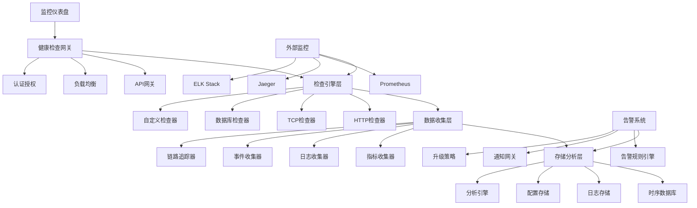
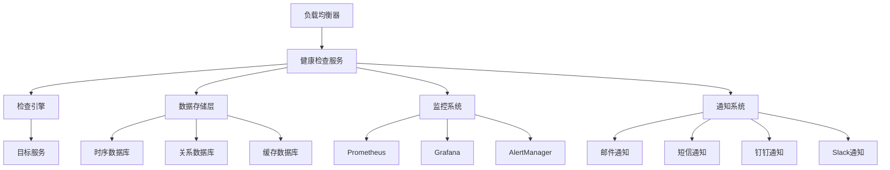

# YYC3 健康检查系统开发规划路线图

> 📋 **文档版本**: v1.0.0 | **创建时间**: 2025-12-08 | **维护团队**: YYC3 AI Family

## 📖 项目概述

YYC3健康检查系统是YYC3 AI Family平台的服务健康监控和诊断中心，提供全面的服务健康检查、性能监控、故障诊断和自动化恢复能力，确保平台的高可用性和稳定性。

### 基本信息

- **服务名称**: YYC3 Health Check System
- **技术栈**: Node.js | Express.js | TypeScript | Prometheus | Grafana | WebSocket
- **服务端口**: 6607 (生产) / 3007 (开发)
- **主要功能**: 服务监控、健康检查、故障诊断、自动恢复、性能分析

## 🎯 开发目标与愿景

### 核心目标
1. **统一健康检查**: 为YYC3平台提供统一的服务健康检查标准
2. **实时监控**: 提供实时的服务状态和性能指标监控
3. **故障诊断**: 快速定位故障根因并提供修复建议
4. **自动恢复**: 实现故障自愈和服务自动恢复机制
5. **性能分析**: 提供深度性能分析和优化建议

### 技术愿景
- 构建企业级的服务监控和诊断平台
- 实现智能化的故障预测和自动恢复
- 提供可视化的健康状态展示
- 支持多层次的服务依赖关系监控

## 🏗️ 技术架构规划

### 架构层次



### 核心模块设计

#### 1. 健康检查管理器 (HealthCheckManager)
```typescript
interface HealthCheckManager {
  // 检查配置
  createCheck(config: HealthCheckConfig): Promise<HealthCheck>;
  updateCheck(id: string, config: Partial<HealthCheckConfig>): Promise<HealthCheck>;
  deleteCheck(id: string): Promise<void>;
  getCheck(id: string): Promise<HealthCheck | null>;
  listChecks(filters?: CheckFilters): Promise<HealthCheck[]>;

  // 检查执行
  executeCheck(checkId: string): Promise<CheckResult>;
  executeChecks(checkIds: string[]): Promise<CheckResult[]>;
  scheduleCheck(checkId: string, schedule: string): Promise<void>;
  cancelScheduledCheck(checkId: string): Promise<void>;

  // 检查历史
  getCheckHistory(checkId: string, timeRange: TimeRange): Promise<CheckResult[]>;
  getCheckStats(checkId: string, timeRange: TimeRange): Promise<CheckStats>;

  // 检查模板
  createTemplate(template: CheckTemplate): Promise<CheckTemplate>;
  getTemplates(): Promise<CheckTemplate[]>;
  applyTemplate(templateId: string, target: string): Promise<HealthCheck>;
}
```

#### 2. 监控指标管理器 (MetricsManager)
```typescript
interface MetricsManager {
  // 指标收集
  collectMetrics(serviceId: string): Promise<ServiceMetrics>;
  collectCustomMetrics(query: MetricsQuery): Promise<CustomMetrics>;
  batchCollectMetrics(serviceIds: string[]): Promise<ServiceMetrics[]>;

  // 指标查询
  queryMetrics(query: PrometheusQuery): Promise<MetricsData>;
  queryRange(query: RangeQuery): Promise<RangeData>;
  querySeries(query: SeriesQuery): Promise<Series[]>;

  // 指标聚合
  aggregateMetrics(metrics: MetricsData[], aggregation: AggregationRule): Promise<MetricsData>;
  calculateDerivedMetrics(baseMetrics: MetricsData[], rules: DerivedRule[]): Promise<MetricsData>;

  // 指标告警
  createAlertRule(rule: AlertRule): Promise<AlertRule>;
  updateAlertRule(id: string, rule: Partial<AlertRule>): Promise<AlertRule>;
  evaluateAlerts(): Promise<Alert[]>;
  silenceAlert(alertId: string, duration: number): Promise<void>;
}
```

#### 3. 故障诊断管理器 (DiagnosisManager)
```typescript
interface DiagnosisManager {
  // 故障检测
  detectAnomalies(serviceId: string, timeRange: TimeRange): Promise<Anomaly[]>;
  detectDegradation(serviceId: string): Promise<ServiceDegradation>;
  detectOutages(serviceId: string): Promise<ServiceOutage>;

  // 根因分析
  analyzeRootCause(incident: ServiceIncident): Promise<RootCauseAnalysis>;
  correlateEvents(events: Event[]): Promise<EventCorrelation>;
  findDependencyIssues(serviceId: string): Promise<DependencyIssue[]>;

  // 故障影响分析
  assessImpact(incident: ServiceIncident): Promise<ImpactAssessment>;
  getAffectedServices(serviceId: string): Promise<string[]>;
  calculateBusinessImpact(incidents: ServiceIncident[]): Promise<BusinessImpact>;

  // 修复建议
  generateRemediationPlan(incident: ServiceIncident): Promise<RemediationPlan>;
  suggestOptimizations(serviceId: string): Promise<OptimizationSuggestion[]>;
  getBestPractices(serviceType: string): Promise<BestPractice[]>;
}
```

#### 4. 自动恢复管理器 (AutoRecoveryManager)
```typescript
interface AutoRecoveryManager {
  // 恢复策略
  createRecoveryStrategy(strategy: RecoveryStrategy): Promise<RecoveryStrategy>;
  updateRecoveryStrategy(id: string, strategy: Partial<RecoveryStrategy>): Promise<RecoveryStrategy>;
  getStrategies(filters?: StrategyFilters): Promise<RecoveryStrategy[]>;

  // 自动恢复
  executeRecovery(incident: ServiceIncident): Promise<RecoveryResult>;
  rollbackRecovery(recoveryId: string): Promise<void>;
  scheduleRecovery(incident: ServiceIncident, delay: number): Promise<string>;

  // 恢复动作
  restartService(serviceId: string): Promise<ActionResult>;
  scaleService(serviceId: string, replicas: number): Promise<ActionResult>;
  switchToBackup(serviceId: string): Promise<ActionResult>;
  clearCache(serviceId: string): Promise<ActionResult>;

  // 恢复验证
  validateRecovery(serviceId: string): Promise<ValidationResult>;
  monitorRecoveryProgress(recoveryId: string): Promise<RecoveryProgress>;
  generateRecoveryReport(recoveryId: string): Promise<RecoveryReport>;
}
```

#### 5. 仪表盘管理器 (DashboardManager)
```typescript
interface DashboardManager {
  // 仪表盘管理
  createDashboard(dashboard: DashboardConfig): Promise<Dashboard>;
  updateDashboard(id: string, config: Partial<DashboardConfig>): Promise<Dashboard>;
  deleteDashboard(id: string): Promise<void>;
  getDashboard(id: string): Promise<Dashboard>;
  listDashboards(filters?: DashboardFilters): Promise<Dashboard[]>;

  // 组件管理
  addComponent(dashboardId: string, component: DashboardComponent): Promise<DashboardComponent>;
  updateComponent(componentId: string, component: Partial<DashboardComponent>): Promise<DashboardComponent>;
  removeComponent(componentId: string): Promise<void>;

  // 实时数据
  subscribeToUpdates(dashboardId: string): WebSocket;
  broadcastUpdate(dashboardId: string, data: any): Promise<void>;
  getRealTimeMetrics(dashboardId: string): Promise<RealTimeData>;

  // 导出分享
  exportDashboard(dashboardId: string, format: ExportFormat): Promise<Buffer>;
  shareDashboard(dashboardId: string, options: ShareOptions): Promise<ShareLink>;
  embedDashboard(dashboardId: string, options: EmbedOptions): Promise<EmbedCode>;
}
```

## 📅 开发阶段规划

### 第一阶段：基础架构建设 (2周)

#### Week 1: 健康检查基础框架
**目标**: 完成健康检查系统的基础框架和核心检查功能

**任务清单**:
- [ ] **项目初始化**
  - [ ] Node.js/TypeScript项目配置
  - [ ] Express.js应用初始化
  - [ ] 数据库设计和迁移脚本
  - [ ] 基础中间件和错误处理

- [ ] **健康检查引擎**
  - [ ] HTTP健康检查器实现
  - [ ] TCP连接检查器实现
  - [ ] 数据库连接检查器实现
  - [ ] 检查配置和调度系统

- [ ] **基础数据模型**
  - [ ] 健康检查配置模型
  - [ ] 检查结果数据模型
  - [ ] 服务依赖关系模型
  - [ ] 指标数据存储模型

- [ ] **API接口开发**
  - [ ] 健康检查CRUD接口
  - [ ] 检查执行和结果查询接口
  - [ ] 服务状态汇总接口
  - [ ] 基础认证和权限控制

**交付物**:
- 健康检查基础框架
- 多种类型检查器
- 数据模型和API接口
- 基础认证系统

#### Week 2: 监控指标收集
**目标**: 实现监控指标收集和基础数据处理

**任务清单**:
- [ ] **Prometheus集成**
  - [ ] Prometheus客户端配置
  - [ ] 自定义指标收集器
  - [ ] 指标暴露和查询接口
  - [ ] 指标聚合和计算

- [ ] **数据存储层**
  - [ ] 时序数据库配置
  - [ ] 数据写入和查询优化
  - [ ] 数据保留和清理策略
  - [ ] 数据备份和恢复

- [ ] **指标处理**
  - [ ] 实时指标处理管道
  - [ ] 指标过滤和转换
  - [ ] 异常值检测和处理
  - [ ] 指标统计和分析

- [ ] **可视化基础**
  - [ ] 基础图表组件
  - [ ] 实时数据更新机制
  - [ ] 仪表盘布局管理
  - [ ] 数据可视化配置

**交付物**:
- Prometheus集成系统
- 时序数据存储
- 指标处理管道
- 基础可视化组件

### 第二阶段：高级功能和智能诊断 (3周)

#### Week 3: 智能故障检测
**目标**: 实现智能故障检测和异常识别

**任务清单**:
- [ ] **异常检测算法**
  - [ ] 统计异常检测实现
  - [ ] 机器学习异常检测模型
  - [ ] 时间序列异常检测
  - [ ] 多维度异常关联分析

- [ ] **故障模式识别**
  - [ ] 常见故障模式定义
  - [ ] 故障特征提取和分析
  - [ ] 故障分类和标记
  - [ ] 故障模式库建设

- [ ] **依赖关系分析**
  - [ ] 服务依赖关系映射
  - [ ] 依赖健康状态传播
  - [ ] 故障影响范围评估
  - [ ] 关键路径识别

- [ ] **趋势分析**
  - [ ] 性能趋势预测
  - [ ] 容量规划分析
  - [ ] 资源使用趋势
  - [ ] 业务指标趋势

**交付物**:
- 智能异常检测系统
- 故障模式识别引擎
- 服务依赖分析
- 趋势分析工具

#### Week 4: 自动恢复机制
**目标**: 实现故障自动恢复和服务自愈

**任务清单**:
- [ ] **恢复策略引擎**
  - [ ] 恢复策略配置系统
  - [ ] 恢复动作库建设
  - [ ] 恢复决策引擎
  - [ ] 恢复效果评估

- [ ] **自动化动作**
  - [ ] 服务重启自动化
  - [ ] 服务扩缩容自动化
  - [ ] 流量切换自动化
  - [ ] 配置更新自动化

- [ ] **安全机制**
  - [ ] 恢复操作审计
  - [ ] 恢复权限控制
  - [ ] 恢复回滚机制
  - [ ] 恢复风险评估

- [ ] **恢复验证**
  - [ ] 恢复后健康检查
  - [ ] 服务功能验证
  - [ ] 性能指标验证
  - [ ] 业务影响评估

**交付物**:
- 自动恢复引擎
- 恢复动作库
- 安全控制机制
- 恢复验证系统

#### Week 5: 告警和通知系统
**目标**: 完成告警规则引擎和多渠道通知系统

**任务清单**:
- [ ] **告警规则引擎**
  - [ ] 告警规则配置系统
  - [ ] 告警条件评估引擎
  - [ ] 告警级别和分类
  - [ ] 告警抑制和依赖

- [ ] **通知网关**
  - [ ] 多渠道通知支持
  - [ ] 通知模板管理
  - [ ] 通知路由和分发
  - [ ] 通知状态跟踪

- [ ] **告警升级**
  - [ ] 告警升级策略
  - [ ] 值班排班管理
  - [ ] 自动升级机制
  - [ ] 告警疲劳控制

- [ ] **告警历史**
  - [ ] 告警记录和存储
  - [ ] 告警统计和分析
  - [ ] 告警趋势分析
  - [ ] 告警效率评估

**交付物**:
- 告警规则引擎
- 多渠道通知系统
- 告警升级机制
- 告警分析系统

### 第三阶段：高级分析和运维工具 (2周)

#### Week 6: 高级分析和预测
**目标**: 实现高级分析和故障预测功能

**任务清单**:
- [ ] **预测分析**
  - [ ] 容量预测模型
  - [ ] 故障预测算法
  - [ ] 性能趋势预测
  - [ ] 资源需求预测

- [ ] **根因分析**
  - [ ] 自动化根因分析
  - [ ] 事件关联分析
  - [ ] 因果关系推断
  - [ ] 根因推荐系统

- [ ] **性能优化**
  - [ ] 性能瓶颈识别
  - [ ] 优化建议生成
  - [ ] 资源配置优化
  - [ ] 架构优化建议

- [ ] **智能运维**
  - [ ] 运维知识库
  - [ ] 智能问答系统
  - [ ] 运维自动化脚本
  - [ ] 最佳实践推荐

**交付物**:
- 预测分析系统
- 根因分析引擎
- 性能优化工具
- 智能运维助手

#### Week 7: 运维工具和集成
**目标**: 完善运维工具和外部系统集成

**任务清单**:
- [ ] **运维工具集**
  - [ ] 命令行工具CLI
  - [ ] 故障诊断工具
  - [ ] 性能分析工具
  - [ ] 数据导出工具

- [ ] **外部集成**
  - [ ] CI/CD系统集成
  - [ ] 监控系统集成
  - [ ] 日志系统集成
  - [ ] 工单系统集成

- [ ] **API生态**
  - [ ] RESTful API完善
  - [ ] GraphQL API支持
  - [ ] WebSocket实时API
  - [ ] API文档和SDK

- [ ] **部署和文档**
  - [ ] 容器化部署配置
  - [ ] 高可用部署方案
  - [ ] 运维文档编写
  - [ ] 用户培训材料

**交付物**:
- 完整运维工具集
- 外部系统集成
- API生态系统
- 部署和文档

## 🔧 技术实现细节

### 核心技术栈

#### 后端框架
```json
{
  "express": "^4.18.2",
  "typescript": "^5.0.0",
  "@types/express": "^4.17.21",
  "ts-node": "^10.9.0",
  "nodemon": "^3.0.0"
}
```

#### 监控和指标
```json
{
  "prom-client": "^15.0.0",
  "prometheus-query": "^4.0.0",
  "@promster/server": "^8.2.0",
  "grafana-api": "^1.0.0"
}
```

#### 数据处理和分析
```json
{
  "lodash": "^4.17.21",
  "moment": "^2.29.4",
  "ml-regression": "^6.0.1",
  "simple-statistics": "^7.8.3",
  "ml-fnn": "^0.3.1"
}
```

#### 实时通信
```json
{
  "socket.io": "^4.7.2",
  "@types/socket.io": "^3.0.2",
  "ws": "^8.14.2",
  "@types/ws": "^8.5.8"
}
```

### 关键配置

#### 健康检查配置
```typescript
// src/config/health-check.ts
export interface HealthCheckConfig {
  id: string;
  name: string;
  type: 'http' | 'tcp' | 'database' | 'custom';
  target: string;
  interval: number; // 检查间隔（秒）
  timeout: number;  // 超时时间（秒）
  retries: number; // 重试次数
  enabled: boolean;
  tags: string[];
  thresholds: {
    responseTime: number;    // 响应时间阈值（毫秒）
    successRate: number;     // 成功率阈值（百分比）
    uptime: number;          // 可用性阈值（百分比）
  };
  notifications: {
    channels: string[];      // 通知渠道
    conditions: string[];    // 告警条件
    escalation: EscalationConfig;
  };
  dependencies?: string[];  // 依赖的服务
}

export interface EscalationConfig {
  levels: Array<{
    delay: number;          // 延迟时间（秒）
    channels: string[];     // 通知渠道
    conditions: string[];   // 触发条件
  }>;
}
```

#### 健康检查执行器
```typescript
// src/services/HealthCheckExecutor.ts
import axios from 'axios';
import { createConnection } from 'mysql2/promise';
import { HealthCheckConfig, CheckResult } from '../types/health-check';

export class HealthCheckExecutor {
  async executeCheck(config: HealthCheckConfig): Promise<CheckResult> {
    const startTime = Date.now();

    try {
      let result: CheckResult;

      switch (config.type) {
        case 'http':
          result = await this.executeHttpCheck(config);
          break;
        case 'tcp':
          result = await this.executeTcpCheck(config);
          break;
        case 'database':
          result = await this.executeDatabaseCheck(config);
          break;
        case 'custom':
          result = await this.executeCustomCheck(config);
          break;
        default:
          throw new Error(`Unsupported check type: ${config.type}`);
      }

      result.responseTime = Date.now() - startTime;
      result.timestamp = new Date().toISOString();

      return this.evaluateThresholds(result, config);
    } catch (error) {
      return {
        checkId: config.id,
        status: 'failed',
        message: error.message,
        responseTime: Date.now() - startTime,
        timestamp: new Date().toISOString(),
        details: { error: error.stack }
      };
    }
  }

  private async executeHttpCheck(config: HealthCheckConfig): Promise<CheckResult> {
    const response = await axios.get(config.target, {
      timeout: config.timeout * 1000,
      validateStatus: () => true, // 不抛出状态码错误
      headers: {
        'User-Agent': 'YYC3-HealthCheck/1.0'
      }
    });

    return {
      checkId: config.id,
      status: response.status >= 200 && response.status < 300 ? 'passed' : 'failed',
      message: `HTTP ${response.status}: ${response.statusText}`,
      details: {
        statusCode: response.status,
        statusText: response.statusText,
        headers: response.headers,
        contentLength: response.data?.length || 0
      }
    };
  }

  private async executeTcpCheck(config: HealthCheckConfig): Promise<CheckResult> {
    return new Promise((resolve, reject) => {
      const [host, port] = config.target.split(':');
      const socket = require('net').createConnection(parseInt(port), host);

      const timeout = setTimeout(() => {
        socket.destroy();
        reject(new Error('Connection timeout'));
      }, config.timeout * 1000);

      socket.on('connect', () => {
        clearTimeout(timeout);
        socket.destroy();
        resolve({
          checkId: config.id,
          status: 'passed',
          message: 'TCP connection successful',
          details: { host, port }
        });
      });

      socket.on('error', (error) => {
        clearTimeout(timeout);
        reject(error);
      });
    });
  }

  private async executeDatabaseCheck(config: HealthCheckConfig): Promise<CheckResult> {
    const connection = await createConnection(config.target);

    try {
      const [rows] = await connection.execute('SELECT 1 as ping');

      return {
        checkId: config.id,
        status: 'passed',
        message: 'Database connection successful',
        details: {
          ping: rows[0].ping,
          serverInfo: connection.serverInfo,
          threadId: connection.threadId
        }
      };
    } finally {
      await connection.end();
    }
  }

  private async executeCustomCheck(config: HealthCheckConfig): Promise<CheckResult> {
    // 动态加载自定义检查模块
    const customCheck = await import(`./custom-checks/${config.target}`);
    const result = await customCheck.execute();

    return {
      checkId: config.id,
      status: result.success ? 'passed' : 'failed',
      message: result.message,
      details: result.details
    };
  }

  private evaluateThresholds(result: CheckResult, config: HealthCheckConfig): CheckResult {
    const { thresholds } = config;
    let violations: string[] = [];

    // 评估响应时间阈值
    if (result.responseTime > thresholds.responseTime) {
      violations.push(`Response time ${result.responseTime}ms exceeds threshold ${thresholds.responseTime}ms`);
    }

    // 评估状态
    if (result.status !== 'passed') {
      violations.push(`Check failed: ${result.message}`);
    }

    // 如果有违规，设置警告或失败状态
    if (violations.length > 0) {
      return {
        ...result,
        status: 'warning',
        violations,
        details: {
          ...result.details,
          violations,
          thresholds
        }
      };
    }

    return result;
  }
}
```

#### 告警规则引擎
```typescript
// src/services/AlertRuleEngine.ts
export class AlertRuleEngine {
  private rules: Map<string, AlertRule> = new Map();
  private evaluator: MetricsEvaluator;

  async evaluateRules(): Promise<Alert[]> {
    const alerts: Alert[] = [];

    for (const [ruleId, rule] of this.rules) {
      try {
        const isTriggered = await this.evaluateRule(rule);

        if (isTriggered) {
          const alert = await this.createAlert(rule);
          alerts.push(alert);
        }
      } catch (error) {
        console.error(`Error evaluating rule ${ruleId}:`, error);
      }
    }

    return alerts;
  }

  private async evaluateRule(rule: AlertRule): Promise<boolean> {
    const metrics = await this.evaluator.queryMetrics(rule.query);

    switch (rule.condition.type) {
      case 'threshold':
        return this.evaluateThreshold(metrics, rule.condition);
      case 'rate':
        return this.evaluateRate(metrics, rule.condition);
      case 'anomaly':
        return this.evaluateAnomaly(metrics, rule.condition);
      case 'absence':
        return this.evaluateAbsence(metrics, rule.condition);
      default:
        return false;
    }
  }

  private evaluateThreshold(metrics: any[], condition: ThresholdCondition): boolean {
    for (const metric of metrics) {
      const value = metric.value;

      switch (condition.operator) {
        case '>':
          if (value > condition.value) return true;
          break;
        case '<':
          if (value < condition.value) return true;
          break;
        case '>=':
          if (value >= condition.value) return true;
          break;
        case '<=':
          if (value <= condition.value) return true;
          break;
        case '==':
          if (value === condition.value) return true;
          break;
        case '!=':
          if (value !== condition.value) return true;
          break;
      }
    }

    return false;
  }

  private evaluateRate(metrics: any[], condition: RateCondition): boolean {
    // 计算增长率或错误率
    const rate = this.calculateRate(metrics, condition.metric);
    return this.compareValue(rate, condition.operator, condition.value);
  }

  private evaluateAnomaly(metrics: any[], condition: AnomalyCondition): boolean {
    // 使用统计方法或机器学习模型检测异常
    const anomalyScore = this.detectAnomaly(metrics, condition);
    return anomalyScore > condition.threshold;
  }

  private evaluateAbsence(metrics: any[], condition: AbsenceCondition): boolean {
    // 检查指标是否缺失
    return metrics.length === 0 || metrics.every(m =>
      this.isOlderThan(m.timestamp, condition.duration)
    );
  }

  private async createAlert(rule: AlertRule): Promise<Alert> {
    const alert: Alert = {
      id: generateId(),
      ruleId: rule.id,
      severity: rule.severity,
      status: 'firing',
      message: this.generateAlertMessage(rule),
      labels: rule.labels,
      annotations: rule.annotations,
      startsAt: new Date().toISOString(),
      fingerprint: this.generateFingerprint(rule)
    };

    // 保存告警记录
    await this.saveAlert(alert);

    // 触发通知
    await this.triggerNotifications(alert);

    return alert;
  }
}
```

## 📊 性能指标和目标

### 系统性能目标

| 指标 | 目标值 | 说明 |
|------|--------|------|
| 检查响应时间 | < 100ms | 单次健康检查执行时间 |
| 告警延迟 | < 30秒 | 告警触发到通知时间 |
| 系统可用性 | 99.9% | 健康检查系统可用性 |
| 数据准确性 | > 99.5% | 检查结果准确率 |
| 并发检查数 | 10,000 | 同时执行的健康检查数 |

### 监控覆盖目标

| 服务类型 | 检查覆盖率 | 检查频率 |
|----------|------------|----------|
| 核心API服务 | 100% | 30秒 |
| 数据库服务 | 100% | 60秒 |
| 缓存服务 | 100% | 30秒 |
| 外部依赖 | 95% | 120秒 |
| 基础设施 | 90% | 300秒 |

## 🔒 安全和合规

### 安全措施
1. **访问控制**: 基于角色的权限管理、API密钥认证
2. **数据安全**: 传输加密、敏感数据脱敏、访问日志
3. **操作安全**: 操作审计、变更审批、权限最小化
4. **网络安全**: 网络隔离、防火墙配置、入侵检测

### 合规要求
1. **审计要求**: 完整的操作审计日志
2. **数据保护**: 遵循数据保护法规
3. **隐私保护**: 个人信息处理和存储
4. **安全标准**: 遵循行业安全标准

## 🚀 部署和运维

### 部署架构



### 运维流程
1. **监控部署**: 服务健康状态监控
2. **配置管理**: 检查配置变更管理
3. **性能优化**: 系统性能调优
4. **故障处理**: 快速故障定位和恢复

## 📈 未来发展规划

### 短期目标 (3-6个月)
- 完成核心健康检查功能
- 实现基础监控和告警
- 建立完整的检查覆盖
- 优化检查性能和准确性

### 中期目标 (6-12个月)
- 支持AI智能诊断
- 实现预测性维护
- 建立完整的运维生态
- 支持多云和混合云监控

### 长期目标 (1-2年)
- 构建智能化运维平台
- 实现全栈监控和诊断
- 建立行业最佳实践
- 支持自适应和自学习系统

## 📞 团队协作

### 开发团队
- **监控专家**: 监控系统和指标分析专家
- **SRE工程师**: 可靠性工程和故障处理专家
- **数据分析师**: 数据分析和可视化专家
- **DevOps工程师**: 自动化运维和部署专家

### 协作流程
1. **需求分析**: 监控需求分析和设计
2. **工具开发**: 监控工具和功能开发
3. **集成测试**: 系统集成和测试验证
4. **部署上线**: 生产环境部署和监控
5. **持续优化**: 性能优化和功能改进

## 📋 风险评估

### 技术风险
- **检查准确性**: 误报和漏报风险
- **性能影响**: 监控对业务性能影响
- **数据安全**: 监控数据安全风险

### 运维风险
- **单点故障**: 监控系统单点故障
- **配置错误**: 错误配置影响监控
- **告警疲劳**: 过多告警影响响应

### 缓解措施
- 多重验证机制
- 性能监控和优化
- 安全审计和加密
- 高可用架构设计

---

<div align="center">

**[⬆️ 回到顶部](#yyc3-健康检查系统开发规划路线图)**

Made with ❤️ by YYC3 AI Family Team

**言启象限，语枢智能** 🏥

</div>