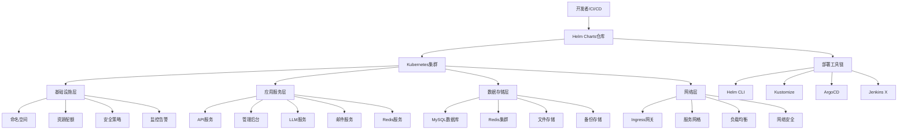

# YYC3 Helm部署系统开发规划路线图

> 📋 **文档版本**: v1.0.0 | **创建时间**: 2025-12-08 | **维护团队**: YYC3 AI Family

## 📖 项目概述

YYC3 Helm部署系统是YYC3 AI Family平台的云原生部署解决方案，基于Kubernetes和Helm Charts提供完整的容器化部署、服务编排、资源管理和自动化运维能力。

### 基本信息

- **服务名称**: YYC3 Helm Deployment System
- **技术栈**: Kubernetes 1.28+ | Helm 3.12+ | Docker | YAML | Bash | Python
- **主要组件**: Helm Charts、Kubernetes manifests、CI/CD pipelines、监控配置
- **部署目标**: YYC3全平台微服务容器化部署

## 🎯 开发目标与愿景

### 核心目标
1. **容器化部署**: 为YYC3平台提供完整的Kubernetes容器化部署方案
2. **服务编排**: 实现微服务间的依赖管理和自动发现
3. **资源管理**: 提供统一的资源配置、限制和优化
4. **自动化运维**: 实现自动扩缩容、故障自愈和滚动更新
5. **多环境支持**: 支持开发、测试、预生产、生产环境的统一部署

### 技术愿景
- 构建企业级的云原生部署平台
- 实现GitOps和基础设施即代码
- 提供可复用的部署模板和最佳实践
- 支持多云部署和边缘计算

## 🏗️ 技术架构规划

### 架构层次



### 核心模块设计

#### 1. Chart结构管理器 (ChartManager)
```yaml
# Chart目录结构
yyc3-platform/
├── Chart.yaml                    # Chart元数据
├── values.yaml                   # 默认配置值
├── values-prod.yaml             # 生产环境配置
├── values-dev.yaml              # 开发环境配置
├── values-staging.yaml          # 预生产环境配置
├── templates/                    # Kubernetes模板文件
│   ├── _helpers.tpl             # 模板助手函数
│   ├── configmap.yaml           # 配置映射
│   ├── secret.yaml              # 密钥配置
│   ├── deployment.yaml          # 部署配置
│   ├── service.yaml             # 服务配置
│   ├── ingress.yaml             # 入口配置
│   ├── hpa.yaml                 # 水平扩缩容
│   ├── pdb.yaml                 # Pod中断预算
│   ├── networkpolicy.yaml       # 网络策略
│   ├── serviceaccount.yaml      # 服务账户
│   ├── rbac.yaml                # RBAC权限
│   └── monitoring/              # 监控配置
│       ├── servicemonitor.yaml
│       ├── prometheusrule.yaml
│       └── dashboard.yaml
├── charts/                       # 依赖Charts
│   ├── mysql/
│   ├── redis/
│   └── nginx/
└── scripts/                      # 部署脚本
    ├── install.sh
    ├── upgrade.sh
    ├── rollback.sh
    └── uninstall.sh
```

#### 2. 环境配置管理器 (EnvironmentManager)
```yaml
# 环境配置模板
environments:
  development:
    namespace: yyc3-dev
    replicas:
      api: 1
      admin: 1
      llm: 1
      mail: 1
      redis: 1
    resources:
      requests:
        cpu: "100m"
        memory: "128Mi"
      limits:
        cpu: "500m"
        memory: "512Mi"
    ingress:
      enabled: true
      host: dev-yyc3.0379.email
      tls: false

  staging:
    namespace: yyc3-staging
    replicas:
      api: 2
      admin: 2
      llm: 2
      mail: 2
      redis: 2
    resources:
      requests:
        cpu: "200m"
        memory: "256Mi"
      limits:
        cpu: "1000m"
        memory: "1Gi"
    ingress:
      enabled: true
      host: staging-yyc3.0379.email
      tls: true

  production:
    namespace: yyc3-prod
    replicas:
      api: 3
      admin: 3
      llm: 3
      mail: 3
      redis: 3
    resources:
      requests:
        cpu: "500m"
        memory: "512Mi"
      limits:
        cpu: "2000m"
        memory: "2Gi"
    ingress:
      enabled: true
      host: yyc3.0379.email
      tls: true
      certificateSecret: yyc3-tls
```

#### 3. 部署自动化管理器 (DeploymentManager)
```bash
#!/bin/bash
# deployment-manager.sh

class DeploymentManager {
    constructor() {
        this.chartPath = "./yyc3-platform"
        this.namespace = ""
        this.environment = ""
        this.releaseName = "yyc3-platform"
    }

    # 部署到指定环境
    async deploy(environment) {
        echo "=== 部署到 ${environment} 环境 ==="

        # 验证环境配置
        this.validateEnvironment(environment)

        # 检查集群连接
        this.checkClusterConnection()

        # 创建命名空间
        this.createNamespace()

        # 安装/更新依赖
        this.installDependencies()

        # 部署应用
        this.installChart()

        # 验证部署
        this.validateDeployment()

        # 配置监控
        this.setupMonitoring()
    }

    # 滚动更新
    async upgrade(environment, chartVersion) {
        echo "=== 滚动更新到版本 ${chartVersion} ==="

        # 备份当前版本
        this.backupCurrentRelease()

        # 执行滚动更新
        helm upgrade \
            --install ${this.releaseName} \
            ${this.chartPath} \
            --namespace ${this.namespace} \
            --values values-${environment}.yaml \
            --set image.tag=${chartVersion} \
            --wait \
            --timeout=10m

        # 验证更新
        this.validateUpgrade()
    }

    # 回滚到指定版本
    async rollback(revision) {
        echo "=== 回滚到版本 ${revision} ==="

        helm rollback \
            ${this.releaseName} \
            ${revision} \
            --namespace ${this.namespace} \
            --wait \
            --timeout=5m

        # 验证回滚
        this.validateRollback()
    }

    # 验证部署状态
    validateDeployment() {
        # 检查Pod状态
        kubectl get pods -n ${this.namespace} -l app=yyc3

        # 检查服务状态
        kubectl get services -n ${this.namespace} -l app=yyc3

        # 检查入口状态
        kubectl get ingress -n ${this.namespace} -l app=yyc3

        # 运行健康检查
        kubectl wait \
            --for=condition=ready pod \
            -l app=yyc3 \
            -n ${this.namespace} \
            --timeout=300s
    }
}
```

#### 4. 监控配置管理器 (MonitoringManager)
```yaml
# 监控配置模板
monitoring:
  enabled: true
  serviceMonitor:
    enabled: true
    interval: 30s
    scrapeTimeout: 10s
    labels:
      release: prometheus
      app: yyc3-platform

  prometheusRule:
    enabled: true
    groups:
      - name: yyc3-platform.rules
        rules:
          - alert: YYC3HighErrorRate
            expr: rate(http_requests_total{status=~"5.."}[5m]) > 0.1
            for: 5m
            labels:
              severity: critical
            annotations:
              summary: "YYC3平台错误率过高"
              description: "服务 {{ $labels.service }} 错误率超过10%"

          - alert: YYC3HighResponseTime
            expr: histogram_quantile(0.95, rate(http_request_duration_seconds_bucket[5m])) > 2
            for: 5m
            labels:
              severity: warning
            annotations:
              summary: "YYC3平台响应时间过长"
              description: "服务 {{ $labels.service }} 95%响应时间超过2秒"

  dashboard:
    enabled: true
    labels:
      grafana_dashboard: "1"
    annotations:
      grafana_folder: "YYC3 Platform"

    configMapRefs:
      - name: yyc3-api-dashboard
      - name: yyc3-admin-dashboard
      - name: yyc3-llm-dashboard
      - name: yyc3-mail-dashboard
      - name: yyc3-redis-dashboard
```

## 📅 开发阶段规划

### 第一阶段：基础设施和基础Charts (2周)

#### Week 1: Kubernetes集群准备和基础Chart
**目标**: 完成Kubernetes集群准备和基础Helm Chart结构

**任务清单**:
- [ ] **集群准备**
  - [x] Kubernetes 1.28+ 集群部署配置
  - [ ] 集群网络配置 (CNI插件选择)
  - [ ] 存储类配置和动态存储
  - [ ] Ingress控制器部署

- [ ] **Helm Chart基础结构**
  - [ ] Chart.yaml元数据配置
  - [ ] 基础模板文件创建
  - [ ] 模板助手函数开发
  - [ ] 默认values.yaml配置

- [ ] **命名空间和RBAC**
  - [ ] 多环境命名空间定义
  - [ ] 服务账户和权限配置
  - [ ] 网络策略和安全上下文
  - [ ] Pod安全策略配置

- [ ] **基础服务部署**
  - [ ] ConfigMap和Secret模板
  - [ ] Service和Deployment模板
  - [ ] 基础健康检查配置
  - [ ] 资源限制和请求配置

**交付物**:
- Kubernetes集群配置文档
- 基础Helm Chart结构
- RBAC和安全配置
- 基础服务模板

#### Week 2: 核心服务Charts开发
**目标**: 完成核心微服务的Helm Charts开发

**任务清单**:
- [ ] **API服务Chart**
  - [ ] API服务Deployment配置
  - [ ] 数据库连接和配置
  - [ ] 健康检查和就绪探针
  - [ ] 水平扩缩容配置

- [ ] **管理后台Chart**
  - [ ] 前端应用部署配置
  - [ ] 静态资源配置
  - [ ] API网关配置
  - [ ] CDN和缓存配置

- [ ] **数据库依赖Charts**
  - [ ] MySQL依赖配置
  - [ ] Redis依赖配置
  - [ ] 数据持久化配置
  - [ ] 备份和恢复配置

- [ ] **网络和入口配置**
  - [ ] Ingress配置模板
  - [ ] TLS证书管理
  - [ ] 域名和路径配置
  - [ ] 负载均衡配置

**交付物**:
- 完整的核心服务Charts
- 数据库依赖配置
- 网络和入口配置
- 部署验证脚本

### 第二阶段：高级功能和CI/CD集成 (3周)

#### Week 3: 高级部署功能
**目标**: 实现高级部署功能和服务治理

**任务清单**:
- [ ] **服务网格集成**
  - [ ] Istio安装和配置
  - [ ] 服务间流量管理
  - [ ] 安全策略和mTLS
  - [ ] 可观察性配置

- [ ] **自动扩缩容**
  - [ ] HPA (水平扩缩容) 配置
  - [ ] VPA (垂直扩缩容) 配置
  - [ ] 自定义扩缩容指标
  - [ ] 集群自动扩缩容

- [ ] **高可用配置**
  - [ ] Pod中断预算 (PDB)
  - [ ] 反亲和性配置
  - [ ] 多可用区部署
  - [ ] 故障转移配置

- [ ] **配置管理**
  - [ ] ConfigMap热更新
  - [ ] Secret管理最佳实践
  - [ ] 环境变量管理
  - [ ] 配置版本控制

**交付物**:
- 服务网格配置
- 自动扩缩容策略
- 高可用部署方案
- 配置管理系统

#### Week 4: 监控和可观察性
**目标**: 完成监控告警和可观察性系统

**任务清单**:
- [ ] **监控系统部署**
  - [ ] Prometheus部署配置
  - [ ] Grafana仪表盘配置
  - [ ] AlertManager告警配置
  - [ ] 自定义业务指标

- [ ] **日志聚合**
  - [ ] ELK Stack部署配置
  - [ ] Fluentd日志收集
  - [ ] 日志格式化和索引
  - [ ] 日志查询和分析

- [ ] **链路追踪**
  - [ ] Jaeger部署配置
  - [ ] 应用链路追踪集成
  - [ ] 追踪数据存储
  - [ ] 性能分析工具

- [ ] **可视化配置**
  - [ ] 服务依赖图
  - [ ] 实时性能仪表盘
  - [ ] 业务指标监控
  - [ ] 告警规则配置

**交付物**:
- 完整监控系统
- 日志聚合方案
- 链路追踪系统
- 可视化仪表盘

#### Week 5: CI/CD流水线集成
**目标**: 实现完整的CI/CD自动化流水线

**任务清单**:
- [ ] **GitOps配置**
  - [ ] ArgoCD部署配置
  - [ ] Git仓库结构设计
  - [ ] 自动同步策略
  - [ ] 部署历史管理

- [ ] **自动化测试**
  - [ ] 容器镜像扫描
  - [ ] 部署前验证
  - [ ] 集成测试自动化
  - [ ] 性能测试集成

- [ ] **发布策略**
  - [ ] 蓝绿部署配置
  - [ ] 金丝雀发布
  - [ ] A/B测试支持
  - [ ] 自动回滚机制

- [ ] **多环境管理**
  - [ ] 环境隔离策略
  - [ ] 配置差异化
  - [ ] 数据迁移工具
  - [ ] 环境同步检查

**交付物**:
- GitOps自动化系统
- CI/CD流水线配置
- 多环境发布策略
- 自动化测试套件

### 第三阶段：企业级功能和运维 (2周)

#### Week 6: 安全和合规
**目标**: 实现企业级安全和合规要求

**任务清单**:
- [ ] **安全加固**
  - [ ] 容器安全配置
  - [ ] 网络安全策略
  - [ ] 镜像签名验证
  - [ ] 漏洞扫描集成

- [ ] **权限管理**
  - [ ] 细粒度权限控制
  - [ ] 服务账户管理
  - [ ] 临时凭证管理
  - [ ] 审计日志记录

- [ ] **合规配置**
  - [ ] 数据加密配置
  - [ ] 隐私保护措施
  - [ ] 数据保留策略
  - [ ] 合规报告生成

- [ ] **备份恢复**
  - [ ] 自动备份策略
  - [ ] 灾难恢复方案
  - [ ] 数据一致性验证
  - [ ] 恢复时间目标

**交付物**:
- 安全加固方案
- 权限管理系统
- 合规配置模板
- 备份恢复策略

#### Week 7: 运维工具和文档
**目标**: 完善运维工具和项目文档

**任务清单**:
- [ ] **运维工具集**
  - [ ] 部署自动化脚本
  - [ ] 故障诊断工具
  - [ ] 性能调优工具
  - [ ] 容量规划工具

- [ ] **文档系统**
  - [ ] 部署指南文档
  - [ ] 运维手册
  - [ ] 故障排查指南
  - [ ] 最佳实践文档

- [ ] **培训和知识库**
  - [ ] 团队培训材料
  - [ ] 知识库建设
  - [ ] 常见问题解答
  - [ ] 视频教程制作

- [ ] **持续改进**
  - [ ] 部署流程优化
  - [ ] 性能调优建议
  - [ ] 成本优化方案
  - [ ] 技术演进规划

**交付物**:
- 完整运维工具集
- 详细项目文档
- 培训和知识库
- 持续改进方案

## 🔧 技术实现细节

### 核心技术栈

#### Kubernetes生态
```yaml
# kubernetes版本和组件
kubernetes: "1.28.0"
helm: "3.12.0"
kubectl: "1.28.0"

# 核心组件
ingressController: "nginx-ingress"
cni: "calico"
storageClass: "csi-hostpath"
monitoring: "prometheus-operator"
logging: "elasticsearch-operator"
serviceMesh: "istio"
```

#### Chart依赖管理
```yaml
# requirements.yaml
dependencies:
  - name: mysql
    version: "9.14.4"
    repository: "https://charts.bitnami.com/bitnami"
    condition: mysql.enabled

  - name: redis
    version: "18.1.0"
    repository: "https://charts.bitnami.com/bitnami"
    condition: redis.enabled

  - name: ingress-nginx
    version: "4.8.3"
    repository: "https://kubernetes.github.io/ingress-nginx"
    condition: ingress.enabled

  - name: prometheus
    version: "25.8.0"
    repository: "https://prometheus-community.github.io/helm-charts"
    condition: monitoring.enabled
```

#### 部署配置示例
```yaml
# templates/deployment.yaml
apiVersion: apps/v1
kind: Deployment
metadata:
  name: {{ include "yyc3-platform.fullname" . }}
  labels:
    {{- include "yyc3-platform.labels" . | nindent 4 }}
spec:
  {{- if not .Values.autoscaling.enabled }}
  replicas: {{ .Values.replicaCount }}
  {{- end }}
  selector:
    matchLabels:
      {{- include "yyc3-platform.selectorLabels" . | nindent 6 }}
  template:
    metadata:
      annotations:
        checksum/config: {{ include (print $.Template.BasePath "/configmap.yaml") . | sha256sum }}
        checksum/secret: {{ include (print $.Template.BasePath "/secret.yaml") . | sha256sum }}
        {{- with .Values.podAnnotations }}
        {{- toYaml . | nindent 8 }}
        {{- end }}
      labels:
        {{- include "yyc3-platform.selectorLabels" . | nindent 8 }}
    spec:
      {{- with .Values.imagePullSecrets }}
      imagePullSecrets:
        {{- toYaml . | nindent 8 }}
      {{- end }}
      serviceAccountName: {{ include "yyc3-platform.serviceAccountName" . }}
      securityContext:
        {{- toYaml .Values.podSecurityContext | nindent 8 }}
      containers:
        - name: {{ .Chart.Name }}
          securityContext:
            {{- toYaml .Values.securityContext | nindent 12 }}
          image: "{{ .Values.image.repository }}:{{ .Values.image.tag | default .Chart.AppVersion }}"
          imagePullPolicy: {{ .Values.image.pullPolicy }}
          ports:
            - name: http
              containerPort: {{ .Values.service.port }}
              protocol: TCP
          livenessProbe:
            httpGet:
              path: {{ .Values.livenessProbe.path }}
              port: http
            initialDelaySeconds: {{ .Values.livenessProbe.initialDelaySeconds }}
            periodSeconds: {{ .Values.livenessProbe.periodSeconds }}
            timeoutSeconds: {{ .Values.livenessProbe.timeoutSeconds }}
            failureThreshold: {{ .Values.livenessProbe.failureThreshold }}
          readinessProbe:
            httpGet:
              path: {{ .Values.readinessProbe.path }}
              port: http
            initialDelaySeconds: {{ .Values.readinessProbe.initialDelaySeconds }}
            periodSeconds: {{ .Values.readinessProbe.periodSeconds }}
            timeoutSeconds: {{ .Values.readinessProbe.timeoutSeconds }}
            failureThreshold: {{ .Values.readinessProbe.failureThreshold }}
          resources:
            {{- toYaml .Values.resources | nindent 12 }}
          env:
            - name: NODE_ENV
              value: {{ .Values.environment }}
            - name: PORT
              value: "{{ .Values.service.port }}"
            {{- range $key, $val := .Values.env }}
            - name: {{ $key }}
              value: {{ $val | quote }}
            {{- end }}
          volumeMounts:
            - name: config
              mountPath: /app/config
              readOnly: true
            {{- if .Values.extraVolumeMounts }}
            {{- toYaml .Values.extraVolumeMounts | nindent 12 }}
            {{- end }}
      volumes:
        - name: config
          configMap:
            name: {{ include "yyc3-platform.fullname" . }}
        {{- if .Values.extraVolumes }}
        {{- toYaml .Values.extraVolumes | nindent 8 }}
        {{- end }}
      {{- with .Values.nodeSelector }}
      nodeSelector:
        {{- toYaml . | nindent 8 }}
      {{- end }}
      {{- with .Values.affinity }}
      affinity:
        {{- toYaml . | nindent 8 }}
      {{- end }}
      {{- with .Values.tolerations }}
      tolerations:
        {{- toYaml . | nindent 8 }}
      {{- end }}
```

#### 水平扩缩容配置
```yaml
# templates/hpa.yaml
{{- if .Values.autoscaling.enabled }}
apiVersion: autoscaling/v2
kind: HorizontalPodAutoscaler
metadata:
  name: {{ include "yyc3-platform.fullname" . }}
  labels:
    {{- include "yyc3-platform.labels" . | nindent 4 }}
spec:
  scaleTargetRef:
    apiVersion: apps/v1
    kind: Deployment
    name: {{ include "yyc3-platform.fullname" . }}
  minReplicas: {{ .Values.autoscaling.minReplicas }}
  maxReplicas: {{ .Values.autoscaling.maxReplicas }}
  metrics:
    {{- if .Values.autoscaling.targetCPUUtilizationPercentage }}
    - type: Resource
      resource:
        name: cpu
        target:
          type: Utilization
          averageUtilization: {{ .Values.autoscaling.targetCPUUtilizationPercentage }}
    {{- end }}
    {{- if .Values.autoscaling.targetMemoryUtilizationPercentage }}
    - type: Resource
      resource:
        name: memory
        target:
          type: Utilization
          averageUtilization: {{ .Values.autoscaling.targetMemoryUtilizationPercentage }}
    {{- end }}
    {{- if .Values.autoscaling.customMetrics }}
    {{- range .Values.autoscaling.customMetrics }}
    - type: {{ .type }}
      {{- if .object }}
      object:
        {{- toYaml .object | nindent 12 }}
      {{- end }}
      {{- if .pods }}
      pods:
        {{- toYaml .pods | nindent 12 }}
      {{- end }}
      {{- if .external }}
      external:
        {{- toYaml .external | nindent 12 }}
      {{- end }}
    {{- end }}
    {{- end }}
{{- end }}
```

## 📊 性能指标和目标

### 部署性能目标

| 指标 | 目标值 | 说明 |
|------|--------|------|
| 部署时间 | < 10分钟 | 完整平台部署时间 |
| 更新时间 | < 5分钟 | 滚动更新完成时间 |
| 可用性 | 99.9% | 服务可用性 |
| 扩缩容时间 | < 2分钟 | 自动扩缩容响应时间 |
| 故障恢复 | < 3分钟 | 故障自愈时间 |

### 资源利用率目标

| 资源类型 | 目标利用率 | 说明 |
|----------|------------|------|
| CPU利用率 | 60-80% | 集群平均CPU利用率 |
| 内存利用率 | 70-85% | 集群平均内存利用率 |
| 存储利用率 | 50-70% | 存储空间利用率 |
| 网络带宽 | < 80% | 网络带宽利用率 |

### 扩展性设计
- 水平扩展：支持多节点集群扩展
- 垂直扩展：支持节点资源升级
- 多集群：支持多集群联邦
- 多云：支持多云部署策略

## 🔒 安全和合规

### 安全措施
1. **容器安全**: 镜像扫描、运行时安全、最小权限原则
2. **网络安全**: 网络策略、mTLS加密、入侵检测
3. **访问控制**: RBAC权限、服务账户、临时凭证
4. **数据保护**: 静态加密、传输加密、密钥管理

### 合规要求
1. **行业标准**: CIS Kubernetes基准、NIST框架
2. **数据合规**: GDPR、CCPA数据保护法规
3. **审计要求**: 操作审计、合规报告
4. **认证标准**: ISO 27001、SOC 2认证

## 🚀 部署和运维

### 部署流程


### 运维监控
- **资源监控**: 集群资源使用率、节点健康状态
- **应用监控**: 服务性能、错误率、响应时间
- **业务监控**: 用户活跃度、功能使用统计
- **安全监控**: 安全事件、漏洞扫描、合规检查

### 故障处理
1. **自动检测**: 监控系统自动检测异常
2. **自动恢复**: Pod重启、节点隔离、流量切换
3. **告警通知**: 多渠道告警通知和升级
4. **故障分析**: 根因分析和改进措施

## 📈 未来发展规划

### 短期目标 (3-6个月)
- 完成核心部署功能开发
- 实现基础的CI/CD自动化
- 建立完整的监控体系
- 优化部署性能和稳定性

### 中期目标 (6-12个月)
- 支持多云和混合云部署
- 实现智能化运维和AIOps
- 建立完整的DevOps体系
- 支持边缘计算和Serverless

### 长期目标 (1-2年)
- 构建云原生平台即服务
- 实现基础设施自动化管理
- 建立云原生最佳实践库
- 支持企业级多云治理

## 📞 团队协作

### 开发团队
- **Kubernetes工程师**: 容器编排和集群管理专家
- **DevOps工程师**: CI/CD和自动化部署专家
- **安全工程师**: 云原生安全和合规专家
- **SRE工程师**: 可靠性和运维专家

### 协作流程
1. **需求分析**: 部署需求评审和技术设计
2. **Chart开发**: Helm Chart开发和测试
3. **CI/CD集成**: 自动化流水线构建
4. **部署验证**: 多环境部署和验证
5. **监控运维**: 持续监控和优化

## 📋 风险评估

### 技术风险
- **版本兼容性**: Kubernetes版本升级兼容性
- **安全漏洞**: 容器和集群安全风险
- **性能瓶颈**: 大规模部署性能问题

### 运维风险
- **单点故障**: 集群组件单点故障
- **配置错误**: 错误配置导致服务中断
- **资源不足**: 资源规划不足影响扩展

### 缓解措施
- 版本测试和渐进式升级
- 安全扫描和自动化修复
- 性能测试和容量规划
- 高可用架构和备份策略

---

<div align="center">

**[⬆️ 回到顶部](#yyc3-helm部署系统开发规划路线图)**

Made with ❤️ by YYC3 AI Family Team

**言启象限，语枢智能** ⚙️

</div>