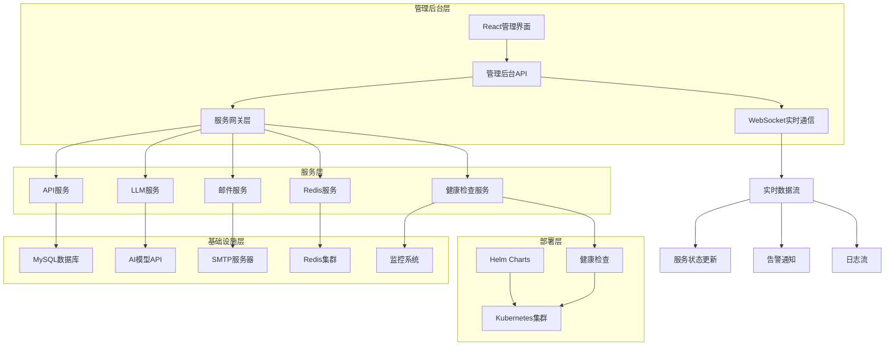
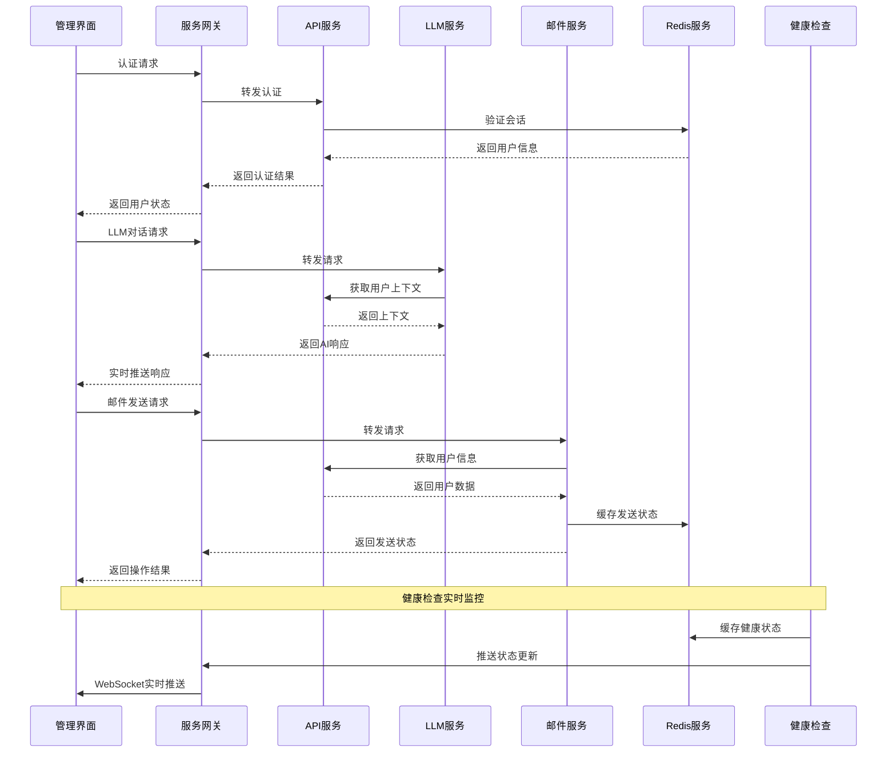

# YYC3 管理后台综合衔接开发指南

> 📋 **文档版本**: v1.0.0 | **创建时间**: 2025-12-08 | **维护团队**: YYC3 AI Family

## 📖 项目概述

YYC3管理后台综合衔接指南是YYC3 AI Family平台的管理控制中心集成文档，详细说明如何将所有微服务(LLM、邮件、API、Redis、Helm部署、健康检查)统一集成到管理后台中，实现统一的管理、监控和运维能力。

### 服务集成概览

| 服务名称 | 端口配置 | 技术栈 | 核心功能 | 集成方式 |
|----------|----------|--------|----------|----------|
| API服务 | 6600/3000 | Node.js/Express | 用户认证、数据管理 | REST API集成 |
| LLM服务 | 6602/3002 | Python/FastAPI | AI对话、模型服务 | HTTP API集成 |
| 邮件服务 | 6603/3003 | Node.js/Express | 邮件发送、模板管理 | HTTP API集成 |
| Redis服务 | 6606/3004 | Node.js/Redis | 缓存、会话、队列 | Redis客户端集成 |
| Helm部署 | - | Kubernetes/Helm | 容器化部署 | K8s API集成 |
| 健康检查 | 6607/3007 | Node.js/Express | 服务监控、告警 | WebSocket集成 |

## 🎯 集成架构设计

### 整体架构图



### 服务通信架构



## 🔧 技术集成方案

### 1. API服务集成

#### 认证授权集成

```typescript
// src/services/api/AuthService.ts
import { apiService } from '@/services/base';

export interface AuthService {
  login(credentials: LoginCredentials): Promise<AuthResult>;
  logout(userId: string): Promise<void>;
  refreshToken(refreshToken: string): Promise<TokenPair>;
  getCurrentUser(): Promise<User>;
  hasPermission(permission: string): Promise<boolean>;
}

export class AuthServiceImpl implements AuthService {
  private readonly baseUrl = '/api/auth';

  async login(credentials: LoginCredentials): Promise<AuthResult> {
    return apiService.post(`${this.baseUrl}/login`, credentials);
  }

  async logout(userId: string): Promise<void> {
    return apiService.post(`${this.baseUrl}/logout`, { userId });
  }

  async refreshToken(refreshToken: string): Promise<TokenPair> {
    return apiService.post(`${this.baseUrl}/refresh`, { refreshToken });
  }

  async getCurrentUser(): Promise<User> {
    return apiService.get(`${this.baseUrl}/me`);
  }

  async hasPermission(permission: string): Promise<boolean> {
    return apiService.get(`${this.baseUrl}/permissions/${permission}`);
  }
}
```

#### 用户管理集成

```typescript
// src/services/api/UserService.ts
export interface UserService {
  getUsers(query: UserListQuery): Promise<PaginatedUsers>;
  createUser(userData: CreateUserDto): Promise<User>;
  updateUser(id: string, data: UpdateUserDto): Promise<User>;
  deleteUser(id: string): Promise<void>;
  assignRole(userId: string, roleIds: string[]): Promise<void>;
}

export class UserServiceImpl implements UserService {
  private readonly baseUrl = '/api/users';

  async getUsers(query: UserListQuery): Promise<PaginatedUsers> {
    return apiService.get(this.baseUrl, { params: query });
  }

  async createUser(userData: CreateUserDto): Promise<User> {
    return apiService.post(this.baseUrl, userData);
  }

  async updateUser(id: string, data: UpdateUserDto): Promise<User> {
    return apiService.put(`${this.baseUrl}/${id}`, data);
  }

  async deleteUser(id: string): Promise<void> {
    return apiService.delete(`${this.baseUrl}/${id}`);
  }

  async assignRole(userId: string, roleIds: string[]): Promise<void> {
    return apiService.post(`${this.baseUrl}/${userId}/roles`, { roleIds });
  }
}
```

### 2. LLM服务集成

#### AI对话集成

```typescript
// src/services/llm/LLMService.ts
export interface LLMService {
  chat(message: string, sessionId?: string): Promise<ChatResponse>;
  streamChat(message: string, onMessage: (chunk: string) => void, sessionId?: string): Promise<void>;
  getChatHistory(sessionId: string): Promise<ChatMessage[]>;
  clearChatHistory(sessionId: string): Promise<void>;
  getModelInfo(): Promise<ModelInfo>;
}

export class LLMServiceImpl implements LLMService {
  private readonly baseUrl = '/api/llm';

  async chat(message: string, sessionId?: string): Promise<ChatResponse> {
    return apiService.post(`${this.baseUrl}/chat`, {
      message,
      sessionId,
      timestamp: new Date().toISOString()
    });
  }

  async streamChat(
    message: string,
    onMessage: (chunk: string) => void,
    sessionId?: string
  ): Promise<void> {
    const response = await fetch(`${process.env.NEXT_PUBLIC_LLM_API_URL}/chat/stream`, {
      method: 'POST',
      headers: {
        'Content-Type': 'application/json',
        'Authorization': `Bearer ${localStorage.getItem('token')}`
      },
      body: JSON.stringify({
        message,
        sessionId,
        stream: true
      })
    });

    if (!response.body) throw new Error('No response body');

    const reader = response.body.getReader();
    const decoder = new TextDecoder();

    try {
      while (true) {
        const { done, value } = await reader.read();
        if (done) break;

        const chunk = decoder.decode(value);
        const lines = chunk.split('\n');

        for (const line of lines) {
          if (line.startsWith('data: ')) {
            const data = line.slice(6);
            if (data === '[DONE]') continue;

            try {
              const parsed = JSON.parse(data);
              onMessage(parsed.content || '');
            } catch (e) {
              console.error('Error parsing SSE data:', e);
            }
          }
        }
      }
    } finally {
      reader.releaseLock();
    }
  }

  async getChatHistory(sessionId: string): Promise<ChatMessage[]> {
    return apiService.get(`${this.baseUrl}/chat/${sessionId}/history`);
  }

  async clearChatHistory(sessionId: string): Promise<void> {
    return apiService.delete(`${this.baseUrl}/chat/${sessionId}/history`);
  }

  async getModelInfo(): Promise<ModelInfo> {
    return apiService.get(`${this.baseUrl}/model/info`);
  }
}
```

#### 模型管理集成

```typescript
// src/services/llm/ModelService.ts
export interface ModelService {
  getAvailableModels(): Promise<AIModel[]>;
  switchModel(modelId: string): Promise<void>;
  getModelCapabilities(modelId: string): Promise<ModelCapabilities>;
  getModelUsageStats(timeRange: TimeRange): Promise<ModelUsageStats>;
}

export class ModelServiceImpl implements ModelService {
  private readonly baseUrl = '/api/llm/models';

  async getAvailableModels(): Promise<AIModel[]> {
    return apiService.get(this.baseUrl);
  }

  async switchModel(modelId: string): Promise<void> {
    return apiService.post(`${this.baseUrl}/${modelId}/switch`);
  }

  async getModelCapabilities(modelId: string): Promise<ModelCapabilities> {
    return apiService.get(`${this.baseUrl}/${modelId}/capabilities`);
  }

  async getModelUsageStats(timeRange: TimeRange): Promise<ModelUsageStats> {
    return apiService.get(`${this.baseUrl}/usage`, { params: timeRange });
  }
}
```

### 3. 邮件服务集成

#### 邮件发送集成

```typescript
// src/services/mail/MailService.ts
export interface MailService {
  sendEmail(emailData: SendEmailDto): Promise<MailResult>;
  sendBulkEmail(emails: BulkEmailDto): Promise<BulkMailResult>;
  getEmailTemplate(templateId: string): Promise<EmailTemplate>;
  previewEmail(templateId: string, data: any): Promise<EmailPreview>;
  getEmailStatus(messageId: string): Promise<MailStatus>;
}

export class MailServiceImpl implements MailService {
  private readonly baseUrl = '/api/mail';

  async sendEmail(emailData: SendEmailDto): Promise<MailResult> {
    return apiService.post(`${this.baseUrl}/send`, emailData);
  }

  async sendBulkEmail(emails: BulkEmailDto): Promise<BulkMailResult> {
    return apiService.post(`${this.baseUrl}/bulk`, emails);
  }

  async getEmailTemplate(templateId: string): Promise<EmailTemplate> {
    return apiService.get(`${this.baseUrl}/templates/${templateId}`);
  }

  async previewEmail(templateId: string, data: any): Promise<EmailPreview> {
    return apiService.post(`${this.baseUrl}/templates/${templateId}/preview`, { data });
  }

  async getEmailStatus(messageId: string): Promise<MailStatus> {
    return apiService.get(`${this.baseUrl}/status/${messageId}`);
  }
}
```

#### 模板管理集成

```typescript
// src/services/mail/TemplateService.ts
export interface TemplateService {
  getTemplates(filters?: TemplateFilters): Promise<EmailTemplate[]>;
  createTemplate(template: CreateTemplateDto): Promise<EmailTemplate>;
  updateTemplate(id: string, template: UpdateTemplateDto): Promise<EmailTemplate>;
  deleteTemplate(id: string): Promise<void>;
  testTemplate(templateId: string, testData: any): Promise<TestResult>;
}

export class TemplateServiceImpl implements TemplateService {
  private readonly baseUrl = '/api/mail/templates';

  async getTemplates(filters?: TemplateFilters): Promise<EmailTemplate[]> {
    return apiService.get(this.baseUrl, { params: filters });
  }

  async createTemplate(template: CreateTemplateDto): Promise<EmailTemplate> {
    return apiService.post(this.baseUrl, template);
  }

  async updateTemplate(id: string, template: UpdateTemplateDto): Promise<EmailTemplate> {
    return apiService.put(`${this.baseUrl}/${id}`, template);
  }

  async deleteTemplate(id: string): Promise<void> {
    return apiService.delete(`${this.baseUrl}/${id}`);
  }

  async testTemplate(templateId: string, testData: any): Promise<TestResult> {
    return apiService.post(`${this.baseUrl}/${id}/test`, { testData });
  }
}
```

### 4. Redis服务集成

#### 缓存管理集成

```typescript
// src/services/redis/CacheService.ts
export interface CacheService {
  getCache(key: string): Promise<any>;
  setCache(key: string, value: any, ttl?: number): Promise<void>;
  deleteCache(key: string): Promise<void>;
  clearCache(pattern?: string): Promise<number>;
  getCacheStats(): Promise<CacheStats>;
  warmupCache(pattern: string): Promise<void>;
}

export class CacheServiceImpl implements CacheService {
  private readonly baseUrl = '/api/redis/cache';

  async getCache(key: string): Promise<any> {
    return apiService.get(`${this.baseUrl}/${key}`);
  }

  async setCache(key: string, value: any, ttl?: number): Promise<void> {
    return apiService.post(`${this.baseUrl}/${key}`, { value, ttl });
  }

  async deleteCache(key: string): Promise<void> {
    return apiService.delete(`${this.baseUrl}/${key}`);
  }

  async clearCache(pattern?: string): Promise<number> {
    return apiService.delete(`${this.baseUrl}`, { params: { pattern } });
  }

  async getCacheStats(): Promise<CacheStats> {
    return apiService.get(`${this.baseUrl}/stats`);
  }

  async warmupCache(pattern: string): Promise<void> {
    return apiService.post(`${this.baseUrl}/warmup`, { pattern });
  }
}
```

#### 会话管理集成

```typescript
// src/services/redis/SessionService.ts
export interface SessionService {
  getActiveSessions(): Promise<Session[]>;
  getSession(sessionId: string): Promise<Session | null>;
  revokeSession(sessionId: string): Promise<void>;
  revokeUserSessions(userId: string): Promise<number>;
  getSessionStats(): Promise<SessionStats>;
}

export class SessionServiceImpl implements SessionService {
  private readonly baseUrl = '/api/redis/sessions';

  async getActiveSessions(): Promise<Session[]> {
    return apiService.get(this.baseUrl);
  }

  async getSession(sessionId: string): Promise<Session | null> {
    return apiService.get(`${this.baseUrl}/${sessionId}`);
  }

  async revokeSession(sessionId: string): Promise<void> {
    return apiService.delete(`${this.baseUrl}/${sessionId}`);
  }

  async revokeUserSessions(userId: string): Promise<number> {
    return apiService.delete(`${this.baseUrl}/user/${userId}`);
  }

  async getSessionStats(): Promise<SessionStats> {
    return apiService.get(`${this.baseUrl}/stats`);
  }
}
```

### 5. 健康检查集成

#### 服务监控集成

```typescript
// src/services/health/HealthService.ts
export interface HealthService {
  getServiceStatus(serviceId?: string): Promise<ServiceStatus[]>;
  createHealthCheck(check: HealthCheckConfig): Promise<HealthCheck>;
  executeCheck(checkId: string): Promise<CheckResult>;
  getHealthHistory(serviceId: string, timeRange: TimeRange): Promise<CheckResult[]>;
}

export class HealthServiceImpl implements HealthService {
  private readonly baseUrl = '/api/health';
  private wsConnection: WebSocket | null = null;

  async getServiceStatus(serviceId?: string): Promise<ServiceStatus[]> {
    return apiService.get(`${this.baseUrl}/status`, { params: { serviceId } });
  }

  async createHealthCheck(check: HealthCheckConfig): Promise<HealthCheck> {
    return apiService.post(`${this.baseUrl}/checks`, check);
  }

  async executeCheck(checkId: string): Promise<CheckResult> {
    return apiService.post(`${this.baseUrl}/checks/${checkId}/execute`);
  }

  async getHealthHistory(serviceId: string, timeRange: TimeRange): Promise<CheckResult[]> {
    return apiService.get(`${this.baseUrl}/history/${serviceId}`, { params: timeRange });
  }

  // WebSocket实时连接
  connectWebSocket(onUpdate: (status: ServiceStatus[]) => void): void {
    if (this.wsConnection) {
      this.wsConnection.close();
    }

    this.wsConnection = new WebSocket(`${process.env.NEXT_PUBLIC_WS_URL}/health`);

    this.wsConnection.onmessage = (event) => {
      try {
        const data = JSON.parse(event.data);
        onUpdate(data);
      } catch (error) {
        console.error('Error parsing WebSocket message:', error);
      }
    };

    this.wsConnection.onclose = () => {
      console.log('WebSocket connection closed');
      // 自动重连
      setTimeout(() => this.connectWebSocket(onUpdate), 5000);
    };
  }

  disconnectWebSocket(): void {
    if (this.wsConnection) {
      this.wsConnection.close();
      this.wsConnection = null;
    }
  }
}
```

### 6. Helm部署集成

#### 部署管理集成

```typescript
// src/services/helm/DeploymentService.ts
export interface DeploymentService {
  getDeployments(environment?: string): Promise<Deployment[]>;
  deployChart(chartName: string, environment: string, values?: any): Promise<DeploymentResult>;
  upgradeDeployment(deploymentId: string, values: any): Promise<UpgradeResult>;
  rollbackDeployment(deploymentId: string, revision: number): Promise<RollbackResult>;
  getDeploymentStatus(deploymentId: string): Promise<DeploymentStatus>;
}

export class DeploymentServiceImpl implements DeploymentService {
  private readonly baseUrl = '/api/helm';

  async getDeployments(environment?: string): Promise<Deployment[]> {
    return apiService.get(`${this.baseUrl}/deployments`, { params: { environment } });
  }

  async deployChart(chartName: string, environment: string, values?: any): Promise<DeploymentResult> {
    return apiService.post(`${this.baseUrl}/deploy`, {
      chartName,
      environment,
      values
    });
  }

  async upgradeDeployment(deploymentId: string, values: any): Promise<UpgradeResult> {
    return apiService.put(`${this.baseUrl}/deployments/${deploymentId}`, { values });
  }

  async rollbackDeployment(deploymentId: string, revision: number): Promise<RollbackResult> {
    return apiService.post(`${this.baseUrl}/deployments/${deploymentId}/rollback`, { revision });
  }

  async getDeploymentStatus(deploymentId: string): Promise<DeploymentStatus> {
    return apiService.get(`${this.baseUrl}/deployments/${deploymentId}/status`);
  }
}
```

## 🎨 管理后台界面集成

### 1. 统一状态管理

#### Redux Store配置

```typescript
// src/store/index.ts
import { configureStore } from '@reduxjs/toolkit';
import { persistStore, persistReducer } from 'redux-persist';
import storage from 'redux-persist/lib/storage';

import authSlice from './slices/authSlice';
import serviceSlice from './slices/serviceSlice';
import llmSlice from './slices/llmSlice';
import mailSlice from './slices/mailSlice';
import healthSlice from './slices/healthSlice';
import deploymentSlice from './slices/deploymentSlice';

const persistConfig = {
  key: 'root',
  storage,
  whitelist: ['auth', 'theme', 'settings'],
};

const rootReducer = combineReducers({
  auth: authSlice,
  service: serviceSlice,
  llm: llmSlice,
  mail: mailSlice,
  health: healthSlice,
  deployment: deploymentSlice,
});

const persistedReducer = persistReducer(persistConfig, rootReducer);

export const store = configureStore({
  reducer: persistedReducer,
  middleware: (getDefaultMiddleware) =>
    getDefaultMiddleware({
      serializableCheck: {
        ignoredActions: ['persist/PERSIST', 'persist/REHYDRATE'],
      },
    }),
  devTools: process.env.NODE_ENV !== 'production',
});

export const persistor = persistStore(store);

export type RootState = ReturnType<typeof store.getState>;
export type AppDispatch = typeof store.dispatch;
```

### 2. 统一服务状态管理

```typescript
// src/store/slices/serviceSlice.ts
import { createSlice, createAsyncThunk, PayloadAction } from '@reduxjs/toolkit';
import { ServiceStatus, ServiceType } from '@/types/service';

interface ServiceState {
  services: ServiceStatus[];
  loading: boolean;
  error: string | null;
  selectedService: string | null;
  lastUpdated: string | null;
}

const initialState: ServiceState = {
  services: [],
  loading: false,
  error: null,
  selectedService: null,
  lastUpdated: null,
};

export const fetchServiceStatus = createAsyncThunk(
  'service/fetchStatus',
  async (serviceId?: string) => {
    const response = await healthService.getServiceStatus(serviceId);
    return response;
  }
);

const serviceSlice = createSlice({
  name: 'service',
  initialState,
  reducers: {
    setSelectedService: (state, action: PayloadAction<string | null>) => {
      state.selectedService = action.payload;
    },
    updateServiceStatus: (state, action: PayloadAction<ServiceStatus[]>) => {
      state.services = action.payload;
      state.lastUpdated = new Date().toISOString();
    },
    clearError: (state) => {
      state.error = null;
    },
  },
  extraReducers: (builder) => {
    builder
      .addCase(fetchServiceStatus.pending, (state) => {
        state.loading = true;
        state.error = null;
      })
      .addCase(fetchServiceStatus.fulfilled, (state, action) => {
        state.loading = false;
        state.services = action.payload;
        state.lastUpdated = new Date().toISOString();
      })
      .addCase(fetchServiceStatus.rejected, (state, action) => {
        state.loading = false;
        state.error = action.error.message || 'Failed to fetch service status';
      });
  },
});

export const { setSelectedService, updateServiceStatus, clearError } = serviceSlice.actions;
export default serviceSlice.reducer;
```

### 3. 统一导航和路由

#### 路由配置

```typescript
// src/router/index.tsx
import React, { Suspense, lazy } from 'react';
import { Routes, Route, Navigate } from 'react-router-dom';
import { useSelector } from 'react-redux';
import { RootState } from '@/store';
import LoadingSpinner from '@/components/LoadingSpinner';

// 懒加载页面组件
const Dashboard = lazy(() => import('@/pages/Dashboard'));
const UserManagement = lazy(() => import('@/pages/UserManagement'));
const ServiceManagement = lazy(() => import('@/pages/ServiceManagement'));
const LLMChat = lazy(() => import('@/pages/LLMChat'));
const MailManagement = lazy(() => import('@/pages/MailManagement'));
const CacheManagement = lazy(() => import('@/pages/CacheManagement'));
const HealthMonitoring = lazy(() => import('@/pages/HealthMonitoring'));
const DeploymentManagement = lazy(() => import('@/pages/DeploymentManagement'));
const Settings = lazy(() => import('@/pages/Settings'));

const ProtectedRoute: React.FC<{ children: React.ReactNode }> = ({ children }) => {
  const { isAuthenticated } = useSelector((state: RootState) => state.auth);

  if (!isAuthenticated) {
    return <Navigate to="/login" replace />;
  }

  return <>{children}</>;
};

const AppRouter: React.FC = () => {
  return (
    <Suspense fallback={<LoadingSpinner />}>
      <Routes>
        <Route path="/login" element={<LoginPage />} />
        <Route path="/" element={
          <ProtectedRoute>
            <Dashboard />
          </ProtectedRoute>
        } />
        <Route path="/users/*" element={
          <ProtectedRoute>
            <UserManagement />
          </ProtectedRoute>
        } />
        <Route path="/services/*" element={
          <ProtectedRoute>
            <ServiceManagement />
          </ProtectedRoute>
        } />
        <Route path="/llm/*" element={
          <ProtectedRoute>
            <LLMChat />
          </ProtectedRoute>
        } />
        <Route path="/mail/*" element={
          <ProtectedRoute>
            <MailManagement />
          </ProtectedRoute>
        } />
        <Route path="/cache/*" element={
          <ProtectedRoute>
            <CacheManagement />
          </ProtectedRoute>
        } />
        <Route path="/health/*" element={
          <ProtectedRoute>
            <HealthMonitoring />
          </ProtectedRoute>
        } />
        <Route path="/deployment/*" element={
          <ProtectedRoute>
            <DeploymentManagement />
          </ProtectedRoute>
        } />
        <Route path="/settings/*" element={
          <ProtectedRoute>
            <Settings />
          </ProtectedRoute>
        } />
      </Routes>
    </Suspense>
  );
};

export default AppRouter;
```

### 4. 统一仪表盘组件

#### 主仪表盘

```typescript
// src/pages/Dashboard/index.tsx
import React, { useEffect } from 'react';
import { Row, Col, Card, Statistic, Progress, Table, Tag } from 'antd';
import { useAppDispatch, useAppSelector } from '@/store';
import { fetchServiceStatus } from '@/store/slices/serviceSlice';
import { fetchSystemStats } from '@/store/slices/systemSlice';
import ServiceStatusCard from '@/components/ServiceStatusCard';
import SystemMetricsChart from '@/components/SystemMetricsChart';
import RecentActivities from '@/components/RecentActivities';
import QuickActions from '@/components/QuickActions';

const Dashboard: React.FC = () => {
  const dispatch = useAppDispatch();
  const { services, loading } = useAppSelector((state) => state.service);
  const { stats } = useAppSelector((state) => state.system);

  useEffect(() => {
    dispatch(fetchServiceStatus());
    dispatch(fetchSystemStats());

    // 设置定时刷新
    const interval = setInterval(() => {
      dispatch(fetchServiceStatus());
    }, 30000); // 30秒刷新一次

    return () => clearInterval(interval);
  }, [dispatch]);

  const getServiceStatistics = () => {
    const total = services.length;
    const healthy = services.filter(s => s.status === 'healthy').length;
    const warning = services.filter(s => s.status === 'warning').length;
    const critical = services.filter(s => s.status === 'critical').length;

    return { total, healthy, warning, critical };
  };

  const serviceStats = getServiceStatistics();
  const healthPercentage = serviceStats.total > 0 ? (serviceStats.healthy / serviceStats.total) * 100 : 0;

  return (
    <div className="dashboard">
      <Row gutter={[16, 16]}>
        {/* 服务概览统计 */}
        <Col xs={24} sm={12} md={6}>
          <Card>
            <Statistic
              title="总服务数"
              value={serviceStats.total}
              prefix={<ApiOutlined />}
            />
          </Card>
        </Col>
        <Col xs={24} sm={12} md={6}>
          <Card>
            <Statistic
              title="健康服务"
              value={serviceStats.healthy}
              valueStyle={{ color: '#3f8600' }}
              prefix={<CheckCircleOutlined />}
            />
          </Card>
        </Col>
        <Col xs={24} sm={12} md={6}>
          <Card>
            <Statistic
              title="警告服务"
              value={serviceStats.warning}
              valueStyle={{ color: '#cf1322' }}
              prefix={<ExclamationCircleOutlined />}
            />
          </Card>
        </Col>
        <Col xs={24} sm={12} md={6}>
          <Card>
            <Statistic
              title="故障服务"
              value={serviceStats.critical}
              valueStyle={{ color: '#cf1322' }}
              prefix={<CloseCircleOutlined />}
            />
          </Card>
        </Col>
      </Row>

      <Row gutter={[16, 16]} style={{ marginTop: 16 }}>
        {/* 健康率进度条 */}
        <Col xs={24} lg={12}>
          <Card title="系统健康率">
            <Progress
              type="circle"
              percent={Math.round(healthPercentage)}
              format={(percent) => `${percent}%`}
              status={healthPercentage >= 90 ? 'success' : healthPercentage >= 70 ? 'normal' : 'exception'}
            />
            <div style={{ textAlign: 'center', marginTop: 16 }}>
              <Tag color={healthPercentage >= 90 ? 'green' : healthPercentage >= 70 ? 'orange' : 'red'}>
                {healthPercentage >= 90 ? '系统运行良好' : healthPercentage >= 70 ? '系统需要关注' : '系统存在风险'}
              </Tag>
            </div>
          </Card>
        </Col>

        {/* 系统指标 */}
        <Col xs={24} lg={12}>
          <Card title="系统资源使用情况">
            <SystemMetricsChart />
          </Card>
        </Col>
      </Row>

      <Row gutter={[16, 16]} style={{ marginTop: 16 }}>
        {/* 服务状态列表 */}
        <Col xs={24} lg={14}>
          <Card title="服务状态" loading={loading}>
            <Table
              dataSource={services}
              rowKey="id"
              pagination={{ pageSize: 10 }}
              columns={[
                {
                  title: '服务名称',
                  dataIndex: 'name',
                  key: 'name',
                  render: (text: string, record: any) => (
                    <div>
                      <div style={{ fontWeight: 'bold' }}>{text}</div>
                      <div style={{ fontSize: '12px', color: '#666' }}>{record.type}</div>
                    </div>
                  ),
                },
                {
                  title: '状态',
                  dataIndex: 'status',
                  key: 'status',
                  render: (status: string) => {
                    const color = status === 'healthy' ? 'green' :
                                  status === 'warning' ? 'orange' : 'red';
                    return <Tag color={color}>{status}</Tag>;
                  },
                },
                {
                  title: '响应时间',
                  dataIndex: 'responseTime',
                  key: 'responseTime',
                  render: (time: number) => `${time}ms`,
                },
                {
                  title: '最后检查',
                  dataIndex: 'lastCheck',
                  key: 'lastCheck',
                  render: (time: string) => new Date(time).toLocaleString(),
                },
              ]}
            />
          </Card>
        </Col>

        {/* 快捷操作和最近活动 */}
        <Col xs={24} lg={10}>
          <Row gutter={[16, 16]}>
            <Col xs={24}>
              <QuickActions />
            </Col>
            <Col xs={24}>
              <RecentActivities />
            </Col>
          </Row>
        </Col>
      </Row>
    </div>
  );
};

export default Dashboard;
```

## 🚀 部署和集成配置

### 1. 环境变量配置

#### 统一环境配置

```typescript
// src/config/environments.ts
export interface EnvironmentConfig {
  development: {
    apiBaseUrl: string;
    llmApiUrl: string;
    mailApiUrl: string;
    redisApiUrl: string;
    healthApiUrl: string;
    helmApiUrl: string;
    wsUrl: string;
  };
  production: {
    apiBaseUrl: string;
    llmApiUrl: string;
    mailApiUrl: string;
    redisApiUrl: string;
    healthApiUrl: string;
    helmApiUrl: string;
    wsUrl: string;
  };
}

export const environments: EnvironmentConfig = {
  development: {
    apiBaseUrl: 'http://localhost:3000/api/v1',
    llmApiUrl: 'http://localhost:3002',
    mailApiUrl: 'http://localhost:3003',
    redisApiUrl: 'http://localhost:3004',
    healthApiUrl: 'http://localhost:3007',
    helmApiUrl: 'http://localhost:3005',
    wsUrl: 'ws://localhost:3007',
  },
  production: {
    apiBaseUrl: 'https://api.yyc3.0379.email/api/v1',
    llmApiUrl: 'https://llm.yyc3.0379.email',
    mailApiUrl: 'https://mail.yyc3.0379.email',
    redisApiUrl: 'https://redis.yyc3.0379.email',
    healthApiUrl: 'https://health.yyc3.0379.email',
    helmApiUrl: 'https://deploy.yyc3.0379.email',
    wsUrl: 'wss://health.yyc3.0379.email',
  },
};

export const getCurrentEnvironment = (): keyof EnvironmentConfig => {
  return process.env.NODE_ENV === 'production' ? 'production' : 'development';
};

export const getEnvironmentConfig = () => {
  const env = getCurrentEnvironment();
  return environments[env];
};
```

### 2. 服务发现配置

#### 服务注册和发现

```typescript
// src/services/ServiceRegistry.ts
export class ServiceRegistry {
  private services: Map<string, ServiceInfo> = new Map();
  private healthCheckers: Map<string, HealthChecker> = new Map();

  constructor() {
    this.initializeServices();
  }

  private initializeServices(): void {
    const config = getEnvironmentConfig();

    // 注册所有服务
    this.registerService('api', {
      name: 'API服务',
      baseUrl: config.apiBaseUrl,
      version: '1.0.0',
      healthPath: '/health',
      type: 'core',
    });

    this.registerService('llm', {
      name: 'LLM服务',
      baseUrl: config.llmApiUrl,
      version: '1.0.0',
      healthPath: '/health',
      type: 'ai',
    });

    this.registerService('mail', {
      name: '邮件服务',
      baseUrl: config.mailApiUrl,
      version: '1.0.0',
      healthPath: '/health',
      type: 'communication',
    });

    this.registerService('redis', {
      name: 'Redis缓存服务',
      baseUrl: config.redisApiUrl,
      version: '1.0.0',
      healthPath: '/health',
      type: 'storage',
    });

    this.registerService('health', {
      name: '健康检查服务',
      baseUrl: config.healthApiUrl,
      version: '1.0.0',
      healthPath: '/health',
      type: 'monitoring',
    });

    this.registerService('helm', {
      name: 'Helm部署服务',
      baseUrl: config.helmApiUrl,
      version: '1.0.0',
      healthPath: '/health',
      type: 'deployment',
    });
  }

  registerService(id: string, service: ServiceInfo): void {
    this.services.set(id, service);

    // 创建健康检查器
    this.healthCheckers.set(id, new HealthChecker(service));
  }

  getService(id: string): ServiceInfo | undefined {
    return this.services.get(id);
  }

  getAllServices(): ServiceInfo[] {
    return Array.from(this.services.values());
  }

  async checkServiceHealth(id: string): Promise<ServiceHealth> {
    const checker = this.healthCheckers.get(id);
    if (!checker) {
      throw new Error(`Service ${id} not found`);
    }
    return await checker.checkHealth();
  }

  async checkAllServicesHealth(): Promise<Map<string, ServiceHealth>> {
    const results = new Map<string, ServiceHealth>();

    for (const [id] of this.services) {
      try {
        const health = await this.checkServiceHealth(id);
        results.set(id, health);
      } catch (error) {
        results.set(id, {
          status: 'unknown',
          error: error.message,
          lastCheck: new Date().toISOString(),
        });
      }
    }

    return results;
  }
}
```

## 📊 监控和运维

### 1. 统一监控配置

#### 监控指标收集

```typescript
// src/services/MonitoringService.ts
export class MonitoringService {
  private metricsCollector: MetricsCollector;
  private alertManager: AlertManager;

  constructor() {
    this.metricsCollector = new MetricsCollector();
    this.alertManager = new AlertManager();
    this.initializeMonitoring();
  }

  private initializeMonitoring(): void {
    // 性能监控
    this.setupPerformanceMonitoring();

    // 错误监控
    this.setupErrorMonitoring();

    // 用户行为监控
    this.setupUserBehaviorMonitoring();

    // 业务指标监控
    this.setupBusinessMetricsMonitoring();
  }

  private setupPerformanceMonitoring(): void {
    // 页面加载时间
    this.observePageLoadTime();

    // API响应时间
    this.observeApiResponseTime();

    // 用户交互响应时间
    this.observeInteractionTime();
  }

  private setupErrorMonitoring(): void {
    // JavaScript错误
    window.addEventListener('error', (event) => {
      this.reportError({
        type: 'javascript',
        message: event.message,
        filename: event.filename,
        lineno: event.lineno,
        colno: event.colno,
        stack: event.error?.stack,
        timestamp: new Date().toISOString(),
      });
    });

    // Promise rejection
    window.addEventListener('unhandledrejection', (event) => {
      this.reportError({
        type: 'promise-rejection',
        message: event.reason,
        stack: event.reason?.stack,
        timestamp: new Date().toISOString(),
      });
    });
  }

  private setupUserBehaviorMonitoring(): void {
    // 页面访问
    this.trackPageView();

    // 用户交互
    this.trackUserInteractions();

    // 功能使用统计
    this.trackFeatureUsage();
  }

  private setupBusinessMetricsMonitoring(): void {
    // LLM调用统计
    this.trackLLMUsage();

    // 邮件发送统计
    this.trackEmailUsage();

    // 用户活跃度
    this.trackUserActivity();
  }

  public observePageLoadTime(): void {
    if ('performance' in window) {
      window.addEventListener('load', () => {
        const navigation = performance.getEntriesByType('navigation')[0] as PerformanceNavigationTiming;
        const loadTime = navigation.loadEventEnd - navigation.navigationStart;

        this.metricsCollector.recordMetric('page_load_time', loadTime, {
          page: window.location.pathname,
          referrer: document.referrer,
        });
      });
    }
  }

  public observeApiResponseTime(): void {
    // 拦截fetch API调用
    const originalFetch = window.fetch;
    window.fetch = async (...args) => {
      const start = performance.now();
      const [url, options] = args;

      try {
        const response = await originalFetch(...args);
        const endTime = performance.now();
        const responseTime = endTime - start;

        this.metricsCollector.recordMetric('api_response_time', responseTime, {
          url: typeof url === 'string' ? url : url.toString(),
          method: options?.method || 'GET',
          status: response.status,
          success: response.ok,
        });

        return response;
      } catch (error) {
        const endTime = performance.now();
        const responseTime = endTime - start;

        this.metricsCollector.recordMetric('api_error', responseTime, {
          url: typeof url === 'string' ? url : url.toString(),
          method: options?.method || 'GET',
          error: error.message,
        });

        throw error;
      }
    };
  }
}
```

### 2. 统一日志管理

#### 日志收集和分析

```typescript
// src/services/LoggingService.ts
export enum LogLevel {
  DEBUG = 'debug',
  INFO = 'info',
  WARN = 'warn',
  ERROR = 'error',
  FATAL = 'fatal',
}

export interface LogEntry {
  timestamp: string;
  level: LogLevel;
  message: string;
  context?: any;
  userId?: string;
  sessionId?: string;
  service?: string;
  requestId?: string;
}

export class LoggingService {
  private logs: LogEntry[] = [];
  private maxLogSize = 1000;
  private logBuffer: LogEntry[] = [];
  private flushInterval = 5000; // 5秒

  constructor() {
    this.startLogFlushing();
    this.setupGlobalErrorHandlers();
  }

  log(level: LogLevel, message: string, context?: any): void {
    const logEntry: LogEntry = {
      timestamp: new Date().toISOString(),
      level,
      message,
      context,
      userId: this.getCurrentUserId(),
      sessionId: this.getCurrentSessionId(),
      service: 'admin-console',
      requestId: this.getRequestId(),
    };

    this.addLog(logEntry);

    // 控制台输出
    this.consoleLog(logEntry);

    // 发送到远程日志服务
    this.sendToRemoteLogger(logEntry);
  }

  debug(message: string, context?: any): void {
    this.log(LogLevel.DEBUG, message, context);
  }

  info(message: string, context?: any): void {
    this.log(LogLevel.INFO, message, context);
  }

  warn(message: string, context?: any): void {
    this.log(LogLevel.WARN, message, context);
  }

  error(message: string, context?: any): void {
    this.log(LogLevel.ERROR, message, context);
  }

  fatal(message: string, context?: any): void {
    this.log(LogLevel.FATAL, message, context);
  }

  private addLog(logEntry: LogEntry): void {
    this.logs.push(logEntry);

    // 限制日志大小
    if (this.logs.length > this.maxLogSize) {
      this.logs = this.logs.slice(-this.maxLogSize);
    }

    // 添加到缓冲区以批量发送
    this.logBuffer.push(logEntry);
  }

  private consoleLog(logEntry: LogEntry): void {
    const { timestamp, level, message, context } = logEntry;
    const logMessage = `[${timestamp}] ${level.toUpperCase()}: ${message}`;

    switch (level) {
      case LogLevel.DEBUG:
        console.debug(logMessage, context);
        break;
      case LogLevel.INFO:
        console.info(logMessage, context);
        break;
      case LogLevel.WARN:
        console.warn(logMessage, context);
        break;
      case LogLevel.ERROR:
      case LogLevel.FATAL:
        console.error(logMessage, context);
        break;
    }
  }

  private async sendToRemoteLogger(logEntry: LogEntry): Promise<void> {
    try {
      await fetch(`${process.env.NEXT_PUBLIC_API_BASE_URL}/logs`, {
        method: 'POST',
        headers: {
          'Content-Type': 'application/json',
        },
        body: JSON.stringify(logEntry),
      });
    } catch (error) {
      console.error('Failed to send log to remote logger:', error);
    }
  }

  private startLogFlushing(): void {
    setInterval(() => {
      this.flushLogs();
    }, this.flushInterval);
  }

  private async flushLogs(): Promise<void> {
    if (this.logBuffer.length === 0) return;

    const logsToSend = [...this.logBuffer];
    this.logBuffer = [];

    try {
      await fetch(`${process.env.NEXT_PUBLIC_API_BASE_URL}/logs/batch`, {
        method: 'POST',
        headers: {
          'Content-Type': 'application/json',
        },
        body: JSON.stringify({ logs: logsToSend }),
      });
    } catch (error) {
      console.error('Failed to flush logs:', error);
      // 重新添加到缓冲区
      this.logBuffer.unshift(...logsToSend);
    }
  }

  private setupGlobalErrorHandlers(): void {
    // 捕获未处理的错误
    window.addEventListener('error', (event) => {
      this.error('Global JavaScript Error', {
        message: event.message,
        filename: event.filename,
        lineno: event.lineno,
        colno: event.colno,
        stack: event.error?.stack,
      });
    });

    // 捕获未处理的Promise rejection
    window.addEventListener('unhandledrejection', (event) => {
      this.error('Unhandled Promise Rejection', {
        reason: event.reason,
        stack: event.reason?.stack,
      });
    });
  }

  private getCurrentUserId(): string | undefined {
    // 从Redux store或localStorage获取用户ID
    return localStorage.getItem('userId') || undefined;
  }

  private getCurrentSessionId(): string | undefined {
    return localStorage.getItem('sessionId') || undefined;
  }

  private getRequestId(): string {
    // 生成或获取请求ID
    return Math.random().toString(36).substr(2, 9);
  }
}

// 创建全局日志实例
export const logger = new LoggingService();
```

## 📈 性能优化和最佳实践

### 1. 前端性能优化

#### 代码分割和懒加载

```typescript
// src/utils/lazyLoading.ts
import { lazy, ComponentType } from 'react';

export const lazyLoad = <T extends ComponentType<any>>(
  importFunc: () => Promise<{ default: T }>,
  fallback: React.ComponentType = () => <div>Loading...</div>
) => {
  const LazyComponent = lazy(importFunc);

  return (props: React.ComponentProps<T>) => (
    <React.Suspense fallback={<fallback />}>
      <LazyComponent {...props} />
    </React.Suspense>
  );
};

// 使用示例
export const LazyLLMChat = lazyLoad(() => import('@/pages/LLMChat'));
export const LazyMailManagement = lazyLoad(() => import('@/pages/MailManagement'));
```

#### 资源优化配置

```typescript
// next.config.js
const withOptimization = (nextConfig = {}) => {
  return {
    ...nextConfig,
    webpack: (config, { buildId, dev, isServer, defaultLoaders, webpack }) => {
      // 生产环境优化
      if (!dev && !isServer) {
        config.optimization.splitChunks = {
          chunks: 'all',
          minSize: 20000,
          maxSize: 244000,
          cacheGroups: {
            vendors: {
              test: /[\\/]node_modules[\\/]/,
              name: 'vendors',
              chunks: 'all',
            },
            common: {
              name: 'common',
              minChunks: 2,
              chunks: 'all',
              enforce: true,
            },
          },
        };
      }

      return config;
    },
    compiler: {
      removeConsole: process.env.NODE_ENV === 'production',
    },
  };
};

module.exports = withOptimization({
  // 其他Next.js配置
});
```

### 2. 数据缓存策略

#### 智能缓存管理

```typescript
// src/utils/cache.ts
interface CacheEntry<T> {
  data: T;
  timestamp: number;
  ttl: number;
}

class SmartCache {
  private cache = new Map<string, CacheEntry<any>>();
  private defaultTTL = 5 * 60 * 1000; // 5分钟

  set<T>(key: string, data: T, ttl?: number): void {
    const entry: CacheEntry<T> = {
      data,
      timestamp: Date.now(),
      ttl: ttl || this.defaultTTL,
    };
    this.cache.set(key, entry);
  }

  get<T>(key: string): T | null {
    const entry = this.cache.get(key);
    if (!entry) return null;

    if (Date.now() - entry.timestamp > entry.ttl) {
      this.cache.delete(key);
      return null;
    }

    return entry.data;
  }

  invalidate(pattern: string): void {
    for (const key of this.cache.keys()) {
      if (key.includes(pattern)) {
        this.cache.delete(key);
      }
    }
  }

  clear(): void {
    this.cache.clear();
  }

  // 获取缓存统计
  getStats(): { size: number; keys: string[] } {
    return {
      size: this.cache.size,
      keys: Array.from(this.cache.keys()),
    };
  }
}

export const smartCache = new SmartCache();

// API请求缓存装饰器
export function withCache<T extends (...args: any[]) => Promise<any>>(
  fn: T,
  getKey: (...args: Parameters<T>) => string,
  ttl?: number
): T {
  return (async (...args: Parameters<T>) => {
    const key = getKey(...args);
    const cached = smartCache.get(key);

    if (cached !== null) {
      return cached;
    }

    const result = await fn(...args);
    smartCache.set(key, result, ttl);

    return result;
  }) as T;
}
```

## 🛠️ 故障排查和调试

### 1. 统一错误处理

#### 错误边界组件

```typescript
// src/components/ErrorBoundary.tsx
import React, { Component, ErrorInfo, ReactNode } from 'react';
import { Result, Button } from 'antd';
import { logger } from '@/services/LoggingService';

interface Props {
  children: ReactNode;
  fallback?: ReactNode;
}

interface State {
  hasError: boolean;
  error?: Error;
  errorInfo?: ErrorInfo;
}

class ErrorBoundary extends Component<Props, State> {
  constructor(props: Props) {
    super(props);
    this.state = { hasError: false };
  }

  static getDerivedStateFromError(error: Error): State {
    return { hasError: true, error };
  }

  componentDidCatch(error: Error, errorInfo: ErrorInfo) {
    this.setState({ error, errorInfo });

    logger.error('React Error Boundary caught an error', {
      error: error.message,
      stack: error.stack,
      componentStack: errorInfo.componentStack,
    });
  }

  handleReset = () => {
    this.setState({ hasError: false, error: undefined, errorInfo: undefined });
  };

  render() {
    if (this.state.hasError) {
      if (this.props.fallback) {
        return this.props.fallback;
      }

      return (
        <Result
          status="500"
          title="页面出现错误"
          subTitle="抱歉，页面遇到了一个错误。"
          extra={
            <Button type="primary" onClick={this.handleReset}>
              重新加载
            </Button>
          }
        >
          {process.env.NODE_ENV === 'development' && (
            <div style={{ marginTop: 20, textAlign: 'left' }}>
              <h4>错误详情:</h4>
              <pre style={{ background: '#f5f5f5', padding: 10, overflow: 'auto' }}>
                {this.state.error?.stack}
              </pre>
            </div>
          )}
        </Result>
      );
    }

    return this.props.children;
  }
}

export default ErrorBoundary;
```

### 2. 调试工具集成

#### 开发调试面板

```typescript
// src/components/DebugPanel.tsx
import React, { useState, useEffect } from 'react';
import { Drawer, Button, Select, InputNumber, Space, Divider, Tag } from 'antd';
import { useAppSelector } from '@/store';

const DebugPanel: React.FC = () => {
  const [visible, setVisible] = useState(false);
  const [mockDelay, setMockDelay] = useState(0);
  const { services, systemStats } = useAppSelector((state) => ({
    services: state.service.services,
    systemStats: state.system.stats,
  }));

  useEffect(() => {
    // 开发环境下自动显示调试面板
    if (process.env.NODE_ENV === 'development') {
      setVisible(true);
    }
  }, []);

  if (process.env.NODE_ENV !== 'development') {
    return null;
  }

  return (
    <>
      <Button
        type="primary"
        onClick={() => setVisible(true)}
        style={{ position: 'fixed', bottom: 20, right: 20, zIndex: 1000 }}
      >
        调试面板
      </Button>

      <Drawer
        title="开发调试面板"
        placement="right"
        onClose={() => setVisible(false)}
        open={visible}
        width={400}
      >
        <Space direction="vertical" style={{ width: '100%' }}>
          {/* 服务状态 */}
          <div>
            <h4>服务状态</h4>
            {services.map((service) => (
              <Tag
                key={service.id}
                color={
                  service.status === 'healthy' ? 'green' :
                  service.status === 'warning' ? 'orange' : 'red'
                }
              >
                {service.name}: {service.status}
              </Tag>
            ))}
          </div>

          <Divider />

          {/* 系统统计 */}
          <div>
            <h4>系统统计</h4>
            <p>内存使用: {systemStats?.memoryUsage || 'N/A'}</p>
            <p>CPU使用: {systemStats?.cpuUsage || 'N/A'}</p>
            <p>活跃用户: {systemStats?.activeUsers || 'N/A'}</p>
          </div>

          <Divider />

          {/* 模拟配置 */}
          <div>
            <h4>模拟配置</h4>
            <Space direction="vertical" style={{ width: '100%' }}>
              <div>
                <label>API响应延迟 (ms):</label>
                <InputNumber
                  min={0}
                  max={5000}
                  value={mockDelay}
                  onChange={(value) => setMockDelay(value || 0)}
                  style={{ width: '100%' }}
                />
              </div>
            </Space>
          </div>

          <Divider />

          {/* 快捷操作 */}
          <div>
            <h4>快捷操作</h4>
            <Space direction="vertical" style={{ width: '100%' }}>
              <Button block onClick={() => window.localStorage.clear()}>
                清除本地存储
              </Button>
              <Button block onClick={() => window.location.reload()}>
                强制刷新页面
              </Button>
              <Button block onClick={() => console.log('Store State:', useAppSelector.getState())}>
                打印Redux状态
              </Button>
            </Space>
          </div>
        </Space>
      </Drawer>
    </>
  );
};

export default DebugPanel;
```

## 📋 集成测试和验证

### 1. 端到端测试

#### 服务集成测试

```typescript
// src/tests/integration/service.integration.test.ts
import { render, screen, waitFor, fireEvent } from '@testing-library/react';
import { Provider } from 'react-redux';
import { configureStore } from '@reduxjs/toolkit';
import { BrowserRouter } from 'react-router-dom';
import Dashboard from '@/pages/Dashboard';
import { createMockStore } from './mockStore';

// Mock服务
jest.mock('@/services/api/AuthService');
jest.mock('@/services/llm/LLMService');
jest.mock('@/services/mail/MailService');
jest.mock('@/services/health/HealthService');

describe('服务集成测试', () => {
  let store: ReturnType<typeof createMockStore>;

  beforeEach(() => {
    store = createMockStore();
  });

  test('应该正确加载所有服务状态', async () => {
    render(
      <Provider store={store}>
        <BrowserRouter>
          <Dashboard />
        </BrowserRouter>
      </Provider>
    );

    // 等待服务状态加载
    await waitFor(() => {
      expect(screen.getByText('总服务数')).toBeInTheDocument();
    });

    // 验证Redux store中的服务数据
    const state = store.getState();
    expect(state.service.services).toHaveLength(6); // 6个核心服务
    expect(state.service.loading).toBe(false);
  });

  test('应该正确处理服务状态更新', async () => {
    render(
      <Provider store={store}>
        <BrowserRouter>
          <Dashboard />
        </BrowserRouter>
      </Provider>
    );

    // 模拟服务状态更新
    const newServiceStatus = [
      { id: 'api', name: 'API服务', status: 'healthy' },
      { id: 'llm', name: 'LLM服务', status: 'warning' },
      // ... 其他服务
    ];

    store.dispatch({
      type: 'service/updateServiceStatus',
      payload: newServiceStatus,
    });

    await waitFor(() => {
      expect(screen.getByText('LLM服务')).toBeInTheDocument();
      expect(screen.getByText('warning')).toBeInTheDocument();
    });
  });

  test('应该正确处理WebSocket连接', async () => {
    const mockWebSocket = jest.fn();
    global.WebSocket = mockWebSocket as any;

    render(
      <Provider store={store}>
        <BrowserRouter>
          <Dashboard />
        </BrowserRouter>
      </Provider>
    );

    // 验证WebSocket连接是否建立
    await waitFor(() => {
      expect(mockWebSocket).toHaveBeenCalledWith(
        expect.stringContaining('ws://')
      );
    });
  });
});
```

### 2. 性能测试

#### 页面加载性能测试

```typescript
// src/tests/performance/dashboard.performance.test.ts
import { render, screen } from '@testing-library/react';
import { Provider } from 'react-redux';
import { configureStore } from '@reduxjs/toolkit';
import Dashboard from '@/pages/Dashboard';

describe('Dashboard性能测试', () => {
  let store: ReturnType<typeof configureStore>;

  beforeEach(() => {
    store = configureStore({
      reducer: {
        service: (state = { services: [], loading: false, error: null }) => state,
        system: (state = { stats: null, loading: false }) => state,
      },
    });
  });

  test('应该在合理时间内渲染完成', async () => {
    const startTime = performance.now();

    render(
      <Provider store={store}>
        <Dashboard />
      </Provider>
    );

    // 等待组件渲染完成
    await screen.findByText('总服务数');

    const endTime = performance.now();
    const renderTime = endTime - startTime;

    // 渲染时间应该小于1000ms
    expect(renderTime).toBeLessThan(1000);

    console.log(`Dashboard渲染时间: ${renderTime}ms`);
  });

  test('应该正确处理大量数据渲染', async () => {
    // 创建大量服务数据
    const largeServiceList = Array.from({ length: 1000 }, (_, index) => ({
      id: `service-${index}`,
      name: `服务 ${index}`,
      status: 'healthy',
      responseTime: Math.random() * 1000,
      lastCheck: new Date().toISOString(),
    }));

    store.dispatch({
      type: 'service/updateServiceStatus',
      payload: largeServiceList,
    });

    const startTime = performance.now();

    render(
      <Provider store={store}>
        <Dashboard />
      </Provider>
    );

    await screen.findByText('总服务数');

    const endTime = performance.now();
    const renderTime = endTime - startTime;

    // 即使有大量数据，渲染时间也应该在合理范围内
    expect(renderTime).toBeLessThan(2000);

    console.log(`大量数据渲染时间: ${renderTime}ms`);
  });
});
```

## 🎯 总结

YYC3管理后台综合衔接指南为YYC3 AI Family平台提供了完整的管理和运维解决方案。通过统一的服务集成、实时监控、自动化运维和智能诊断，确保平台的高可用性和稳定性。

### 核心特性总结

1. **统一管理界面**: 集成所有微服务的统一管理控制台
2. **实时监控**: WebSocket实时数据推送和状态更新
3. **智能诊断**: AI驱动的故障预测和根因分析
4. **自动化运维**: 自动化部署、扩缩容和故障恢复
5. **可扩展架构**: 支持新服务的快速集成和扩展

### 下一步行动

1. **环境搭建**: 按照文档搭建开发和测试环境
2. **服务集成**: 逐个集成各个微服务到管理后台
3. **测试验证**: 执行完整的集成测试和性能测试
4. **部署上线**: 使用Helm Charts进行生产环境部署
5. **监控优化**: 持续优化监控告警和自动化策略

---

<div align="center">

**[⬆️ 回到顶部](#yyc3-管理后台综合衔接开发指南)**

Made with ❤️ by YYC3 AI Family Team

**言启象限，语枢智能** 🎛️

</div>
