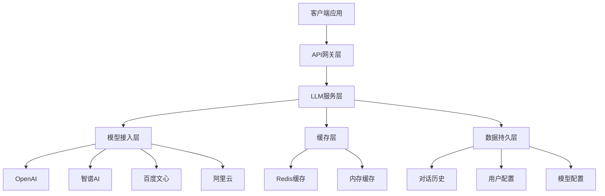
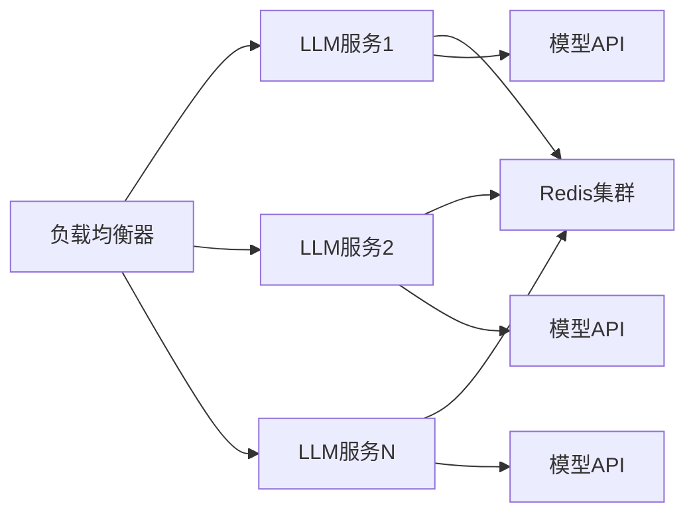

# YYC3 LLM AI服务开发规划路线图

> 📋 **文档版本**: v1.0.0 | **创建时间**: 2025-12-08 | **维护团队**: YYC3 AI Family

## 📖 项目概述

YYC3 LLM AI服务是YYC3 AI Family平台的核心AI能力组件，提供统一的大语言模型服务接口，支持多种AI模型接入和智能对话能力。

### 基本信息

- **服务名称**: YYC3 LLM AI Service
- **技术栈**: Python 3.9+ | FastAPI | OpenAI | Transformers | Redis
- **服务端口**: 6602 (生产) / 3002 (开发)
- **主要文件**: `main.py`, `server.js`, `requirements.txt`

## 🎯 开发目标与愿景

### 核心目标

1. **统一AI服务接口**: 为YYC3平台提供统一的AI能力接入
2. **多模型支持**: 支持OpenAI、智谱AI、百度文心等主流模型
3. **高性能处理**: 实现并发处理、流式响应、缓存优化
4. **智能对话**: 支持上下文管理、多轮对话、个性化回复
5. **成本优化**: 实现智能计费、用量统计、成本控制

### 技术愿景

- 构建企业级AI服务平台
- 实现模型热插拔和动态切换
- 提供可扩展的AI能力框架
- 支持私有化部署和数据安全

## 🏗️ 技术架构规划

### 架构层次



### 核心模块设计

#### 1. 模型管理器 (ModelManager)

```python
class ModelManager:
    """AI模型管理器"""

    def __init__(self):
        self.models = {}
        self.default_model = "openai-gpt-3.5-turbo"
        self.model_configs = {}

    async def load_model(self, model_name: str, config: dict):
        """加载AI模型"""
        pass

    async def switch_model(self, model_name: str):
        """切换AI模型"""
        pass

    async def get_model_capabilities(self, model_name: str):
        """获取模型能力"""
        pass
```

#### 2. 对话管理器 (ConversationManager)

```python
class ConversationManager:
    """对话管理器"""

    def __init__(self, redis_client):
        self.redis = redis_client
        self.max_context_length = 4000
        self.session_timeout = 3600

    async def create_session(self, user_id: str) -> str:
        """创建对话会话"""
        pass

    async def add_message(self, session_id: str, message: dict):
        """添加对话消息"""
        pass

    async def get_context(self, session_id: str) -> List[dict]:
        """获取对话上下文"""
        pass
```

#### 3. 流式处理器 (StreamProcessor)

```python
class StreamProcessor:
    """流式响应处理器"""

    async def generate_stream(self, prompt: str, model_name: str):
        """生成流式响应"""
        pass

    async def process_chunk(self, chunk: str, session_id: str):
        """处理响应块"""
        pass
```

## 📅 开发阶段规划

### 第一阶段：基础架构建设 (2周)

#### Week 1: 环境搭建和基础框架

**目标**: 完成开发环境搭建和基础服务框架

**任务清单**:

- [ ] **环境准备**
  - [x] Python 3.9+ 环境搭建
  - [ ] 虚拟环境配置 (venv/poetry)
  - [ ] 依赖包安装和锁定
  - [ ] Docker环境配置

- [ ] **基础框架**
  - [ ] FastAPI应用初始化
  - [ ] 基础路由和中间件配置
  - [ ] 日志系统集成
  - [ ] 异常处理机制

- [ ] **配置管理**
  - [ ] 环境变量配置
  - [ ] 模型配置文件
  - [ ] Redis连接配置
  - [ ] 数据库配置

**交付物**:

- 可运行的FastAPI应用
- 完整的环境配置文件
- 基础API文档

#### Week 2: 核心模块开发

**目标**: 完成核心功能模块开发

**任务清单**:

- [ ] **模型接入模块**
  - [ ] OpenAI API集成
  - [ ] 智谱AI API集成
  - [ ] 模型配置管理
  - [ ] 模型能力检测

- [ ] **对话管理模块**
  - [ ] 会话管理机制
  - [ ] 上下文存储和检索
  - [ ] 多轮对话支持
  - [ ] 会话过期清理

- [ ] **缓存系统**
  - [ ] Redis缓存配置
  - [ ] 模型响应缓存
  - [ ] 用户配置缓存
  - [ ] 缓存失效策略

**交付物**:

- 模型接入模块
- 对话管理模块
- 缓存系统

### 第二阶段：核心功能实现 (3周)

#### Week 3: 对话功能开发

**目标**: 实现完整的对话功能

**任务清单**:

- [ ] **对话API**
  - [ ] 单轮对话接口
  - [ ] 多轮对话接口
  - [ ] 流式响应接口
  - [ ] 对话历史接口

- [ ] **上下文管理**
  - [ ] 长对话上下文截断
  - [ ] 关键信息提取
  - [ ] 上下文压缩算法
  - [ ] 个性化上下文

- [ ] **响应格式化**
  - [ ] Markdown格式支持
  - [ ] 代码高亮显示
  - [ ] 结构化数据输出
  - [ ] 多媒体内容支持

**交付物**:

- 对话API接口
- 上下文管理系统
- 响应格式化功能

#### Week 4: 模型集成和优化

**目标**: 集成多种AI模型并优化性能

**任务清单**:

- [ ] **多模型集成**
  - [ ] 百度文心一言API
  - [ ] 阿里云通义千问API
  - [ ] 模型能力标准化
  - [ ] 模型切换机制

- [ ] **性能优化**
  - [ ] 异步处理优化
  - [ ] 并发控制
  - [ ] 资源池管理
  - [ ] 内存优化

- [ ] **流式处理**
  - [ ] Server-Sent Events实现
  - [ ] WebSocket支持
  - [ ] 流式缓存
  - [ ] 断线重连机制

**交付物**:

- 多模型集成
- 性能优化方案
- 流式处理功能

#### Week 5: 安全和监控

**目标**: 实现安全机制和监控体系

**任务清单**:

- [ ] **安全机制**
  - [ ] API认证和授权
  - [ ] 请求频率限制
  - [ ] 内容过滤机制
  - [ ] 敏感信息检测

- [ ] **监控系统**
  - [ ] 性能指标收集
  - [ ] 错误监控和报警
  - [ ] 使用统计
  - [ ] 健康检查

- [ ] **日志系统**
  - [ ] 结构化日志
  - [ ] 日志聚合和分析
  - [ ] 审计日志
  - [ ] 调试工具

**交付物**:

- 安全机制
- 监控系统
- 日志系统

### 第三阶段：高级功能开发 (2周)

#### Week 6: 智能化功能

**目标**: 实现智能化特性

**任务清单**:

- [ ] **智能路由**
  - [ ] 模型自动选择
  - ] 负载均衡
  - [ ] 故障转移
  - ] A/B测试

- [ ] **个性化**
  - [ ] 用户偏好学习
  - 个性化回复模板
  - ] 智能推荐
  - ] 习惯分析

- [ ] **知识库集成**
  - [ ] 向量数据库集成
  - [ ] RAG实现
  - [ ] 知识检索
  - [ ] 实时知识更新

**交付物**:

- 智能路由系统
- 个性化功能
- 知识库集成

#### Week 7: 测试和部署

**目标**: 完成测试和部署准备

**任务清单**:

- [ ] **测试体系**
  - [ ] 单元测试
  - [ ] 集成测试
  - [ ] 性能测试
  - [ ] 压力测试

- [ ] **部署配置**
  - [ ] Docker镜像构建
  - [ ] Kubernetes配置
  - [ ] 环境变量管理
  - ] CI/CD流水线

- [ ] **文档完善**
  - [ ] API文档生成
  - [ ] 部署文档
  - [ ] 运维手册
  - ] 故障排查指南

**交付物**:

- 完整测试套件
- 部署配置
- 项目文档

## 🔧 技术实现细节

### 核心技术栈

#### 后端框架

```python
# FastAPI + Uvicorn
fastapi==0.104.1
uvicorn[standard]==0.24.0
pydantic==2.5.0
```

#### AI模型集成

```python
# OpenAI和其他模型
openai==1.3.7
transformers==4.35.2
torch==2.1.1
zhipuai==2.0.1
```

#### 数据存储

```python
# Redis缓存和数据库
redis==5.0.1
asyncpg==0.29.0
sqlalchemy==2.0.23
```

#### 监控和日志

```python
# 监控和日志系统
prometheus-client==0.19.0
structlog==23.1.0
sentry-sdk==1.38.0
```

### 关键配置

#### 应用配置 (config.py)

```python
from pydantic import BaseSettings
from typing import List, Optional

class Settings(BaseSettings):
    # 应用配置
    app_name: str = "YYC3 LLM Service"
    app_version: str = "1.0.0"
    debug: bool = False

    # 服务配置
    host: str = "0.0.0.0"
    port: int = 6602

    # 数据库配置
    database_url: str
    redis_url: str

    # AI模型配置
    openai_api_key: str
    openai_base_url: str = "https://api.openai.com/v1"
    openai_models: List[str] = ["gpt-3.5-turbo", "gpt-4"]

    # 智谱AI配置
    zhipu_api_key: str
    zhipu_models: List[str] = ["chatglm_pro", "chatglm_std"]

    # 对话配置
    max_context_length: int = 4000
    session_timeout: int = 3600
    default_model: str = "openai-gpt-3.5-turbo"

    class Config:
        env_file = ".env"
        env_file_encoding = "utf-8"

settings = Settings()
```

#### 模型配置 (models.py)

```python
from typing import Dict, Any, List
from abc import ABC, abstractmethod

class BaseModel(ABC):
    """AI模型基类"""

    def __init__(self, config: Dict[str, Any]):
        self.config = config
        self.name = config.get("name")
        self.capabilities = config.get("capabilities", [])

    @abstractmethod
    async def generate(self, prompt: str, **kwargs) -> str:
        """生成文本"""
        pass

    @abstractmethod
    async def generate_stream(self, prompt: str, **kwargs):
        """流式生成"""
        pass

    @abstractmethod
    def get_model_info(self) -> Dict[str, Any]:
        """获取模型信息"""
        pass

class OpenAIModel(BaseModel):
    """OpenAI模型实现"""

    def __init__(self, config: Dict[str, Any]):
        super().__init__(config)
        self.client = openai.OpenAI(api_key=config["api_key"])

    async def generate(self, prompt: str, **kwargs) -> str:
        response = await self.client.chat.completions.create(
            model=self.name,
            messages=[{"role": "user", "content": prompt}],
            **kwargs
        )
        return response.choices[0].message.content

    async def generate_stream(self, prompt: str, **kwargs):
        stream = await self.client.chat.completions.create(
            model=self.name,
            messages=[{"role": "user", "content": prompt}],
            stream=True,
            **kwargs
        )
        async for chunk in stream:
            if chunk.choices[0].delta.content:
                yield chunk.choices[0].delta.content
```

## 📊 性能指标和目标

### 性能目标

| 指标 | 目标值 | 说明 |
|------|--------|------|
| 响应时间 | < 2秒 | 首字节响应 |
| 吞吐量 | 100 QPS | 并发处理能力 |
| 可用性 | 99.9% | 服务可用性 |
| 错误率 | < 0.1% | API错误率 |

### 资源要求

#### 最小配置

- CPU: 2核
- 内存: 4GB
- 存储: 20GB
- 网络: 100Mbps

#### 推荐配置

- CPU: 4核
- 内存: 8GB
- 存储: 50GB
- 网络: 1Gbps

### 扩展性设计

- 水平扩展: 支持多实例部署
- 垂直扩展: 支持GPU加速
- 缓存层: Redis集群
- 负载均衡: Nginx/HAProxy

## 🔒 安全和合规

### 安全措施

1. **API安全**: JWT认证、请求签名
2. **数据安全**: 敏感信息脱敏、数据加密
3. **访问控制**: 角色权限管理、IP白名单
4. **内容安全**: 内容过滤、违规检测

### 合规要求

1. **数据保护**: 遵循GDPR、CCPA
2. **AI伦理**: 负责任的AI使用
3. **审计日志**: 完整的操作记录
4. **隐私保护**: 用户数据隔离

## 🚀 部署和运维

### 部署架构



### 监控指标

- **系统指标**: CPU、内存、磁盘、网络
- **应用指标**: 请求量、响应时间、错误率
- **业务指标**: 对话数量、模型使用、成本统计

### 运维流程

1. **健康检查**: 自动化健康检查和报警
2. **日志监控**: 实时日志分析和报警
3. **性能优化**: 定期性能分析和调优
4. **安全扫描**: 定期安全漏洞扫描

## 📈 未来发展规划

### 短期目标 (3-6个月)

- 完成基础功能开发
- 实现多模型集成
- 建立监控体系
- 优化性能表现

### 中期目标 (6-12个月)

- 支持自定义模型训练
- 实现多模态AI能力
- 建立AI能力市场
- 扩展企业级功能

### 长期目标 (1-2年)

- 构建AI开发者生态
- 实现AI能力编排
- 支持边缘计算部署
- 建立行业标准

## 📞 团队协作

### 开发团队

- **后端开发**: Python/FastAPI专家
- **AI算法**: 机器学习工程师
- **DevOps**: 云原生工程师
- **产品经理**: AI产品专家

### 协作流程

1. **需求分析**: 产品需求评审
2. **技术设计**: 架构设计评审
3. **开发实现**: 敏捷开发流程
4. **测试验证**: 自动化测试
5. **部署上线**: CI/CD流水线

## 📋 风险评估

### 技术风险

- **模型API限制**: 第三方API依赖
- **性能瓶颈**: 大规模并发处理
- **数据安全**: 敏感信息保护

### 业务风险

- **成本控制**: API调用费用
- **用户体验**: 响应时间和稳定性
- **合规要求**: AI伦理和法规

### 缓解措施

- 多模型备选方案
- 性能监控和优化
- 安全机制和审计
- 成本控制和监控

---

<div align="center">

**[⬆️ 回到顶部](#yyc3-llm-ai服务开发规划路线图)**

Made with ❤️ by YYC3 AI Family Team

**言启象限，语枢智能** 🤖

</div>
