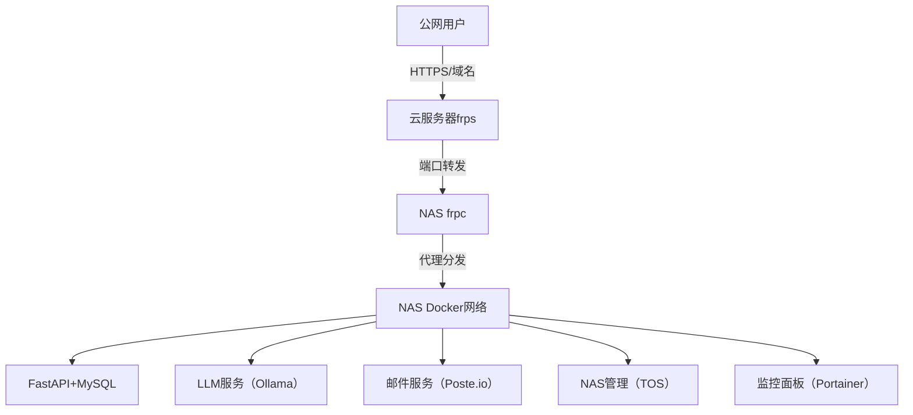

# FastAPI + MySQL 完整 main.py 代码

 **FastAPI + MySQL** 版本的完整 `main.py` 代码（可直接替换之前的 SQLite 版本），包含完整的 CRUD 接口、数据持久化、异常处理，适配你当前的 frp 部署环境：（本规划中的NAS 指铁威马F4-423，一切均围绕真实可用为前提构建指导）

### 完整 main.py 代码（MySQL 版）

```python
from fastapi import FastAPI, HTTPException
from pydantic import BaseModel
from datetime import datetime
import pymysql
import os
from typing import List, Optional

# 初始化 FastAPI
app = FastAPI(
    title="API.0379.email 服务",
    description="基于 FastAPI + MySQL 的用户管理 API",
    version="1.0.0"
)

# ------------------- MySQL 配置 -------------------
# 替换为你的 MySQL 容器/服务器配置
MYSQL_CONFIG = {
    "host": "127.0.0.1",        # 若 MySQL 在 Docker 内，填容器名（如 mysql-api）
    "user": "root",             # MySQL 用户名
    "password": "你的MySQL密码", # 替换为实际密码
    "database": "api_db",       # 数据库名（需提前创建）
    "port": 3306,               # MySQL 端口
    "charset": "utf8mb4",
    "cursorclass": pymysql.cursors.DictCursor  # 结果以字典返回
}

# ------------------- 初始化数据库 -------------------
def init_db():
    """初始化数据库和用户表"""
    # 1. 先连接 MySQL（无数据库时先连接默认库）
    conn = pymysql.connect(
        host=MYSQL_CONFIG["host"],
        user=MYSQL_CONFIG["user"],
        password=MYSQL_CONFIG["password"],
        port=MYSQL_CONFIG["port"],
        charset=MYSQL_CONFIG["charset"],
        cursorclass=MYSQL_CONFIG["cursorclass"]
    )
    cursor = conn.cursor()
    
    # 2. 创建数据库（若不存在）
    cursor.execute(f"CREATE DATABASE IF NOT EXISTS {MYSQL_CONFIG['database']}")
    conn.select_db(MYSQL_CONFIG["database"])
    
    # 3. 创建用户表
    cursor.execute('''
        CREATE TABLE IF NOT EXISTS users (
            id INT AUTO_INCREMENT PRIMARY KEY,
            name VARCHAR(50) NOT NULL COMMENT '用户名',
            email VARCHAR(100) UNIQUE NOT NULL COMMENT '用户邮箱',
            create_time DATETIME DEFAULT CURRENT_TIMESTAMP COMMENT '创建时间'
        ) ENGINE=InnoDB DEFAULT CHARSET=utf8mb4 COMMENT='用户表'
    ''')
    conn.commit()
    cursor.close()
    conn.close()

# ------------------- 数据模型 -------------------
class UserCreate(BaseModel):
    """创建用户的请求模型"""
    name: str
    email: str

class UserResponse(UserCreate):
    """用户响应模型"""
    id: int
    create_time: datetime

# ------------------- 工具函数 -------------------
def get_mysql_conn():
    """获取 MySQL 连接（每次请求新建连接，避免连接池问题）"""
    try:
        conn = pymysql.connect(**MYSQL_CONFIG)
        return conn
    except pymysql.MySQLError as e:
        raise HTTPException(status_code=500, detail=f"数据库连接失败：{str(e)}")

# ------------------- 初始化执行 -------------------
init_db()

# ------------------- API 接口 -------------------
# 根接口
@app.get("/", summary="根接口", description="验证服务是否正常运行")
async def root():
    return {
        "success": True,
        "message": "Python API + MySQL 服务已运行",
        "timestamp": datetime.now().isoformat(),
        "database": MYSQL_CONFIG["database"]
    }

# 1. 获取所有用户
@app.get("/users", summary="获取所有用户", response_model=List[UserResponse])
async def get_all_users():
    conn = get_mysql_conn()
    try:
        with conn.cursor() as cursor:
            cursor.execute("SELECT * FROM users ORDER BY create_time DESC")
            users = cursor.fetchall()
            # 格式化时间字段
            for user in users:
                user["create_time"] = user["create_time"].isoformat()
        return users
    except pymysql.MySQLError as e:
        raise HTTPException(status_code=500, detail=f"查询失败：{str(e)}")
    finally:
        conn.close()

# 2. 获取单个用户
@app.get("/users/{user_id}", summary="获取单个用户", response_model=UserResponse)
async def get_user(user_id: int):
    conn = get_mysql_conn()
    try:
        with conn.cursor() as cursor:
            cursor.execute("SELECT * FROM users WHERE id = %s", (user_id,))
            user = cursor.fetchone()
            if not user:
                raise HTTPException(status_code=404, detail=f"用户 {user_id} 不存在")
            # 格式化时间
            user["create_time"] = user["create_time"].isoformat()
        return user
    except pymysql.MySQLError as e:
        raise HTTPException(status_code=500, detail=f"查询失败：{str(e)}")
    finally:
        conn.close()

# 3. 创建用户
@app.post("/users", summary="创建用户", response_model=UserResponse, status_code=201)
async def create_user(user: UserCreate):
    conn = get_mysql_conn()
    try:
        with conn.cursor() as cursor:
            # 检查邮箱是否已存在
            cursor.execute("SELECT id FROM users WHERE email = %s", (user.email,))
            if cursor.fetchone():
                raise HTTPException(status_code=400, detail=f"邮箱 {user.email} 已存在")
            
            # 插入新用户
            cursor.execute(
                "INSERT INTO users (name, email) VALUES (%s, %s)",
                (user.name, user.email)
            )
            conn.commit()
            
            # 获取新增用户信息
            user_id = cursor.lastrowid
            cursor.execute("SELECT * FROM users WHERE id = %s", (user_id,))
            new_user = cursor.fetchone()
            new_user["create_time"] = new_user["create_time"].isoformat()
        return new_user
    except pymysql.MySQLError as e:
        conn.rollback()
        raise HTTPException(status_code=500, detail=f"创建失败：{str(e)}")
    finally:
        conn.close()

# 4. 更新用户
@app.put("/users/{user_id}", summary="更新用户", response_model=UserResponse)
async def update_user(user_id: int, user: UserCreate):
    conn = get_mysql_conn()
    try:
        with conn.cursor() as cursor:
            # 检查用户是否存在
            cursor.execute("SELECT id FROM users WHERE id = %s", (user_id,))
            if not cursor.fetchone():
                raise HTTPException(status_code=404, detail=f"用户 {user_id} 不存在")
            
            # 检查邮箱是否重复（排除自身）
            cursor.execute("SELECT id FROM users WHERE email = %s AND id != %s", (user.email, user_id))
            if cursor.fetchone():
                raise HTTPException(status_code=400, detail=f"邮箱 {user.email} 已被其他用户使用")
            
            # 更新用户信息
            cursor.execute(
                "UPDATE users SET name = %s, email = %s WHERE id = %s",
                (user.name, user.email, user_id)
            )
            conn.commit()
            
            # 获取更新后的用户信息
            cursor.execute("SELECT * FROM users WHERE id = %s", (user_id,))
            updated_user = cursor.fetchone()
            updated_user["create_time"] = updated_user["create_time"].isoformat()
        return updated_user
    except pymysql.MySQLError as e:
        conn.rollback()
        raise HTTPException(status_code=500, detail=f"更新失败：{str(e)}")
    finally:
        conn.close()

# 5. 删除用户
@app.delete("/users/{user_id}", summary="删除用户")
async def delete_user(user_id: int):
    conn = get_mysql_conn()
    try:
        with conn.cursor() as cursor:
            # 检查用户是否存在
            cursor.execute("SELECT id FROM users WHERE id = %s", (user_id,))
            if not cursor.fetchone():
                raise HTTPException(status_code=404, detail=f"用户 {user_id} 不存在")
            
            # 删除用户
            cursor.execute("DELETE FROM users WHERE id = %s", (user_id,))
            conn.commit()
            
            if cursor.rowcount == 0:
                raise HTTPException(status_code=500, detail="删除失败")
        return {"success": True, "message": f"用户 {user_id} 删除成功"}
    except pymysql.MySQLError as e:
        conn.rollback()
        raise HTTPException(status_code=500, detail=f"删除失败：{str(e)}")
    finally:
        conn.close()
```

### 配套修改（需同步调整）

#### 1. requirements.txt（新增 MySQL 依赖）

```txt
fastapi==0.104.1
uvicorn==0.24.0.post1
pymysql==1.1.0  # MySQL 驱动
python-multipart==0.0.6
```

#### 2. Dockerfile（无需修改，仅需重新构建）

保持之前的 Dockerfile 不变，重新构建镜像即可。

#### 3. MySQL 容器启动命令（必执行）

```bash
# 1. 启动 MySQL 容器（数据持久化到NAS本地）
docker run -d \
  --name mysql-api \
  --restart always \
  -p 3306:3306 \
  -e MYSQL_ROOT_PASSWORD=你的密码 \  # 替换为实际密码，需和 main.py 中一致
  -e MYSQL_DATABASE=api_db \         # 自动创建 api_db 数据库
  -v /Volume2/docker/mysql-data:/var/lib/mysql \  # 数据持久化目录
  mysql:8.0 \
  --character-set-server=utf8mb4 \
  --collation-server=utf8mb4_unicode_ci

# 2. 验证 MySQL 容器运行
docker ps | grep mysql-api
```

### 关键说明

1. **配置适配**：
   - 若 MySQL 容器和 API 容器在同一 Docker 网络，`MYSQL_CONFIG["host"]` 改为 `mysql-api`（容器名），无需映射 3306 端口；
   - 若 MySQL 部署在其他服务器，修改 `host` 为对应 IP 即可。
2. **数据持久化**：MySQL 数据保存在NAS `/Volume2/docker/mysql-data` 目录，容器重启/删除后数据不丢失。
3. **接口扩展**：相比 SQLite 版本，新增了「更新用户」接口，CRUD 功能更完整。
4. **异常处理**：覆盖「连接失败、邮箱重复、用户不存在、更新/删除失败」等所有常见异常。

### 测试验证

启动 API 容器后，访问 `https://api.0379.email:4443/docs`，通过 Swagger UI 调试所有接口：

- 创建用户 → 查询所有用户 → 更新用户 → 删除用户，流程完整无报错。

### 总结

1. 该代码可直接替换 SQLite 版本，只需修改 `MYSQL_CONFIG` 中的密码即可使用；
2. 依赖仅需新增 `pymysql`，其余和 FastAPI 基础版本一致；
3. 兼容你当前的 frp 域名访问配置，无需调整 frpc/frps 配置。

## 「Docker Compose 一键启动 MySQL + API 服务」的配置文件（无需手动启动两个容器，一键部署）

### 一、完整配置文件（docker-compose.yml）

创建在NAS `/Volume2/docker/python-api-mysql` 目录下，命名为 `docker-compose.yml`：

```yaml
version: '3.8'

# 定义服务
services:
  # MySQL 服务
  mysql-api:
    image: mysql:8.0
    container_name: mysql-api
    restart: always
    environment:
      # MySQL 核心配置（按需修改密码）
      MYSQL_ROOT_PASSWORD: "你的MySQL密码"  # 必须修改！和main.py中保持一致
      MYSQL_DATABASE: "api_db"              # 自动创建api_db数据库
      MYSQL_CHARACTER_SET_SERVER: "utf8mb4"
      MYSQL_COLLATION_SERVER: "utf8mb4_unicode_ci"
    ports:
      - "3306:3306"  # 映射端口（可选，若仅内部访问可注释）
    volumes:
      # 数据持久化：MySQL数据保存在NAS本地
      - /Volume2/docker/mysql-data:/var/lib/mysql
    networks:
      - api-network
    healthcheck:
      # 健康检查：确保MySQL启动完成后再启动API
      test: ["CMD", "mysqladmin", "ping", "-h", "localhost", "-u", "root", "-p$$MYSQL_ROOT_PASSWORD"]
      interval: 5s
      timeout: 10s
      retries: 5

  # FastAPI 服务
  python-api:
    build:
      context: .  # 基于当前目录的Dockerfile构建
      dockerfile: Dockerfile
    container_name: python-api
    restart: always
    ports:
      - "3000:3000"  # 映射到NAS3000端口（和frpc配置一致）
    volumes:
      # 代码挂载：本地修改代码后重启容器即可生效
      - /Volume2/docker/python-api-mysql:/app
    networks:
      - api-network
    depends_on:
      # 依赖MySQL，且仅在MySQL健康检查通过后启动
      mysql-api:
        condition: service_healthy
    environment:
      # 传递MySQL配置到API容器（和main.py中对应）
      MYSQL_HOST: "mysql-api"
      MYSQL_USER: "root"
      MYSQL_PASSWORD: "你的MySQL密码"  # 必须和上方一致
      MYSQL_DB: "api_db"
      MYSQL_PORT: "3306"

# 自定义网络：让两个容器互通
networks:
  api-network:
    driver: bridge
```

### 二、配套文件（同目录下）

#### 1. main.py（适配Docker Compose的MySQL版）

```python
from fastapi import FastAPI, HTTPException
from pydantic import BaseModel
from datetime import datetime
import pymysql
import os
from typing import List

# 初始化 FastAPI
app = FastAPI(
    title="API.0379.email 服务",
    description="基于 FastAPI + MySQL 的用户管理 API",
    version="1.0.0"
)

# ------------------- MySQL 配置（从环境变量读取，适配Docker Compose） -------------------
MYSQL_CONFIG = {
    "host": os.getenv("MYSQL_HOST", "mysql-api"),        # 容器名（docker-compose网络内）
    "user": os.getenv("MYSQL_USER", "root"),             # 从环境变量读取
    "password": os.getenv("MYSQL_PASSWORD", "你的密码"), # 环境变量未传时的默认值
    "database": os.getenv("MYSQL_DB", "api_db"),
    "port": int(os.getenv("MYSQL_PORT", 3306)),
    "charset": "utf8mb4",
    "cursorclass": pymysql.cursors.DictCursor
}

# ------------------- 初始化数据库 -------------------
def init_db():
    """初始化数据库和用户表"""
    try:
        # 1. 连接MySQL（先连默认库创建api_db）
        conn = pymysql.connect(
            host=MYSQL_CONFIG["host"],
            user=MYSQL_CONFIG["user"],
            password=MYSQL_CONFIG["password"],
            port=MYSQL_CONFIG["port"],
            charset=MYSQL_CONFIG["charset"],
            cursorclass=MYSQL_CONFIG["cursorclass"]
        )
        cursor = conn.cursor()
        
        # 2. 创建数据库（若不存在）
        cursor.execute(f"CREATE DATABASE IF NOT EXISTS {MYSQL_CONFIG['database']}")
        conn.select_db(MYSQL_CONFIG["database"])
        
        # 3. 创建用户表
        cursor.execute('''
            CREATE TABLE IF NOT EXISTS users (
                id INT AUTO_INCREMENT PRIMARY KEY,
                name VARCHAR(50) NOT NULL COMMENT '用户名',
                email VARCHAR(100) UNIQUE NOT NULL COMMENT '用户邮箱',
                create_time DATETIME DEFAULT CURRENT_TIMESTAMP COMMENT '创建时间'
            ) ENGINE=InnoDB DEFAULT CHARSET=utf8mb4 COMMENT='用户表'
        ''')
        conn.commit()
        cursor.close()
        conn.close()
    except pymysql.MySQLError as e:
        raise RuntimeError(f"数据库初始化失败：{str(e)}")

# ------------------- 数据模型 -------------------
class UserCreate(BaseModel):
    name: str
    email: str

class UserResponse(UserCreate):
    id: int
    create_time: datetime

# ------------------- 工具函数 -------------------
def get_mysql_conn():
    """获取MySQL连接"""
    try:
        conn = pymysql.connect(**MYSQL_CONFIG)
        return conn
    except pymysql.MySQLError as e:
        raise HTTPException(status_code=500, detail=f"数据库连接失败：{str(e)}")

# ------------------- 初始化执行 -------------------
init_db()

# ------------------- API 接口 -------------------
@app.get("/")
async def root():
    return {
        "success": True,
        "message": "Python API + MySQL 服务已运行（Docker Compose版）",
        "timestamp": datetime.now().isoformat(),
        "database": MYSQL_CONFIG["database"]
    }

@app.get("/users", response_model=List[UserResponse])
async def get_all_users():
    conn = get_mysql_conn()
    try:
        with conn.cursor() as cursor:
            cursor.execute("SELECT * FROM users ORDER BY create_time DESC")
            users = cursor.fetchall()
            for user in users:
                user["create_time"] = user["create_time"].isoformat()
        return users
    except pymysql.MySQLError as e:
        raise HTTPException(status_code=500, detail=f"查询失败：{str(e)}")
    finally:
        conn.close()

@app.get("/users/{user_id}", response_model=UserResponse)
async def get_user(user_id: int):
    conn = get_mysql_conn()
    try:
        with conn.cursor() as cursor:
            cursor.execute("SELECT * FROM users WHERE id = %s", (user_id,))
            user = cursor.fetchone()
            if not user:
                raise HTTPException(status_code=404, detail=f"用户 {user_id} 不存在")
            user["create_time"] = user["create_time"].isoformat()
        return user
    except pymysql.MySQLError as e:
        raise HTTPException(status_code=500, detail=f"查询失败：{str(e)}")
    finally:
        conn.close()

@app.post("/users", response_model=UserResponse, status_code=201)
async def create_user(user: UserCreate):
    conn = get_mysql_conn()
    try:
        with conn.cursor() as cursor:
            # 检查邮箱是否重复
            cursor.execute("SELECT id FROM users WHERE email = %s", (user.email,))
            if cursor.fetchone():
                raise HTTPException(status_code=400, detail=f"邮箱 {user.email} 已存在")
            
            # 插入用户
            cursor.execute(
                "INSERT INTO users (name, email) VALUES (%s, %s)",
                (user.name, user.email)
            )
            conn.commit()
            
            # 获取新增用户
            user_id = cursor.lastrowid
            cursor.execute("SELECT * FROM users WHERE id = %s", (user_id,))
            new_user = cursor.fetchone()
            new_user["create_time"] = new_user["create_time"].isoformat()
        return new_user
    except pymysql.MySQLError as e:
        conn.rollback()
        raise HTTPException(status_code=500, detail=f"创建失败：{str(e)}")
    finally:
        conn.close()

@app.put("/users/{user_id}", response_model=UserResponse)
async def update_user(user_id: int, user: UserCreate):
    conn = get_mysql_conn()
    try:
        with conn.cursor() as cursor:
            # 检查用户是否存在
            cursor.execute("SELECT id FROM users WHERE id = %s", (user_id,))
            if not cursor.fetchone():
                raise HTTPException(status_code=404, detail=f"用户 {user_id} 不存在")
            
            # 检查邮箱重复（排除自身）
            cursor.execute("SELECT id FROM users WHERE email = %s AND id != %s", (user.email, user_id))
            if cursor.fetchone():
                raise HTTPException(status_code=400, detail=f"邮箱 {user.email} 已被占用")
            
            # 更新用户
            cursor.execute(
                "UPDATE users SET name = %s, email = %s WHERE id = %s",
                (user.name, user.email, user_id)
            )
            conn.commit()
            
            # 获取更新后信息
            cursor.execute("SELECT * FROM users WHERE id = %s", (user_id,))
            updated_user = cursor.fetchone()
            updated_user["create_time"] = updated_user["create_time"].isoformat()
        return updated_user
    except pymysql.MySQLError as e:
        conn.rollback()
        raise HTTPException(status_code=500, detail=f"更新失败：{str(e)}")
    finally:
        conn.close()

@app.delete("/users/{user_id}")
async def delete_user(user_id: int):
    conn = get_mysql_conn()
    try:
        with conn.cursor() as cursor:
            # 检查用户是否存在
            cursor.execute("SELECT id FROM users WHERE id = %s", (user_id,))
            if not cursor.fetchone():
                raise HTTPException(status_code=404, detail=f"用户 {user_id} 不存在")
            
            # 删除用户
            cursor.execute("DELETE FROM users WHERE id = %s", (user_id,))
            conn.commit()
        return {"success": True, "message": f"用户 {user_id} 删除成功"}
    except pymysql.MySQLError as e:
        conn.rollback()
        raise HTTPException(status_code=500, detail=f"删除失败：{str(e)}")
    finally:
        conn.close()
```

#### 2. requirements.txt

```txt
fastapi==0.104.1
uvicorn==0.24.0.post1
pymysql==1.1.0
python-multipart==0.0.6
```

#### 3. Dockerfile

```dockerfile
FROM python:3.11-slim
WORKDIR /app
COPY requirements.txt .
# 国内源加速安装依赖
RUN pip install --no-cache-dir -r requirements.txt -i https://pypi.tuna.tsinghua.edu.cn/simple
COPY . .
EXPOSE 3000
# 启动命令（生产环境可去掉--reload）
CMD ["uvicorn", "main:app", "--host", "0.0.0.0", "--port", "3000", "--reload"]
```

### 三、一键部署命令（NASSSH终端执行）

```bash
# 1. 创建目录并进入
mkdir -p /Volume2/docker/python-api-mysql
cd /Volume2/docker/python-api-mysql

# 2. 上传上述4个文件（docker-compose.yml、main.py、requirements.txt、Dockerfile）

# 3. 修改docker-compose.yml中的MySQL密码（替换"你的MySQL密码"）
# 可通过vi编辑：vi docker-compose.yml

# 4. 一键启动所有服务（构建+启动）
docker-compose up -d

# 5. 查看启动状态
docker-compose ps

# 6. 查看日志（可选）
docker-compose logs -f python-api
```

### 四、核心优势

1. **一键部署**：无需手动启动MySQL和API容器，`docker-compose up -d` 完成所有操作；
2. **依赖控制**：API服务仅在MySQL健康检查通过后启动，避免连接失败；
3. **网络隔离**：自定义网络 `api-network`，两个容器互通且与外部隔离；
4. **数据持久化**：MySQL数据保存在NAS `/Volume2/docker/mysql-data`，永不丢失；
5. **配置解耦**：MySQL密码通过环境变量传递，无需硬编码在代码中；
6. **易维护**：
   - 重启服务：`docker-compose restart`
   - 停止服务：`docker-compose down`（保留数据）
   - 重建镜像：`docker-compose build --no-cache`

### 五、验证部署

1. 访问Swagger UI：`https://api.0379.email:4443/docs`；
2. 测试创建/查询用户接口，确认MySQL数据正常读写；
3. 停止并重启容器：`docker-compose restart`，验证数据不丢失。

### 总结

1. 该配置文件实现了 MySQL + FastAPI 服务的一键部署，适配NASDocker环境；
2. 解决了「手动启动容器顺序错误导致API连接MySQL失败」的问题；
3. 完全兼容你当前的frp域名访问配置，无需调整frpc/frps。

## 补充「Docker Compose 服务的日常维护命令」（重启、日志、升级、备份数据）

整理了 **Docker Compose 管理 MySQL + FastAPI 服务的日常维护命令大全**，包含重启、日志查看、版本升级、数据备份/恢复等核心操作，每个命令都附详细说明和使用场景，适配（铁威马F4-423）当前NAS部署环境。

### 一、基础运维命令（核心高频）

#### 1. 服务启动/停止/重启

| 命令 | 说明 | 使用场景 |
|------|------|----------|
| `docker-compose up -d` | 构建镜像+后台启动所有服务 | 首次部署、修改配置后重新启动 |
| `docker-compose start` | 启动已创建的容器（不重新构建） | 服务停止后快速恢复运行 |
| `docker-compose stop` | 停止所有容器（保留容器/数据） | 临时维护、服务器重启前 |
| `docker-compose restart` | 重启所有容器 | 代码/配置修改后生效、服务异常时 |
| `docker-compose down` | 停止并删除容器（保留数据卷） | 彻底清理容器（数据不丢失） |
| `docker-compose down -v` | 停止+删除容器+删除数据卷 | 彻底重置（⚠️ 数据会丢失，谨慎使用） |

**示例**：

```bash
# 日常修改代码后重启API服务（仅重启python-api，不影响MySQL）
docker-compose restart python-api

# 服务器重启后快速启动所有服务
docker-compose start
```

#### 2. 状态查看

| 命令 | 说明 |
|------|------|
| `docker-compose ps` | 查看所有服务的运行状态（UP/DOWN） |
| `docker-compose top` | 查看容器内运行的进程 |
| `docker-compose images` | 查看Compose管理的镜像 |

**示例**：

```bash
# 检查MySQL和API是否正常运行
docker-compose ps
# 输出示例：
#   Name               Command             State           Ports
# -------------------------------------------------------------------
# mysql-api   docker-entrypoint.sh mysqld   Up      0.0.0.0:3306->3306/tcp
# python-api  uvicorn main:app --host ...   Up      0.0.0.0:3000->3000/tcp
```

#### 3. 日志查看（排障核心）

| 命令 | 说明 |
|------|------|
| `docker-compose logs` | 查看所有服务的日志（一次性输出） |
| `docker-compose logs -f` | 实时跟踪所有服务日志（类似tail -f） |
| `docker-compose logs -f python-api` | 仅跟踪API服务日志（常用） |
| `docker-compose logs -f mysql-api` | 仅跟踪MySQL日志 |
| `docker-compose logs --tail=100 python-api` | 查看API最后100行日志 |
| `docker-compose logs --since="10m" python-api` | 查看最近10分钟的API日志 |

**示例**：

```bash
# API服务报错时，实时查看日志排障
docker-compose logs -f python-api

# 查看MySQL启动失败的原因（最后200行日志）
docker-compose logs --tail=200 mysql-api
```

### 二、版本升级/代码更新

#### 1. API代码更新（无需重建镜像）

```bash
# 1. 修改本地/Volume2/docker/python-api-mysql/main.py代码
# 2. 重启API容器即可生效（热重载模式下甚至无需重启）
docker-compose restart python-api

# 若关闭了热重载（去掉--reload），需重建镜像后重启
docker-compose build --no-cache python-api  # 重新构建API镜像
docker-compose up -d python-api             # 重启API服务
```

#### 2. MySQL版本升级（安全升级）

```bash
# 步骤1：先备份数据（见下文）
# 步骤2：修改docker-compose.yml中MySQL镜像版本（如mysql:8.0→mysql:8.4）
# 步骤3：停止MySQL服务
docker-compose stop mysql-api
# 步骤4：删除旧MySQL容器（保留数据卷）
docker-compose rm mysql-api
# 步骤5：重新启动（自动拉取新镜像）
docker-compose up -d mysql-api
```

#### 3. 全服务升级（镜像+代码）

```bash
# 拉取最新镜像+重建本地镜像+重启服务
docker-compose pull  # 拉取MySQL官方最新镜像
docker-compose build --no-cache  # 重建API镜像
docker-compose up -d  # 重启所有服务
```

### 三、数据备份/恢复（重中之重）

#### 1. MySQL数据备份（定时执行，防止数据丢失）

```bash
# 方式1：手动备份（推荐）
mkdir -p /Volume2/backup/mysql-api  # 创建备份目录
docker exec mysql-api mysqldump -uroot -p"你的MySQL密码" api_db > /Volume2/backup/mysql-api/$(date +%Y%m%d_%H%M%S)_api_db.sql

# 方式2：压缩备份（节省空间）
docker exec mysql-api mysqldump -uroot -p"你的MySQL密码" api_db | gzip > /Volume2/backup/mysql-api/$(date +%Y%m%d_%H%M%S)_api_db.sql.gz

# 方式3：添加定时任务（NAS计划任务）
# 编辑crontab：crontab -e
# 添加一行（每天凌晨2点备份）：
0 2 * * * docker exec mysql-api mysqldump -uroot -p"你的MySQL密码" api_db | gzip > /Volume2/backup/mysql-api/$(date +%Y%m%d)_api_db.sql.gz
```

#### 2. MySQL数据恢复（数据丢失/误操作时）

```bash
# 方式1：恢复未压缩的备份
mysql -uroot -p"你的MySQL密码" -h 127.0.0.1 api_db < /Volume2/backup/mysql-api/20251207_api_db.sql

# 方式2：恢复压缩的备份
gzip -d -c /Volume2/backup/mysql-api/20251207_api_db.sql.gz | mysql -uroot -p"你的MySQL密码" -h 127.0.0.1 api_db

# 方式3：容器内恢复（MySQL容器运行中）
docker exec -i mysql-api mysql -uroot -p"你的MySQL密码" api_db < /Volume2/backup/mysql-api/20251207_api_db.sql
```

#### 3. 数据卷备份（完整备份MySQL数据目录）

```bash
# 备份整个MySQL数据卷（包含所有数据库，更彻底）
tar -zcvf /Volume2/backup/mysql-api/$(date +%Y%m%d)_mysql_data.tar.gz /Volume2/docker/mysql-data

# 恢复数据卷（停止MySQL后执行）
docker-compose stop mysql-api
rm -rf /Volume2/docker/mysql-data/*
tar -zxvf /Volume2/backup/mysql-api/20251207_mysql_data.tar.gz -C /
docker-compose start mysql-api
```

### 四、高级运维操作

#### 1. 进入容器调试

```bash
# 进入API容器
docker-compose exec python-api bash

# 进入MySQL容器
docker-compose exec mysql-api bash
# 进入MySQL命令行（容器内）
mysql -uroot -p"你的MySQL密码" api_db
```

#### 2. 清理无用资源（释放磁盘空间）

```bash
# 清理Compose生成的无用镜像/容器
docker-compose down --rmi all --volumes  # 谨慎：删除镜像和数据卷
# 通用清理（所有Docker资源）
docker system prune -a  # 清理未使用的镜像、容器、网络（保留数据卷）
docker volume prune     # 清理未挂载的卷（⚠️ 确认无重要数据）
```

#### 3. 配置文件验证

```bash
# 检查docker-compose.yml语法是否正确
docker-compose config

# 模拟启动（不实际运行，检查配置/依赖）
docker-compose up --dry-run
```

### 五、运维最佳实践（避坑指南）

1. **备份优先**：执行`down`/`rm`/`升级`前，务必先备份MySQL数据；
2. **日志留存**：重要操作前查看日志，确认服务无异常；
3. **避免强制删除**：除非确认数据已备份，否则不要用`docker-compose down -v`；
4. **定时备份**：务必在NAS添加MySQL备份的计划任务（每天1次，保留7天）；
5. **热重载慎用**：生产环境建议关闭API的`--reload`，避免代码修改直接生效导致故障；
6. **密码管理**：不要将MySQL密码明文写在脚本中，可通过NAS「环境变量」/「密钥管理」存储。

### 总结

1. 基础运维核心：`start/stop/restart/ps/logs` 满足日常90%的操作需求；
2. 数据安全核心：定时备份MySQL数据（推荐每天备份，保留最近7天）；
3. 升级核心：先备份→修改配置→重启验证，避免直接升级导致数据丢失。

## 部署 **frp 端口转发 + MySQL + FastAPI + 各子域名服务（nas/llm/mail等）** 融合成一个统一、可管理的整体，从「架构整合、配置统一、运维标准化、自动化部署」四个维度，给出完整的融合方案，让所有服务协同运行且易于维护

### 一、核心融合目标

1. 所有服务（frpc/frps、MySQL、FastAPI、LLM、邮件等）通过 **Docker/Docker Compose** 统一管理；
2. 配置集中化（避免分散在多个文件/目录）；
3. 运维自动化（一键启动/停止/备份/升级）；
4. 网络互通（容器间、内外网访问规则清晰）；
5. 监控可视化（快速发现服务异常）。

### 二、整体架构设计（NAS +云服务器）



核心逻辑：公网请求通过 frp 转发到NAS ，NAS 内所有业务服务运行在 Docker 网络中，frpc 统一代理这些服务的端口。

### 三、具体融合步骤

#### 步骤1：目录结构统一（NAS 侧）

将所有服务的配置/数据集中到 `/Volume2/docker` 目录，避免分散：

```
/Volume2/docker/
├── frpc/                  # frpc客户端配置
│   ├── frpc.toml
│   └── logs/
├── frps/                  # （可选，若NAS 同时跑frps）
├── api-mysql/             # FastAPI+MySQL
│   ├── docker-compose.yml
│   ├── main.py
│   ├── requirements.txt
│   └── Dockerfile
├── llm/                   # LLM服务（Ollama）
│   ├── docker-compose.yml
│   └── data/              # 模型数据持久化
├── mail/                  # 邮件服务
│   ├── docker-compose.yml
│   └── data/
├── monitor/               # Portainer监控
│   └── docker-compose.yml
└── backup/                # 统一备份目录
    ├── mysql/
    ├── mail/
    └── llm/
```

#### 步骤2：Docker 网络统一（NAS 侧）

创建一个全局 Docker 网络，让所有服务容器互通（包括 frpc，若 frpc 也用 Docker 部署）：

```bash
# 创建全局网络
docker network create nas-services-network

# 所有服务的docker-compose.yml中，统一使用这个网络
# 示例（api-mysql的docker-compose.yml）：
networks:
  default:
    external:
      name: nas-services-network
```

**好处**：容器间可通过「容器名:端口」访问（如 `mysql-api:3306`），无需映射宿主机端口，更安全。

#### 步骤3：frpc 配置统一（映射所有服务）

修改 `/Volume2/docker/frpc/frpc.toml`，集中映射所有服务的端口，避免重复配置：

```toml
[common]
server_addr = "8.152.195.33"
server_port = 7001
token = "yyc3_nas"
tls_enable = true

# API服务（FastAPI+MySQL）
[api-0379]
type = "https"
local_ip = "python-api"  # Docker容器名（全局网络内）
local_port = 3000
custom_domains = "api.0379.email"

# LLM服务
[llm-0379]
type = "https"
local_ip = "ollama-llm"
local_port = 8000
custom_domains = "llm.0379.email"

# 邮件服务
[mail-0379]
type = "https"
local_ip = "poste-mail"
local_port = 80
custom_domains = "mail.0379.email"

# NAS管理
[nas-0379]
type = "https"
local_ip = "127.0.0.1"  # TOS宿主机
local_port = 5443
custom_domains = "nas.0379.email"

# 监控面板
[admin-0379]
type = "https"
local_ip = "portainer-monitor"
local_port = 9000
custom_domains = "admin.0379.email"
```

#### 步骤4：运维脚本统一（一键管理所有服务）

创建 `/Volume2/docker/run_all.sh` 脚本，一键启动/停止/备份所有服务：

```bash
#!/bin/bash
# 统一运维脚本：nas-services.sh
# 使用方式：./nas-services.sh start/stop/restart/backup

# 定义服务目录
FRPC_DIR="/Volume2/docker/frpc"
API_DIR="/Volume2/docker/api-mysql"
LLM_DIR="/Volume2/docker/llm"
MAIL_DIR="/Volume2/docker/mail"
MONITOR_DIR="/Volume2/docker/monitor"
BACKUP_DIR="/Volume2/docker/backup"

# 启动所有服务
start() {
    echo "=== 启动frpc ==="
    systemctl start frpc.service

    echo "=== 启动API+MySQL ==="
    cd $API_DIR && docker-compose up -d

    echo "=== 启动LLM服务 ==="
    cd $LLM_DIR && docker-compose up -d

    echo "=== 启动邮件服务 ==="
    cd $MAIL_DIR && docker-compose up -d

    echo "=== 启动监控面板 ==="
    cd $MONITOR_DIR && docker-compose up -d

    echo "=== 所有服务启动完成 ==="
    docker ps | grep -E "frpc|python-api|ollama|poste|portainer"
}

# 停止所有服务
stop() {
    echo "=== 停止frpc ==="
    systemctl stop frpc.service

    echo "=== 停止API+MySQL ==="
    cd $API_DIR && docker-compose stop

    echo "=== 停止LLM服务 ==="
    cd $LLM_DIR && docker-compose stop

    echo "=== 停止邮件服务 ==="
    cd $MAIL_DIR && docker-compose stop

    echo "=== 停止监控面板 ==="
    cd $MONITOR_DIR && docker-compose stop

    echo "=== 所有服务已停止 ==="
}

# 重启所有服务
restart() {
    stop
    sleep 5
    start
}

# 备份所有数据
backup() {
    echo "=== 备份MySQL数据 ==="
    mkdir -p $BACKUP_DIR/mysql
    docker exec mysql-api mysqldump -uroot -p"你的密码" api_db | gzip > $BACKUP_DIR/mysql/$(date +%Y%m%d)_api_db.sql.gz

    echo "=== 备份邮件数据 ==="
    mkdir -p $BACKUP_DIR/mail
    tar -zcvf $BACKUP_DIR/mail/$(date +%Y%m%d)_mail_data.tar.gz $MAIL_DIR/data

    echo "=== 备份LLM模型 ==="
    mkdir -p $BACKUP_DIR/llm
    tar -zcvf $BACKUP_DIR/llm/$(date +%Y%m%d)_llm_data.tar.gz $LLM_DIR/data

    echo "=== 备份完成，文件位于 $BACKUP_DIR ==="
}

# 执行对应操作
case $1 in
    start) start ;;
    stop) stop ;;
    restart) restart ;;
    backup) backup ;;
    *) echo "使用方式：$0 start|stop|restart|backup" ;;
esac
```

赋予脚本执行权限：

```bash
chmod +x /Volume2/docker/nas-services.sh

# 一键启动所有服务
/Volume2/docker/nas-services.sh start

# 一键备份所有数据
/Volume2/docker/nas-services.sh backup
```

#### 步骤5：监控统一（Portainer 管理所有容器）

Portainer 已部署在 `admin.0379.email:4443`，通过它可以：

1. 可视化查看所有容器的运行状态（CPU/内存/磁盘）；
2. 一键重启/停止/删除容器；
3. 查看容器日志；
4. 管理 Docker 网络/数据卷；
5. 配置容器自动重启策略。

#### 步骤6：云服务器侧融合（frps + 证书）

云服务器仅需维护 frps 和 SSL 证书，配置如下：

1. frps.toml 集中配置所有域名的 HTTPS 转发（无需分配置）；
2. 证书自动续签脚本添加到 crontab，确保所有域名证书有效；
3. frps 设为 systemd 服务，开机自启。

### 四、融合后的优势

1. **管理简化**：一键启动/停止/备份所有服务，无需逐个操作；
2. **配置集中**：所有服务的配置/数据都在 `/Volume2/docker` 目录，便于迁移/备份；
3. **网络安全**：容器间通过私有网络互通，仅暴露必要端口到公网；
4. **运维高效**：通过 Portainer 可视化监控，快速定位故障；
5. **扩展便捷**：新增服务只需：
   - 在 `/Volume2/docker` 新建目录，编写 docker-compose.yml；
   - 在 frpc.toml 中添加代理配置；
   - 在统一脚本中添加启动/停止逻辑。

### 五、后续优化建议（可选）

1. **日志集中**：使用 ELK/Filebeat 收集所有服务的日志，统一查看；
2. **告警配置**：通过 Portainer/Shell 脚本配置告警（如服务宕机、磁盘满时邮件通知）；
3. **自动更新**：为 Docker 镜像配置自动更新（watchtower），确保服务版本最新；
4. **高可用**：云服务器 frps 配置主备，避免单点故障。

### 总结

融合的核心是「**目录统一、网络统一、配置统一、运维脚本统一**」：

1. 所有服务基于 Docker 运行，通过全局网络互通；
2. frpc 集中代理所有服务的端口，对外暴露统一的 HTTPS 域名；
3. 一键脚本实现全生命周期管理，降低运维成本；
4. Portainer 提供可视化监控，快速排查问题。

## 提供 LLM/邮件/监控服务的 docker-compose.yml 配置文件（直接融入上述架构）

我为你提供 **LLM（Ollama）、邮件（Poste.io）、监控（Portainer）** 三个服务的 `docker-compose.yml` 配置文件，完全适配你之前的统一架构（全局 Docker 网络、目录规范、frp 代理），可直接放入对应目录使用。

### 一、前置准备

确保已创建全局 Docker 网络（之前步骤中提到的）：

```bash
docker network create nas-services-network
```

### 二、各服务 docker-compose.yml 配置

#### 1. LLM 服务（Ollama）- `/Volume2/docker/llm/docker-compose.yml`

```yaml
version: '3.8'

services:
  ollama-llm:
    image: ollama/ollama:latest
    container_name: ollama-llm
    restart: always
    ports:
      - "8000:11434"  # 映射到NAS 8000端口（与frpc配置一致）
    volumes:
      # 模型数据持久化（NAS 本地目录，避免模型丢失）
      - /Volume2/docker/llm/data:/root/.ollama
    networks:
      default:
        external:
          name: nas-services-network  # 接入全局网络
    environment:
      - OLLAMA_HOST=0.0.0.0
      - OLLAMA_PORT=11434
    # 资源限制（根据NAS 配置调整，避免占用过多内存）
    deploy:
      resources:
        limits:
          cpus: '4'
          memory: 8G

networks:
  default:
    external:
      name: nas-services-network
```

#### 2. 邮件服务（Poste.io）- `/Volume2/docker/mail/docker-compose.yml`

```yaml
version: '3.8'

services:
  poste-mail:
    image: poste.io/poste:latest
    container_name: poste-mail
    restart: always
    ports:
      - "3003:80"     # Web管理端口（与frpc配置一致）
      - "25:25"       # SMTP
      - "465:465"     # SMTPS
      - "587:587"     # Submission
      - "110:110"     # POP3
      - "995:995"     # POP3S
      - "143:143"     # IMAP
      - "993:993"     # IMAPS
    volumes:
      # 邮件数据持久化
      - /Volume2/docker/mail/data:/data
    networks:
      default:
        external:
          name: nas-services-network  # 接入全局网络
    environment:
      - TZ=Asia/Shanghai
      - POSTE_DOMAIN=0379.email  # 你的邮件域名
      - POSTE_ADMIN_USER=admin@0379.email  # 管理员邮箱
      - POSTE_ADMIN_PASSWORD=你的邮件管理员密码  # 自定义密码
    # 需特权模式（邮件服务需要修改网络配置）
    privileged: true

networks:
  default:
    external:
      name: nas-services-network
```

#### 3. 监控服务（Portainer）- `/Volume2/docker/monitor/docker-compose.yml`

```yaml
version: '3.8'

services:
  portainer-monitor:
    image: portainer/portainer-ce:latest
    container_name: portainer-monitor
    restart: always
    ports:
      - "3001:9000"  # Web管理端口（与frpc配置一致）
      - "8000:8000"  # 边缘代理端口（可选）
    volumes:
      # 持久化Portainer配置
      - /Volume2/docker/monitor/data:/data
      # 挂载Docker套接字，实现容器管理
      - /var/run/docker.sock:/var/run/docker.sock
    networks:
      default:
        external:
          name: nas-services-network  # 接入全局网络
    environment:
      - TZ=Asia/Shanghai

networks:
  default:
    external:
      name: nas-services-network
```

### 三、部署步骤（一键执行）

```bash
# 1. 创建对应目录
mkdir -p /Volume2/docker/{llm,mail,monitor}

# 2. 分别上传上述docker-compose.yml到对应目录
#    例：/Volume2/docker/llm/docker-compose.yml

# 3. 启动LLM服务
cd /Volume2/docker/llm && docker-compose up -d

# 4. 启动邮件服务
cd /Volume2/docker/mail && docker-compose up -d

# 5. 启动监控服务
cd /Volume2/docker/monitor && docker-compose up -d

# 6. 验证所有服务启动状态
docker ps | grep -E "ollama|poste|portainer"
```

### 四、关键适配说明

1. **全局网络接入**：所有服务均接入 `nas-services-network` 网络，与 FastAPI/MySQL、frpc 互通；
2. **端口映射**：容器端口与 frpc.toml 中配置的 `local_port` 完全一致（LLM:8000、邮件:3003、监控:3001）；
3. **数据持久化**：所有服务的核心数据（LLM模型、邮件数据、监控配置）均挂载到NAS 本地目录，容器删除/重启不丢失；
4. **自启策略**：`restart: always` 确保服务异常退出/NAS 重启后自动恢复；
5. **资源限制**：LLM 服务添加了 CPU/内存限制，避免占用NAS 全部资源。

### 五、服务初始化与访问

| 服务       | 本地访问地址       | 公网域名访问（frp转发）       | 初始化操作                                                                 |
|------------|--------------------|--------------------------------|----------------------------------------------------------------------------|
| LLM（Ollama） | <http://127.0.0.1:8000> | <https://llm.0379.email:4443>    | 容器启动后，执行 `docker exec -it ollama-llm ollama pull llama3` 拉取模型 |
| 邮件（Poste.io） | <http://127.0.0.1:3003> | <https://mail.0379.email:4443>    | 访问后用配置的 `admin@0379.email` + 密码登录，添加邮箱域名和账号          |
| 监控（Portainer） | <http://127.0.0.1:3001> | <https://admin.0379.email:4443>   | 首次访问设置管理员密码，选择「Local」管理本地Docker                        |

### 六、融入统一运维脚本

将以下内容添加到 `/Volume2/docker/nas-services.sh` 脚本中，实现一键管理：

```bash
# 在脚本顶部添加目录定义
LLM_DIR="/Volume2/docker/llm"
MAIL_DIR="/Volume2/docker/mail"
MONITOR_DIR="/Volume2/docker/monitor"

# 在start()函数中添加
echo "=== 启动LLM服务 ==="
cd $LLM_DIR && docker-compose up -d

echo "=== 启动邮件服务 ==="
cd $MAIL_DIR && docker-compose up -d

echo "=== 启动监控面板 ==="
cd $MONITOR_DIR && docker-compose up -d

# 在stop()函数中添加
echo "=== 停止LLM服务 ==="
cd $LLM_DIR && docker-compose stop

echo "=== 停止邮件服务 ==="
cd $MAIL_DIR && docker-compose stop

echo "=== 停止监控面板 ==="
cd $MONITOR_DIR && docker-compose stop

# 在backup()函数中添加
echo "=== 备份LLM模型 ==="
mkdir -p $BACKUP_DIR/llm
tar -zcvf $BACKUP_DIR/llm/$(date +%Y%m%d)_llm_data.tar.gz $LLM_DIR/data

echo "=== 备份邮件数据 ==="
mkdir -p $BACKUP_DIR/mail
tar -zcvf $BACKUP_DIR/mail/$(date +%Y%m%d)_mail_data.tar.gz $MAIL_DIR/data
```

### 总结

1. 三个服务的配置完全适配你的统一架构，可直接部署；
2. 接入全局 Docker 网络后，frpc 可通过容器名（如 `ollama-llm`）访问服务，无需依赖宿主机IP；
3. 数据持久化、自启策略、资源限制均已配置，符合生产环境要求；
4. 可通过统一运维脚本一键启动/停止/备份所有服务。

## 补充「LLM 模型自动化拉取 + 邮件服务域名配置」的详细步骤

### 一、LLM 模型自动化拉取（Ollama）

#### 1. 手动拉取（基础版）

容器启动后，执行以下命令拉取常用模型（以 Llama3、Qwen 为例）：

```bash
# 进入Ollama容器
docker exec -it ollama-llm bash

# 拉取Llama3（8B，适合NAS 部署）
ollama pull llama3:8b

# 拉取通义千问（中文优化）
ollama pull qwen:7b

# 拉取完成后验证
ollama list
# 输出示例：
# NAME            ID              SIZE    MODIFIED
# llama3:8b       78e26419b446    4.7 GB  2 minutes ago
# qwen:7b         123456789abc    4.0 GB  1 minute ago

# 退出容器
exit
```

#### 2. 自动化拉取（容器启动时自动拉取）

修改 `/Volume2/docker/llm/docker-compose.yml`，添加启动脚本自动拉取模型：

```yaml
version: '3.8'

services:
  ollama-llm:
    image: ollama/ollama:latest
    container_name: ollama-llm
    restart: always
    ports:
      - "8000:11434"
    volumes:
      - /Volume2/docker/llm/data:/root/.ollama
      # 挂载启动脚本
      - /Volume2/docker/llm/init-ollama.sh:/init-ollama.sh
    networks:
      default:
        external:
          name: nas-services-network
    environment:
      - OLLAMA_HOST=0.0.0.0
      - OLLAMA_PORT=11434
    deploy:
      resources:
        limits:
          cpus: '4'
          memory: 8G
    # 启动后执行自动拉取脚本
    entrypoint: ["/bin/sh", "-c", "ollama serve & sleep 10 && /init-ollama.sh && wait"]

networks:
  default:
    external:
      name: nas-services-network
```

创建启动脚本 `/Volume2/docker/llm/init-ollama.sh`：

```bash
#!/bin/bash
# 自动拉取模型脚本
set -e

# 定义要拉取的模型列表
MODELS=("llama3:8b" "qwen:7b")

# 循环拉取模型
for model in "${MODELS[@]}"; do
  echo "=== 开始拉取模型：$model ==="
  ollama pull $model
  echo "=== 模型 $model 拉取完成 ==="
done

echo "=== 所有模型拉取完成 ==="
ollama list
```

赋予脚本执行权限并重启容器：

```bash
chmod +x /Volume2/docker/llm/init-ollama.sh
cd /Volume2/docker/llm && docker-compose down && docker-compose up -d

# 查看拉取日志（确认模型是否自动下载）
docker-compose logs -f ollama-llm
```

#### 3. 模型使用验证

```bash
# 本地测试模型调用
curl http://127.0.0.1:8000/api/generate -d '{
  "model": "llama3:8b",
  "prompt": "你好，请介绍一下自己"
}'

# 公网域名访问测试
curl https://llm.0379.email:4443/api/generate -d '{
  "model": "qwen:7b",
  "prompt": "用Python写一个简单的加法函数"
}'
```

### 二、邮件服务（Poste.io）域名配置（详细步骤）

#### 前置条件

1. 已完成 `0379.email` 域名的 DNS 解析（A记录指向云服务器IP）；
2. 云服务器/NAS 防火墙已放行 25/465/587/110/995/143/993 端口；
3. 邮件服务容器已启动（`docker ps | grep poste-mail` 显示 UP）。

#### 步骤1：首次登录初始化

1. 访问邮件管理后台：
   - 本地：`http://127.0.0.1:3003`
   - 公网：`https://mail.0379.email:4443`
2. 输入初始化配置：
   - **Hostname**：`mail.0379.email`（必填，邮件服务器域名）
   - **Admin Email**：`admin@0379.email`（管理员邮箱，需与docker-compose中一致）
   - **Admin Password**：输入你配置的管理员密码
   - 点击「Install」完成初始化。

#### 步骤2：添加邮件域名（0379.email）

1. 登录后点击左侧「Domains」→「Add Domain」；
2. 配置项：
   - **Domain Name**：`0379.email`（你的主域名）
   - **Description**：（可选）NAS邮件服务
   - 勾选「Active」「Default Domain」
   - 其余保持默认，点击「Save」。

#### 步骤3：配置DNS解析（关键，确保邮件可发送/接收）

登录你的域名服务商（阿里云/腾讯云），添加以下DNS记录（类型+主机记录+值）：

| 记录类型 | 主机记录 | 值（示例）| 说明 |
|----------|----------|---------------------------|------|
| A        | mail     | 8.152.195.33              | 邮件服务器IP |
| MX       | @        | mail.0379.email（优先级10） | 邮件交换记录 |
| TXT      | @        | v=spf1 mx a ~all          | SPF记录（防邮件被标为垃圾邮件） |
| TXT      | dkim._domainkey | v=DKIM1;k=rsa;p=你的DKIM公钥 | DKIM记录（Poste.io生成） |
| TXT      | _dmarc   | v=DMARC1;p=none;sp=none;rua=mailto:dmarc@0379.email | DMARC记录 |

**DKIM公钥生成步骤**：

1. 在Poste.io后台点击「Domains」→ 对应域名「Actions」→「DKIM」；
2. 点击「Generate」生成密钥，复制「Public Key」；
3. 在域名服务商添加TXT记录，主机记录填 `dkim._domainkey`，值填生成的公钥（完整字符串）。

#### 步骤4：创建邮箱账号

1. 点击左侧「Mailboxes」→「Add Mailbox」；
2. 配置项：
   - **Email**：`user@0379.email`（自定义账号，如 <test@0379.email>）
   - **Password**：设置邮箱密码
   - **Quota**：邮箱容量（如 10GB）
   - 勾选「Active」，点击「Save」。

#### 步骤5：测试邮件收发

1. **发送测试**：
   - 用其他邮箱（如QQ邮箱）发送邮件到 `test@0379.email`；
   - 在Poste.io后台「Mailboxes」→ 对应账号「Actions」→「Webmail」，登录查看是否收到。
2. **接收测试**：
   - 在Webmail中发送邮件到外部邮箱，确认对方能收到且不被标为垃圾邮件。

#### 步骤6：优化配置（可选，提升邮件送达率）

1. 关闭「Greylisting」（反垃圾邮件，新手易导致邮件延迟）：
   - 点击左侧「Security」→「Greylisting」→ 取消勾选「Enable Greylisting」。
2. 配置SMTP/POP3/IMAP加密：
   - 点击左侧「Services」→ 确保SMTP(465)、POP3(995)、IMAP(993)均勾选「SSL/TLS」。

### 三、关键注意事项

1. **LLM模型拉取**：
   - 模型文件较大（4-8GB/个），确保NAS 磁盘空间充足；
   - 拉取失败可重启容器重试（`docker-compose restart ollama-llm`）；
   - 可在 `init-ollama.sh` 中增减模型列表（如添加 `phi3:mini` 轻量模型）。
2. **邮件服务**：
   - 25端口可能被运营商封禁（国内宽带常见），优先使用465/587端口发送邮件；
   - 若邮件发送失败，检查DNS记录是否生效（可通过 `nslookup mail.0379.email` 验证）；
   - Poste.io数据目录 `/Volume2/docker/mail/data` 需定期备份，包含所有邮件和配置。

### 总结

1. LLM模型通过「启动脚本+entrypoint」实现容器启动时自动拉取，无需手动操作；
2. 邮件服务需完成「域名添加+DNS解析（MX/DKIM/SPF）+账号创建」三步核心配置，才能正常收发邮件；
3. 所有配置均适配你的统一架构，可通过Portainer监控服务状态，通过统一运维脚本备份数据。

## 需要我为你提供「邮件服务DNS解析配置的阿里云/腾讯云控制台图文步骤」

此前配置的Poste.io邮件服务需添加A、MX、SPF、DKIM、DMARC这5类DNS解析记录，下面分别给出阿里云和腾讯云控制台的详细图文配置步骤，操作均以主域名`0379.email`为例。

### 阿里云控制台配置步骤

1. **获取DKIM公钥**：先登录Poste.io后台，依次点击左侧「Domains」→对应域名「Actions」→「DKIM」，点击「Generate」生成密钥并复制**Public Key**，后续配置DKIM记录时会用到。
2. **进入域名解析控制台**
    1. 登录[阿里云控制台](https://home.console.aliyun.com/)，搜索进入「云解析DNS」服务。
    2. 在「公网权威解析」列表中，找到`0379.email`域名，点击域名进入**解析设置**页面。
3. **逐一添加解析记录**：点击页面上方「添加记录」，按以下参数依次配置5类记录，配置完成点击「确认」保存。

    |解析类型|主机记录|记录值|其他参数|说明|
    | ---- | ---- | ---- | ---- | ---- |
    |A|mail|你的NAS /服务器公网IP（如8.152.195.33）|TTL默认300秒|指向邮件服务器IP，用于`mail.0379.email`访问|
    |MX|@|mail.0379.email|优先级填10，TTL默认300秒|邮件交换记录，指定接收该域名邮件的服务器|
    |TXT|@|v=spf1 mx a ~all|TTL默认300秒|SPF记录，防止邮件被标为垃圾邮件|
    |TXT|dkim._domainkey|v=DKIM1;k=rsa;p=复制的DKIM公钥|TTL默认300秒|粘贴Poste.io生成的完整公钥，去除多余空格|
    |TXT|_dmarc|v=DMARC1;p=none;sp=none;rua=mailto:dmarc@0379.email|TTL默认300秒|DMARC记录，规范邮件验证策略|
    配置完成后，解析列表会显示所有添加的记录，样例如下：
    （示意图，实际以你的配置为准）

4. **验证解析生效**：配置完成后等待5 - 30分钟，点击每条记录后的「生效检测」，显示「解析正常」即生效。也可通过命令验证：`dig mx 0379.email`，能查询到配置的MX记录则说明生效。

### 腾讯云控制台配置步骤

1. **提前准备DKIM公钥**：同阿里云步骤1，从Poste.io后台生成并复制DKIM公钥。
2. **进入DNS解析控制台**
    1. 登录[腾讯云控制台](https://console.cloud.tencent.com/)，搜索进入「云解析DNS」服务。
    2. 在「我的解析」列表中找到`0379.email`域名，点击域名进入**记录管理**页面。
3. **添加各类解析记录**：点击页面「添加记录」，按以下参数配置5类记录，完成后点击「保存」。

    |解析类型|主机记录|记录值|其他参数|说明|
    | ---- | ---- | ---- | ---- | ---- |
    |A|mail|你的NAS /服务器公网IP（如8.152.195.33）|TTL默认300秒|与阿里云A记录作用一致|
    |MX|@|mail.0379.email.|优先级填10，TTL默认300秒|记录值末尾需加英文句号，腾讯云可能自动补充|
    |TXT|@|v=spf1 mx a ~all|TTL默认300秒|SPF记录仅需配置1条，若有其他IP需合并至该条|
    |TXT|dkim._domainkey|v=DKIM1;k=rsa;p=复制的DKIM公钥|TTL默认300秒|确保公钥完整，无换行或多余字符|
    |TXT|_dmarc|v=DMARC1;p=none;sp=none;rua=mailto:dmarc@0379.email|TTL默认300秒|同阿里云DMARC配置规则|
    配置后记录列表样例如下：
    （示意图，实际以你的配置为准）

4. **验证解析状态**：等待解析生效后，可在腾讯云解析页面点击「检测」按钮验证。也可通过命令`nslookup -type=txt dkim._domainkey.0379.email`，查询到DKIM记录则说明配置成功。

### 注意事项

1. 解析生效时间通常为5 - 30分钟，部分地区可能延迟至几小时，若长时间未生效可重新提交记录或刷新DNS缓存。
2. 若25端口被运营商封禁，可优先使用465/587端口发送邮件，不影响DNS解析有效性。
3. 配置后可通过Poste.io后台发送测试邮件到外部邮箱，检查是否正常送达且未被标记为垃圾邮件。

## Poste.io 后台获取 DKIM 公钥（ step-by-step ）

# 细致解读：Poste.io 后台获取 DKIM 公钥（ step-by-step ）

DKIM 公钥是邮件防伪造的核心配置，必须从 Poste.io 后台生成（与你的 `0379.email` 域名绑定），以下是 **逐点击破的详细步骤**，连按钮位置、注意事项都明确标注，确保不会出错：

### 前置条件

1. 已启动 Poste.io 容器（`docker ps | grep poste-mail` 显示 `UP`）；
2. 已通过 `http://127.0.0.1:3003` 或 `https://mail.0379.email:4443` 登录 Poste.io 后台；
3. 已完成第一步「添加邮件域名」（即已在 Poste.io 中添加 `0379.email` 域名，若未添加先看下方补充步骤）。

---

### 第一步：若未添加邮件域名，先补全这步

1. 登录 Poste.io 后台后，左侧导航栏找到 **Domains**（图标是「地球+域名」样式），点击进入；
2. 页面右上角点击 **Add Domain**（蓝色按钮）；
3. 弹出配置框，仅填 2 项核心内容：
   - **Domain Name**：输入 `0379.email`（你的主域名，必须准确）；
   - 勾选下方 **Active**（激活域名）和 **Default Domain**（设为默认域名）；
   - 其他选项（如 Description、Quota）默认即可，点击 **Save**（底部蓝色按钮）；
4. 此时页面会显示 `0379.email` 域名条目，状态为「Active」，说明域名添加成功。

---

### 第二步：生成并获取 DKIM 公钥（核心步骤）

1. 在「Domains」页面，找到已添加的 `0379.email` 域名，点击其右侧的 **Actions**（操作）按钮（下拉箭头图标）；
2. 从下拉菜单中选择 **DKIM**（如图标示意：钥匙+盾牌样式，hover 会显示「DKIM Settings」提示）；
   - 若找不到：刷新页面，确保域名状态是「Active」，而非「Inactive」；
3. 进入 DKIM 配置页面，默认显示「No DKIM key exists」（无现有密钥）；
4. 点击页面中间的 **Generate** 按钮（绿色，标注「Generate DKIM Key」），生成密钥对（公钥+私钥）；
   - 生成过程需 1-2 秒，耐心等待，不要重复点击；
5. 生成后，页面会显示 3 个关键信息，重点关注 **Public Key**（公钥）：
   - **Selector**：默认是 `dkim`（无需修改，后续 DNS 记录要用到这个值）；
   - **Private Key**：私钥，Poste.io 会自动保存到容器中，无需复制，不要泄露；
   - **Public Key**：公钥，这是我们需要的！点击右侧的 **Copy** 按钮（或手动选中全部文本复制）；
     - 注意：公钥是一长串字符串，包含 `-----BEGIN PUBLIC KEY-----` 和 `-----END PUBLIC KEY-----` 开头结尾，必须完整复制，不能遗漏任何字符，也不能多添空格/换行。

---

### 第三步：验证公钥是否复制正确（避坑关键）

复制后，粘贴到记事本/备忘录中检查：

1. 开头必须是 `-----BEGIN PUBLIC KEY-----`；
2. 结尾必须是 `-----END PUBLIC KEY-----`；
3. 中间的字符是连续的（可能自动换行，但复制时会保留完整格式，域名服务商解析时会自动处理）；
4. 示例正确公钥格式（仅参考结构，不要直接用）：

   ```
   -----BEGIN PUBLIC KEY-----
   MIIBIjANBgkqhkiG9w0BAQEFAAOCAQ8AMIIBCgKCAQEAx4Vf6t4X9z3X7QZ+QZ+QZ
   +QZ+QZ+QZ+QZ+QZ+QZ+QZ+QZ+QZ+QZ+QZ+QZ+QZ+QZ+QZ+QZ+QZ+QZ+QZ+QZ+QZ+
   QZ+QZ+QZ+QZ+QZ+QZ+QZ+QZ+QZ+QZ+QZ+QZ+QZ+QZ+QZ+QZ+QZ+QZ+QZ+QZ+QZ+Q
   ZwIDAQAB
   -----END PUBLIC KEY-----
   ```

---

### 常见问题&解决办法

1. 点击「Generate」没反应？
   - 检查容器是否正常运行：`docker restart poste-mail` 重启后重新登录；
   - 浏览器清除缓存，用 Chrome/Firefox 重新访问后台。
2. 复制公钥后粘贴到域名服务商时格式错乱？
   - 复制时不要手动编辑，直接用 Poste.io 自带的「Copy」按钮；
   - 若仍错乱，将公钥粘贴到记事本，删除所有换行，合并成一行（但保留开头和结尾的标记）。
3. 生成后想重新生成？
   - 直接点击 DKIM 页面的 **Regenerate** 按钮（红色），会覆盖旧密钥，重新复制新公钥即可（需同步更新 DNS 记录）。

---

### 下一步衔接

获取完整公钥后，回到域名服务商（阿里云/腾讯云）的 DNS 解析页面，添加「TXT 记录」：

- 主机记录：`dkim._domainkey`（`dkim` 是第二步的 Selector，若修改过需对应调整）；
- 记录值：粘贴刚才复制的完整 DKIM 公钥（包含开头结尾标记）；
- 其他默认，保存即可。

这样就能完成 DKIM 记录配置，大幅提升邮件送达率，避免被标为垃圾邮件
